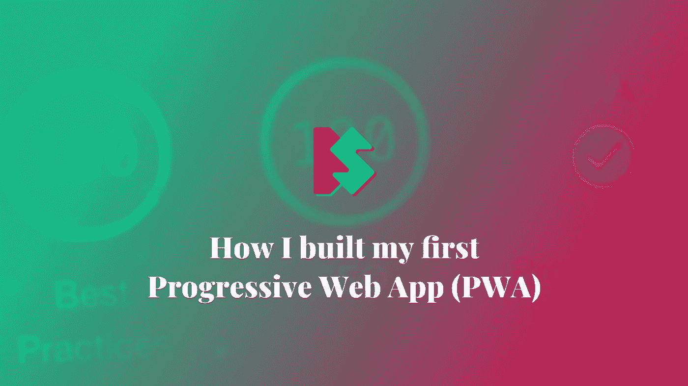
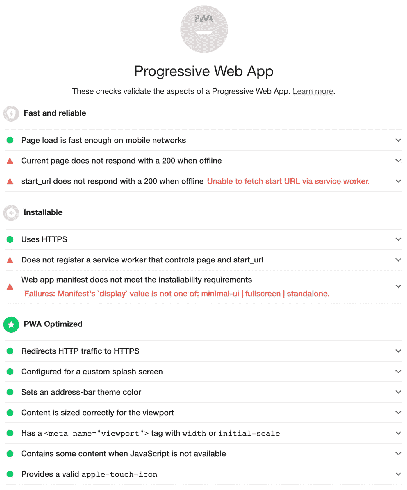
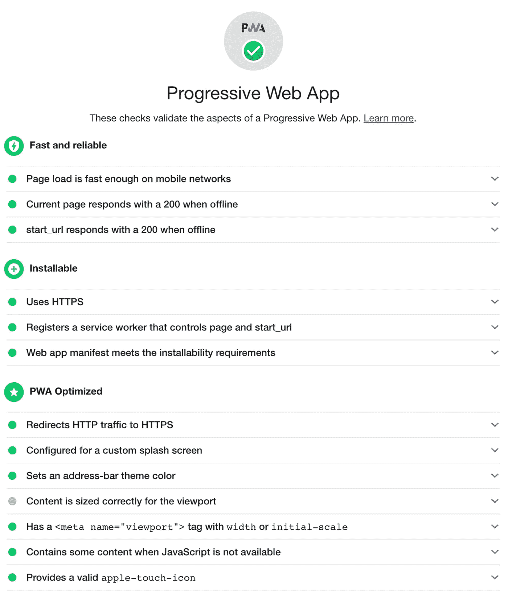
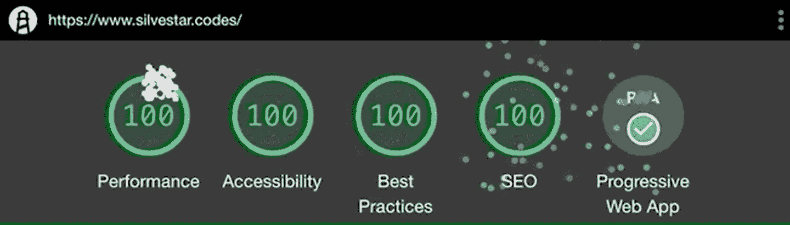

# 我如何构建我的第一个渐进式网络应用程序(PWA)

> 原文：<https://itnext.io/how-i-built-my-first-progressive-web-app-pwa-6fd3f5a164c0?source=collection_archive---------0----------------------->

## 渐进式网络应用

## 得到完美的灯塔分数



从今天起，我的网站可以作为一个进步的网络应用程序。耶！💯


在这篇文章中，你将会了解到更多关于我如何以及为什么在我的网站上添加这个令人兴奋的特性。

# 我为什么要这么做？

我喜欢认为自己是一个非常迂腐的人，我从第一天开始就试图让我的网站变得更好。当我建立我的网站时，我并不了解所有来自网页性能工具的指标，如 PageSpeed Insights 或 WebPageTest。但是，当我试图让我的网站更好的时候，我在学习新的技术，我的网站变得越来越好。

现在我的网站得分最高，但有一件事困扰了我一段时间。这是渐进式网络应用评分。



通过查看 PWA 报告，我意识到我的网站已经为 PWA 做好了准备。只有几个问题需要解决。我不理解这些问题，但这从未阻止过我。

# 我是如何做到的

作为我的起点，我决定遵循[“你的第一个渐进式 Web 应用”教程](https://codelabs.developers.google.com/codelabs/your-first-pwapp/#4)。第一步是更新我的`webmanifest.json`文件。我添加了`start_url`和`display`选项以及一些必需的 meta 标签，比如`<meta name="apple-mobile-web-app-capable" content="yes">`。

```
{
  "name": "SB site - Silvestar Bistrović website",
  "short_name": "SB site - Silvestar Bistrović website",
  "icons": [
    …
  ],
  "theme_color": "#12e09f",
  "background_color": "#fff",
  "start_url": "/offline.html",
  "display": "standalone"
}
```

接下来，我为服务人员创建了`sw.js`文件。要注册服务人员，需要将一小段代码添加到您的索引页面中:

```
// CODELAB: Register service worker.
if ('serviceWorker' in navigator) {
  window.addEventListener('load', () => {
    navigator.serviceWorker.register('/service-worker.js')
      .then((reg) => {
        console.log('Service worker registered.', reg);
      });
  });
}
```

服务工作者文件的内容可能会有所不同，这取决于您希望在您的站点上实现什么。由于我的网站非常简单，我决定只使用基本的离线体验。这意味着我需要一个`offline.html`文件用于离线体验。这将是我主页的精简版。所以我移除了外部图像，并用 CSS 创建了一个占位符。我移除了外部 CSS 文件并将其内联到`head`部分。剩下唯一要做的就是添加 favicon 文件。我还不确定这是否需要，但我决定把它放在那里，以防万一。反正那些文件也不大。

`sw.js`文件可以分成四个部分:

*   定义常数，
*   安装，
*   激活，以及
*   引人入胜。

首先，我定义了缓存名称和要缓存的文件。

```
// constants
const CACHE_NAME = 'sb-cache-v1.3'
const FILES_TO_CACHE = [
  '/offline.html',
  '/favicon/apple-touch-icon.png',
  '/favicon/favicon-32x32.png',
  '/favicon/favicon-16x16.png',
  '/favicon/site.webmanifest',
  '/favicon/safari-pinned-tab.svg',
  '/favicon/favicon.ico',
  '/favicon/mstile-144x144.png',
  '/favicon/browserconfig.xml'
]
```

接下来，我创建了`install`事件，它使用给定的缓存名称打开缓存并缓存文件。

```
self.addEventListener('install', (event) => {
  // CODELAB: Precache static resources here.
  event.waitUntil(
    caches.open(CACHE_NAME).then((cache) => {
      console.log('[ServiceWorker] Pre-caching offline page')
      return cache.addAll(FILES_TO_CACHE)
    })
  )
})
```

之后，我创建了`activate`事件，它从磁盘中清除缓存的文件。

```
self.addEventListener('activate', (event) => {
  // CODELAB: Remove previous cached data from disk.
  event.waitUntil(
    caches.keys().then(keyList => Promise.all(keyList.map((key) => {
      if (key !== CACHE_NAME) {
        console.log('[ServiceWorker] Removing old cache', key)
        return caches.delete(key)
      }
    })))
  )
})
```

最后，我创建了`fetch`事件，该事件仅在请求`.mode`为`navigate`时处理页面导航。如果请求无法从网络上获取项目，它会尝试获取`offline.html`文件。

```
self.addEventListener('fetch', (event) => {
  // CODELAB: Add fetch event handler here.
  if (event.request.mode === 'navigate') {
    event.respondWith(
      fetch(event.request)
        .catch(() => caches.open(CACHE_NAME)
          .then(cache => cache.match('offline.html')))
    )
  }
})
```

# 决赛成绩

部署完成后，我运行了站点的审计，现在它看起来像这样:



我觉得烟花值得另一个样子。💯



# 后续步骤

接下来的步骤是了解更多关于[工具箱](https://developers.google.com/web/tools/workbox/)的信息。在那之后，我计划为我的边项目[代码行每日](https://cld.silvestar.codes/)添加完整的离线体验。

*最初发布于*[*https://www . silvestar . codes*](https://www.silvestar.codes/articles/how-i-built-my-first-progressive-web-app-pwa/)*。*