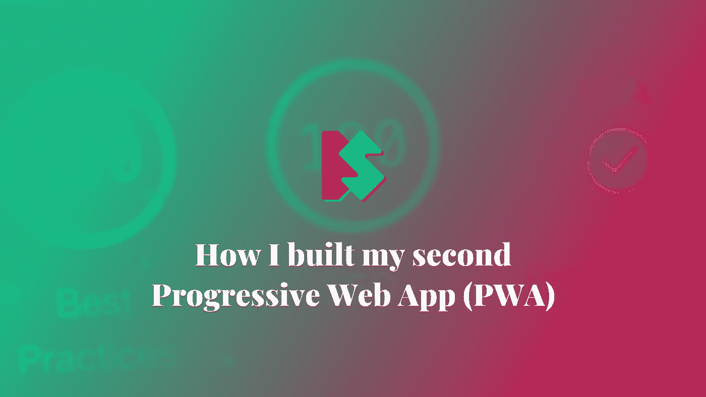
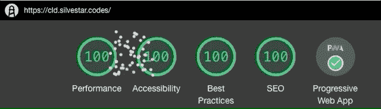

# 我如何构建我的第二个渐进式网络应用程序(PWA)

> 原文：<https://itnext.io/how-i-built-my-second-progressive-web-app-pwa-3508c26d8e77?source=collection_archive---------7----------------------->

## 渐进式网络应用

## 得到完美的灯塔分数



从今天起，我的副业项目[代码行日报](https://cld.silvestar.codes/)作为一个渐进式网络应用程序可用。

如果你碰巧读过[我之前写的关于“我如何构建我的第一个渐进式网络应用程序(PWA)](/how-i-built-my-first-progressive-web-app-pwa-6fd3f5a164c0)”的文章，这篇文章是续篇。

# 工具箱

在我之前制作 PWA 的尝试中，我都是手动处理的。我了解了可用的选项和技术，这有助于我理解 PWA 网站是如何工作的。

这次我决定用[工具箱](https://developers.google.com/web/tools/workbox)做 PWA。Workbox 是 Google 让 PWA 更流畅的工具。

> *Workbox 是一组库和节点模块，可以轻松缓存资源并充分利用用于构建* [*渐进式 Web 应用*](https://developers.google.com/web/progressive-web-apps/) *的功能。*

有一个很棒的[“入门”指南](https://developers.google.com/web/tools/workbox/guides/get-started)，我按照它在几分钟内设置了初始版本。Workbox 正在提供[预定义的缓存策略](https://developers.google.com/web/tools/workbox/modules/workbox-strategies)，如“CacheFirst”或“StaleWhileRevalidate”。您可以在一行中设置缓存策略，如下所示:

```
// Serve all CSS files with StaleWhileRevalidate strategy
workbox.routing.registerRoute(
  /\.css$/,
  new workbox.strategies.StaleWhileRevalidate()
)
```

这种策略告诉服务旧的/陈旧的 CSS 文件如果可用。如果不可用，请使用网络请求来获取文件。

你可以在 GitHub 库中看到代码行每日[的所有策略。](https://github.com/maliMirkec/code-line-daily/blob/master/src/sw/sw.js)

# 预缓存

设置好策略后，我已经使用 [Workbox CLI](https://developers.google.com/web/tools/workbox/guides/precache-files/cli) 创建了要预缓存的文件列表。我已经将 Workbox CLI 作为一个全局`npm`包进行了安装。

```
npm i -g workbox-cli
```

之后，`workbox`命令在我的终端可用。我已经运行了命令来启动向导。

```
workbox wizard --injectManifest
```

我已经选择了已配置的路径并选择了要预缓存的文件，Workbox CLI 为我创建了一个新文件。

为了能够将这些文件注入到服务工作者文件中，我在其中添加了下面一行:

```
workbox.precaching.precacheAndRoute([]);
```

最后，我运行了命令`workbox injectManifest`,该命令创建了新的服务工作者文件，其中包含了要预缓存的文件列表。

# 自动化

我很高兴一切正常，但是我意识到我需要手动运行这些命令。因为我已经花了很多精力来自动化这个项目，所以我想把 Workbox 添加到我的 Gulp 任务中。幸运的是，Workbox 也可以作为 Node.js 环境的插件使用。

有一种`generateSW`模式可以创建一个带有预缓存设置的服务人员，这似乎是符合我需求的逻辑选项。

> *这将生成一个服务工作器，为您的配置选择的所有文件进行预缓存设置*

这是我的项目的配置。

```
{
  "globDirectory": "dist/",
  "globPatterns": [
    "**/*.{html,webmanifest,css,eot,svg,ttf,woff,woff2,png,js,ico,jpg}"
  ],
  "globIgnores": [
    "docs/**/*",
    "gfx/cover/**/*"
  ],
  "swDest": "dist/sw.js",
  "swSrc": "src/sw/sw.js"
}
```

其中:

*   `swSrc`选项告诉在哪里可以找到服务人员文件，
*   `swDest`选项告诉在哪里保存已处理的服务人员文件，
*   `globDirectory`选项告诉哪个文件夹扫描预先缓存的文件，
*   `globPatterns`选项告知使用哪些模式，以及
*   `globIgnores`选项告知忽略哪些文件夹，尽管模式匹配。

运行 Gulp 任务后，我得到了最终的服务工作者文件，如下所示:

```
// load workbox
importScripts('https://storage.googleapis.com/workbox-cdn/releases/4.3.1/workbox-sw.js')

// output successful message
if (workbox) {
  console.log(`Yay! Workbox is loaded 🎉`)
} else {
  console.log(`Boo! Workbox didn't load 😬`)
}

workbox.core.setCacheNameDetails({
  prefix: 'cld',
  suffix: 'v1.0',
  precache: 'precache',
  runtime: 'runtime'
})

workbox.precaching.precacheAndRoute([
  // precached file list
])

// Serve all html files with StaleWhileRevalidate strategy
workbox.routing.registerRoute(
  /\.html$/,
  new workbox.strategies.NetworkFirst()
)

// Serve all css files with StaleWhileRevalidate strategy
workbox.routing.registerRoute(
  /\.js$/,
  new workbox.strategies.StaleWhileRevalidate()
)

// Serve all css files with StaleWhileRevalidate strategy
workbox.routing.registerRoute(
  /\.css$/,
  new workbox.strategies.StaleWhileRevalidate()
)

// Serve all other assets with CacheFirst strategy
workbox.routing.registerRoute(
  /\.(?:png|jpg|jpeg|svg|gif|webp|ico|webmanifest|eot,ttf,woff,woff2)$/,
  new workbox.strategies.CacheFirst({
    plugins: [
      new workbox.expiration.Plugin({
        maxEntries: 20,
        maxAgeSeconds: 30 * 24 * 60 * 60
      })
    ]
  })
)
```

# 决赛成绩

代码行日报现在是进步的网络应用程序。那是我的第二个 PWA，我会推荐大家多了解一下。该网站现在可以离线访问，但它也通过尽可能提供缓存资产为我的用户节省了带宽。继续尝试每天安装[代码行](https://cld.silvestar.codes/)，让我知道你的想法。



作为奖励，我已经运行了 Code Line Daily 站点的审计，我再次看到了 fireworks，就像在[我的个人站点](https://www.silvestar.codes)一样。💯

*最初发布于*[*https://www . silvestar . codes*](https://www.silvestar.codes/articles/how-i-built-my-second-progressive-web-app-pwa/)*。*