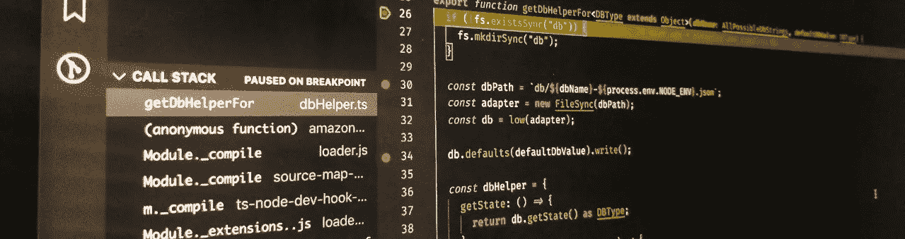
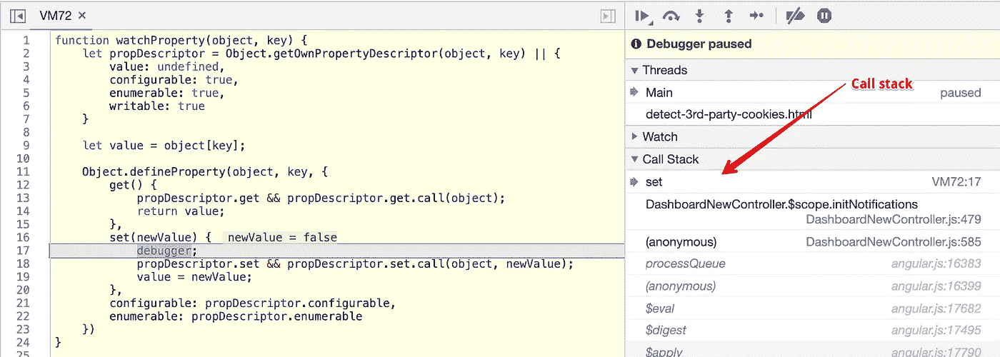
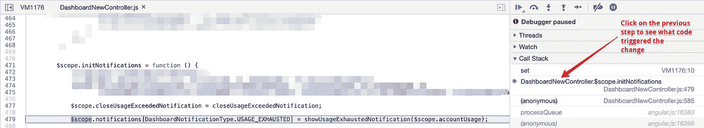

# 我如何调试不是我写的 Javascript 代码

> 原文：<https://itnext.io/how-i-debug-javascript-code-i-didnt-write-6c405a6a9103?source=collection_archive---------4----------------------->



当调试您没有编写的代码时，尤其是 JavaScript 代码，事情会变得非常混乱和复杂。得益于 Javascript 的单线程方法和[事件循环](https://www.youtube.com/watch?v=8aGhZQkoFbQ)，代码通常不会沿着直线方向移动。可能有异步/同步回调、xhr、超时/间隔、事件监听器、承诺等等，这些*“help”*使你的代码不能以一种直接的方式工作，并且很容易迷失代码前进的方向。

有时，发现天知道代码的哪一部分将一些值改变成了它原本不期望的值，这变得非常令人沮丧。我开发了一个 Angular.js 应用程序，它相当复杂，有很多观察器、事件监听器和异步调用，很难理解。

比方说，我们有一个 bug，其中`$scope.notifications.usage_exhausted`本应该是`true`，但是当你点击一个按钮时，不知何故变成了`false`，而你不知道是什么代码做的。一般来说，你会从一个方法开始，找出那个值做什么，那个按钮做什么，那个值设置在哪里，所有输入字段都设置了什么属性为`ng-model` (angular 定义输入字段自动同步模型的方法)等等。这种方法是可行的，但是它会浪费大量的时间去查看那些不是罪魁祸首的代码，并且让你觉得 [*我在生活中到底在做什么？如果当我点击那个该死的按钮时，我能以某种方式看到*变成`$scope.notifications.usage_exhausted`会怎么样？](https://hackspirit.com/what-am-i-doing-with-my-life-5-steps-to-finally-work-it-out/)

嗯，你可以用下面的代码片段来实现:

这个代码片段所做的是，它用 JavaScript 的本机[getter/setter](http://javascript.info/property-accessors)替换 object 上的属性，这些属性的行为与普通属性完全一样，但是每当您希望观察的属性发生变化时，它都有一个`debugger`供您使用。你所需要做的就是，`watch`当属性正确或未定义时。

```
// watch when it was correct or undefined
watchProperty($scope.notifications, 'usage_exhausted');
```

现在，无论何时`$scope.notifications.usage_exhausted`由于应用程序中的任何代码而发生变化，您都会得到一个断点，现在您需要看到的只是堆栈跟踪。



值改变时的自动调试点



调用堆栈中的上一步

你确切地知道值在哪里被改变了。如果您以正常的方式调试问题，那么到目前为止您已经有了几个断点，并且还在调试中。

**我提到的场景(点击按钮)非常简单，但有时由于一些延迟的 XHR 调用、超时/间隔或任何异步原因，值会在没有任何用户操作的情况下发生变化，这种情况下使用传统的调试方法很难找出问题所在。**

# 监视数组

同样，您也可以观察数组索引的变化，以发现在特定索引处设置了什么代码。

```
watchProperty($scope.projects, 3)
```

每当`$scope.projects`上的第 3 个元素被设置时，这将触发一个调试点。尽管当第三个元素被`push`放入数组时这并没有帮助。为了缓解这一问题，我们可以创建一个新的函数来观察阵列上的任何变化，并且可以编码如下:

这里我们*通过在数组本身上创建这些方法来隐藏`[Array.prototype](https://medium.com/free-code-camp/prototype-in-js-busted-5547ec68872)`的`push`、`pop`和`splice`方法。现在，无论何时，代码的任何部分调用特定数组**的这些*突变*方法中的任何一个，**你都会有断点，然后你可以再次看到调用堆栈来跟踪问题。*

您可以为任何类型的代码创建这样的调试器。假设您在您的应用程序中使用了`[Set](https://developer.mozilla.org/en-US/docs/Web/JavaScript/Reference/Global_Objects/Set)` s，并且您想要调试`Set.`的一个特定的[实例](https://medium.com/free-code-camp/prototype-in-js-busted-5547ec68872)，只需编写另一个类似`watchSet`的代码片段(就像我们在上面编写`watchArray`一样)，来查看您想要查看的任何函数。

**您可以为感兴趣的属性在对象上添加多个监视或嵌套监视。如果新值本身是一个对象，你甚至可以在深入断点时添加观察器来观察新值的属性。**

# 警告

这种调试方式并不是完美的，并且在这些技巧不起作用的地方有一些限制，这些限制是:

*   如果使用`[delete](https://developer.mozilla.org/en-US/docs/Web/JavaScript/Reference/Operators/delete)`操作符删除一个属性，该操作不会被检测到，因此不会被注意到。
*   如果你的代码中的一个属性是用`Object.defineProperty` / `Object.defineProperties`定义的，那会导致观察器被覆盖，你不得不再次观察它。
*   一些我现在想不起来的事情。

像 Vue.js 这样的框架，它们本身使用 getter 和 setter 来进行变更检测和反应，在`watchProperty`片段中已经被处理了，方法是使用`[Object.getOwnPropertyDescriptor](https://developer.mozilla.org/en-US/docs/Web/JavaScript/Reference/Global_Objects/Object/getOwnPropertyDescriptor)`获得原始的`getter/setter`，将它们保存在闭包中，并在调用 getter/setter 时使用正确的`this`调用它们。

# 助手 Chrome 扩展

现在，每次你想调试时创建这些方法都是一个问题，为此我使用了这个很棒的 Chrome 扩展[](https://chrome.google.com/webstore/detail/user-javascript-and-css/nbhcbdghjpllgmfilhnhkllmkecfmpld?hl=en)****，它可以让你定义你想在任何网站加载时运行的 javascript 代码。只需将这些片段保存为`*.*`通配符，这样您就可以随时随地在控制台上使用它们。我将这个扩展用于更多的片段，比如在需要的时候按需加载任何 javascript 库。我是 *lodash* 的[超级粉丝，每当我不得不动态地大量修改数据时，我都会加载它。](https://medium.com/@pranavjindal999/stop-using-loops-just-lodash-everything-c60417b43b6c)****

****使用这样的观察器确实加快了我的调试速度。我额外使用了框架特定的扩展(比如 angular.js 的 [this](https://chrome.google.com/webstore/detail/angularjs-batarang/ighdmehidhipcmcojjgiloacoafjmpfk?hl=en) 和新的开发工具特性，比如[条件断点](https://blittle.github.io/chrome-dev-tools/sources/conditional-breakpoints.html)、[日志点](https://developers.google.com/web/updates/2019/01/devtools#logpoints)和[实时表达式](https://developers.google.com/web/updates/2018/08/devtools#watch)，让我的调试过程不那么令人沮丧。****

****调试愉快！！****