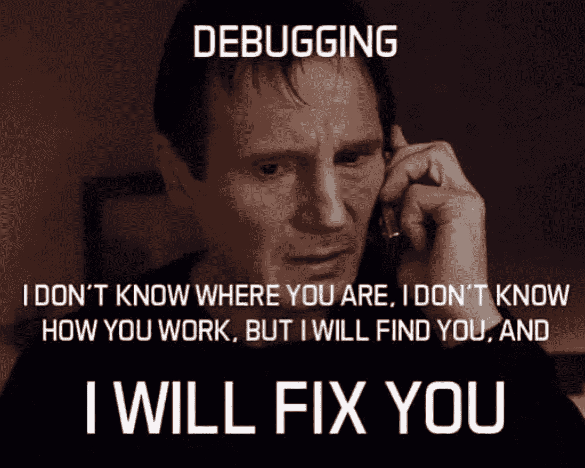
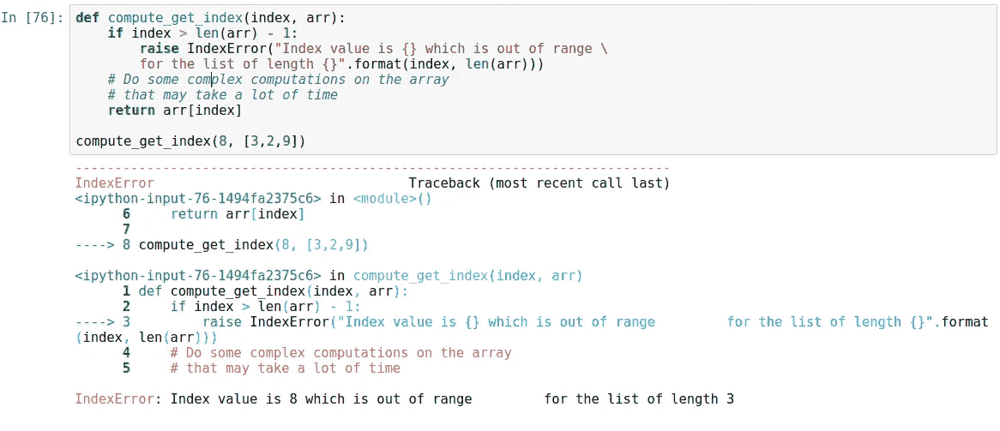
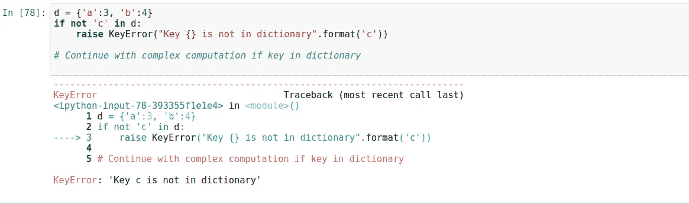
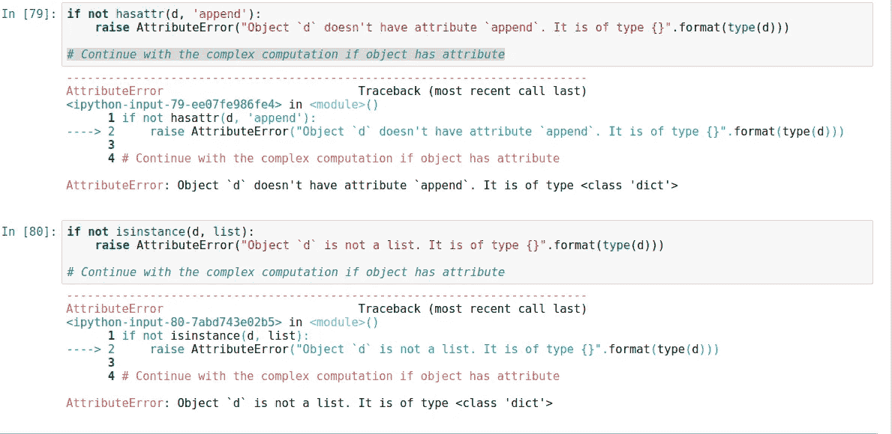
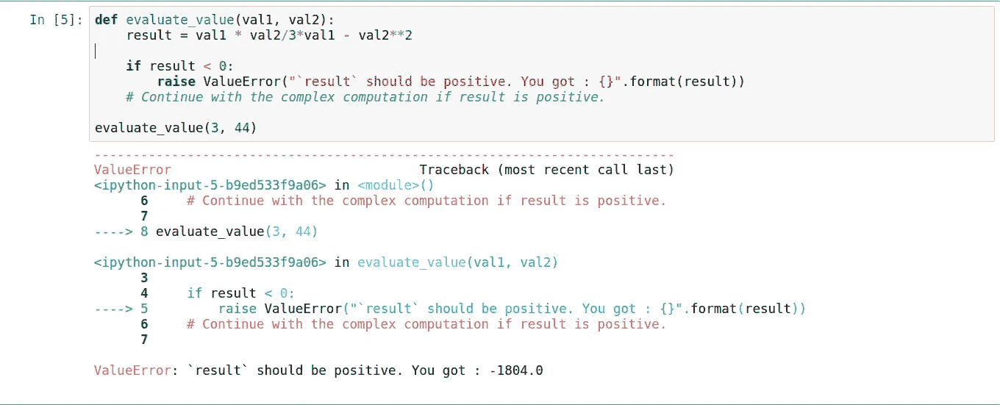

# 我如何调试我的 Python 项目——第 1 部分:引发异常

> 原文：<https://itnext.io/how-i-debug-my-python-projects-part-1-raising-exceptions-6bcb07673010?source=collection_archive---------3----------------------->



我先引用埃德格·迪克斯特拉的一段话

> 如果调试是去除软件缺陷的过程，那么编程就必须是把缺陷放进去的过程

在我的职业生涯中，我参与了许多 python 项目；大型、小型和中型项目。起初这并不容易，因为我相信一个好的程序员应该能够写出没有错误的代码。然而，我后来明白，最好的学习方法是犯错误，尝试，敢于和从结果中学习。我将在这里引用尼古拉斯·尼葛洛庞帝的一段话

> 编程让你思考问题，在调试的时候你学习学习

以下是我在调试 python 项目时使用的技术:

*   引发异常
*   断言
*   Python 日志模块
*   Python 调试器模块
*   Python Jupyter 笔记本

在本文中，我将向您介绍第一种技术— **引发异常**

# 引发异常

当程序在执行过程中遇到错误时，就会引发异常。它们扰乱了程序的正常流程，通常会突然终止程序。异常由 raise 语句引发。在代码中，raise 语句由以下内容组成:

*   raise 关键字
*   对 Exception()函数的调用
*   一个字符串，其中包含传递给 Exception()函数的有用的错误消息。

例如，如果您在交互式 shell 中输入以下代码

```
raise Exception(“The error message goes here”)
```

您将得到下面的**回溯**:

```
Traceback (most recent call last):
  File "<stdin>", line 1, in <module>
Exception: The error message goes here
```

> **回溯**包括错误消息、导致错误的行的行号以及导致错误的函数调用序列。这个调用序列称为调用堆栈。

如果没有`try`和`except`以及可选的`else`来覆盖引发异常的 raise 语句，程序就会崩溃并显示异常错误消息。

## 我如何使用异常来调试代码

那么我如何使用异常来调试我的代码呢？非常好的问题。这个想法是，我检查我的代码，并检测任何可能在未来发生的潜在错误，并尽早提出这些错误。通过这种方式，我可以在错误造成很大损害并变得难以发现之前处理它们。

我将根据我在编码时遇到的常见异常错误进行解释。

> 值得注意的是，异常通常被认为是用户错误。例如，每当用户输入不正确的数据或由于错误数据导致计算失败时，通常会引发异常。在大多数情况下，会处理这些异常，并提示用户输入正确的值。但在其他情况下，没有处理，程序被允许崩溃

## **索引错误**

> 当您试图对超出允许边界的列表、元组或字符串进行索引时引发

如果在我的程序中，我知道我将处理索引一个列表，并且说在索引列表之前将发生的计算是复杂的并且将花费大量的时间。如果发生了`IndexError`异常，我不想等到这个计算发生后再接收它。我要做的是，确保我要用的索引在这个范围内。让我们考虑下面的代码

```
def compute_get_index(index, arr):
    # Do some complex computations on the array 
    # that may take a lot of time
    return arr[index]compute_get_index(8, [3,2,9])
```

如果我运行上面的函数，由于索引`8`超出范围，程序将引发`indexError`异常。令人不安的是，复杂的计算将在错误出现之前首先执行。因此，为了尽早发现这个错误，我将检查以确保索引在范围内。如果没有，我会抛出一个好消息作为异常。通过这种方式，我们得到了错误，并且枯燥的复杂计算不再执行



## **按键错误**

> 当您试图访问字典中不存在的键值时引发。

与上述`IndexError`中的原理相同。假设您知道您将通过键访问字典，并且您不确定从用户输入或计算中获得的键是否确实在字典中。我处理这个问题的方法是，首先检查以确保它是字典中的一个键。如果不是，我会提前抛出一个`KeyError`异常并处理它，而不是让我的代码运行到最后因为同样的错误而失败



## 属性错误

> 当进行无效的属性引用或属性赋值失败时引发

这也是很常见的情况。有时，我会从 None 对象中调用``append`'方法。或者列表中的“`get`”方法。发生这种情况是因为有时我所期望的函数或进程的输出实际上并不是这样。为了调试它，我确保检查了有问题的对象是否具有该属性。如果没有，我会提前抛出`AttributeError`异常，处理它并继续前进。



从上面的代码可以看出，我希望我的对象`d`具有属性`append`。对于第二种情况，在我执行复杂的计算之前，我希望我的对象`d`是一个`list`。

## 值错误

> 当函数收到正确类型的参数但值不合适时引发

这个例外在很多数学运算中都会出现。例如，在数学模块方法`math.sqrt()`中(负数的平方根引发`ValueError`异常)。如果一个函数只适用于特定范围的值，那么当收到的参数不满足特定范围时，抛出一个`ValueError`是合理的。

因此，如果我知道我的函数只对某个范围内的值起作用，我会确保在开始冗长乏味的复杂运算之前检查该值，这样我就能及早发现它，处理它并继续前进。

以下面的函数为例。我知道我的复杂运算只适用于正值。所以我要做的是检查，确保在运算中使用的值是正的。如果没有，我抛出异常，避免运行明显会失败的复杂操作，修复问题并继续前进。



# 我如何构建我的自定义异常类

在调试期间，我们可以处理许多其他情况，例如:

*   **零除法错误** — `raised when you try to divide by zero`
*   **io 错误**——`raised when an I/O operation fails for an I/O-related reason`
*   **文件存在错误** — `raised when trying to create a file or directory which already exists.`
*   **IsADirectoryError** — `raised when a file operation is requested on a directory`
*   **notdirectoryerror**— `raised when a directory operation is requested on something which is not a directory.`

在进入代码的更复杂部分之前，我使用所有这些来确保我的代码按预期工作。

在许多情况下，您可能找不到与您想要在代码中应用的约束类型相匹配的内置异常。在这种情况下，您可以创建满足您需求的自定义例外。

假设您想要检查并确保某个特定值大于 10。当然，你可以使用`ValueError`，但是如果你想通过给它一个特定的和唯一的名字比如`ValueSmallerThanTenError`来定制错误，那该怎么办呢？这就是我如何创建我的自定义异常类

*   我从基类开始。这是[例外文件](https://docs.python.org/3/tutorial/errors.html#user-defined-exceptions)说的

> 当创建一个可能引发几个不同错误的模块时，通常的做法是为该模块定义的异常创建一个基类，并创建该基类的子类，以便为不同的错误条件创建特定的异常类

```
class MyException(Exception):
    """Base class exceptions for this module"""
    def __init__(self, msg):
            self.msg = msg def __str__(self):
        return "{}".format(self.msg)
```

我的基本异常有一个`__init__()`方法，它接收引发的消息。它还有`__str__()`方法，因为当引发一个异常时，我们同时创建一个异常实例并打印它。

*   然后，我创建继承基类的不同异常类来处理特定的错误。

```
class ValueSmallerThanTenError(MyException):
    def __init__(self, msg="ValueSmallerThanTenError occured"):
        super().__init__(msg)
```

让我们测试我们的定制异常类


# 结论

这些是我使用异常来调试代码的方法。这可能是错误的方法，或者可能有人有更好的方法来使用异常调试 python 项目。请在评论中分享你的想法。

在我的下一篇文章中，我将向您展示如何使用断言来调试我的代码。**我希望你喜欢阅读我的文章，并发现它很有帮助。**