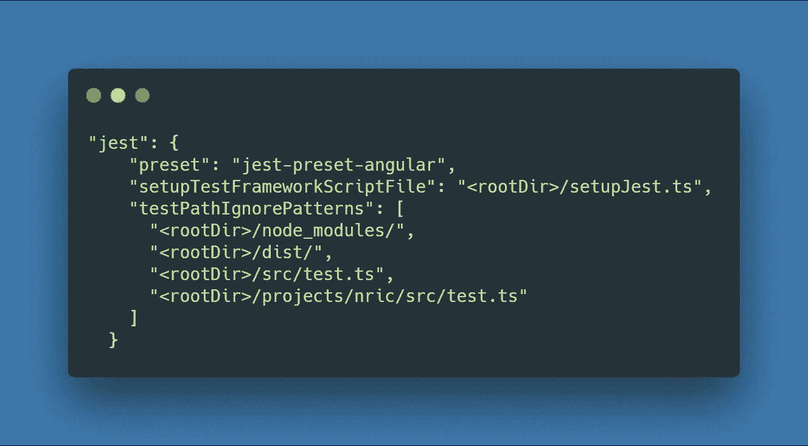
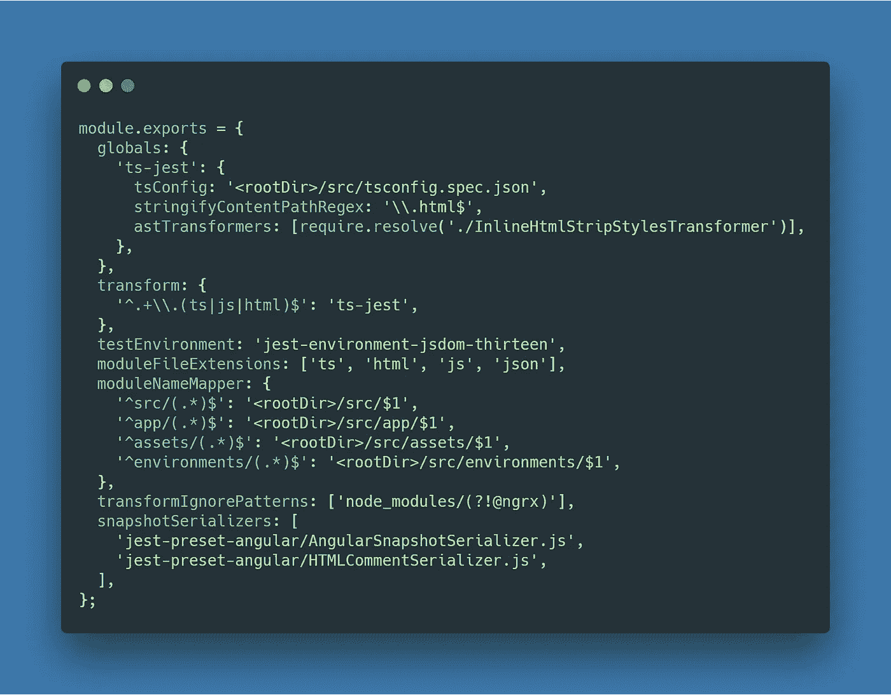
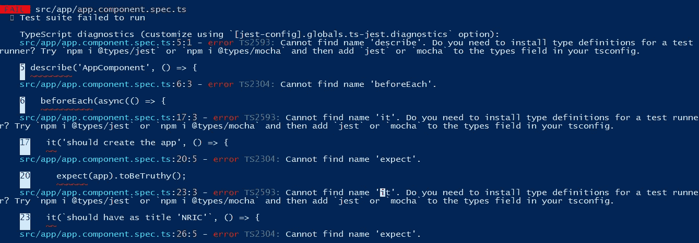
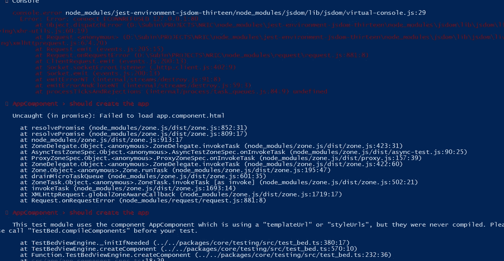
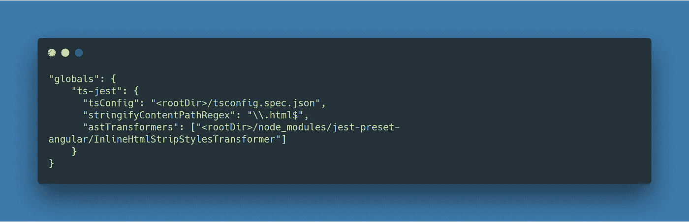
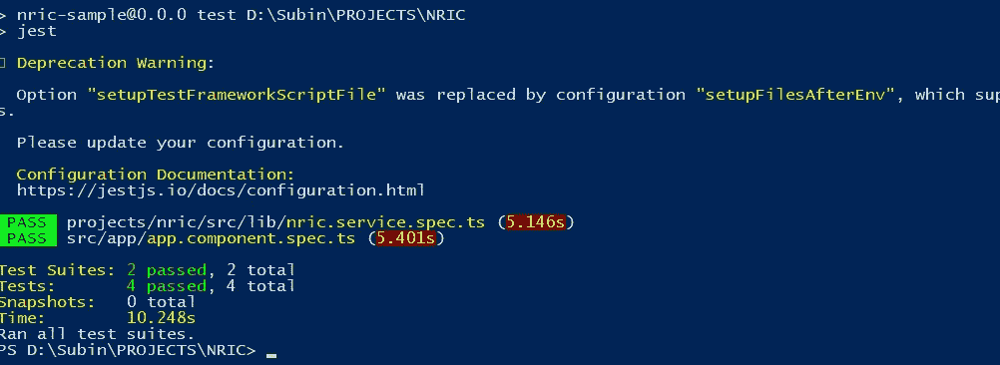
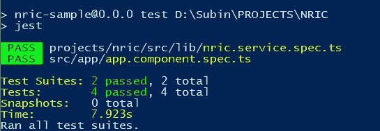
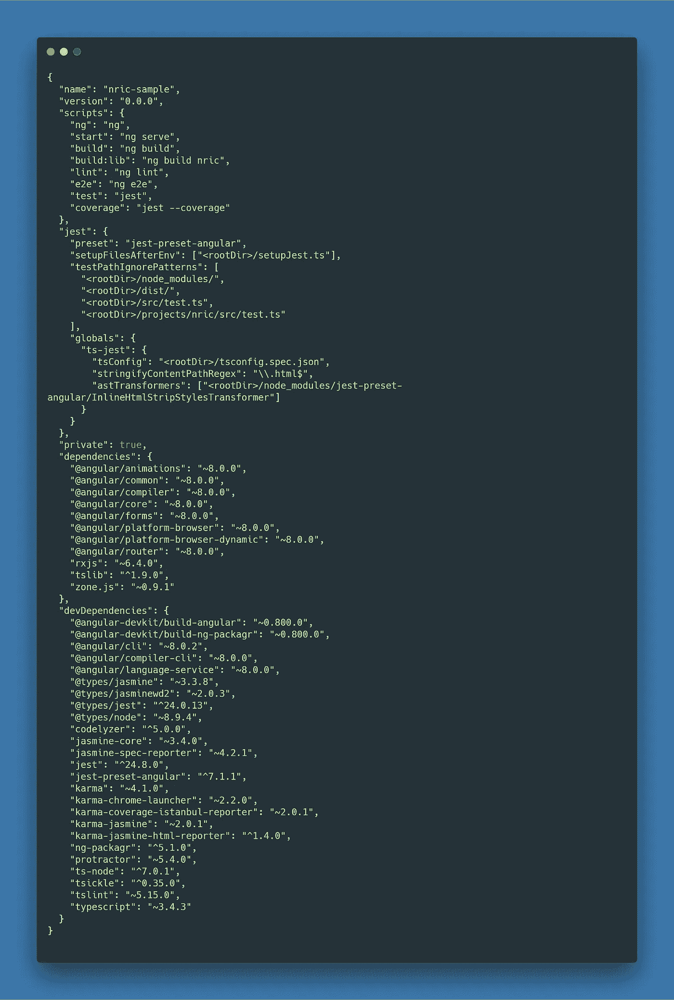

# 我如何配置 Jest 来测试我的 Angular 8 项目

> 原文：<https://itnext.io/how-i-do-configure-jest-to-test-my-angular-8-project-2bd84a21d725?source=collection_archive---------1----------------------->

## 指导端到端地在 Angular 上设置 Jest，并移除旧的测试框架。


照片由[布雷克·康纳利](https://unsplash.com/@blakeconnally)在 [Unsplash](https://unsplash.com/photos/B3l0g6HLxr8) 上拍摄

这篇文章是为 Angular 8 项目配置 Jest 的最新文章。我希望它对想在应用程序中使用 [Jest](https://jestjs.io/) 的 Angular 开发者有所帮助。

*更多类似内容，请查看*[*https://betterfullstack.com*](https://betterfullstack.com/)

## 为什么我要用笑话

就我个人而言，我使用 Jest 只有两个原因:

1.  我可以在命令行上运行它，所以很容易与 git 挂钩集成。
2.  我可以为我的屏幕快照，很容易有覆盖报告。

但是你可以在**资源/参考**查看**【5】****【6】**更多使用 Jest 的利弊。

## 设置项目

按照 [Angular.io](https://angular.io/guide/setup-local) 上的指南设置项目。

## 添加笑话

为了使用 Jest 作为我们的测试跑步者，我们将使用 [jest-preset-angular](https://github.com/thymikee/jest-preset-angular) 。要启动并运行它，我们只需遵循[自述文件](https://github.com/thymikee/jest-preset-angular/blob/master/README.md)中的说明。

```
npm install -D jest jest-preset-angular @types/jest
```

然后在与 **package.json** 同一个根目录下或者主[工作区](https://angular.io/guide/file-structure)的 **src** 内创建 **setupJest.ts** 文件。


setupJest.ts

下一步是在 **package.json** 上添加 jest 配置



package.json

我添加了**testpathignorpatterns**来避免因果冲突

> 根据 Angular CLI 的默认设置，jest 将获取一个`src/test.ts`文件。为了避免这个问题，你可以将其重命名为`src/karmaTest.ts`或者通过添加`<rootDir>/src/test.ts`到 jest `testPathIgnorePatterns`选项来隐藏它。

你可以看到当 [angular-cli](https://cli.angular.io/) 设置默认 angular 项目时， **ts.config.json** 和 **ts.config.spec.json** 与 **package.json** 在同一个根，但是 [jest-preset-angular](https://github.com/thymikee/jest-preset-angular) 把它放在 **src** 文件夹中。



从 jest-preset-angular 暴露的[配置](https://github.com/thymikee/jest-preset-angular/blob/master/jest-preset.js)

对于 **package.json.** 上的全局 jest 配置，我们必须覆盖**<rootDir>/src/ts config . spec . JSON**

```
"jest": {
   ... "globals": { "ts-jest": { "tsConfig": "<rootDir>/tsconfig.spec.json" } }},
```

如果你遇到这个问题。这意味着你的**字根**不对



终端-错误找不到描述的名称

现在我们运行 add script to package.json

```
"scripts": {
   ... "test": "jest"},
```

并运行 **npm 运行测试**。

然后我们得到这个错误



终端-无法加载 html 和 css

根本原因是我们现在在非 CLI 环境中运行测试。你可以在[这里](https://angular.io/guide/testing#compile-components)阅读更多内容。

那么如何修复呢？

如果您选择覆盖 [jest-preset-angular](https://github.com/thymikee/jest-preset-angular) 以便指向特定的 tsconfig，您也需要添加 **astTransformers** 部分，否则您将在任何 html 模板上得到解析错误，如:



package.json

否则，您将在任何 html 模板 url 和样式模板 URL 上得到解析错误

```
[Error](https://angular.io/api/core/MissingTranslationStrategy#Error): This test module uses the component AppComponent which is using [a](https://angular.io/api/router/RouterLinkWithHref) "templateUrl" or "[styleUrls](https://angular.io/api/core/Component#styleUrls)", but they were never compiled. Please call "TestBed.compileComponents" before your test.
```

你应该把 commonjs 添加到 tsconfig.spec.json 这个错误会自动修复，因为 Angular 发布了 v6，默认的`tsconfig.json`和`tsconfig.spec.json`已经改变。因此，`jest`会抛出这样一个错误:

```
Error: connect ECONNREFUSED 127.0.0.1:80
```

如果我们重新进行测试，一切应该还是绿色的。



终端运行测试成功

但是现在在控制台上有一个警告，我想清除它。因为它在 [jest 文档](https://jestjs.io/docs/en/configuration)上被弃用。所以改成:

```
“setupFilesAfterEnv”: [“<rootDir>/setupJest.ts”]
```

现在控制台更清晰了



终端-修复警告消息

## 移除 Karma devDependencies

下面是 package.json 现在的样子



完整包. json

因此，从 package.json 中，我们可以看到我们不再需要的测试库列表。

```
"@types/jasmine": "~3.3.8","@types/jasminewd2": "~2.0.3""jasmine-core": "~3.4.0","jasmine-spec-reporter": "~4.2.1","jest": "^24.8.0","jest-preset-angular": "^7.1.1","karma": "~4.1.0","karma-chrome-launcher": "~2.2.0","karma-coverage-istanbul-reporter": "~2.0.1","karma-jasmine": "~2.0.1","karma-jasmine-html-reporter": "^1.4.0","protractor": "~5.4.0",
```

所以现在我将把它从 **devDependencies** 中移除:

```
npm uninstall karma karma-chrome-launcher karma-coverage-istanbul-reporter karma-jasmine karma-jasmine-html-reporter @types/jasmine @types/jasminewd2 jasmine-core jasmine-spec-reporter protractor
```

接下来是删除一些文件，比如 **karma.config.js** 和 **src/test.ts**

然后从 **tsconfig.spec.json** 内的文件中删除 **angular.json 内的 **test** 条目、e2e 文件夹**和 **src/test.ts**

现在，我们再次运行测试，看看结果并享受。

下面是我最后的 [**源代码**](https://github.com/hoangtranson/angular-jest-starter) 。

## 资源/参考资料

[1]:设置本地环境和工作区[https://angular.io/guide/setup-local](https://angular.io/guide/setup-local)

[2]:配置笑话[https://jestjs.io/docs/en/configuration](https://jestjs.io/docs/en/configuration)

[3]: Jest 预设角度库[https://github.com/thymikee/jest-preset-angular](https://github.com/thymikee/jest-preset-angular)

[4]:调用 compile components()[https://angular.io/guide/testing](https://angular.io/guide/testing)

[5]:使 Jest 成为最佳反应测试框架的 8 件事[https://code . tuts plus . com/tutorials/8-Things-the-Make-Jest-the-Best-React-Testing-Framework-CMS-30534](https://code.tutsplus.com/tutorials/8-things-that-make-jest-the-best-react-testing-framework--cms-30534)

[6]:爱 Jest 的理由[https://it next . io/Reasons-to-Love-Jest-the-developer-experience-b 00 EC 93 df 7 bb](/reasons-to-love-jest-the-developer-experience-b00ec93df7bb)