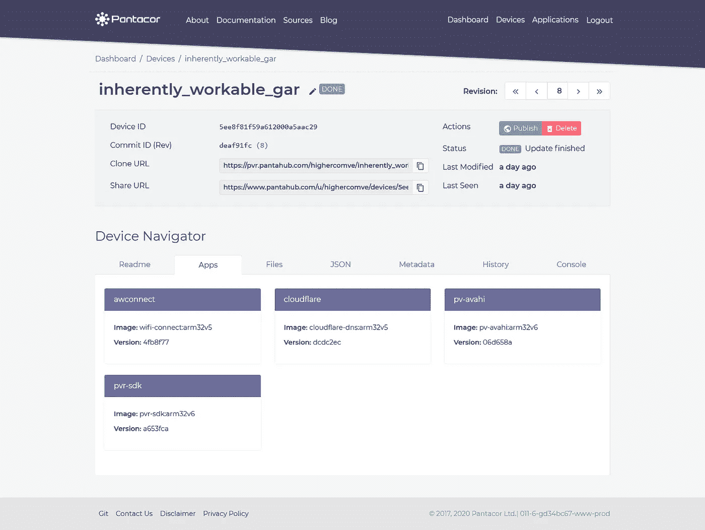
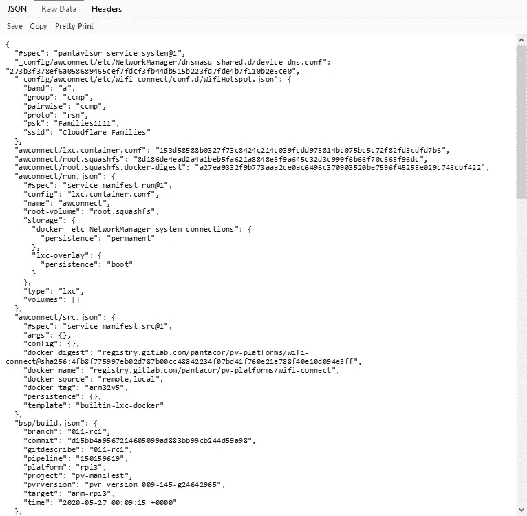
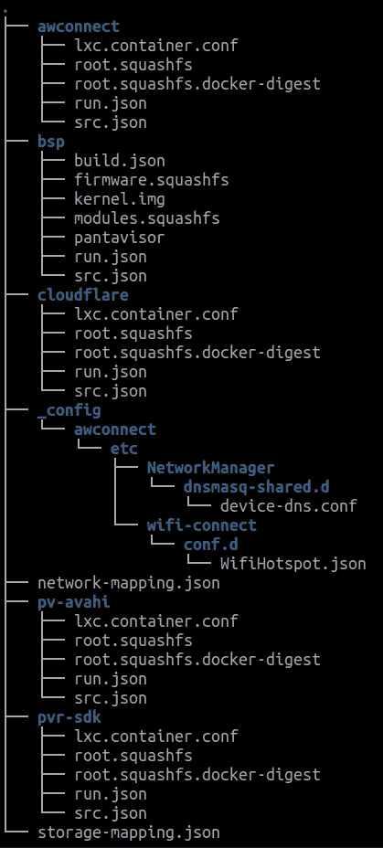

# 我如何向我的朋友解释我们在工作中做什么

> 原文：<https://itnext.io/how-i-explain-to-my-friends-what-we-do-at-work-f3aa34b18861?source=collection_archive---------6----------------------->

Pantahub 和 Pantavisor 有时可能很难理解，因为在某种程度上，它改变了我们与设备固件和软件的关系。

今天，当你不使用嵌入式设备时，可能是物联网项目或家庭自动化，你将使用 Linux 发行版更新你的设备，并开始通过 ssh 安装软件包和配置它们，如果你需要复制，你将从头再来。然后，如果您想稍微自动化这个过程，您可以创建一个 shell 脚本来完成所有的配置和安装。

如果您已经更新了该脚本，然后需要更新该配置(假设您只有两台设备)，您需要在两台设备上运行所有程序，最好是通过 SSH。你可以在这里做一些更复杂的事情，有很多工具可以做，但是也许你在一个内存很小的设备上运行，你的计划可能会失败。

但我们想做的是像你看到 Docker 镜像和 Docker 容器一样看到设备及其配置，但你甚至不需要安装和配置设备一次。你只需要用 Pantahub 闪一下。然后发布将在设备上部署的修订版。您甚至可以将一个设备设置为包的领导者，整个包将自动遵循领导者的修订。

让我们从理解所有这些术语开始:设备、版本、平台等。为此，让我们多谈谈 Pantahub 和 Pantavisor。

# Pantahub 是什么？

Pantahub 为各种基于 Linux 的连接设备提供云控制的固件和软件管理。除此之外，Pantahub 还为设备制造商、运营商和技术爱好者提供了一个社区生态系统，让他们聚集在一起，分享他们的工作。

要使用 Pantahub，您需要在设备上安装 Pantavisor。

# 什么是 Pantavisor？

Pantavisor 是 Linux 设备初始化系统，它将所有的运行时变成一组容器微函数。通过 Pantavisor，设备通过 Linux 容器技术成为软件定义的基础设施。所有启用 Pantavisor 的设备都可以自动连接到 Pantahub 实例。

通过使用这两种技术，您将能够以类似于(类似但不相同)使用 docker 管理应用程序的方式来管理您的设备和软件。

然而，代替在设备上运行容器，设备将直接在金属上运行**平台**，允许你拥有设备的版本。这个设备状态版本被称为**修订版**，在 Pantahub 里面你将有能力返回到以前的修订版，更重要的是，系统是容错的。这意味着，如果您部署了一个无法在设备上正确运行的版本，它将启动能够正确运行的上一个版本，如果您以错误的方式配置了某些东西或者软件出现了任何问题，您可以确保不会丢失您的设备。

# 生态系统是如何运作的

这个生态系统可能看起来类似于你在 Docker hub 上看到的容器，但你看到的不是容器，而是设备。

在这里，您可以看到 Pantahub 内部是如何显示设备的。

Pantahub 中的一个设备代表一个物理设备，在这个例子中是一个运行几个**平台**/应用程序的 raspberry pi 3 b+。

那些**平台**是从 docker 容器构建的，但是在设备内部没有任何 Docker 运行时。

在本例中，您会看到一台设备正在运行:

*   **cloudflare** :由[one.apps.pantahub.com](https://www.pantahub.com/blog/how-pantahub-and-pantavisor-works/one.apps.pantahub.com)安装的平台，用于管理 DNS 配置并为您的 WIFI 热点设置 DNS 过滤器
*   **awconnect** :管理网络和 wifi 连接。
*   **pv-avahi** :暴露 mDns 配置，以便能够使用 PVR CLI 或移动应用程序发现网络上任何启用 Pantahub 的设备。
*   **pvr-sdk** :管理设备的一些功能，如 SSH 连接、跟踪设备的能力、读取用户元数据等等。

这样，您可以注意到一个设备是如何由几个平台组成的，而这些平台是基于 docker 容器的。但是请记住，设备上没有运行任何 docker 容器。

设备修订版被描述为一个 JSON 文件，当您克隆设备时，该文件被转换为文件系统。

让我用一个使用相同设备的可视化示例来解释一下。

我们称之为设备修订状态的规范

如您所见，**状态**是一个标准化的 JSON，具有设备的文件夹结构，其中该结构中的任何`.json`文件都是`state.json`的一部分，任何其他文件格式都由该文件的 sha256 表示，并保存在 Pantahub 对象中(我们在云中的存储)

当您使用`pvr clone URL_OF_DEVICE`(就像 git 克隆一样)时，您将获得与`state.json`中相同的结构，但是表示为 sha256 的文件将被下载。

结果会是一个像这样的文件夹。

每个平台都存在于自己的文件夹中，所有的配置文件都存在于`_config/${PLATFORM}`文件夹中

如果你想深入研究所有可用的端点，你可以阅读 API 参考[这里](https://docs.pantahub.com/pantahub-base/devices/)文档或者 swagger 文档[这里](https://api.pantahub.com/swagger/index.html)