# 我如何用 Python 为我的游戏生成 1000 个随机面孔

> 原文：<https://itnext.io/how-i-generated-1000-random-faces-for-my-game-in-python-83340079013f?source=collection_archive---------1----------------------->

在我的游戏开发过程中，我意识到我需要一个有人脸头像的对话系统。

因此我决定基于一个著名的游戏*论文创建一个人脸生成器。*

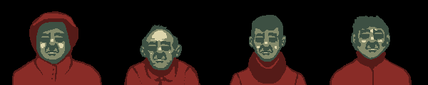

[杜科普的](https://forums.tigsource.com/index.php?topic=29750.20)人脸生成器(请转自论文)

# 数据采集

我从 pixabay.com 下载了大约 50 幅肖像(所有图片都是 CC 许可的，不需要注明出处)。

接下来，我在 Photoshop 中剪切每个图像的背景(只是一个多边形选择工具和 Delete 键)。我计划稍后使用*剪切*效果来隐藏任何瑕疵。

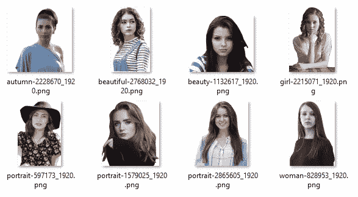

背景已移除的图像

## 人脸分割

我用图层来分割脸部。我只是简单地刷上“鼻子和嘴”，然后是“眼睛和眉毛”部分，然后为它创建一个新的 PS 层。我通过选择可见像素(*Ctrl+图层缩略图点击*)并从选择的图层中新建一个图层。任何头发，眼镜或其他面部覆盖进入一个名为“头发 _ 重叠”的层。我标记了所有 50 张图片的片段。

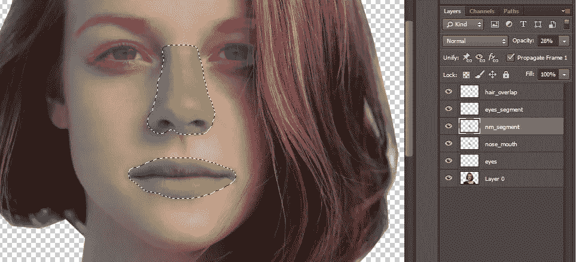

层工作流

我还必须为新粘贴的特征准备面部——我使用*克隆图章工具*，克隆皮肤并涂抹所有面部特征(新图层*涂抹*)。

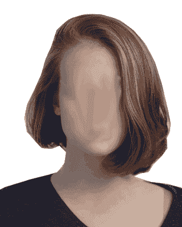

## 特征抽出

我下载的一些肖像照片不适合整体使用，所以我只提取了我可以用于生成器的特征(即只有鼻子和嘴唇)。

我将使用 *psd_tools* 和 *Pillow* Python 库提取特性(安装那些使用*pip install PSD-tools Pillow*或让您的 IDE 处理它的特性)。

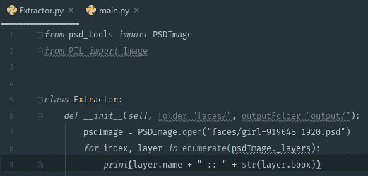

这个代码片段应该列出所有的层和它们的边界框..


..确实如此。

接下来，我想将所有的图层导出到单独的图像文件中。我还为每个层名称创建了一个文件夹(下面的代码片段生成了多个文件夹和文件，即*eyes/girl-919048 _ 1920 . PSD . png*)。

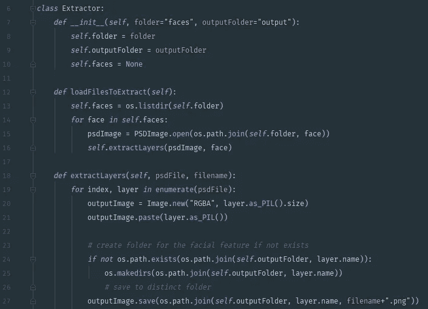

将图层提取到图像文件

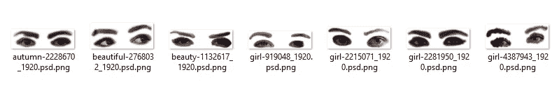

提取的“眼睛”层

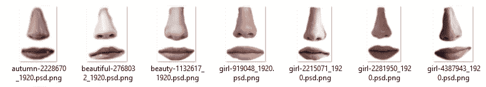

“鼻子 _ 嘴”层

# 面孔生成器

现在我只需要把它们放在一起，枕头图片会有所帮助。

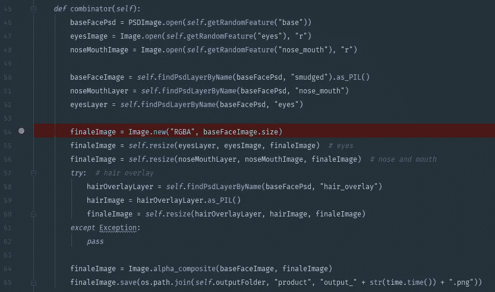

层层叠叠

生成的图像有点难看，所以现在是时候尝试用剪切过滤器隐藏不完美之处了。

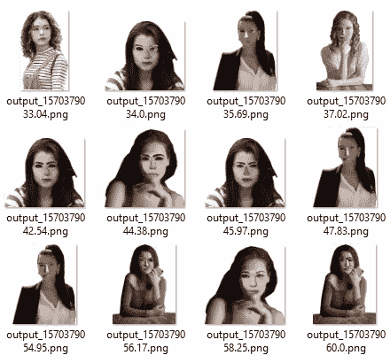

生成的图像

*断流*滤波器很好地“隐藏”了故障。

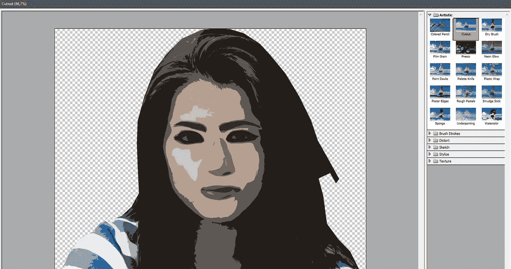

动作中的剪切效果

不幸的是，如果不使用 Sobel 过滤器、中值过滤器和抖动，就无法在 Python 中创建这种效果，这将非常耗时。我发现了一个 GIMP 插件[*FU _ artist _ cutout . SCM*](http://gimpchat.com/viewtopic.php?p=137912)*做同样的事情，但这也不是正确的方法。我将使用 G'MIC 库，它也有一个[在线 UI](https://gmicol.greyc.fr/) 。*

*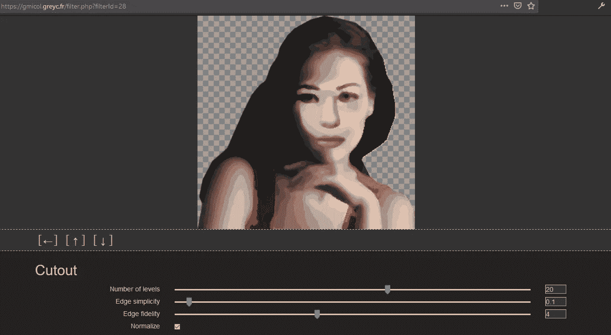*

*G'MIC 在线实用程序*

*事实证明，gmic 只能使用脚本，它没有用于*剪切*效果的命令行参数。我在文件 *gmic_stdlib.gmic:* 中找到了*剪切*效果的定义*

```
*fx_cutout :
-repeat $! -l[$>] -split_opacity -l[0]
-**median** {10-$3}
-**quantize** $1
--area. 0,1 med=${-med} -rm.
-inpaint_holes {$med*$2%},0,1
-if $4 -n 0,255 -endif-endl -a c -endl -done*
```

*现在，我可以为 g'mic 创建自己的剪切滤波器:*

```
*# File `myCutout.gmic`
cutout : 
  -echo "Arguments : $1,$2"
  -input $1
    -repeat $! -l[$>] -split_opacity -l[0] 
    -median **6**
    -quantize **20** 
    --area. 0,1 med=${-med} -rm. 
    -inpaint_holes {$med***0**%},0,1 
  -endl -a c -endl -done -output $2*
```

*有了这个和命令行工具，我就准备好了。*

*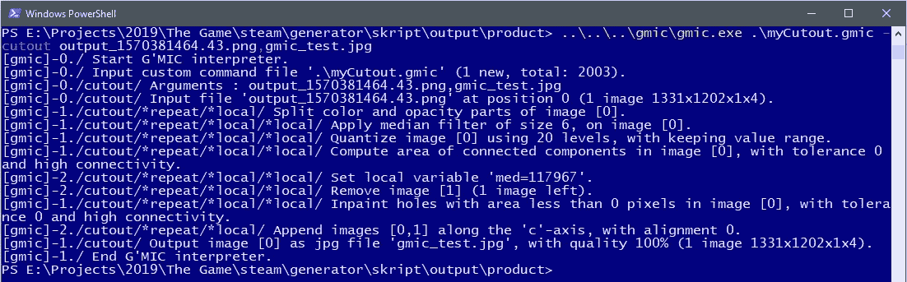*

*G'MIC 在行动*

*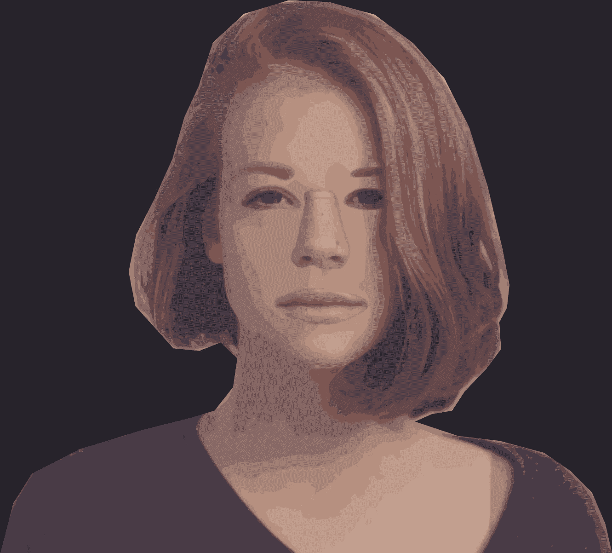*

*随机脸。头发覆盖工作，膨胀。*

*现在我只需将它插入到*子进程*中，让它运行一段时间来生成我想要的任意多的随机面。完成了。*

*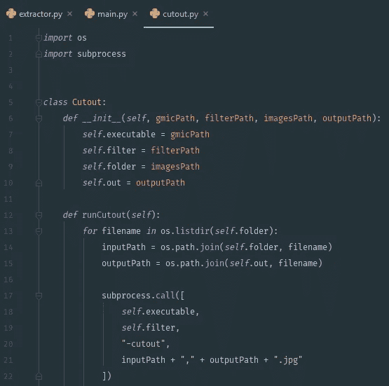*

*代码和一些。我的 github 上有 psd 测试文件。*

 *[## janjilecek/faceGenerator

### 此时您不能执行该操作。您已使用另一个标签页或窗口登录。您已在另一个选项卡中注销，或者…

github.com](https://github.com/janjilecek/faceGenerator)*