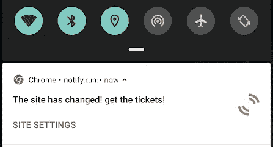
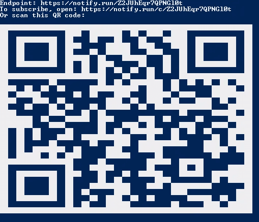
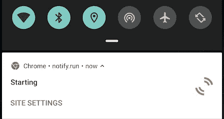
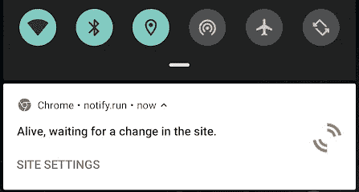

# 我是如何拿到一张门票的，这是一场布兰登·桑德森的讲座，门票很快就卖光了，里面有 40 行 Python 代码

> 原文：<https://itnext.io/how-i-got-tickets-to-a-quickly-sold-out-brandon-sanderson-lecture-with-40-lines-of-python-code-64c672f6e000?source=collection_archive---------1----------------------->

简而言之——当有票的时候，我的手机收到了这个通知:



我手机截图

# 背景故事

几个月前，当地的幻想和科幻组织邀请布兰登·桑德森，他是我一直以来最喜欢的幻想作家，作为一年一度的“图标”节(一个幻想和科幻节)的嘉宾

我一听到这个消息，就知道我必须去听他的一个讲座。我几乎读过他写的每一本书，他的世界给了我无尽的灵感。事实上，我在几个月内读完了他所有的主要书籍。一周前，他们终于公布了音乐节的官方日程，其中包括桑德森的讲座。但是，令我惊讶的是，他们还没有发售门票。取而代之的是，日程表上有了一个 ***“停止发售，门票将在几天后发售”*** 的大标题。由于我对早年的常规演讲厅很熟悉，我知道它们都很小，如果我想得到一张他演讲的门票，我必须很快。随着这个消息在社交媒体上传播开来，关于科幻和奇幻团体的讨论愈演愈烈，我觉得拿到一张票的机会正在一分一秒地减少。我不能错过这个机会。

我和一个朋友分享了我的恐惧，他给了我一个很酷的主意(我甚至不确定他是不是 100%认真的)
他说——“嘿，你为什么不写点东西来帮你呢？你只需要看看什么时候有票，然后通知自己。不会那么难的。”

他是对的。这并不难。

# 设计

所以我坐下来写了一个 python 脚本，它会在有票的时候通知我。基本思想是这样的:**一旦脚本发现售票站点有变化，它需要直接向我的手机发送推送通知。这是我知道我能及时看到票的唯一方法，因为我的手机一直带在身边，所以我得到通知的几率很高。我还决定每 10 分钟检查一次就足够了，我心想——票不会很快售完(剧透:我只说对了一半，其中一个工作室在两分钟内就卖光了)**

代码本身非常简单，但我想我应该分享一下，以防有其他程序员不知道做这样的事情有多容易，让他们的生活变得轻松一点。

# 准备

编程语言:Python
需求:只有 PyPI 的一个包— **“通知-运行”**
很棒的 Python 包，你可以在这里找到它的 Github 页面[。
您可以进入您的 python 环境(我假设您使用的是 virtual-env)并运行:](https://github.com/notify-run/notify.run)

`pip install notify-run`

完成后，您需要注册一个频道。此通道将允许您的代码通过手机的 web 浏览器直接向您的手机发送通知。因此，在安装 notify-run 之后，您需要运行:

```
notify-run register
```

*Windows 用户:如果你使用了一个虚拟环境来安装 notify-run，你可以在 venv“Scripts”文件夹(venv\Scripts)中找到你的 notify-run 可执行文件，还有‘pip’、‘python’和‘easy _ install’。*

这个很酷的包为你创造了一个渠道。运行该命令后，您将获得一个二维码和一个链接，将您的手机连接到新创建的频道



通知-运行产生的 QR 码

您的本地环境已经就绪。现在你只需要写代码。

# 代码

如我所说，代码本身非常简单。我不太担心性能，因为我决定它应该每 10 分钟运行一次。站点本身是静态的，在请求发出后没有代码生成，所以这使得它更加容易。我唯一真正的挑战是让自己得到通知，其余的很容易。我先给出代码，然后再解释。

```
from urllib.request import urlopen
from notify_run import Notify
import re
from time import sleepdef notify_me(url):
    # The notify-run object
    notify = Notify()
    data = (urlopen(url)).readlines()

    # A simple counter, to notify every 2 hours it's still alive
    count = 0
    # A first message, to check for the health of the channel.
    notify.send('Starting notification process')
    found = False
    # try/finally so I would get notified if the script stopped
    # for any reason.
    try:
        # A simple while, with a 2 hour health check.
        while not found:
            found = True
            for line in data:
                x = re.search('Closed sale', str(line))
                if x:
                    found = False
                    break
            sleep(600)
            count += 600
            if count >= 7200:
                # Notify me that the code is still running
                notify.send('Alive, waiting for a change in the site.')
                count = 0
            data = (urlopen(url)).readlines()
    finally:
        # If we got here,I should buy the tickets,
        # or something went wrong. Either way, I should check
        notify.send('The site has changed! check it!')
```

该功能有两个部分—第一部分是准备部分，第二部分是主循环，每 2 小时通知一次其健康状态。
第一行很简单——定义通知对象。这个对象允许我们与之前注册的通知运行通道进行通信。
然后，我们用`urllib.requests`包打开页面，得到它。然后我们读取该对象的行，并将它们插入到数据中。
第一个有趣的呼叫是`notify.send('Starting')`呼叫。这里，我们向通道发送第一个通知。

在这一部分，你的手机应该是这样的:



第一个通知的屏幕截图

下一部分是一个简单的 while 循环。每隔 10 分钟(600 秒)，下载网站，使用正则表达式包(re)遍历它，并检查确切的单词“Closed sale”。如果你找到他们，这意味着网站还没有改变，所以没有票。
因此，每隔 2 小时，您就会看到以下通知:



但是，如果“re”不能匹配这些单词，这意味着站点已经更改，while 循环应该会中断，您会在手机上看到以下通知:


就是这样！你已经做到了。现在，您可以创建自己的脚本来帮助自动购买您想要的演出和电影的门票。

如果有任何问题，随时给我发消息！