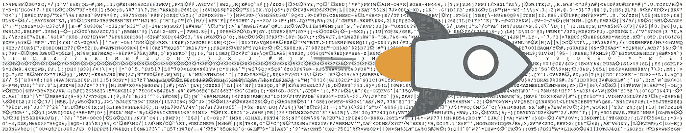
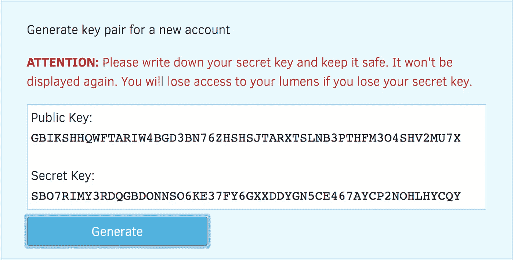
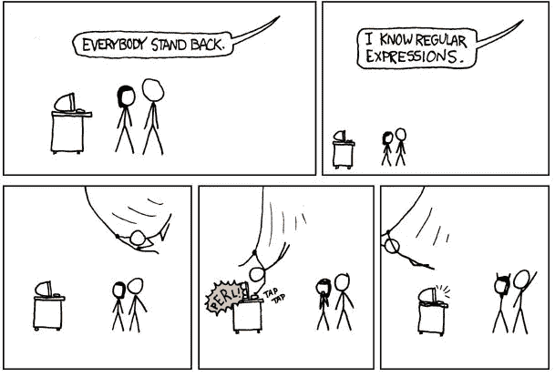

# 我如何帮助从内存转储、正则表达式和耐心中恢复 5000XLM

> 原文：<https://itnext.io/how-i-helped-recover-5000xlm-from-ram-dumps-regexp-and-patience-42a8c8fc87cf?source=collection_archive---------3----------------------->



T 我在这里，阅读 [/r/Stellar](https://www.reddit.com/r/Stellar) 上的一些帖子的标题，这时我偶然发现了[这个小灾难](https://www.reddit.com/r/Stellar/comments/7t3xp8/psa_on_the_importance_of_your_private_key_and_my/)在这里 [/u/badusernam](https://www.reddit.com/user/badusernam) 讲述了他在从一个交易所向其发送所有 XLM 后未能记录他的私人密钥后绝望和不幸的故事。

对于那些不熟悉什么是加密货币的私钥、私钥、公钥和钱包的人，可以这样想:

> 你的公钥就是你的钱包，钱包保存货币就像电子邮件地址保存电子邮件一样。您可以将公钥共享给 **receive** currency，就像共享您电子邮件地址来接收电子邮件一样。现在，您的私人密钥就是您从钱包向其他地方发送货币的密码，就像您的密码允许您从自己的帐户发送电子邮件一样。

抱歉，这个类比过于简单，我发现如果和他们熟悉的东西比较，会帮助一些人更好地理解。

这让我想到了他之前的一篇帖子，他悬赏任何能帮助他找回私钥的人，帖子的语气令人沮丧，相当悲观。Op 不断地说自己愚蠢，我为他感到难过，有几个从 RAM 中恢复的建议。所以我开始调查。

不过，我做的第一件事是[在账户查看器存储库](https://github.com/stellar/account-viewer/issues/53)上创建了一个问题，以防止其他人走上同样的道路。这立即导致一个名为`[fnando](https://github.com/fnando)`的了不起的用户解决了这个问题，并在网站上实现。向所有参与其中的人致敬。



几天前没有任何预警。

我的第二步是尽可能不使用精确的步骤来复制场景，因为我不想在测试不成功的情况下打扰用户。这意味着我生成了一个新的 pair，关闭了选项卡，关闭了 chrome，并继续从我的 RAM 中生成一个 dump。

> 我绝不是内存取证方面的专家，远远不是，所以肯定有更好的方法来完成我将要描述的每一步。我没有遵循 AFF4 格式，而是一个更简单的 RAW，一个文件的疯狂。

为了生成 RAM 转储(在 mac 上)，我遵循了“[使用 OSXpmem 和 Volatility](http://ponderthebits.com/2017/02/osx-mac-memory-acquisition-and-analysis-using-osxpmem-and-volatility/) 进行内存获取和分析”，但没有做 Volatility 部分，我只是在我的工作 IDE 上打开了 16Gb 的文件，并看着它崩溃，因为它无法处理它。我不知道它会这么大，但这是有道理的，因为我运行的机器有 16Gb 的内存。

然后我下载了一个名为 [iHex](https://itunes.apple.com/es/app/ihex-hex-editor/id909566003?mt=12) 的十六进制编辑器，并开始寻找已知的私钥，到处都有匹配。混杂着 HTML，混杂着胡言乱语，在符号和特殊字符之间被隔离，但是我找不到一个像样的方法来找到它，除非…嗯，已经有了它。

我还可以找到我所有的密码，我访问过的网站，信息摘录，编码图像，IP 地址，电子邮件地址，你能想到的，RAM 都有，所以避免使用公共计算机可能是一个明智的想法，如果你不得不这样做，事后强制重启。理想情况下，你应该将电脑引导到一个可信的失忆操作系统[，比如 Tails](https://tails.boum.org/) 。这样你就可以不太担心(不是完全)谁会四处窥探，但首先要阅读他们网站上的[警告页面](https://tails.boum.org/doc/about/warning/index.en.html)。

无论如何，回到私钥，在这一点上，我与 **badusernam** 取得了联系，我们开始通过 [Discord](https://discordapp.com/) 分享我们的进展。有时候我确信我们会找到它，有时候我担心我们会一无所获。我对它有点着迷，花了无数个晚上寻找找到私钥的方法，却不知道。我恍然大悟..

# 进入正则表达式的领域

我们都对正则表达式又爱又恨，但是有效解析 800 万行 RAM 的唯一方法是遵循模式搜索，而不是字面上寻找随机字符串。为此，我找到了一款名为 [SlickEditPro](https://www.slickedit.com/trial/slickedit) 的应用，并使用了他们的 14 天试用版。我会向任何处于类似情况的人推荐它，它有自己的学习曲线和特点，但它处理工作非常好，我不能抱怨。

我使用的第一个正则表达式是简单的`S[A-Z0–9]{55}`，它将寻找一个 56 个字符长的字母数字字符串，全部大写，以`S`开头。这给了我大部分的测试键，但不是最接近用户描述的过程的那些。

它也给了我大约 80 万个匹配，这太多了。我尝试了其他几种正则表达式，用于小写匹配、部分匹配、html 标签中包含的关键字，你能想到的，我都尝试了。



强制脱衣[https://xkcd.com/208/](https://xkcd.com/208/)

经过多次尝试，我开始注意到一些东西。有时，私钥和公钥是存在的，但**不是以一种明显的方式**，它们就在那里……但与其他字符混合在一起，被似乎是空格的东西隔开，用“*我们在这里，我们在这里*”的口号来嘲弄我们。而不是看起来像`SBO7RIMY3RDQGBDONNSO6KE37FY6GXXDDYGN5CE467AYCP2NOHLHYCQY`

看起来像是:

```
S<NUL>B<NUL>O<NUL>7<NUL>R<NUL>I<NUL>M<NUL>Y<NUL>3<NUL>R<NUL>D<NUL>Q<NUL>G<NUL>B<NUL>D<NUL>O<NUL>N<NUL>N<NUL>S<NUL>O<NUL>6<NUL>K<NUL>E<NUL>3<NUL>7<NUL>F<NUL>Y<NUL>6<NUL>G<NUL>X<NUL>X<NUL>D<NUL>D<NUL>Y<NUL>G<NUL>N<NUL>5<NUL>C<NUL>E<NUL>4<NUL>6<NUL>7<NUL>A<NUL>Y<NUL>C<NUL>P<NUL>2<NUL>N<NUL>O<NUL>H<NUL>L<NUL>H<NUL>Y<NUL>C<NUL>Q<NUL>Y<NUL>
```

> *我后来从 reddit* *的一个评论中得知* [*它是空的，因为它是 UTF-16 编码的，这也可能意味着它来自 RAM 的 java 脚本部分，而不是 HTML。*](http://reddit.com/r/Stellar/comments/7u1wo0/update_5000_lumens_lost_with_stellar_account/dthrcq9)

有一本名为[的好书，是每个程序员绝对需要了解的关于编码和字符集的知识，以处理文本](http://kunststube.net/encoding/)，它解释了编码之间的区别，并解释了在这个明显充满乱码的私有密钥样本上发生了什么。

那是顿悟的时刻，这里的“*等一下*”。我写了一个快速的正则表达式，结果胜出。请记住，所有这些测试最初都是由我执行的，但必须由用户在实际的 RAM 转储上再次执行，所以我必须耐心地等待，直到他测试完拒绝或坚持这种方法。我不想访问别人的内存转储，我太好奇不窥探左右，所以这是唯一的办法。


这是它所有的荣耀

我认为它可以简化很多，它可以写得更简洁，可能执行得更好，但事实是，这挽救了一天，并帮助用户找回了他的钱包。这也让我得到了奖励，有些人甚至在 reddit 上给了我小费！，但这不是重点。

排队的兴奋，哦，我他妈的上帝，我们做到了，赞美，肾上腺素激增，这一定是因为找回了一笔不小的钱，屏幕两边的笑容，然后，就这样，一切都结束了。

# 结论

如果您处于类似的情况，并且足够幸运地进行了 RAM 转储，或者仍然适合进行 RAM 转储(例如，没有重新启动计算机)，请尝试一下。不要让网上的回复把你击垮，或许还有一丝追求的光芒。

我也没有下班后的爱好，所以我需要找点别的。
如果你像/

[我在这里写了一个关于硬件钱包的故事](https://medium.com/@juan_cortes/why-i-chose-the-ledger-nano-s-e442728dff6d)