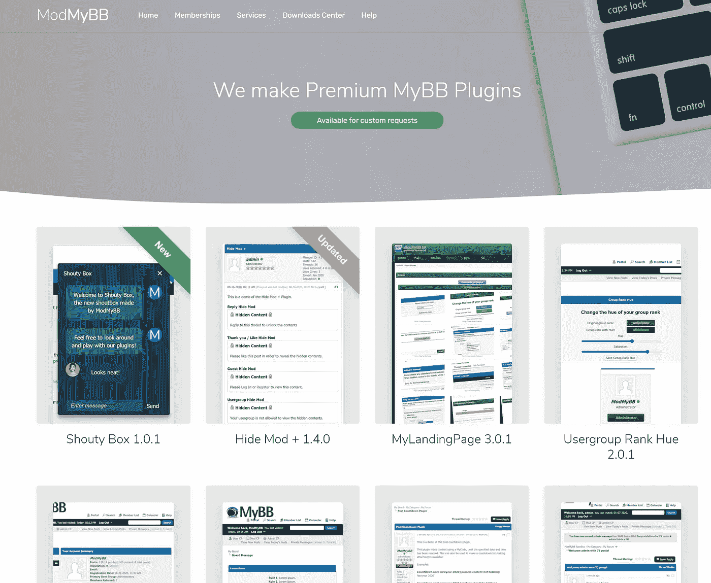
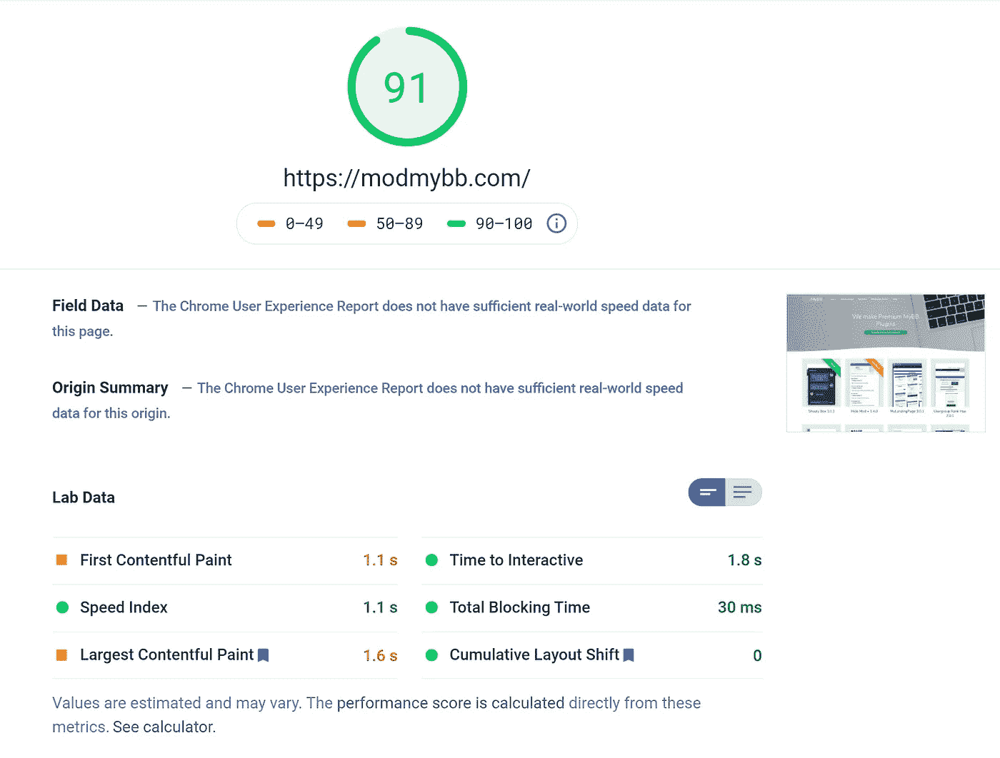
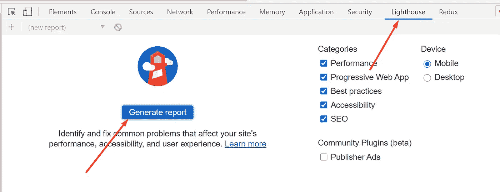

# 我如何用 GatsbyJS 和 AWS 改进我的网站的 SEO

> 原文：<https://itnext.io/how-i-improved-the-seo-of-my-website-with-gatsbyjs-and-aws-bcac9a98307?source=collection_archive---------4----------------------->

## 提高 SEO 排名之旅。

## 提高我的网站搜索引擎优化的关键之旅。我是这样做的。

这是我两个月的漫长旅程，从 Alexa 排名**6.7 米**到**2.1 米**(越低越好)。这是我在 Alexa 排名中的一个 **4 671 803** 增长。我们将讨论我用来实现这一目标的策略。例如，迁移到静态网站、托管迁移和性能调整。虽然 210 万不是 Alexa 上最好的排名，但比 670 万有了很大进步

本文讨论的网站销售 MyBB 论坛软件的软件插件。我曾经是这个开源软件的开发团队成员。

# 我是如何开始的

我需要一个展示我的产品的前端，一个后端，以及一个购买和下载产品的客户区。

## 前端技术

考虑到用户体验、成本和速度，我选择了以下技术。我使用 React 和一个漂亮的模板制作了前端。React 是一个非常有用的工具，可以提供漂亮的用户体验。更新无需重新加载浏览器，这使得它非常流畅。

我的插件网站的反应应用程序。

# 解决 React SEO 问题

由 [Merakist](https://unsplash.com/@merakist?utm_source=medium&utm_medium=referral) 在 [Unsplash](https://unsplash.com?utm_source=medium&utm_medium=referral) 上拍摄

有几个选项可以确保我的完全成熟的 React 站点被搜索引擎完全索引。

## 服务器端渲染反应

一种解决方案是在服务器端呈现 React 应用程序。但是，这将使开发更加复杂，也增加了成本，而这对于一个小型的纯静态网站来说是不必要的。

## 静态网站怎么办？

静态网站速度很快，很好地处理 SEO，并且整体上很容易处理。然后我调查了不同的选择。

*   用 HTML 构建一个静态网站是行不通的。我不愿意维护一个纯 HTML 的网站。大多数 React 组件已经存在，并且更容易维护。
*   然后我查看了 **React 静态网站生成器**。有几个 npm 包抓取你的 React 网站，把这些变成静态网站。我测试了这些，但是这些都不能满足我的网站的需求。静态页面生成速度很慢，效果也不好，同时还需要代码更新。
*   这时我发现了 [**Gatsby**](https://www.gatsbyjs.com/) ，一个从 React 应用程序生成静态网站的成熟框架。听起来很有希望。看看这些例子，这正是我所需要的。Gatsby 有一个很大的社区，有很多为它编写的扩展，提供了广泛的可能性，比如为不同的视口自动调整图像大小。

# 调整盖茨比的搜索引擎优化

在新网站投入生产后，是时候进一步调整和改进 SEO 了。我脑子里有一些想法。

## 常规搜索引擎优化更新

首先，每一页需要有一个非常准确和不同的标题。我使用了头盔和 GraphQL 查询的组合来实现这一点。关于这一点的完整说明可以在 [Gatsby 文档](https://www.gatsbyjs.com/docs/how-to/querying-data/use-static-query/)中找到。

接下来，我确保所有图像都有正确的 alt 标签。这可能看起来不多，但值得仔细检查，因为这对你的整体搜索引擎优化得分有影响。

最后，元描述很重要。这是我没有时间改进的地方。准确，中肯的元描述对你的搜索引擎优化很重要。确保 HTML 头项目包括所有你需要的元标签。例如，描述、作者等等。根据 Moz 的说法，元描述的理想长度在 155 到 160 个字符之间。

HTML 元描述示例

## 额外的搜索引擎优化考虑

现在很多网站都是 PWAs，渐进式的 web 应用。这意味着这些网站可以安装在你的手机上，看起来就像真正的移动应用程序，就好像它们来自应用程序商店一样。虽然 pwa 不会直接提高你的 SEO 分数，但是它们确实提高了用户体验，这应该是我们的首要目标。

我们可以用[*Gatsby-plugin-manifest*](https://www.gatsbyjs.com/plugins/gatsby-plugin-manifest/)和[*Gatsby-plugin-offline*](https://www.gatsbyjs.com/plugins/gatsby-plugin-offline/)插件在 Gatsby 中做到这一点。第一个插件确保清单文件在那里，使你的网站成为一个 PWA。第二个插件确保即使没有网络连接，你的网络应用程序仍然工作。对于静态网站，这不需要太多的配置就可以很好地工作。

使用[*Gatsby-plugin-sitemap*](http://gatsby-plugin-sitemap)*我能够确保生成正确的站点地图。*

# *测量网站速度*

*我们已经做了相当多的 SEO 改进，但是你考虑过你的网站速度吗？谷歌根据页面速度对网站进行排名。现在是 2021 年，快速网站是必须的！*

> *速度现在是谷歌搜索的登陆页面因素*
> 
> *~ [谷歌开发者](https://developers.google.com/web/updates/2018/07/search-ads-speed#:~:text=Speed%20is%20now%20used%20as%20a%20ranking%20factor%20for%20mobile%20searches,-Users%20want%20to&text=The%20Search%20team%20announced%20speed,factor%20for%20mobile%20searches%20too.)*

*谷歌做了一个非常有用的工具来衡量你的网站的速度表现！我们有两种方式可以运行它。*

## *通过 Google PageSpeed Insights 测量速度*

*谷歌提供了一个叫做[的工具。这个工具可以让你得到网站页面速度的分数和反馈。让我们试试我的 MyBB 插件营销网站。](https://developers.google.com/speed/pagespeed/insights/)*

**

*从 Google 生成页面速度洞察报告*

*在我实施了所有的速度改进之后，我们最终获得了 91%的分数！这对页面速度很有好处。很多非常受欢迎的网站得分较低。一定要试用这个工具，并阅读谷歌提供的反馈，因为它非常有价值。*

## *通过谷歌灯塔测量速度*

*另一种衡量网站速度的方法是使用 Chrome 内置的 LigtHouse。在 Chrome 中，打开开发者控制台(F12)。找到灯塔选项卡，点击*生成报告*。这将生成一个报告，就像 PageSpeed insights 工具一样，但是，该工具在本地运行，也可以用于测量本地网站的速度。*

**

*在 Chrome 中使用谷歌灯塔*

# *速度改进*

*SEO 改进本身是不够的。我们需要禁食。熊熊燃烧。很快。网站。在 2021 年这是必须的，让我们来看看我采取的一些行动，以提高盖茨比网站的速度。*

## *快速托管*

**

*AWS 是我最喜欢的云托管提供商。*

*正如文章开头提到的，我仍然在为我的静态网站使用共享主机。更快的是 CDN，也称为内容交付网络，在世界各地都有分布式缓存。这确保了一个快速的静态网站，无论你在哪里。当您浏览网站时，您将登陆离您最近的 web 缓存，这可以改善连接到网站的延迟。*

*我最喜欢的云提供商是 AWS，所以我选择了 S3 来托管文件，CloudFront 作为 CDN。我立即注意到上传文件到 S3 比使用 FTP 快得多，我喜欢它！我的 CICD 部署计划从部署 1 个多小时缩短到仅部署 4 分钟，AWS S3 铲斗的速度真是令人难以置信。由于 CDN 的速度，访问我的网站成了一种享受。下面是亚马逊对 AWS S3 + CloudFront 组合的解释。*

*我担心成本，因为我以前没有使用 S3 或 CloudFront 进行个人项目的经验。我又惊又喜。我目前平均每天支付 0.10 美元，也就是说，AWS 上最贵的 CDN 每年总共 36.5 美元。一旦网站变得更受欢迎，我预计成本会略有上升，但不会大幅上升。这一成本包括营销网站托管以及客户区，我也迁移到 AWS 以获得速度优势。*

## *提供正确的图像尺寸*

*如果你的页面上有很多图片，为浏览你网站的设备优化这些图片是至关重要的。盖茨比为此有一个巨大的图书馆叫做[*——盖茨比形象*](https://www.gatsbyjs.com/plugins/gatsby-image/) 。它将调整图像的大小到你的设备上，并延迟加载图像。延迟加载甚至可以设置为在加载全质量图像时查看模糊的低分辨率图像。这是一个很好的用户体验，让网站感觉更快。这个库一开始很难建立，但是一旦你做对了，网站就会快很多，用户体验也会好很多。*

## *减少资产文件大小*

*作为最后的优化，我使用了[*Gatsby-plugin-purge css*](http://gatsby-plugin-purgecss/)来移除不必要的 CSS。这有助于减少你的 CSS 文件大小，使你的网站更快。在某些情况下，这可能会破坏您的网站，但我很幸运，不必更改任何配置。它开箱即用。*

# *结论*

*这就是我如何能够将我的 Alexa GatsbyJS 网站排名提高 460 万的原因。你是如何优化你的网站的？在 Alexa 中排名如何？让我们知道！*

*[订阅我的媒体](https://kevinvr.medium.com/membership)到**解锁** **所有** **文章**。通过使用我的链接订阅，你是支持我的工作，没有额外的费用。你会得到我永远的感激。*