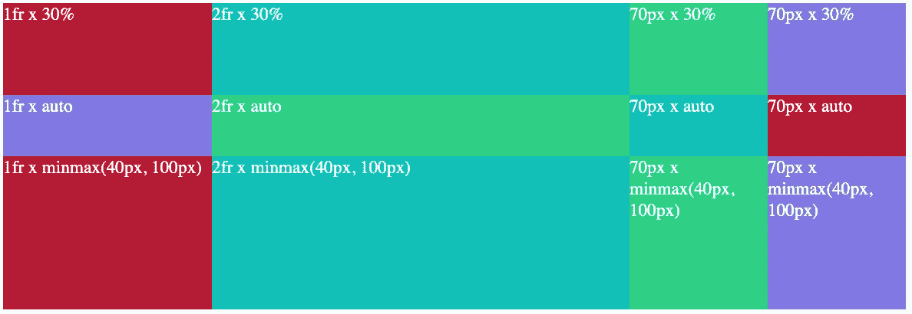
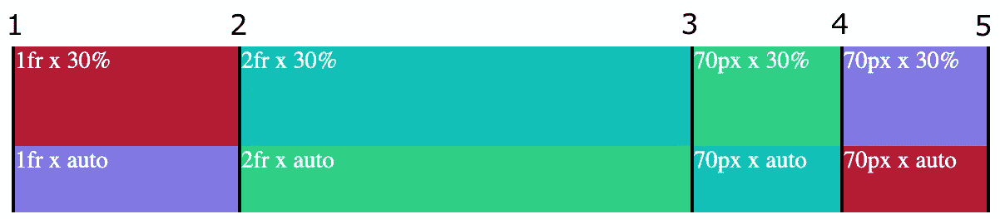
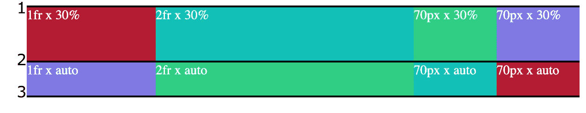
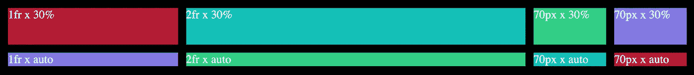
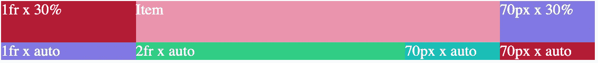
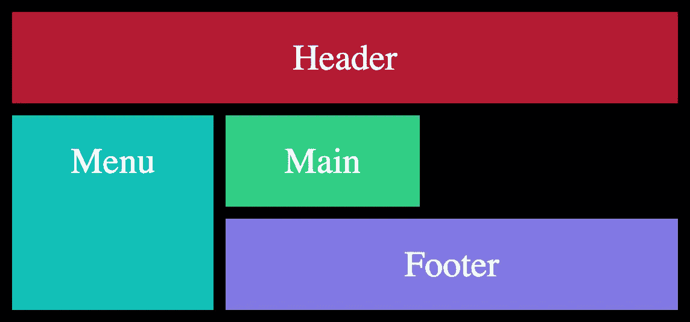

# 🔥我如何在 5 分钟内学会 CSS 网格

> 原文：<https://itnext.io/how-i-learned-css-grid-in-5-min-ec6439d8bf0?source=collection_archive---------3----------------------->

如果你很懒，不想阅读 CSS 网格文档，那么这篇文章就是为你准备的。


CSS Grid 是一个非常强大的布局系统，有很多特性。如果你很懒，不想阅读所有的文档，这篇文章就是为你准备的。它包含了一个最小的 CSS 网格语法，可以在大多数用例中快速使用它。

[](https://medium.com/subscribe/@easy-web) [## 每当维塔利·舍甫琴科发表文章时，就收到一封电子邮件。

### 每当维塔利·舍甫琴科发表文章时，就收到一封电子邮件。通过注册，您将创建一个中型帐户，如果您还没有…

medium.com](https://medium.com/subscribe/@easy-web) 

# ***内容***

1.  [**什么是 CSS 网格？**](#2e7e)
2.  [**术语**](#c5ee)
3.  [**网格模板类型**](#6c07)
4.  [**例题**](#2844)
5.  [**集装箱**](#e4f0)
6.  [**线**](#ba54)
7.  [**项**](#eb68)
8.  [**区域**](#e401)
9.  [**结论**](#bfa6)
10.  [**了解更多**](#b031)

# 什么是 CSS 网格？

**CSS 网格** —是使用 ***网格标记* *排列 HTML 元素的方式，没有浮动和定位*** 。它不是 *flex、*的替代品，此外，您可以将*网格*和 *flex* 组合在一起。

你可以把它想象成一个摄像机网格，你把一个物体放在网格的水平线和垂直线中。


# 术语

1.  集装箱——(例如。摄像机网格) ***父*** 块，使用**行**和**列将其分成 ***单元***；**
2.  **线**——(例如。摄像机网格的水平线和垂直线)**行**和**列**的*边缘*和；
3.  **项目**——(例如。对象在摄像机镜头中的位置) ***子*** 元素，它占用一个或多个 ***单元格*** 的空间；
4.  **区** — **项****T5，名称** 占据 ***单元格***；

# 网格模板类型

您可以使用两种方法来定义网格模板:

1.  基于行和列:在**容器**中定义行和列模板，然后在**项中设置位置。**最适合表格、模态窗口等小型组件；
2.  基于网格**区域:**命名每个**项目**，然后参考**容器**中的**项目**名称来设置位置。最适合定义页面的主要结构，包括页眉、菜单、页脚；

我们将在接下来的段落中更详细地回顾这些类型。

# 例子

基于行和列的网格模板:

基于网格区域的网格模板:

# 网格容器

**网格容器** —是定义网格标记的**父** **div 元素**。

```
.container {
  **display: grid;**
}
```

稍后，您需要通过定义每个**行**和**列**的大小，将网格划分为 ***单元格*** 。

```
.container {
  display: grid; **grid-template-columns**: 1fr 2fr repeat(2, 70px);
  **grid-template-rows**: 30% auto minmax(40px, 100px);
}
```

**单元定义**

*   **fr** —是剩余空间的*分数*(比率)；
*   **重复(<次>，<单位> )** —重复多少次空格；
*   **百分比** —获取所有可用空间的百分比(行或列的总空间)；
*   **自动** —占用所有剩余空间；
*   **minmax( < min >，< max > )** —定义占用空间的最小和最大边界；



> *💡注:* < X > x < Y >:其中 X 为宽度，Y 为高度
> 
> *💡注意:容器网格相当抽象，意味着你不必为每个单元格创建单独的* **项** *元素。*

# 线条

**线** —每个**单元格之间的间隔**。水平线和垂直线将**容器**分成网格。

垂直线:



> *💡注:行数从索引* ***1 开始，*** *的意思是* *如果你有 4 列，那么总共就是 5 竖线。行也一样。*

水平线:



> *💡注意:行索引用于将* ***项目*** *元素定位在* ***单元格*** *上。*

使用 ***列-间隙:*** 和 ***行-间隙:*** 或仅仅一个 ***间隙:<列> <行>*** 来定义线条的粗细:

```
.container {
  display: grid;grid-template-columns: 1fr 2fr repeat(2, 70px);
  grid-template-rows: 30% auto;
  **gap:** 10px; /* OR  gap: 10px 10px; */
}
```



# 项目

现在，当我们有了由父**容器**定义的网格标记时，是时候放置子元素 **item，**哪个将占用一个或多个**单元格**的空间:

```
.item {
  **grid-column:** 2 / span 2;
  **grid-row:** 1 / span 1;
}
```

在这里我们定义了我们想要占据哪个**细胞**。记住线索引总是从 **1** 开始。

**网格-列/行:<行索引> / <要占用的单元格数量>。**



# **区域**

**区**——只是一个名为项的**T31。我们使用这个名称来明确定义父**容器中**单元格**上的**项目**位置。****

首先，让我们创建几个**项目**和给它们命名:

```
.item1 { **grid-area:** header; }
.item2 { **grid-area:** menu; }
.item3 { **grid-area:** main; }
.item4 { **grid-area:** footer; }
```

现在，我们可以使用**容器**中的名称来定义整个布局:

```
.container { 
  display: grid;
  **grid-template-areas:**
    'header header header header'
    'menu main . .'
    'menu footer footer footer';
  gap: 10px;
}
```

> *💡注意:使用* ***。*** *(点号)来描述* ***单元格*** *其中没有对应的* ***项*** *与名称。*



# 结论

学习完这些主要属性后，你将能够涵盖大多数 CSS 网格用例。如果您想更深入地了解和检查更多 CSS 网格特性，请浏览以下参考资料:

*   [网格完全指南](https://css-tricks.com/snippets/css/complete-guide-grid/#basics-browser-support)
*   [w3 学校指南](https://www.w3schools.com/css/css_grid.asp)
*   [MDN 文档](https://developer.mozilla.org/en-US/docs/Web/CSS/CSS_Grid_Layout)

[](https://medium.com/subscribe/@easy-web) [## 每当维塔利·舍甫琴科发表文章时，就收到一封电子邮件。

### 每当维塔利·舍甫琴科发表文章时，就收到一封电子邮件。通过注册，您将创建一个中型帐户，如果您还没有…

medium.com](https://medium.com/subscribe/@easy-web) 

# 了解更多信息

[](https://medium.com/@easy-web/how-to-scale-angular-without-limits-e6a6ca15111) [## 🔥如何无限制地缩放角度

### 极限总是在你的头脑中，清空你的头脑和秤

medium.com](https://medium.com/@easy-web/how-to-scale-angular-without-limits-e6a6ca15111) [](https://medium.com/@easy-web/how-micro-frontend-changes-the-future-of-angular-bb4deb2cfdad) [## 🔥微前端如何改变 Angular 的未来？

### 让我们看看为什么 Angular 最适合微前端

medium.com](https://medium.com/@easy-web/how-micro-frontend-changes-the-future-of-angular-bb4deb2cfdad)