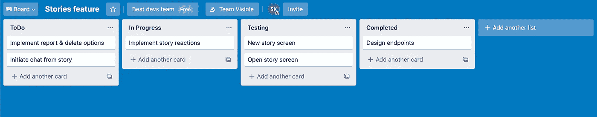

# 我如何学会管理我的小型开发团队，你也可以

> 原文：<https://itnext.io/how-i-learned-to-manage-my-small-team-of-devs-and-so-can-you-2d52c8d1ea4f?source=collection_archive---------3----------------------->

## 5 个行之有效的技巧，可以真正提高你的团队的生产力


威廉·艾文在 [Unsplash](https://unsplash.com/s/photos/project-manager?utm_source=unsplash&utm_medium=referral&utm_content=creditCopyText) 上的照片

与一个非常大的团队相比，与一个小团队一起工作可能听起来更容易，但事实是你也将面临许多挑战。尤其是如果你像我一样没有经验。

我知道在创业初期，每个人都可以扮演开发者的角色。所以这是给你的，首席开发人员，项目经理，首席技术官和首席执行官…给那些开始或加入一个只有少数开发人员的创业公司的人。

**没有人喜欢改变** 作为首席开发人员，你能为你的团队做的最糟糕的事情之一，就是组织和实现更新的代码，与他们分享，这样他们就可以开始了，却发现你需要做一些改变。每个人的工作都将受到影响，这将使整个更新推迟！

很明显，你不能预见每一件可能出错的小事，但是你测试的越多，你需要改变的可能性就越小。

创建简洁的文档
你还记得在大学时，你必须为一些编程课程创建文档吗？那个混蛋！！！**“为什么有人需要一份 10 页的程序作业文档？”**我以前觉得。**“把这该死的东西运行一下，看看到底行不行！”**。嗯，看来我们的教授知道得更清楚！谁会知道呢，对吧？😛写文档，不只是在大的合作中是必要的…即使你只有两个开发团队，也要写！

当我花时间在文档中向每个人解释需要做什么以及如何做时，我自己已经在我的项目中看到了大量的质量改进。你开发一个新功能的后端吗？太好了！包括所有新的数据库结构、新的端点、它们的参数和响应，以及任何值得注意的东西。

这里有一个例子:

```
**NEW STRUCTURES****Story** {
   text: **String**, *// optional*
   imageURL: **String**
   likes: **Int**,
   comments: **Int**,
   views: **Int**,
   reports: **Int**, *// if > 2 we’ll put a blur with a message*
   user: **JSON**, *// { id, gender }* createdAt: **Date
**   existsUntil: **Date** *// createdAt + 24 hours*
}*----------------------------------------------***NEW ENDPOINTS****getStoriesOfUsers** {
    **params**: {
        userIds: **Array<String>**,
        shouldFetchCurrentUserStories: **Bool**
    },
 **response**: {
        stories: **Array<Story>**, *// empty array if none*
        currentUserStories: **Array<Story>**, *// empty array if none*
        likes: **Array<Like>** *// empty array if none*
    }
}It's called from the home page, as soon as the current user is fetched
```

看看这样对前端开发人员或任何相关人员来说有多简单？尤其是在这个人人都远程工作的时代，这是交流任何变化/功能的好方法。

> 确保在同一个文档中包含任何模型…这将使开发人员更容易不必在单独的文件中寻找。

可视化是组织
拥有一份详细的文档来指导你的团队完成他们需要做的事情是很好的。更好的是，使用一个管理应用程序，帮助你对你的任务有一个更直观的感觉。这样一款应用叫做 [Trello](https://trello.com/) *，它提供了一套工具，比如给某些人分配任务，为每项任务设定截止日期，根据标题分类等等。

它看起来是这样的:



你大概能猜到，这些应用的设计方式是，每次开发者把一个任务拖到下一个类别，他/她都会获得一种成就感！当你能看到自己的进步时，继续工作会变得更容易。

> 你能做的最好的事情，就是既使用项目管理应用**又编写**文档

> *我与 Trello 无关…我只是真心喜欢它！

**更短的更新，更快的实现** 我逐渐意识到的另一件事是，有多个小的更新比有一个大的更新更有效率。你会问，这怎么可能？不应该用完全相同的时间吗？嗯，不。你看，长时间做一个更新的人会觉得单调。如果你仔细想想，这确实很有意义。当一个更新很短并且你很快就完成了，你会觉得**你**做得很快。否则，当你完成一个大更新的一部分时，你仍然有许多事情要做，那种负担的感觉仍然存在。

当然，有时候一个更新本质上是很大的，不能再分成小的。在这种情况下，你真的无能为力；只是尽量不要一个接一个的有重大更新。在中间放一些小的。

**大家都同意吗？** 总是，我怎么强调都不为过，**总是**，与您的开发人员交流您认为需要完成的工作！在一个小团队里，每个人都应该有一票！尤其是如果你没有钱，你不能只是向他们要东西。

我的意思不仅仅是讨论**你是否应该开发一个特性，还包括**这个特性应该如何开发。当每个人都参与进来时，你会惊讶地发现一个想法会变得多好！****

**总结** 下面是这个故事的摘要:

*   在将每个特性分配给一个 dev 之前，首先确保不需要做任何改变
*   彻底记录每个更新的要求和规范
*   开始使用项目管理应用程序
*   最好有许多小的更新，而不是非常大的更新
*   不要只是提出完整的想法，然后等待它们的实现…和你的团队一起讨论它们！

我希望你读完我的毫无疑问完美的指南后，不是吹牛😜，您将获得如何优雅地管理您的小型开发团队的感觉。

感谢您的阅读！下一集再见(希望如此😁)