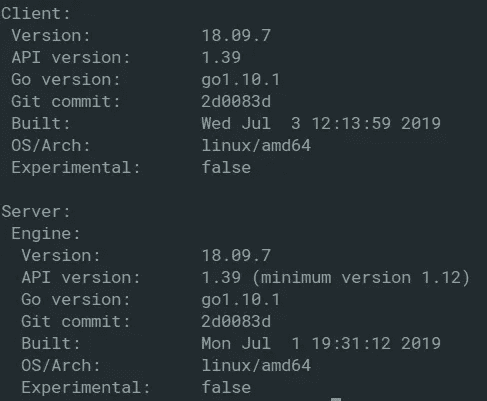
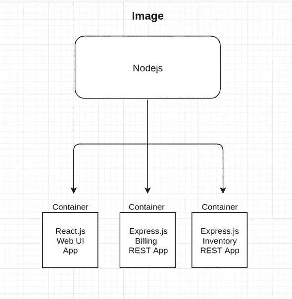
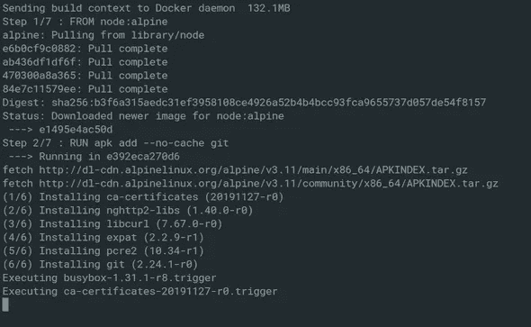
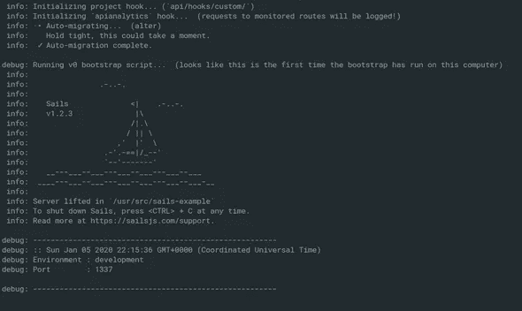
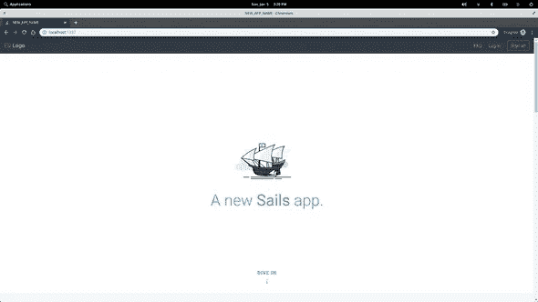

# 我是如何学会不再担心并爱上 Docker 的

> 原文：<https://itnext.io/how-i-learned-to-stop-worrying-and-love-docker-ff4b268ed5b0?source=collection_archive---------5----------------------->

你已经做到了。您成功构建了您的后端！这是你告诉自己忘记你是如何*建造*这个该死的东西，把注意力放在 UI 上的部分。

事实上，在构建过程中，认为*理所当然*的心态就是我们如何得到*眼泪*。在这种情况下，很容易忘记您的包管理器已经过时，忘记您曾经通过 NVM 切换到 Node 9.x，或者忘记您现在在一台完全不同的机器上。

在处理共享项目时，您可能会问自己一些问题:

*   在本地工作时，我如何避免担心再次复制生产构建环境？
*   我能在共享代码之前隔离并解决我的构建问题吗？
*   我如何确保与我一起工作的其他人在拉/叉时处于相同的环境中？

这些可能是你头脑中的一些疑惑，但是像 Docker 这样的工具可以帮你抽象出大部分。Docker 为我们提供了一个值得信赖的、独立的构建过程，这样您就可以放心地测试和共享代码。

到本系列结束时，我们应该能够创建一个数据库，生成一个模式，播种 DB，初始化我们的服务器，并运行 PGAdmin 通过一个 Docker 命令连接所有这些，而不用担心当其他人必须处理它时会发生什么。

**听起来很不错，那么我需要知道些什么？**

你要做的第一件事是[安装 docker](https://docs.docker.com/install/) 。根据您使用的操作系统，您的说明可能会有所不同。完成后，在您的终端中键入:

`docker version`

您应该会看到类似这样的内容:



Docker 本身是一个广泛的主题，因此为了简洁和本系列的范围，我们将把事情浓缩为:[图像](https://docs.docker.com/engine/reference/commandline/images/)、[docker 文件](https://docs.docker.com/engine/reference/builder/)和 [docker-compose](https://docs.docker.com/compose/) 。

为了对 Docker 有一个更高层次的概述，这里有一篇杰夫·黑尔的优秀文章。

# 那么图像到底是什么呢？

**简而言之，映像是一个文件，它的唯一目的是承载程序运行的依赖和配置。**

理解图像*是*的最简单方法是在你的终端上输入:`docker run hello-world`。

如果一切顺利，你应该得到一个看起来像胡言乱语的提要。然而，它们是关于我们如何在这个提示中与**图像**交互的一些说明。

```
1\. The Docker client contacted the Docker daemon. 2\. The Docker daemon pulled the "hello-world" image from the Docker Hub. (amd64) 3\. The Docker daemon created a new container from that image which runs the executable that produces the output you are currently reading. 4\. The Docker daemon streamed that output to the Docker client, which sent it to your terminal.
```


*是的* …什么是守护进程？

根据维基的说法:

> *守护程序是类 Unix 操作系统上的一种程序，它在后台运行，而不是在用户的直接控制下，等待特定事件或条件的发生而被激活。*

迷人，太好了。

所以在按回车键和提示符之间的某个地方，这个 Docker 守护进程正在为我们做所有的脏工作，当它完成时，它返回一个`hello-world`。

如果你运行`docker ps -a`，你应该会得到类似这样的东西

```
| CONTAINER ID | IMAGE | COMMAND | CREATED | STATUS | PORTS | NAMES | | ------------ | :---------: | :------: | :------------: | :-----------------------: | :---: | ------- | | a0adf8a9dbe5 | hello-world | "/hello" | 23 minutes ago | Exited ( 0 ) 23 minutes ago | | example |
```

**现在**我们知道我们有这个`hello-world`图像，在我们的电脑里，我们从这个 [*DockerHub*](https://hub.docker.com/) 地方把它拉出来，听起来有点像 GitHub，但是是为了图像。此图像的唯一目的是打印*“来自码头工人的你好”*。几乎所有的节点都有图像，postgres，ubuntu，如果它是一个环境，那么很可能有一个图像。

您可能已经注意到，在我们的*“码头工人您好”*之前，我们收到了一条信息:

```
Unable to find image 'hello-world:latest' locally latest: Pulling from library/hello-world 1b930d010525: Pull complete
```

Docker 足够聪明，可以在从 DockerHub 中提取图片之前检查任何现有的图片，这非常漂亮。

所以，现在我们知道了什么是**映像**以及 Docker 如何获取这些*依赖关系*和*配置*供我们的程序运行。下一个要真正理解的概念是 [**容器**](https://www.docker.com/resources/what-container) 。不必深究容器和进程之间的关系(这里有一篇 Jessica Grebenschikov[的文章](https://medium.com/@jessgreb01)可以提供一些线索)，容器本质上是运行我们代码的图像的一个实例。

下面是一个有趣的小图表，展示了容器在我们的应用程序中是如何运行的:



很好，现在我们知道了这种关系，但是我们应该如何着手**构建**这些容器呢？说到构建容器，Docker 给了我们一个强大的工具来帮助我们，这个工具叫做 [**Dockerfiles**](https://docs.docker.com/engine/reference/builder/) 。

# docker 文件只是一组指令

直接来自文件:

> *docker file 是一个文本文档，它包含用户可以在命令行上调用的所有命令来组合一个图像。使用 docker build，用户可以创建一个连续执行几个命令行指令的自动化构建。*


让我们从为 [Sails](https://sailsjs.com/) API 容器编写自己的指令集开始。在您的终端中:

```
mkdir docker-example cd docker-example touch Dockerfile
```

在我们的 Docker 文件中，让我们告诉 Docker 为了成功地构建一个 Sails 应用程序它需要知道什么:

```
FROM node:alpine 
RUN apk add - -no-cache git 
RUN mkdir usr/src/ 
RUN cd /usr/src && git clone https://github.com/nelson-lopez/sails-example 
WORKDIR /usr/src/sails-example 
RUN npm install CMD [ "node", "app.js" ]
```

现在我们可以继续运行我们的构建了:

`docker build -t sails .`

我们这里说的就是:docker，在这个 ***目录*** ( **的上下文中，用标签( **-t** ) ***风帆*** 构建一个新的容器。**)。

现在 Docker 将检查我们当前的目录，并看到有一个现有的 **Dockerfile** 并运行该构建，将其命名为 **sails** 。

事情正在发生。



让我们一步一步地看看我们的构建发生了什么:

`FROM node:alpine`这里我们告诉 Docker 为我们的程序运行拉一个瘦节点**映像**。注意，`FROM`给了 Docker*图像*的上下文。

`RUN apk add --no-cache git` ***节点:阿尔卑斯山*** 没有安装 *git* 所以 Docker 现在看到了这个命令并为我们安装了 **git** 。

注意:从 github repo 构建可以是非传统的，但是对于这个例子，我想展示 Docker 是多么的多才多艺。

`RUN mkdir usr/src/`这里没有什么太花哨的，我们只是为我们的源代码做一个文件夹。

`RUN cd /usr/src && git clone https://github.com/nelson-lopez/sails-example`现在我们已经有了一个包含**节点**和 **git** 的环境，我们可以继续进行回购了。但是首先我们必须进入源目录。

`WORKDIR /usr/src/sails-example`我们的 src 目录现在有了一个*sails-示例*文件夹，来自我们提取的 repo。为了将容器的上下文设置到那个文件夹，我们现在必须给它一个`WORKDIR`。在这种情况下，它的'/usr/src/sails-example '。

`RUN npm install`我们安装我们的帆依赖。

最后，我们指定`node app.js`作为运行容器时要执行的命令。

太好了，现在我们要做的就是运行这该死的东西。我们首先使用`run`命令，然后使用`-p`标志将一个端口映射到我们的容器。在我们的终端中，让我们运行`docker run -p 3001:1337`将端口 **3001** 映射到我们的容器，如果一切按计划进行，我们应该看到以下内容:



如果我们在浏览器中转到`localhost:3001`，我们可以看到 Sails 正在运行。



现在，您已经有了一个在本地运行的 Sails 应用程序，只需两个命令和不到 15 行代码，无需 CLI！这只是你能用 Docker 做的事情的皮毛。拥有一个容器固然很好，但是当你将多个容器组合在一起制作一个多面应用时，Docker 才真正大放异彩。

在本系列的下一部分，我们将讨论 **docker-compose** 如何将一切编织在一起。只需订阅下面的通知时，它被释放。

*最初发布于*[*https://speaker box . now . sh*](https://speakerbox.now.sh/docker/)*。*