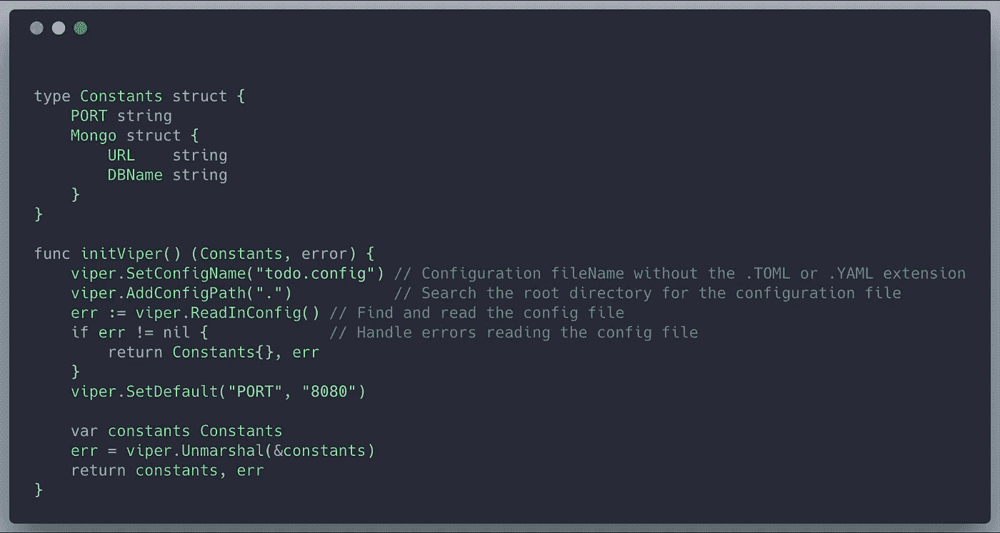
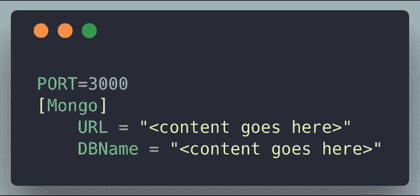
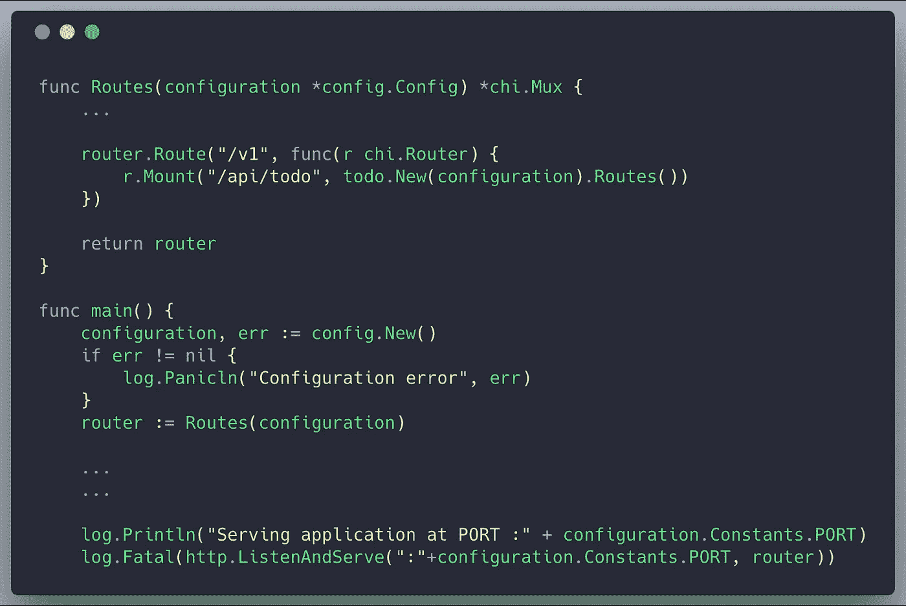
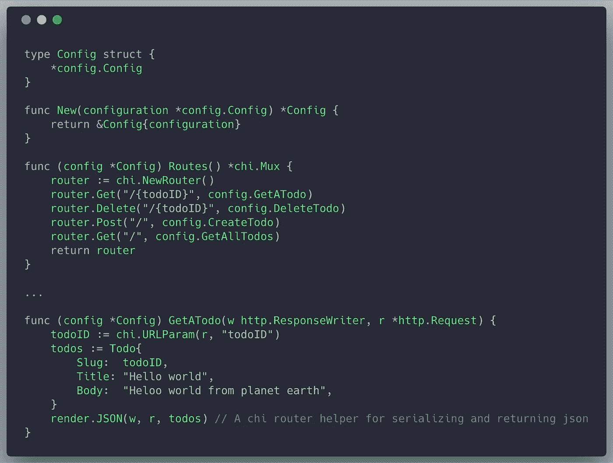
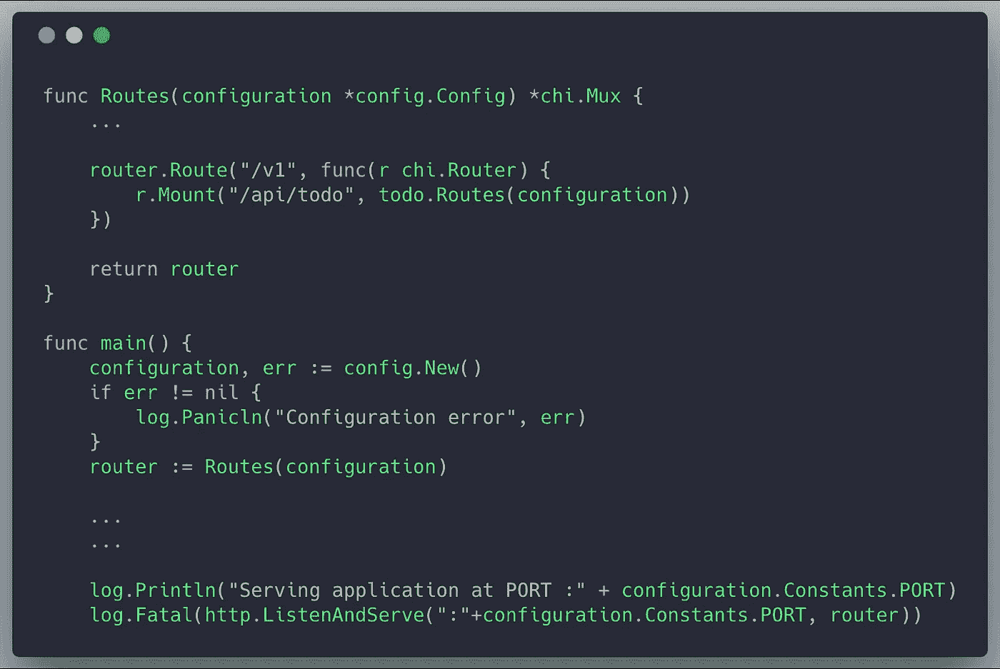
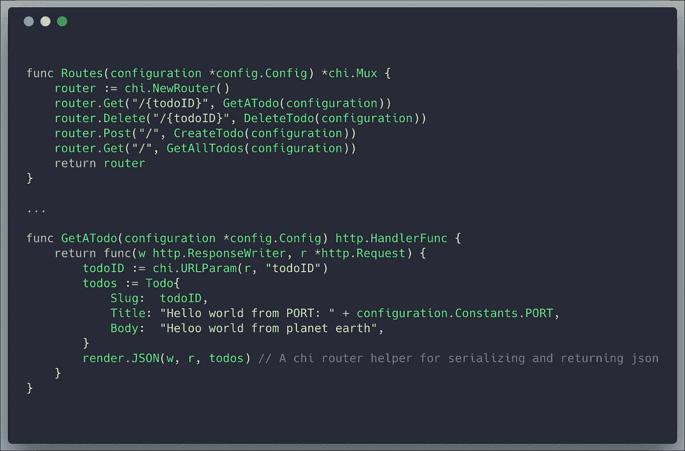

# 我如何在 Golang 项目中传递共享资源(数据库、配置等)。

> 原文：<https://itnext.io/how-i-pass-around-shared-resources-databases-configuration-etc-within-golang-projects-b27af4d8e8a?source=collection_archive---------0----------------------->


配置无处不在

在我的[上一篇文章](/structuring-a-production-grade-rest-api-in-golang-c0229b3feedc)中，我们探索了一个可以用于任何 web 应用程序的整体架构，并且我们继续为 todo 应用程序构建了一个静态 JSON api。在这篇文章中，我们将介绍每个 web 应用程序的一个重要部分。

在大多数应用程序中，通常需要传递共享资源。这些资源可以是配置、数据库连接等。

花言巧语很容易，但我将向您展示我是如何用代码做到的。


让我们看看一些代码

首先，让我们陈述一下我们在上一篇文章中停止的地方。我们有一个路由和处理程序设置的项目。让我们从配置开始。在大多数项目中，您需要来自外部环境的数据(配置文件、环境变量等)。这些数据通常包括数据库连接字符串、数据库名称和其他配置数据。

# 应用程序配置

我更喜欢使用一个叫做 [viper](https://github.com/spf13/viper) 的工具来处理我的配置。

为什么？它已经存在很长时间了(大约 4 年)，使用第三方消除了我重写自己的 json/toml/yaml 反序列化逻辑的需要(虽然编写起来并不困难)，但我也获得了一些额外的好处:

*   为不在配置文件中的字段设置默认值
*   读取 JSON、TOML、YAML、HCL 和 Java 属性配置文件
*   实时观察和重读配置文件(可选)
*   从环境变量中读取
*   从远程配置系统(etcd 或 Consul)读取，并观察变化
*   从命令行标志中读取
*   从缓冲区读取
*   设置显式值

让我们写一些代码:

首先，我们创建一个包，在这里我们将初始化我们的配置和其他第三方连接。这将是`internal/config`。我们将配置包放在内部，以防止其他项目使用这个配置包。

> *内部包装用于使特定包装不可移植。*

在配置包中，让我们创建一个函数来解析配置文件并返回一个包含该数据的结构



将数据从我们的配置文件加载到

这段代码做的事情非常简单:

*   毒蛇。SetConfigName("todo.config ")使 viper 期望一个名为` todo.config '的配置文件，通常带有. toml 或。yaml 扩展。
*   毒蛇。AddConfigPath("，")让 viper 在当前/主目录中搜索配置文件。但是您可以拥有多个 viper 实例。AddConfigPath("xxx ")，带有 viper 可以在其中搜索配置文件的不同路径。
*   毒蛇。SetDefault 设置 8080 和端口的默认值，即使配置文件为空，或者其中没有定义端口。
*   毒蛇。解组做的最重要的工作是将从配置文件中读出的数据解组到我们的常量结构中。

# 我们的配置文件应该是这样的:



接下来，我们将创建我们的数据库连接实例，并将其放在一个配置结构中，我们将在应用程序中传递给需要数据库实例或其他配置数据的模块。


需要注意的事项:

*   我们将 initViper 返回的常量存储到 config 实例中(我们将在应用程序中传递这个实例)
*   我们利用这些常量(DB URL 和 DBName)来拨打 mongodb 连接
*   我们将数据库连接存储到配置实例中
*   我们返回一个指向配置实例的指针(我们将传递一个指向这个配置实例的指针)

# 让我们在应用程序的其余部分利用这个配置



需要注意的事项:

*   我们称之为配置。New()，从我们的主函数中获取我们的配置实例(实际上是一个指针)。
*   我们使用这个新配置从配置文件中访问端口地址。
*   我们调整 main.go 中的 Routes 函数，以接受一个配置作为参数

# 最重要的是

我们现在在“todo”特性包中有了一个“New()”函数。我们将配置传递给 new，后者又返回一个类型，允许我们调用 todo features 包中的 Routes 方法。

```
r.Mount("/api/todo", **todo.New(configuration)**.Routes())
```

现在来看看实际的代码:



需要注意的事项:

*   在 Go 中，我们不能在导入的类型上定义方法，所以我们将导入的类型嵌入到本地定义的配置类型中。
*   每个处理程序现在都是 config 类型的一个方法，所以它们现在可以访问我们的配置文件中的数据，以及一个数据库连接来满足它们的持久性需求。
*   **请理解，虽然我们在本例中使用了 mongoDB 数据库，但连接可以是到任何数据源、redis 数据库、到度量引擎的连接、到第三方服务提供商的连接等。**

在上面的例子中，我们制作了 Config 结构的 Handlers 方法，但是这并不是真正必要的。让我们研究另一种方法。我们不使用结构的方法，而是使用闭包(是的。闭包也可以用在 golang 中。也很漂亮。)

# 使用闭包而不是结构方法



我们将配置直接传递给 Routes 函数。

如果您有一点困惑，该代码片段中最重要的一行是这样的:

```
r.Mount("/api/todo", todo.Routes(configuration))
```

我们所做的是调整我们以前的安装路线的方法。因此，我们没有使用新的函数进行初始化，而是将配置直接传递给 Routes 函数(不再是方法)。

接下来我们调整我们的 Routes 方法来接受这个配置，同样地**调整我们的处理程序成为接受配置的闭包**，然后返回一个处理程序来处理请求(由于闭包的魔力，处理程序也可以访问配置参数。



我们的处理程序现在利用闭包保持常规处理程序，同时能够接收额外的参数

需要注意的事项:

*   代码表面积越小。使用闭包，代码感觉更紧凑(在我看来，也更优雅)。

```
router.Get("/{todoID}", GetATodo(configuration))
```

*   闭包可以不那么不自然，因为您可以有这样的场景

```
functionA(argA)(argB)(argC)
```

这个例子是使用闭包产生的有效代码。functionA 接受 argA，并返回一个接受 argB 的函数，同样返回一个接受 argC 的函数，然后 argC 可以返回任何东西(甚至是另一个函数)

但是我仍然认为闭包是代码合成的真正强大的工具，并且在代码可读性和可维护性方面，当利大于弊时使用它们。

# 结论

我真的不擅长总结文章，因为我通常最终会编辑它们，并在此过程中添加新的东西。

总之，我们学到了:

*   如何在配置中使用 viper 进行解析
*   如何创建 mongo 数据库实例
*   如何在应用程序中使用
*   -嵌入式结构和方法(OOP 方法)
*   -闭包(功能性更强的方法)

如果你有问题，需要建议，或者只是想聊聊 Golang，编码，或者一般的牛逼，请尽量联系我🙂。

我正在考虑开始一个半定期的时事通讯，关于我在代码架构方面学到的东西，并编写整洁的和未来证明 golang 代码库，但是不知道是否有人想加入这样的时事通讯。如果你是一个对此感兴趣的人，请发表评论。

# github 上的子项目链接:

OOP 模式:

[](https://github.com/tonyalaribe/todoapi/tree/master/withmongodb) [## tonyalaribe/todoapi

### 这是一个演示项目，展示了如何用 golang 构建简洁的 REST APIs。

github.com](https://github.com/tonyalaribe/todoapi/tree/master/withmongodb) 

使用闭包:

[](https://github.com/tonyalaribe/todoapi/tree/master/withmgonclosures) [## tonyalaribe/todoapi

### 这是一个演示项目，展示了如何用 golang 构建简洁的 REST APIs。

github.com](https://github.com/tonyalaribe/todoapi/tree/master/withmgonclosures) 

# 本系列的前一篇文章:

[](/structuring-a-production-grade-rest-api-in-golang-c0229b3feedc) [## 我如何在 Golang 中构建生产级 REST API？

### 有一种误解认为用 golang 编写的 API 不能像其他语言一样简单和地道。事实上，我已经…

itnext.io](/structuring-a-production-grade-rest-api-in-golang-c0229b3feedc)