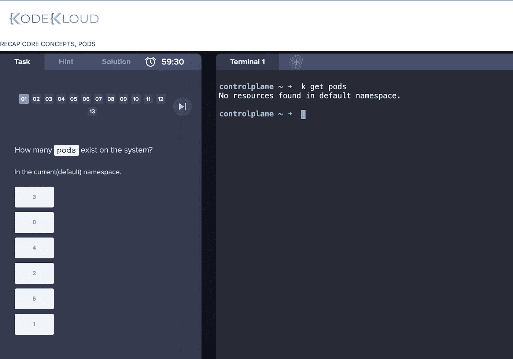
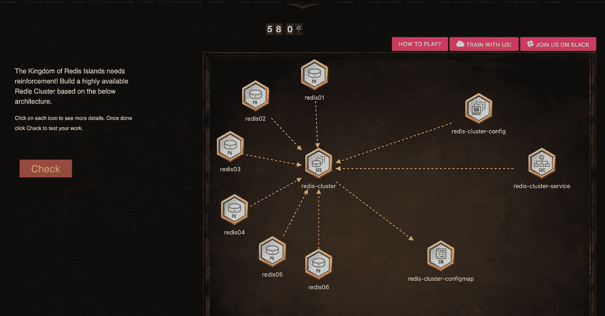
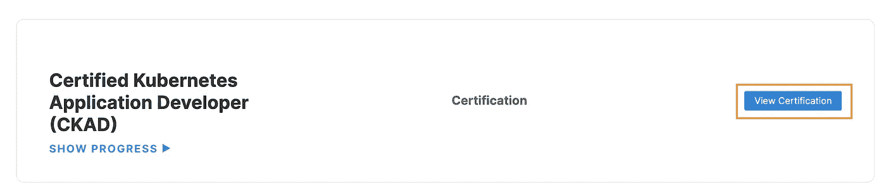
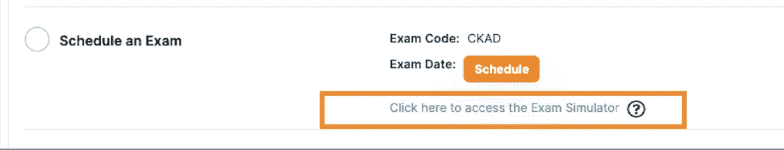
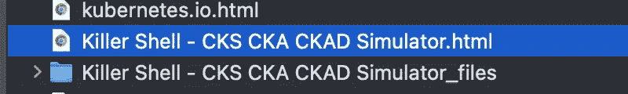

# 我如何准备 CKAD 2022(认证 Kubernetes 应用程序开发人员)

> 原文：<https://itnext.io/how-i-prepare-ckad-certified-kubernetes-application-developer-ad911d5f1054?source=collection_archive---------0----------------------->


前几天刚考过 CKAD。我想和你分享我准备 CKAD 考试的所有资源。

# 第 1 部分:K8S 概念学习

这是穆姆沙德·曼南贝斯的一门好课:

[https://www . udemy . com/course/certified-kubernetes-application-developer/](https://www.udemy.com/course/certified-kubernetes-application-developer/)

这门课程已经包含了大量有用的资源。我已经用 1.5x 的速度浏览了所有视频。有些我已经读过好几遍了。有 12 个小时的视频内容。

# 第 2 部分:练习命令和文档

## 练习 k8s 命令

udemy 课程，它提供了一个在 KodeKloud 中练习的交互式终端。一旦您订阅了 udemy 课程，它将免费为您提供一个 KcodKloud 帐户。



在 KodeCloud 里面，有一个实践课程叫做 Pod 的游戏，大部分的场景都是实践系统。例如建立一个 Redis 集群。您需要在 k8s 集群中逐个启动服务/配置。每个游戏我都练了两遍。



## 准备您自己的 cmd 别名

在考试开始时花 2 分钟准备别名是个好主意。你需要记住一些命令，因为考试时不允许查看笔记。一些别名可以在 [Kubernetes 备忘单](https://kubernetes.io/docs/reference/kubectl/cheatsheet/)中找到。以下是我用过的别名:

```
export ns=default
alias k='kubectl -n $ns' // Remember this must be single quote
alias kp='k get pods'
export do="--dry-run=client -o yaml"// I would add the following alias when I need to do, not at the begining of the exam
// For debug pod's network
alias kcmd='k run tmp --restart=Never --rm -i --image=nginx:alpine -- curl -m 5'
export now="--force --grace-period 0"
```

## Vim 设置

此设置很重要，它减少了复制和粘贴 yaml 文件时的格式问题:

```
vim ~/.vimrc
// input this
set sw=2 ts=2 sts=2 et
```

## 浏览器书签—快速找到 yaml / cmd！

您可以将一些您会在浏览器中使用的链接加入书签。确保书签名称不要太复杂。看到有博文提到考官用书签拒绝考生。我花了 1 个小时整理我需要的书签。以下是一些书签样本，可以导入 chrome:

[https://github . com/reetasingh/CKAD-Bookmarks/blob/master/kubernetes . io . html](https://github.com/reetasingh/CKAD-Bookmarks/blob/master/kubernetes.io.html)

我已经使用下面的练习来练习如何找到命令或 yaml 模板。我实际上没有运行这些命令，但是我已经阅读了所有的问题，并从我的书签中找到了所有需要的 yaml 文件:

[https://github.com/dgkanatsios/CKAD-exercises](https://github.com/dgkanatsios/CKAD-exercises)

# 第 3 部分:演示考试

## 柯达云

它提供了两个模拟考试，但我认为它太简单了。很快就能完成。

## [Killer.sh](http://Killer.sh)

我觉得这个演示考试真的很有用。一旦你购买了 Linux 基础的 CKAD 考试，他们将为你提供两次免费的**(两次都是相同的问题)。如果你想要额外的疗程，将需要额外的费用。[更多信息](https://killer.sh/faq)**

**你可以在这里找到演示考试(在 LinuxFundation 门户):
[https://trainingportal.linuxfoundation.org/learn/dashboard](https://trainingportal.linuxfoundation.org/learn/dashboard)**

**登录网站后，点击“查看认证”:**

****

**单击以下按钮打开演示考试:**

****

**我认为这次演示比真正的考试难多了。我不能在 2 个小时内完成，但它提供了 36 个小时的访问时间。我建议你在考试前一天预留一节课，这样你可以刷新肌肉记忆。**

**在完成了第一节的那些问题后，我已经下载了答案页以备将来修改。**

****

# **第 4 部分:其他提示**

## **使用记事本进行备注**

**在考试中，你会有一个简单的浏览器记事本(在考试控制台内)，它可以记录每个问题的权重和一些备注，以便你知道哪个问题需要再次检查。这是我用过的格式:**

```
questionNo%weightage status
1%9 ok
2%4 ok
3%4 need check
....
```

**我使用下面的命令为每个问题生成模板**

```
echo -e {1..17}"%\\n"
```

## **阅读官方手册**

**确保您已经阅读了官方手册和说明**

*   **[https://docs . Linux foundation . org/TC-docs/certification/lf-candidate-handbook](https://docs.linuxfoundation.org/tc-docs/certification/lf-candidate-handbook)**
*   **[https://docs . Linux foundation . org/TC-docs/certification/tips-cka-and-ckad](https://docs.linuxfoundation.org/tc-docs/certification/tips-cka-and-ckad)**

## **考试不要自己写 yaml 文件**

*   **你可能会花太多时间写它**
*   **应该首先使用发电机，例如`k run XXX --image=xxxx`或`k expose deploy ...`**
*   **[https://medium . com/@ athar vac . cloud/kubernetes-deep-dive-part-3-generators-for-quick-POC-6 CAC 698 f 08 EB](https://medium.com/@atharvac.cloud/kubernetes-deep-dive-part-3-generators-for-quick-poc-6cac698f08eb)**
*   **当您使用生成器时，请使用，先进行模拟运行并导出到文件。**
*   **如果没有可以使用的生成器，请从文档中复制 yaml**

# **最终想法**

**感谢您的阅读！如果你喜欢这篇文章，请点击👏button =]**

**做动手实验考试是非常有趣和令人兴奋的。如有疑问，欢迎留言！**

**我的领英:[www.linkedin.com/in/alick-wong](http://www.linkedin.com/in/alick-wong)**