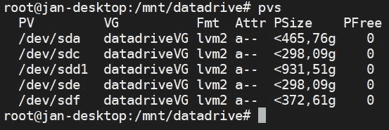
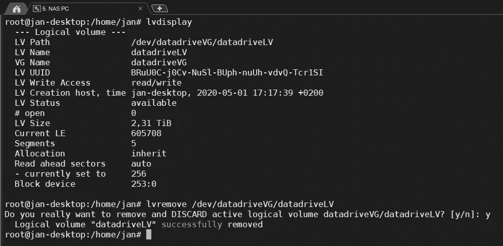
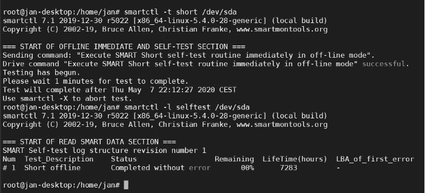
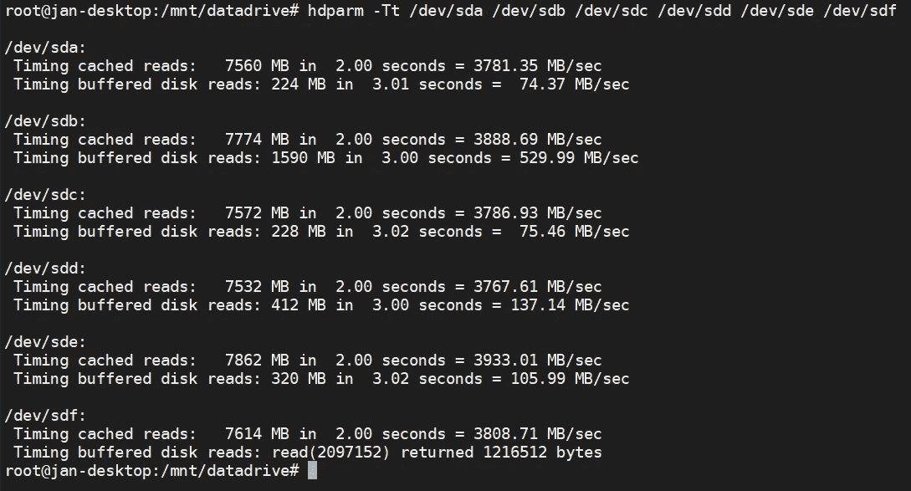
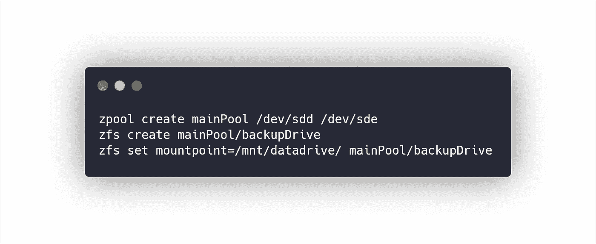
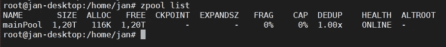
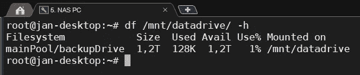

# 我如何为我的家庭 NAS 服务器用 ZFS 文件系统替换 LVM

> 原文：<https://itnext.io/how-i-replaced-lvm-with-zfs-filesystem-for-my-home-nas-server-7165f620e07f?source=collection_archive---------5----------------------->

在上一篇[文章](/how-i-turned-my-old-desktop-into-2-5tb-nas-backup-linux-server-with-a-few-hard-drives-1414852aa0b5)中，我没有用 LVM 很好地解决在我的家庭 NAS 中使用多个磁盘的问题，所以我现在要用 ZFS 升级解决方案。

# 什么是 ZFS？

ZFS 是一个高级文件系统，具有强大的功能，如池化存储、快照、自动修复和数据完整性验证、RAID-Z 和 16eb 文件大小限制。

## 集中储存

ZFS 结合了卷管理器(就像我上次使用的 LVM)和文件系统的特性。这意味着文件系统可以跨多个驱动器或一个池。

# 以前与 LVM 的解决方案

在前面的解决方案中，我使用逻辑卷管理器进行了以下设置:

在一个大的(2.3 TB)逻辑卷中只有一堆硬盘。这带来了一个大问题——如果其中一个驱动器出现故障，整个逻辑卷都会被破坏。

这就是 ZFS 的用武之地。

# 用 ZFS 取代 LVM

首先，我必须将我的数据备份到另一个(外部)驱动器上。然后我卸载了逻辑卷并删除了它。

在第一个解决方案中，我没有检查磁盘的运行状况，所以现在我已经检查了。我用过 SMART(自我监控、分析和报告技术)。

我发现其中 3 个磁盘充满了错误和故障，所以我只选择了 *sdd* (WD 1TB)和 *sde* (WD 320GB)驱动器，它们也具有最快的读取速度(我没有测试写入速度，读取速度对我来说足够作为基准)。我已经用 *hdparm* 测试了读取速度。

(sdb 是系统固态硬盘， *sdd* 是 SATA3 硬盘)

## 安装和使用 ZFS

首先，我将磁盘格式化为 Solaris 文件系统(fdisk 中的*be*代码，上一篇文章中的教程)。

然后，我使用 zfstools ( *安装 zfsutils-linux* )创建池，将其挂载到一个挂载点，并开始使用 ZFS。

池列表

装载点—可用空间

在上一篇文章中，挂载点已经在 samba 配置中注册了，所以我可以马上开始使用网络驱动器。
搞定。