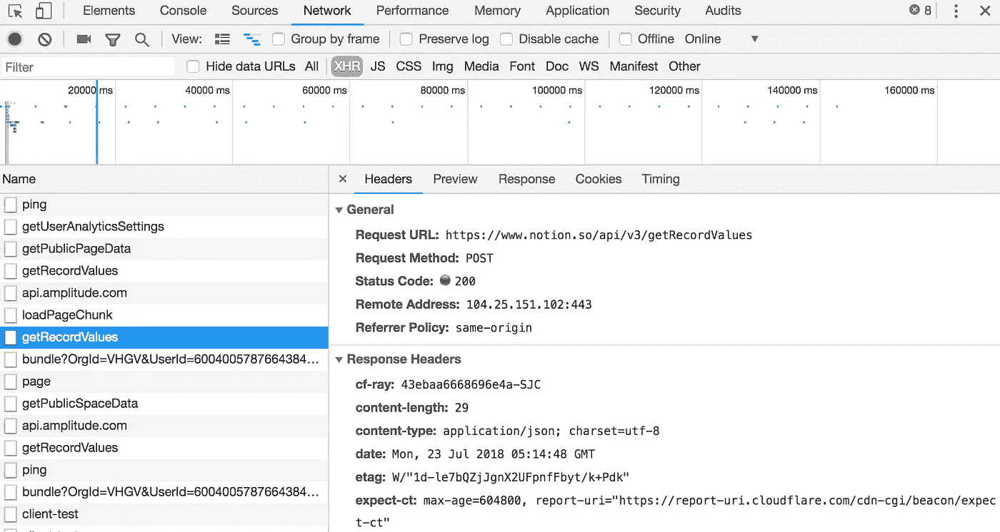

# 我如何对 API 概念进行逆向工程

> 原文：<https://itnext.io/how-i-reverse-engineered-notion-api-19480490bbeb?source=collection_archive---------3----------------------->

[观念](https://blog.kowalczyk.info/article/88aee8f43620471aa9dbcad28368174c/)是一个很好的写作工具，但内容却被困在网络应用程序中。

该公司正在开发一个官方 API，但我没有耐心。

这篇文章描述了我如何逆向工程他们的 API 并创建了一个 Go 库 [notionapi](https://github.com/kjk/notionapi) 。

# 这一切都始于一次失败。

我提取概念内容的第一次尝试是传统的网络抓取。

我发现了一个 Python [脚本](https://github.com/shariq/notion-on-firebase)，它使用 Selenium 递归地抓取一个概念页面，并将其发布到 Firebase 主机。

我把它移植到 Node 上使用[木偶师](https://blog.kowalczyk.info/article/ea07db1b9bff415ab180b0525f3898f6/)(比 Selenium 更好的技术)。

虽然这种方法有效，但它仅限于获得由概念应用程序呈现的页面的一字不差的 HTML。

我希望能够改变页面的外观，添加像页脚和页眉和导航栏等元素。

我曾短暂地考虑过尝试从呈现的 HTML 中重建页面结构，但这充其量只是一大堆丑陋的猜测。

# 灯泡时刻

像 concept 这样的现代 SPA 应用程序通常的工作方式是，它们使用从服务器请求的数据，用 JavaScript 在客户机上呈现大部分 HTML。

快速浏览 Chrome 开发工具证实了这一理论。

当加载一个概念页面时，我看到了像`/api/v3/getRecordValues`和`/api/v3/loadPageChunk`这样的 XHR 请求。

幸运的是我的 API 没有混淆。它以 JSON 数据的形式返回响应，不难理解字段的含义。

我可以直接向服务器请求结构，而不是从 HTML 中推导出结构。

# 建筑工具

我可以在 Chrome dev tools 中查看客户端和服务器之间的 API 请求，但这不是最好的工作流程。

我的第一步是编写 node.js 脚本，记录客户端在呈现给定页面时调用的所有 XHR 请求。

这比使用开发工具有几个优点:

*   我可以过滤掉对第三方服务的请求，比如 amplitude、fullstory 和 intercom
*   我可以过滤掉不感兴趣的请求，比如`/api/v3/ping`
*   我可以漂亮地打印 JSON
*   我可以将捕获的流量写入一个文件，以供进一步分析

剧本是这样的:

# 大局分析

查看捕获的数据后，概念内容的结构并不复杂。

包括顶级页面在内的所有内容都是一个块。

块由一个唯一的 id 标识，看起来像一个标准的 UUID 格式。

块被排列成一棵树，即一些块具有子块。

块有元数据，如创建时间、最后编辑时间、版本等。

有不同种类的块:页面、文本、待办事项、列表项等。

有些图块具有该图块类型特有的性质。例如，页面块具有`title`属性。

为了获取页面的内容，我们从它的 UUID 开始，我们可以找到它，因为它是页面 url 的最后一部分。

我们可以发出`/api/v3/getRecordValues` API 来获取页面中的块列表，然后发出`/api/v3/loadPageChunk`来获取这些块的内容。

剩下的工作是弄清楚有哪些类型的块，它们是如何表示的，并编写一些代码来帮助检索数据，并以一种更容易消费的格式呈现数据，以便生成输出，例如定制的 HTML。

# 测试不同种类的块

概念页面由不同种类的块组成，我们需要知道每个块在 JSON 响应中是如何表示的。

为了系统地研究它，我为每种类型的块创建了一个测试页面，并使用请求日志脚本查看服务器为该块返回的 JSON。

# 编写 Go 库

下一步是编写一个 Go 库。

从`getRecordValues`和`loadPageChunk`获取样本 JSON 响应后，我使用 [Quicktype](https://app.quicktype.io/) 生成 Go 结构。

我不得不稍微调整它们以适应响应的变化。

剩下的工作是编写一个 helper 函数，它抽象出 HTTP 请求的细节，并返回一个易于使用的描述概念页面的结构。

该工作的结果是 [notionapi](https://github.com/kjk/notionapi) Go 包。

# 在实践中使用图书馆

这不仅仅是一次学术练习。

这个博客是由我存储在 GitHub 库中的 markdown 文件驱动的。

我的目标是将内容转移到概念，这样我就可以更容易地编辑它，将其转换为 HTML 并作为我的网站/博客发布。

你可以在这里看到代码。

代码的高层结构:

*   我使用我的 Go [notionapi](https://github.com/kjk/notionapi) 库从概念下载内容
*   我缓存下载的数据，并将它们存储在 git 存储库中。这是为了确保即使 idea 消失了，我也有一份数据的副本，以便更快地调整发布代码(不需要重新下载)，并且对 idea 服务器更友好(除非绝对必要，否则不需要重新下载)
*   我将概念数据转换成 HTML，将其包装在我的页面的模板中，并将 HTML 文件写入磁盘
*   我部署到[网络生活](https://www.netlify.com/)

*原载于*[*blog . kowalczyk . info*](https://blog.kowalczyk.info/article/88aee8f43620471aa9dbcad28368174c/how-i-reverse-engineered-notion-api.html)*。*