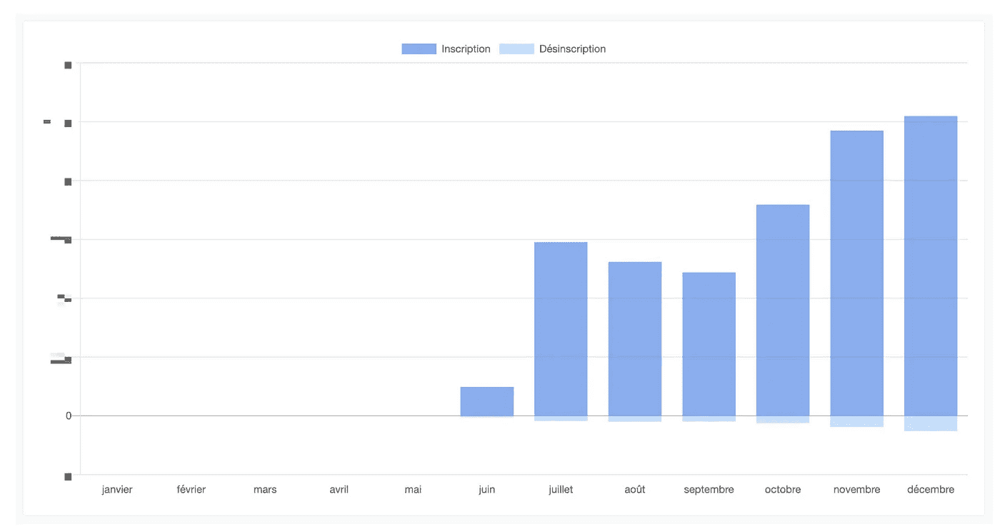
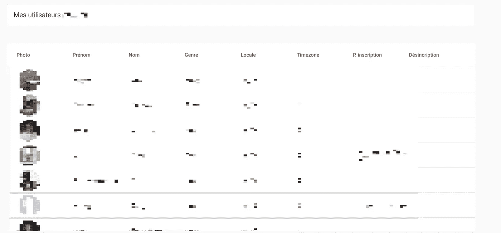
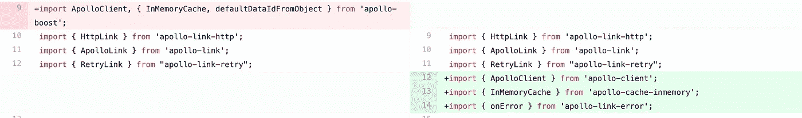
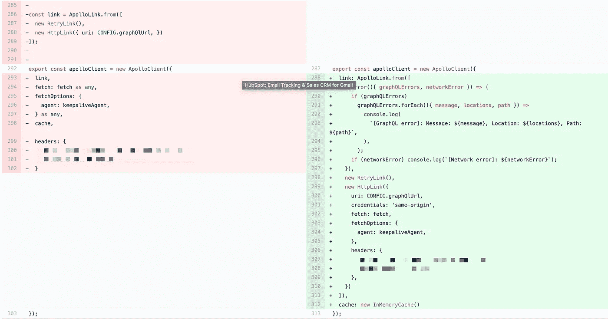
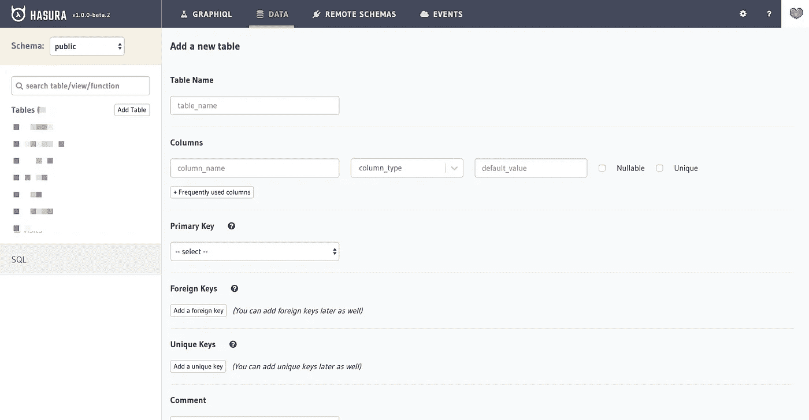
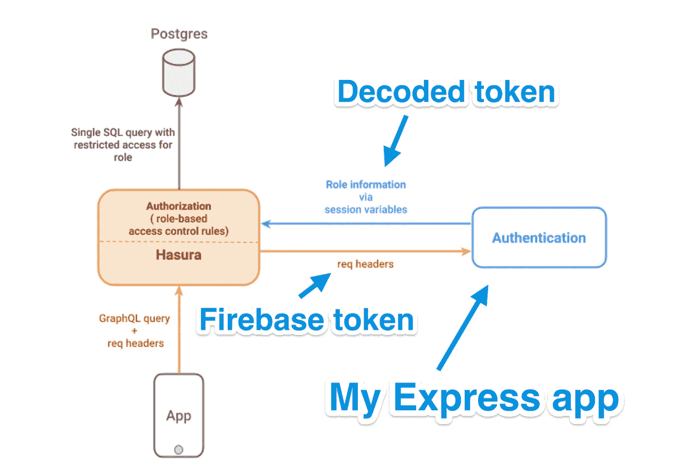

# 我如何扩展 Firebase(通过迁移到 graphQL)？并将我的开发速度提高 10 倍

> 原文：<https://itnext.io/how-i-scale-firebase-by-migrating-to-graphql-and-speed-up-my-development-by-10x-200b4a3068a0?source=collection_archive---------0----------------------->

我联合创办([sently . io](https://sently.io/en))；基本上，我们为法国公司提供服务和一个在 Facebook Messenger 上发送内容的软件。

对于我们的堆栈，我们集中使用 Angular 和 Express 的 Firebase 服务(授权、RTDB、Firestore、托管和云功能)。

> 声明:我在 6 个月前完成了这次迁移。它缺少一些图片，但我无法找到写这篇文章之前的时间。我希望你仍然会喜欢它🤞

# 语境

大约 6 个月前，我们开始遇到 Firebase 的严重扩展问题，我们的一些客户开始拥有大量数据(大约 200，00 0 个用户)。我们的软件有一个报告选项卡，需要查询大量数据。

图表 1:收购柱状图

图表 2:用户表

# 问题:在前面查询和大小查询

由于 Firebase RTDB 的限制，在前端进行查询非常困难:

*   我们可以**只过滤一个属性**，然后我们必须在前面做
*   结果的大小，我们需要**下载所有的数据**，我们不能像使用 graphQL 那样有部分响应
*   计数器:你知道一个简单的数据集计数器，不下载所有数据是不可能的。

所以，我们的主要瓶颈是前线的 RTDB 火力基地。我们的软件前端开始为一些页面下载大约 60mb 的数据，我不用告诉你，用户界面是冻结的，相当慢❄️😂

对于后端，这没问题，下载所有数据和缓存一些查询不成问题，我们经历了 100%的峰值数据。

我尝试了 Firebase 的 RTDB 的每一种可能的优化:去结构化数据，远程计数器，甚至迁移到 Firestore！

*   去结构化:它给后端和前端增加了太多的复杂性
*   Firestore:允许查询多个领域，并有一个分页计数器！但是神圣的 sh**，它是如此昂贵！对于我们的业务，我们需要查询大量的数据，价格太高了。
*   使用带有 api 的 Firebase 在前端和 RTDB 之间添加一个层

对于一个数据库来说开销太大了，所以我放弃了 Firebase。😞

我很感谢 Firebase 为我提供了令人敬畏的数据库。这对于 3 年前开始创业很有好处，因为它提供了:开箱即用的实时和全面管理的解决方案。三年前这很好，但是现在，我们有了更好的选择。

# 寻找替代方案

**规格:**我想要可扩展的东西，不要给我提供这样的限制。我想要有助于获得时间和速度的东西。

我再也不想要无 SQL 解决方案了，因为 SQL 数据库拥有无 SQL 数据库的所有功能，而且它的伸缩性非常好。没有去结构化和公司。

选择是:PostgreSQL + graphQL。

GraphQL 很棒，但我们是一个小团队，有太多样板文件，没有一个好的 graphQL API，所以在一个完美的世界里，我希望有类似 Firebase 的东西，但由 graphQL 和 PostgreSQL 推动

**解决方案:**

我发现的是:

*   海报:【https://www.graphile.org/postgraphile/ 
*   https://dgraph.io/
*   哈苏拉:[https://hasura.io/](https://hasura.io/)
*   另一个我不记得了(对不起，😞).

Postgraphile:对我们来说太多的设置，似乎很复杂。

哇，我真的很喜欢这个数据库，似乎是未来！🚀但是在我寻找新数据库的时候，云中没有托管。对于我们这个小团队，我不想管这个。

最后一个，**哈苏拉**只在 alpha 中，但是如此令人印象深刻！GraphQL 开箱即用，实时，模式模型可以用他们的用户界面来定义。请求的认证由我的 Express 应用程序管理。

**生活在一个完美的世界:**哈苏拉符合我所有的规格。

# 学习图表 QL

## **Apollo:从前台和后台查询你的数据**

我学会了如何设置 Apollo 来查询我的 graphQL API。它的伟大给我留下了深刻的印象。只需几行代码，我就有了一个由 REDIS 支持的完全托管的缓存，并且如果它由于网络或服务器错误而失败，我会尝试多次操作。([https://www.apollographql.com/docs/link/links/retry/](https://www.apollographql.com/docs/link/links/retry/))。

**Noob 错误:**添加一个到 apollo-client 的链接很困难，因为我使用的是 [Apollo boost](https://github.com/apollographql/apollo-client/tree/master/packages/apollo-boost) 的 ApolloClient。Apollo boost 是一种开始使用 Apollo 客户端的零配置方式。因此，如果你想从 boost 向你的 apollo 客户端添加实时和一些链接，**使用普通的**。

# 将我所有的大数据集从 Firebase 迁移到 Hasura

步骤如下:

*   在 Hasura 中创建 Postgres 模式
*   将数据库和 Hasura 服务器投入生产
*   重建所有的数据
*   创建脚本，将数据从 Firebase 迁移到 Hasura
*   更新前端和后端(查询和验证)

## 在 Hasura 中创建 Postgres 模式

我的 Firebase 模式在 Hasura 中很容易重建。在 Hasura 中创建模式的界面非常巧妙

## 重建所有的数据

我的 Firebase 数据是规范化的，但是为了性能优化，我解构了一些数据。

你知道，像这样的事情:

我用 nodeJS 脚本重构了我的所有数据，以获得良好的模式。

## 将数据库和 Hasura 服务器投入生产

我们是一个小团队，我希望每一项服务都托管在云中，并得到全面管理(备份，一键扩展…)。

哈苏拉提供了一个 docker 图像；所以在谷歌云平台上部署它非常容易。(感谢[谷歌云](https://medium.com/u/4f3f4ee0f977?source=post_page-----200b4a3068a0--------------------------------)提供的谷歌云积分)。

## 创建脚本，将数据从 Firebase 迁移到 Hasura

为了迁移我的所有数据，我编写了一个脚本，将 graphQL 直接转换到我的生产服务器。

由于数据集的规模，这不是一个简单的任务。首先，我从 Firebase 的 RTDB 下载 JSON 文件，然后规范化+扁平化数据，而**没有办法用 firestore** 做到这一点，我必须用他们的 API 查询数据(耗时，因为我们必须担心如何不超载 firestore)！

我经常使用库[下划线. js](https://underscorejs.org/#pick) 来迁移数据。

***pick*** *和****chunk****函数很有用:*

*   ***选择**规范化对象，因为在 Firebase 中，有时它是不规范的，并且您的 graphQL 更新将无法工作，因为它是 SQL 而不是非 SQL😈*

*   ***Chunk** 创建小批量更新，因为一次完整更新不起作用(数据丢失)。*

## *更新前端和后端(查询和认证)*

## *-查询*

*用我的前端和后端进行查询(只需要在 nodeJS 上导入 fetch)几乎是相似的，因为它使用的是 apollo，并且是相同的结构。我以前没有用过 Firebase，因为它的前端和后端是不同的库。*

*唯一的不同是，由于阿波罗-安格尔([https://github.com/apollographql/apollo-angular](https://github.com/apollographql/apollo-angular))的出现，Angular 中的样板文件变少了。*

*在更新了所有的查询之后，前端有了响应(不再冻结)并且速度有了很大的提高，但是网络上的数据仍然很大。*

*在 Hasura 文档中没有任何关于压缩来自 Hasura 的响应的内容，我不得不在问题中搜索，我发现他们正在使用 Caddy 来管理服务器:[https://github.com/hasura/graphql-engine/issues/1253](https://github.com/hasura/graphql-engine/issues/1253)。*

*基本上，压缩响应只是在 caddy 文件中添加一行代码。这个回答现在被压缩成了 GZIP🔥。*

## *-认证*

**

*身份验证类似于 Firebase，我们可以为权限定义 ACL。当从前端查询 Hasura 时，我们在请求的头部传递 Firebase auth 令牌，然后 Hasura 将它发送到认证服务器。认证服务器对收到的令牌进行解码，并使用自定义声明(组权限+用户 id)将其发送回 Hasura。*

*我们所有的 ACL 都基于用户 Id 或自定义声明。我们在自定义声明中传递了用户的角色。*

# *🎉最后*

*我在一个晚上部署了所有这些迁移，大概花了我 10 分钟。我丢失了 10 分钟的数据，但这并没有影响我们的业务。👌*

*总之，我对这次迁移非常满意。性能和简单性是存在的，我不会再使用 Firebase 的数据库，因为 Hasura 比它好 10 倍！*

***Firebase 数据库:💀***

***哈苏拉:🌈***

# ***🎁尝试之前不知道的额外功能:代码生成***

*我在前端和后端都使用了 typescript。Hasura 和所有自动生成的代码加速了我们的开发。*

*—*

*从哈苏拉模式:*

*   *我们可以生成 graphQL 模式/类型*

*从生成的 graphQL 模式/类型:*

*   *我们可以生成类型脚本类型*

*—*

*我在一个文件夹中的某个地方编写查询/突变，启动一个命令和 BIM，我已经输入了 typescript 查询+ angular 服务准备就绪。*

**

*那就是**牛逼！***