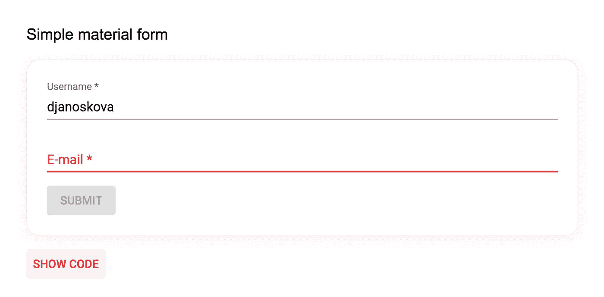
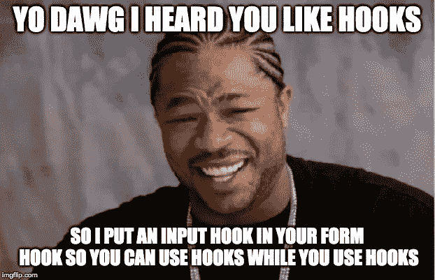

# 我如何尝试验证 React 表单(用钩子)

> 原文：<https://itnext.io/how-i-tried-to-validate-react-forms-with-hooks-31634fc5385b?source=collection_archive---------2----------------------->



来自 Vue.js 的背景，转变为 React 对我来说相当不愉快。我发现很难实现的许多事情之一是表单验证和数据绑定。如果你了解 Vue，你就会知道它有一个神奇的东西叫做 **v 型**。您还可以创建定制的 v-model 绑定，并创建自我验证的组件。如果你不知道 Vue，但仍然代码反应，无论如何。这不是一篇 Vue.js 的文章，我保证。我会试试看。

下班后的时间对我来说也差不多——谷歌“如何验证 React 表单”、“如何使用钩子进行表单验证”等等。我真的想找到或发明一种既节省时间又能提供高质量结果的方法。我的动机是在我的工作场所创建具有许多表单的 ui，所以我想花更少的时间来实现数据绑定和表单验证，因为这已经变得相当耗时耗力。

我不断地创建许多可配置的表单和输入组件，并且总是让自己不得不为自组装表单编写巨大的配置。他们确实工作了，但是他们没有给我提供多少布局配置选项——例如，如果我想对项目使用 grid，就需要我编写额外的配置并让组件对它做出反应。我无法想象让我的同事用它工作，我也不想这样做。我想找到一种不那么笨拙的方法来验证我的表单。

钩子。

这个词，是的。钩子。

我受到了丹·阿布拉莫夫的输入挂钩的启发，它看起来应该是这样的(抱歉，我是这么想的):

```
**export function** *useInput*(initialValue = '') {
  **const** [value, setValue] = *useState*(initialValue);
  **const** *onChange* = e => setValue(e.**target**.**value**);
  **return** { *onChange*, value }
}
```

这是一个开始。它是一个钩子，你可以像这样调用一个输入

```
<**input type="text"** {...*useInput*(**'initValue'**)} />
```

它将控制它的值——我们从钩子返回的是一个 *onChange* 函数和输入的*值*，所以假设它将自我更新。您可以在其中添加一些错误处理(绑定一个错误类——例如，如果您使用的是 bootstrap CSS，那么**是无效的**)),但仅此而已。你仍然没有双向绑定的形式，你只有一种自我控制的输入。不过，这是个开始。

# 那么我创造了什么？


[https://media.giphy.com/media/12NUbkX6p4xOO4/giphy.gif](https://media.giphy.com/media/12NUbkX6p4xOO4/giphy.gif)

我用钩子和验证函数创建了一个文件，看起来可能不太好，但它很好地满足了我的需要。我还在继续重构它。有利的一面是——我只需要编写一次代码，我将用它来验证我的表单，直到我找到/创造出更好的东西。它在组件中是这样使用的:

<materialform>带验证的组件</materialform>

这是一个具有两个(材质 UI)字段和一个按钮的组件。如果字段无效，该按钮将被禁用。在我看来，这是一个非常短小精悍的代码。如果我们从数据绑定和验证的角度来说，这是一个开发者的梦想。

## 那里到底发生了什么？

我们首先调用 *useForm* 钩子并传入我们的默认*值*。*使用形式*是很多所说的魔法发生的地方。它还返回一些东西— *值*， *useInput* hook 和 *isValid* 布尔属性。(它返回更多，但我现在不会让你困惑，因为我们将只使用这 3 个。)

```
**const** { values, *useInput*, **isValid** } = *useForm*({
  **username**: **''**,
  **email**: **''** });
```

*   值-值对象实时变化。这意味着你不需要任何 *onChange* 和 *setState* 处理程序，这一切都发生在我们的钩子中，它们只负责让你得到你唯一感兴趣的东西——你的价值捆绑在一起。
*   use input——一个你在输入中使用的钩子，就像我之前展示的那样。第一个参数是输入的**名称**，这也是将在*值*对象中访问的属性。第二个属性是验证，可以作为字符串或对象传递。

```
<**TextField
  label="Username *"** {...*useInput*(**'username'**, **'isRequired'**)}
/>
```

*   isValid 布尔验证结果。我用它来禁用提交按钮，这样用户就可以看到他们无法提交表单。

```
<**Button type="submit" disabled=**{!**isValid**}>
  Submit
</**Button**>
```

如果你在做简单的表格，这就是全部了。

如果您对代码感兴趣，请继续阅读。如果没有，您可以滚动到文章底部预览现场演示。

# useForm(默认值，无效)

所以我告诉你我们正在传递默认值给*用户表单*钩子。我们还可以传递第二个属性——一个对象——它将是我们的错误属性，在输入无效的情况下附加到输入中。当使用 Material UI 组件时，我们感兴趣的是像这样将 *error="true"* 添加到我们的组件中

```
<TextField error/>
```

但是如果我们使用 Bootstrap、布尔玛、定制 CSS 或其他 UI 框架呢？我们可以用一种简单的方式传递我们的选择:

```
**const** { values } = *useForm*(
  { name: '' },
  { className: 'is-invalid' }
)
```

您可以选择您需要的任何无效属性，或者组合多个值。

这是我的整个*使用表单*代码。可以看到，有***values****和****setValues****变量(用于存储和更改值) ***formErrors*** 和***setformer rors***变量(用于存储和更改错误)以及一个 ***挂载的*** 布尔***

**这个自定义*使用的表单*钩子的大部分功能是**

*   **它控制安装状态(我添加这个是因为按钮最初在一毫秒内有效，我想避免它马上闪烁到无效——这会分散注意力)**
*   ****它创建另一个( *useInput* )钩子，并在**中传递它的属性(比如 formHandler 或 errorHandler，这样子输入可以重写值，或者我们的错误输入属性)**
*   **它返回*值*，一个手动*设置值*的函数(如果你需要在提交后重置一个表单)*使用输入，错误*(一个包含字段及其第**第**未满足规则的对象)和*是一个有效的*布尔变量，它需要安装表单并且错误为空，以便*为真*。**

# **使用输入(名称，验证)**

**因此， *useForm* 让我们可以访问这个 *useInput* 钩子，它控制我们的值、错误并接受输入名称和验证标准。**

****

**[https://imgflip.com/memegenerator/Yo-Dawg-Heard-You](https://imgflip.com/memegenerator/Yo-Dawg-Heard-You)**

**我们在这里处理很多事情。我们想知道输入是否被聚焦、改变、模糊等——以控制值和错误显示。例如，如果您还没有触摸输入，我们不希望它发出红光。一些代码只是设置像 *handleBlur* 或 *handleFocus* 这样的值，我不会深入讨论这些。**

**我们在挂载时验证输入，因为我们需要知道是否需要禁用按钮。**

```
***useEffect*(() => {
  *handleValidation*();
}, [handleValidation, name]);**
```

**我们也在每次改变值的时候验证它。`**handleValidation()**` **在每一次值改变**时被重新创建，所以`useEffect`依赖数组会在我们需要的时候照顾我们的函数运行。**

**如果您在组件的某个地方使用来自 *useForm* 的 *setValues* ，我们还需要注意我们自身输入的外部变化。**

```
***useEffect*(() => {
  if (value !== formValue) {
    *setValue*(formValue);
    *setIsTouched*(false);
    *setIsFocused*(false);
  }
}, [formValue, value, setValue, setIsFocused, setIsTouched]);**
```

**这会触发值更改并调用验证。**

**还有改变父对象的*值——handle change*期望获得一个事件(或任何具有目标:{ value }属性的对象),并调用父对象的函数 *setFormData* 来更新整个对象。**

```
****const** handleChange = *useCallback*(({ target }) => {
  **const** { value, checked, type } = target;
  **const** newValue = type === 'checkbox' ? checked : value; // using dot helps us change nested values **let** data;
  **const** isNested = name.includes('.');
  if (isNested) {
    dot.override = true;
    data = dot.*str*(name, newValue, { ...formData });
  }
  else data = { ...formData, [name]: newValue }; *setValue*(newValue);
  *setFormData*(data);
}, [setValue, formData, setFormData, name]);**
```

****更新:验证也可以使用*点*库来处理嵌套的名称值。如果您对更多感兴趣，可以在本文末尾看到演示应用程序。是这样用的:****

```
**<input {...useInput('**member.username**', 'isRequired')}>**
```

**验证本身被外包到我的 *validate* 函数中，该函数要么返回第一个未满足的规则，要么返回 null。如果我们有一个未满足的规则，我们将输入的*名称*和规则添加到我们的错误对象中，该对象在 *useForm* 钩子中。**

```
****const** handleValidation = *useCallback*(() => {
  **const** isValid = *validate*(value, validationRules);
  *setIsValid*(isValid);
  *handleError*(name, isValid);
}, [setIsValid, validationRules, name, value, handleError]);**
```

# **验证(值，验证)**

```
****export function** *validate*(value, validation) {
  **const** fieldsToValidate = {};
  **let** trimmedValidation;

  **switch** (**typeof** validation) {
    **case 'object'**:
      ***Object***.keys(validation).forEach(property => {
        fieldsToValidate[property] = validation[property]
      });
      **break**;

    **case 'string'**:
    **default**:
      **if** (!validation.**length**) **return null**;

      trimmedValidation = validation.replace(/ /g, **''**);
      trimmedValidation.split(**','**).forEach(fieldName => {
        fieldsToValidate[fieldName.trim()] = **true**;
      });
  }

  *// check whether we do need to validate at all* **const** isRequired = fieldsToValidate.**isRequired** || fieldsToValidate.**isEmpty** === **false**;
  **if** (!value && !isRequired) **return null**;

  **let** unmetValidationRule = **null**;
  **let** isValid = **true**;

  ***Object***.keys(fieldsToValidate).forEach(rule => {
    *// don't proceed if we're already invalid* **if** (!isValid) **return**;

    **const** options = fieldsToValidate[rule];

    **switch** (rule) {
      **case 'isRequired'**:
        **if** (!value) isValid = **false**;
        **break**;

      **default**:
        **switch** (options) {
          **case true**:
          **case null**:
            isValid = validator[rule](value);
            **break**;
          **case false**:
            isValid = !validator[rule](value);
            **break**;
          **default**:
            isValid = validator[rule](value, options);
        }
    }

    **if** (!isValid) unmetValidationRule = rule;
  });

  **return** unmetValidationRule || **null**;
}**
```

**所以基本上，如果我得到一个字符串，我把它解析成一个对象，如果我得到一个对象，我只是移动值。我使用的是*fields validate*变量，填充后看起来像这样**

```
**{
  isRequired: true,
  isLength: { min: 6 }
}**
```

**假设它属于如下所示的输入(如果需要更复杂的规则，可以传递一个验证对象)**

```
**<input {...useInput('username', {
  isRequired: true,
  isLength: { min: 6 }
})}>**
```

**你可以看到我创建了我的自定义*是必需的*规则。如果我想通过字符串验证，我觉得用起来很舒服。我用的是 [*验证器*](https://www.npmjs.com/package/validator) npm 包，里面有很多特性供你选择。如果没有值，并且规则中说它不是必需的，我也不会验证字段(通过使用' isRequired': true 或验证器的' isEmpty': false)。然后，我将返回未满足的规则或空值。子对象从错误对象中添加或移除其错误，并且..就是这样！**

## **另一个表格示例**

**这个有自定义的错误属性，使用 *isEmail* validator 的方法和 *isInt。*你可以看到你可以传递[验证器](https://www.npmjs.com/package/validator)接受的方法。由于传递了选项/参数，它可能无法与它们的所有方法一起工作。增强这段代码是可能的，如果你喜欢，你肯定可以这样做。现在我需要一些小而简单的东西。**

## **代码是开源的**

**如果你想使用这个表单验证，它存在于我在 GitHub—[https://github.com/DJanoskova/React-validator-demo](https://github.com/DJanoskova/React-validator-demo)的库中。您不必将本文中的代码拼凑在一起。**

**还有更多的例子和一个位于[https://react-form-hook-validator.herokuapp.com/](https://react-form-hook-validator.herokuapp.com/)的现场演示。**

**感谢您的阅读，验证愉快！**