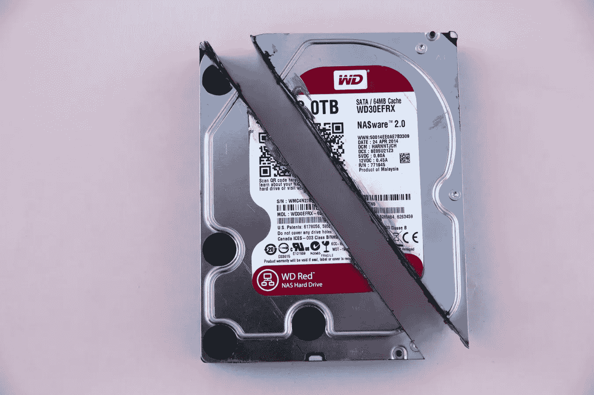
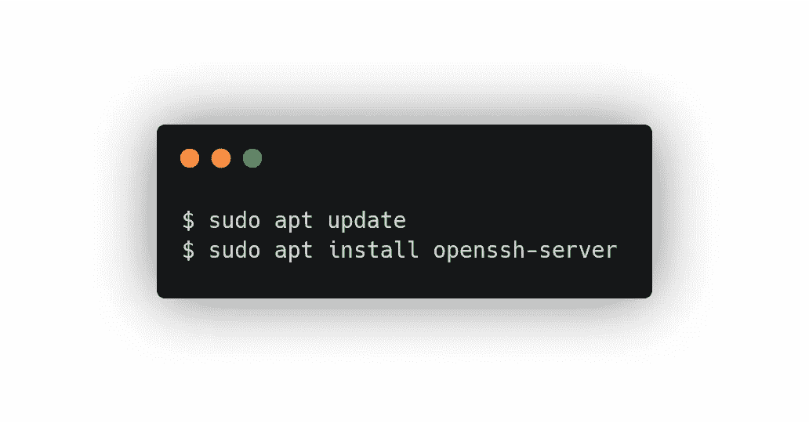
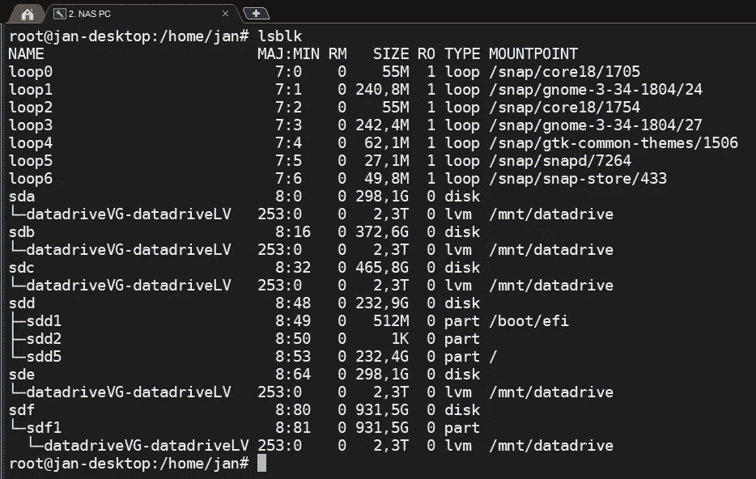
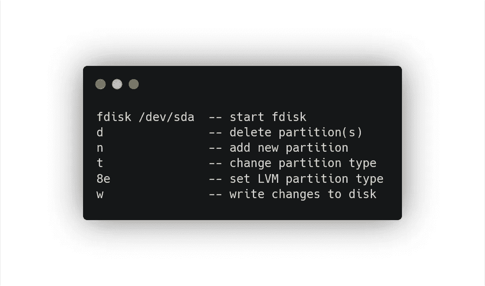
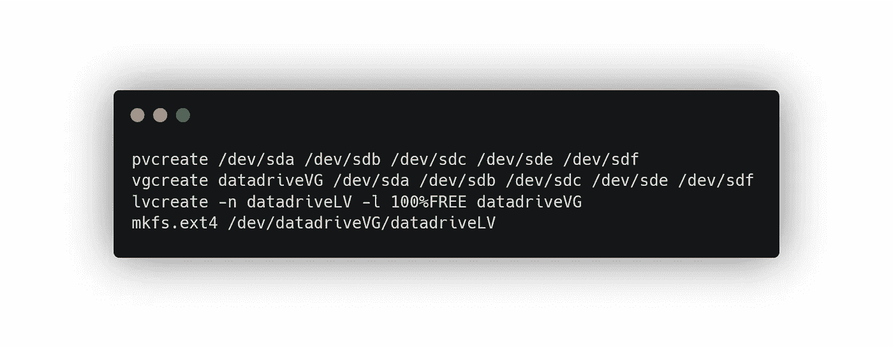
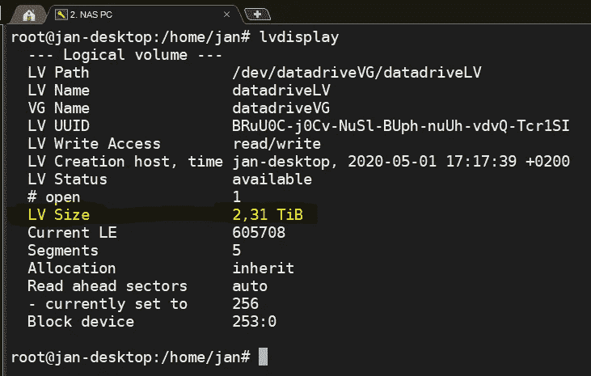
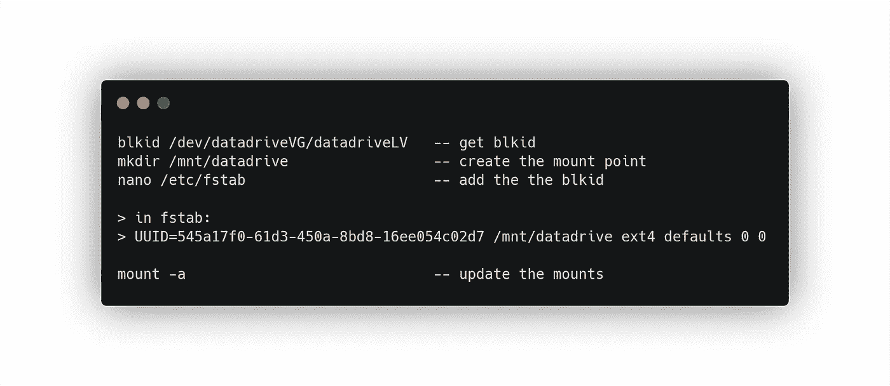
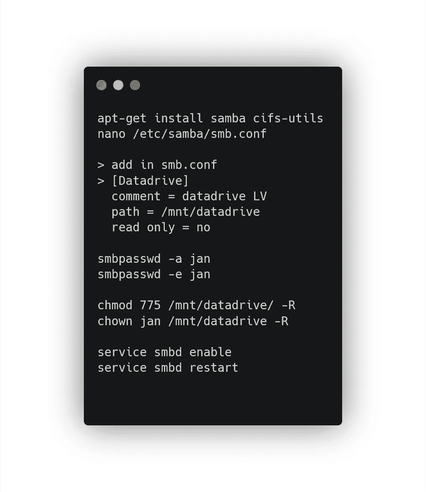
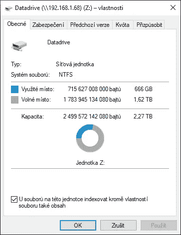

# 我如何用几个硬盘将我的旧台式机变成 2.5TB NAS 备份 Linux 服务器

> 原文：<https://itnext.io/how-i-turned-my-old-desktop-into-2-5tb-nas-backup-linux-server-with-a-few-hard-drives-1414852aa0b5?source=collection_archive---------3----------------------->

这一切都是从我得到一台新的笔记本电脑开始的，它远远取代了我的台式电脑。是时候重新利用桌面，让它变得有用了，尤其是当我一直都是一个人在家的时候。

首先，我拿了一些闲置的旧硬盘——我有这些容量为 320 GB、400 GB 和 500 GB 的旧 SATA 硬盘，我计划有一天用它们来做些什么。这一天已经到来。

我把桌面 PC 擦了一下，装了新的 [Ubuntu Focal Fossa 20.04](https://releases.ubuntu.com/20.04/) 在上面。用一个 USB 安装程序花了半个小时，是用[鲁弗斯](https://rufus.ie/)做的。我还安装了一个 ssh 服务器用于远程访问。

然后我把电脑拆开，找到一些电缆，在里面放了 5 个硬盘，并拆除了旧的 GPU，所以设置没有浪费太多的电。

现在是真正“神奇”的时候了。我想将 5 个磁盘合并成一个大的可用空间，这样我就可以通过 samba 服务器进行远程备份。

## 逻辑卷管理器

LVM 正是我所需要的。这是一个与物理硬盘一起工作的抽象层。您可以使用它将物理磁盘“合并”成一大块美味的可用空间。

首先，我需要擦除磁盘，并将其格式化为 LVM 兼容的文件系统。

这些是磁盘(我是在它完成后写这个指南的，所以磁盘标签已经是“后 LVM”，但磁盘是一样的):

lsblk 显示所有 sdX

我从/dev/sda 开始，298GB 的磁盘。

*Fdisk* 实用程序足够强大并且易于使用，所以让我们用它来格式化磁盘。它有一个简单的 CLI 界面:

我对其他磁盘做了同样的处理。现在是 LVM 的时候了。首先，我使用 *pvcreate* 将单个磁盘注册为物理卷。我创建了一个名为 *datadriveVG 的卷组。之后，我使用跨越这些磁盘的 100%空闲空间创建了一个逻辑卷，并将其全部格式化为 *ext4* 文件系统。*

在将可用空间合并成一个逻辑卷之后

然后，我创建一个挂载点，并在 *fstab、*中注册它，以便在每次 PC 重新启动时挂载逻辑卷。为此，我需要获取卷的 *blkid* 。

我需要做的最后一件事是 samba 服务器，这样我就可以从我的 windows 远程访问它作为一个网络驱动器。

我通过 apt 安装它并编辑 *smb.conf* 文件。然后，我将新驱动器的权限更改为可写，并将所有者设置为我自己。我还注册了我的帐户，并为远程访问设置了密码。最后一件事——我将 samba 服务设置为在启动后初始化，并重新启动它以使配置更改立即生效。

然后我把整个东西作为网络驱动器添加到我的 Windows 中，我们就完成了。

