# 我如何把我的旧 MacBook Pro 变成一个家庭服务器来运行网络广告拦截器

> 原文：<https://itnext.io/how-i-turned-my-old-macbook-pro-into-a-home-server-to-run-network-wide-ad-blocker-475120852402?source=collection_archive---------1----------------------->

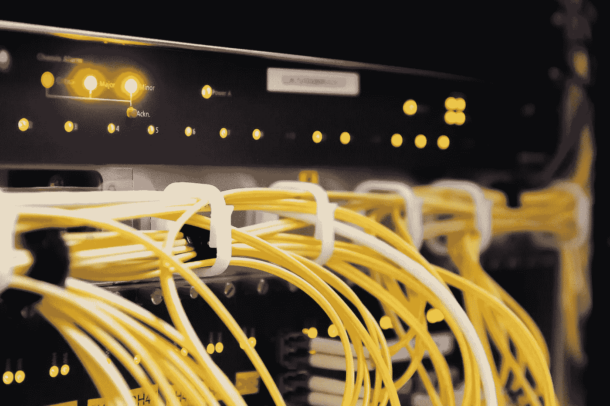

图片来自 Pixabay

你好，新年到了(我还能这么说吗？)有了新瘾，自主持。我关注 Reddit 上的自托管社区已经有一段时间了，我一直想拥有自己的服务器来玩，运行一些程序，破坏一些东西，也许还有一些自动化来让生活变得更好。

今年年初，不知从哪里，我有了尝试的想法，毕竟，我是一名开发人员，对这类东西很感兴趣。

好吧，我查了利息，硬件呢？来杯[树莓酱](https://www.raspberrypi.org/)怎么样？


是的，这个信用卡形状的东西实际上是一台能够运行多个应用程序的计算机，它是 DIY 项目/学习/小型服务器的强烈推荐硬件之一。

我很想买一个，最新的 Raspberry Pi 4 型号，四核 1.5GHz CPU 和 2/4/8gb SDRAM。这对初学者或家庭服务器来说应该是很多的。

我差点就要买一台了，但后来我想起来我有一台非常旧的 Macbook Pro(2011 年初)，放在某个地方除了收集灰尘什么也不做，真有趣！💡。我们能把它变成家庭服务器吗？就这样，探索开始了…

# 我有什么？

让我们看看这台 mac 有什么，

## 五金器具

我的旧 mac 有一个

*   2.0GHz 四核英特尔酷睿 i7 处理器，对于我的用例来说应该绰绰有余。
*   它已经升级到 16GB DDR3 内存
*   我已经用 250GB 固态硬盘替换了默认硬盘作为启动卷

此外，这台 mac 有一个光驱(记得吗？)现在已经没有用了。所以我已经移除了光驱，并在 HDD Caddy(很便宜)的帮助下，用 1TB 的 HDD (2.5 英寸)取而代之。
为了获得更多存储空间，我可以随时使用通过 USB 连接的外置硬盘。

总的来说，这台机器配备了一些硬件来处理一些负载。

## 软件

对于操作系统来说，最好的做法是用一些 Linux 发行版来代替 macOS，这对服务器来说是完美的(你不需要任何 GUI)。但我保留了现有的 macOS，因为这仍然是一个实验，我不确定我是否会长期使用这种设置(如果是这样，我会切换操作系统)，加上我使用另一台 Mac 来工作，所以连接和屏幕共享的兼容性是内置的。

目前它运行的是 macOS High Sierra(这是该 mac 最后支持的操作系统)

# 成为服务器

服务器应该一直运行，没有睡眠或中断，因为其他设备将依赖于它，很明显，Macbook pro 不是为服务器而设计的(为什么会是！).当盖子合上时，Mac 会让系统进入睡眠状态，或者根据配置在一段时间后进入睡眠状态，这显然对使用笔记本电脑很有好处，有助于节省能源。但是对于一个服务器，我们不希望任何优化，所以我们需要做一些调整⚙️.

## 不要睡觉😴

首先，我在节能设置中禁用了系统睡眠。
在`System Preferences > Energy Saver`里，在两个*电池*电源适配器标签下

*   将`Computer Sleep`设置为从不
*   启用`Wake for network access`
*   启用`Put hard disks to sleep when possible`

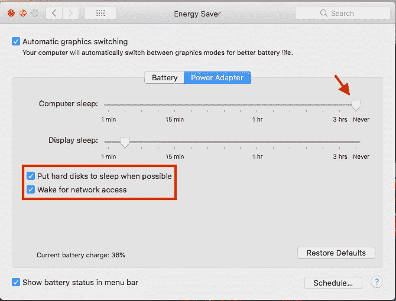

这还不够，当盖子合上时，mac 仍然会自动进入睡眠状态。我已经尝试了几种建议的解决方案来防止它，其中一种是免费的，对我很有效的是安非他命。这个应用程序可以防止 mac 进入睡眠状态，并提供一些定制。

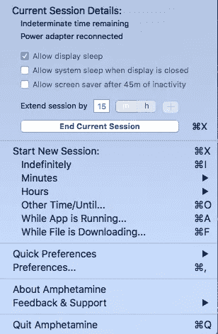

我们可以创建一个无限期的会话，这意味着系统不会无限期地休眠，这正是我想要的。此外，我还让这个应用程序在系统启动时启动。因此，即使在意外重启后，系统也会继续运行。

另外，我已经关闭了蓝牙和其他不必要的服务和通知。有了这个和插上电源，这台 mac 应该可以永远运行。

## 网络

mac 还没有成为服务器，我需要从其他设备远程连接到这台机器(仅在同一个网络中)，目前我不打算向外界公开这台服务器。因此该服务器应该只能从同一个网络中访问。

为了更好的连接速度，我禁用了 WiFi，并通过 LAN 电缆将这台 mac 连接到我的网络(是的，它有 LAN 端口，不需要适配器，多酷啊)。

*我如何在网络中识别这台机器？*
通过 IP 地址，每台机器一旦连接到网络，就会有一个由路由器(DHCP 服务器)分配的内部 IP 地址。一个问题是，默认情况下，分配的 IP 地址不是静态的，这意味着它可以在发生一些事情后改变。

我希望我的服务器的 IP 地址是静态的，这样所有设备都可以可靠地与服务器通信。我可以在`TCP/IP`设置下的`System Preferences > Network > Advanced`中这样做，

*   将`Configure IPv4`选项更改为`Using DHCP with manual address`
*   在`IPv4 Address`下，我们可以为服务器设置所需的 IP 地址，或者继续使用已经分配的地址。

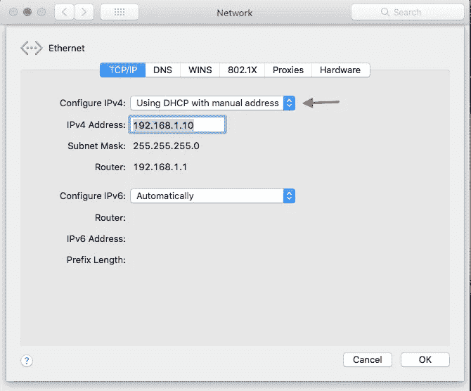

所以我的服务器现在有了一个静态 IP 地址`192.168.1.10`(仅限内部)

## 共享

另外，我需要启用一些选项来远程访问这台机器，它在`System Preferences > Sharing`下面，

*   我已经把我的电脑名字改成了`Home Server`(为了容易识别)
*   使能`Screen Sharing`、`File Sharing`和`Remote Login`

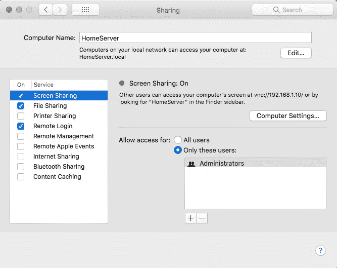

有了它，我可以通过 SSH 远程访问这台 mac，通过屏幕共享应用程序(从另一台 Mac)远程访问 UI，并通过 SMB 连接访问文件。

让我们来测试一下，在我的另一台 mac 上，我已经可以在“网络”选项卡下看到我的服务器名✔️️，

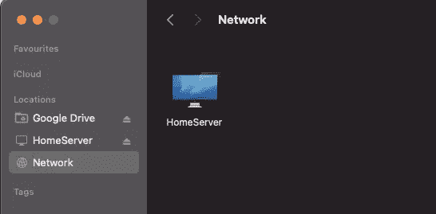

当我单击 HomeServer 时，会出现一个登录屏幕提示，我可以在其中键入该计算机的用户名和密码(与我通常登录该计算机时使用的用户名和密码相同)

或者，您可以通过 SSH 登录，

```
ssh {username}@{server-ip-address}eg: 
ssh admin@192.168.1.10
```

现在，我的 mac 已经成为一台服务器，我可以远程使用和玩🎉🎉🎉

## 警告⚠️

有一个问题我在这篇文章中没有提到，那就是一些人提出了关于使用笔记本电脑作为服务器的担忧，因为它的电池。原因是让笔记本电脑全天候连接充电器对电池有害。很少有人报告说他们的电池在几天后会膨胀(这可能是一个严重的危险)。

如果你正在尝试这样做，小心这种担心。一个建议是从笔记本电脑上取下电池，通过电源适配器使用。但是我喜欢把电池作为备用电源，这样万一停电或者我不小心关掉了电源插座，服务器仍然可以运行一段时间。
**所以我已经实现了一个自动化解决方案来解决这个问题，我将创建一个单独的帖子(这是一个冗长的帖子)来详细说明。**

# 沙盒

还是，读书？你真棒！🔥

现在我有了自己的服务器，我可以开始在里面安装服务和程序，但在此之前，我想确保我不会弄乱系统文件或做一些导致系统损坏/故障的事情，我还想要一些东西，如果我不想要某个程序了，我可以很容易地清理它。

对此我们有什么？向[码头工人](https://www.docker.com/products/docker-desktop)问好

> Docker 是一组平台即服务产品，使用操作系统级虚拟化来交付称为容器的软件包中的软件。容器是相互隔离的，捆绑了它们自己的软件、库和配置文件；他们可以通过明确定义的渠道相互交流

使用 docker，我们可以安全地部署一个应用程序，并轻松地销毁它，而不会在我们的服务器中留下任何痕迹。

在 Mac 上安装 Docker 最简单的方法是使用 Docker 桌面应用程序。我已经在 mac 服务器上安装了 Docker Desktop。同样在设置中，启用了系统启动时启动 docker。

在`Resources`下，我们可以为虚拟机配置 CPU、内存和存储。此外，在`File Sharing`部分，我们可以指定向虚拟机公开哪些文件夹，这样我们可以默认控制 docker 中运行的应用程序可以访问哪些文件。

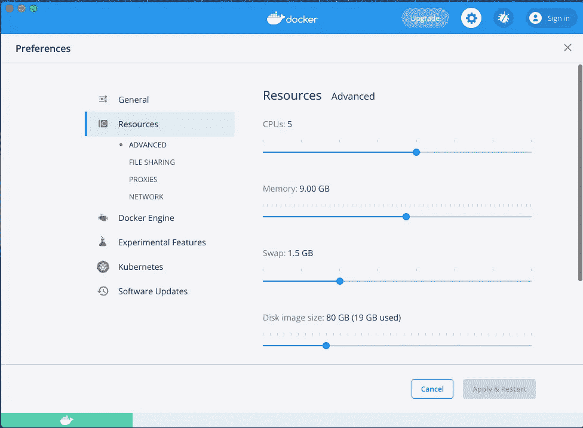

一旦我应用了更改，docker 将重启并开始运行。通过远程机器上的 SSH，我可以通过执行任何 docker 命令来检查 docker 是否正在运行，例如:`docker ps`(它列出了所有正在运行的容器)。

让我们运行一个简单的 Nginx 服务器来测试是否一切正常。

```
docker run --rm --name my-nginx -p 80:80 -d nginx 
```

这个命令将使用最新的 *nginx* docker 映像部署一个名为 *my-nginx* 的 docker 容器，并在主机上的端口`80`和其他几个端口上公开服务。

现在在另一台机器上，当我打开浏览器并输入

```
[http://{server-ip}:8](/{server-ip}:80)0
```

我可以看到 Nginx 的欢迎页面。

# 网络广告拦截器

现在我已经准备好了服务器和沙盒环境，等待一些工作。我应该先安装什么？🤔。自托管社区有一个令人敬畏的开源软件列表，我们可以自托管，并且被这个列表的规模所淹没。

你自己看看吧，

[](https://github.com/awesome-selfhosted/awesome-selfhosted) [## GitHub-awesome-self hosted/awesome-self hosted:自由软件网络服务和 web…

### 可以在你自己的服务器上托管的自由软件网络服务和网络应用的列表

github.com](https://github.com/awesome-selfhosted/awesome-selfhosted) 

我想尝试的第一件事是一个网络范围的广告拦截器，以阻止恼人的广告，并保护我在网络中的设备免受恶意/恶意软件/钓鱼网站的攻击。

以下是两个最值得推荐的广告拦截开源软件，

*   [PiHole](https://pi-hole.net/)
*   [AdGuard 主页](https://adguard.com/en/adguard-home/overview.html)

这两个我都试过，虽然我真的很喜欢 PiHole，但我还是决定使用 AdGuard Home，因为我喜欢干净的 UI 和易于配置。

我可以使用 docker-compose 轻松安装这个应用程序，YAML 定义如下所示，

然后使用以下命令进行部署，

```
docker-compose up -d
```

`-d`标志将在后台启动容器并让它们运行。我们可以使用`docker ps`命令检查容器状态，这里是输出，

```
CONTAINER ID   IMAGE                        COMMAND                  CREATED         STATUS         PORTS                                                                                                                                                                                                                           NAMES
5e80d27a243d   adguard/adguardhome:latest   "/opt/adguardhome/Ad…"   8 seconds ago   Up 7 seconds   67-68/udp.....0.0.0.0:82->80/tcp   adguardhome
```

Adguard Home 服务正在端口`80`上运行，但是我们第一次需要通过端口`3000`访问它来进行一些初始设置。

在浏览器中，我导航到`http://{server-ip}:3000`，可以看到 Adguard 主页欢迎屏幕。

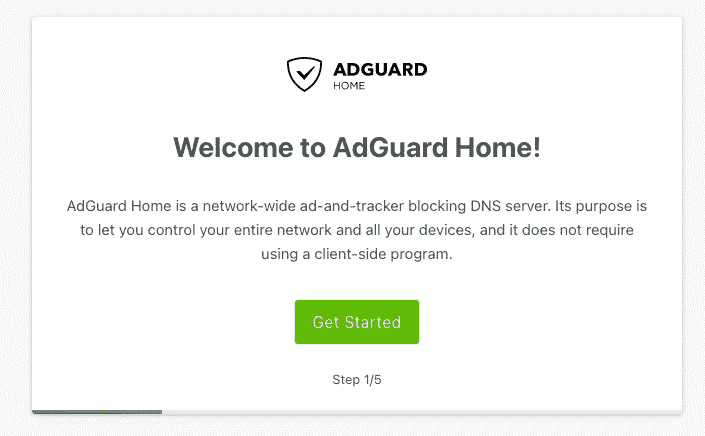

Adguard 欢迎屏幕

在接下来的几个设置中，我需要配置 Adguard 主目录应该运行的端口，设置用户名和密码等。设置完成后，我可以通过`http://{server-ip}:80`访问 Adguard 主页。

首先，我将我的网络的 DNS 服务器改为使用 Cloudflare DNS 服务器`1.1.1.2` & `1.0.0.2`(这些是流行的`[1.1.1.1](https://one.one.one.one)` DNS 的其他变体)，这也将阻止恶意软件网站。

我们可以在`Settings -> DNS Settings`下这样做，

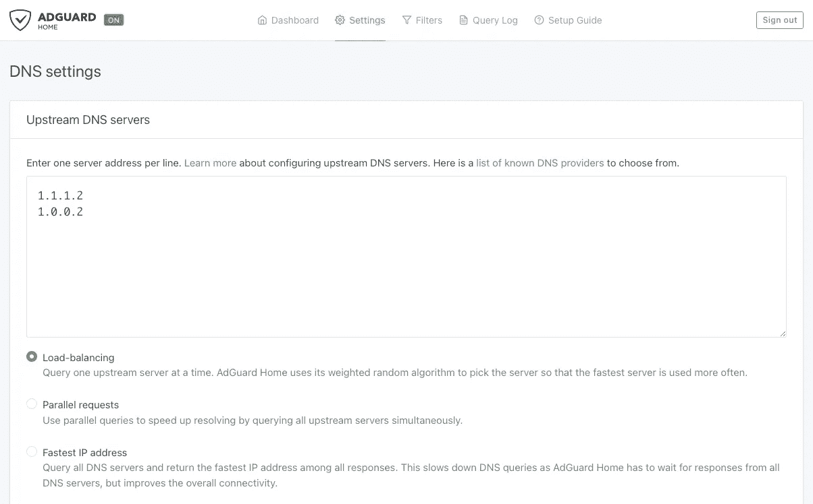

第二，我们可以自定义阻止列表，默认情况下 Adguard Home 会有一个默认列表，但我们可以在`Filters -> DNS Blocklists`下更改或扩展它，


你可以在这个网站上找到几个这样的黑名单，https://firebog.net。至此，Adguard Home 已经准备就绪。

最后，我需要再做一个设置，即指示我的网络中的各个设备将我的 mac 服务器用作 DNS 服务器。我可以用两种方式做到，

*   通过更新我的路由器中的 DNS 服务器配置，以便所有设备将自动使用路由器中提到的 IP 地址
*   通过手动更新所有设备中的 DNS 配置。

我做了第一个，这是强制我的网络中的所有设备使用我的 Mac 服务器 IP 作为 DNS 服务器的更简单的方法。

确切的过程因路由器的类型而异，对于我的路由器，它是直接的，我的 DNS 配置如下所示，

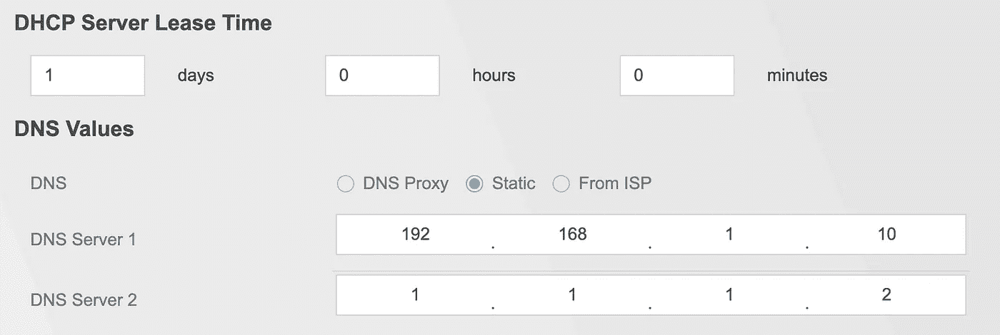

`192.168.1.10`是我的 mac 服务器 IP 地址，注意在 *DNS 服务器 2* 中我有提到过`1.1.1.2`？这是因为如果我的 mac 服务器由于某种原因停止工作，那么整个互联网将无法为我的网络中的任何设备工作(是的，这是很多)，所以我已经配置了一个辅助 DNS 来防止这个问题。(还有其他解决方案，如运行辅助 Adguard 服务器)。这意味着一些流量将跳过 Adguard 服务器，但目前来看这没什么问题。

或者，您可以随时更新单个设备的 DNS 配置，例如对于 Mac，我们可以这样做`System Preferences -> Network -> Advanced -> DNS`

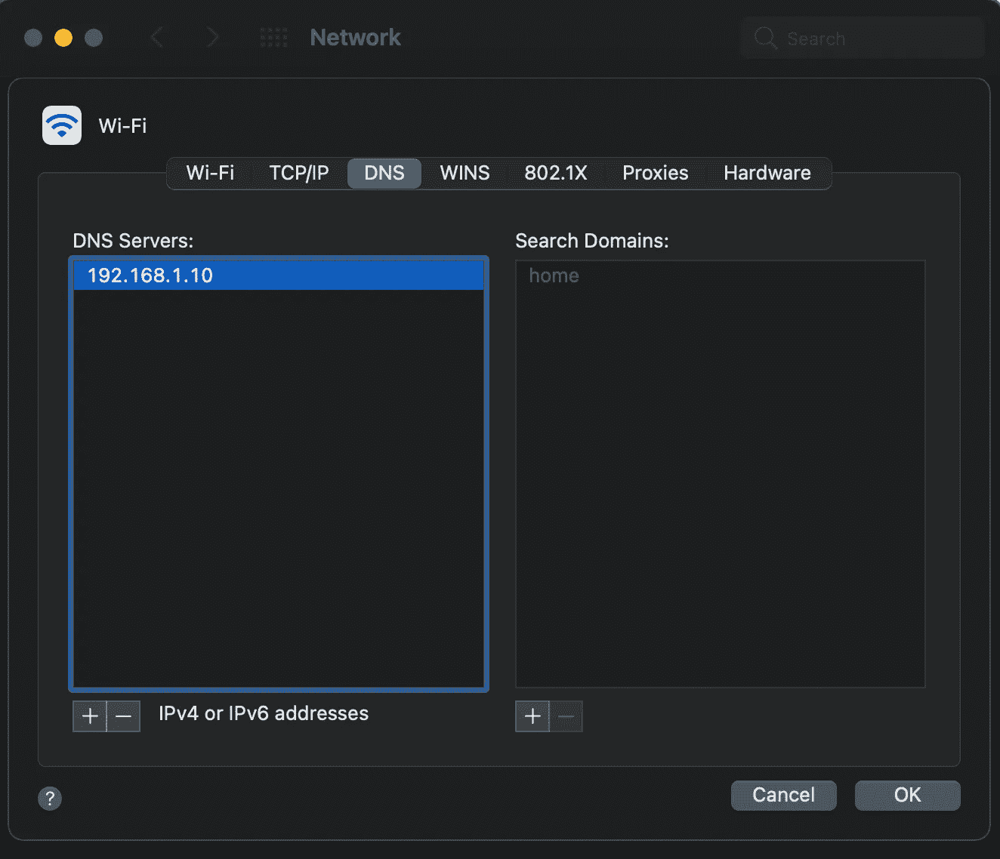

就是这样。现在，Adguard Home 将自动阻止我网络中的广告和恶意软件网站。我可以在 Adguard 主页的仪表板上看到一些很酷的统计数据，这是我的，

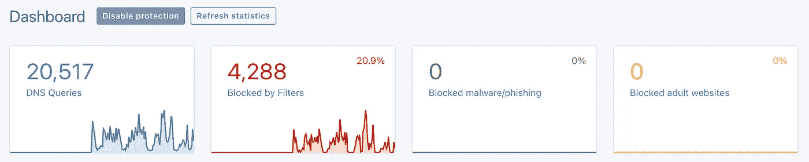

我现在 20%的网络流量都被屏蔽了，那就很多了！🍾。以下是我最常阻止的域名，

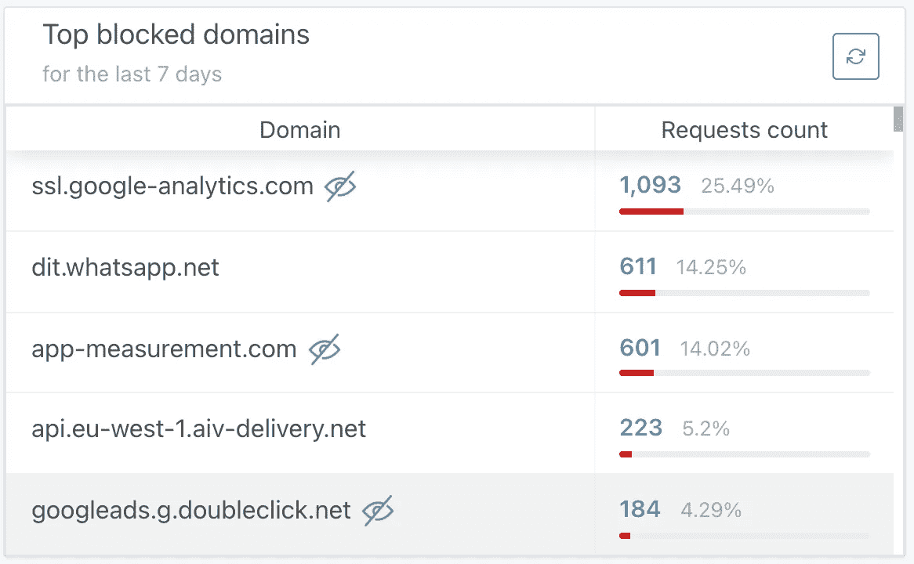

# 结论

运行我自己的服务器是一个有趣的实验，需要学习很多东西，当然也有很多责任和工作，但我喜欢目前为止的结果。这只是一个开始，我将探索更多的自我托管的可能性。未完待续…