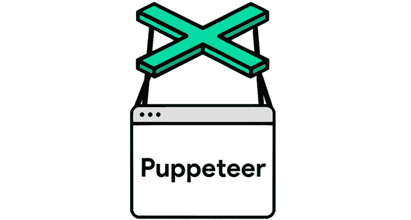
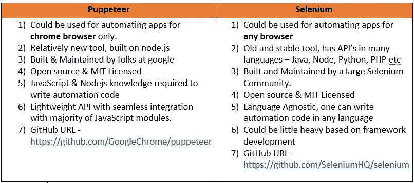

# 我如何使用木偶师建立一个完整的脸书生日祝福！

> 原文：<https://itnext.io/how-i-used-puppeteer-to-build-a-complete-facebook-birthday-wisher-d7f4f8fcbd99?source=collection_archive---------0----------------------->



> 您知道我们的整个浏览器应用程序都可以自动化吗？

[**木偶师**](https://pptr.dev/) 就是这样一个牛逼的库。它建立在 node.js 之上，提供了一个干净的 API 来控制谷歌的 chrome/chromium 浏览器。

近年来，软件自动化行业经历了惊人的发展！你可能听说过用于浏览器自动化的老式 [**Selenium**](https://www.seleniumhq.org/) 。如果您还没有，现在就去看看吧，因为这一切都是从 selenium 开始的:)

如今，我们有如此多的选择来自动化我们的浏览器、编写集成和端到端测试。

我们来谈谈木偶师，正如他们的官方网站所说-

> Puppeteer 是一个节点库，它提供了一个高级 API 来控制 Chrome 或通过 [DevTools 协议](https://chromedevtools.github.io/devtools-protocol/)的 Chrome。默认情况下，Puppeteer 运行无头的[,但是可以配置为运行完整的(非无头的)Chrome 或 Chrome。](https://developers.google.com/web/updates/2017/04/headless-chrome)

它给了我们控制几乎整个 chrome 浏览器的能力，我们可以用它来自动化我们的 web 应用程序，而不管我们的应用程序是基于哪种前端框架/技术(Angular/React/Vue 等)。

**硒和木偶师的主要区别-**



**脸书生日 CLI**——*一个交互式命令行界面，为你的 Facebook 好友祝福*

因此，现在我们已经看到并了解了木偶师以及它与其他自动化工具的不同之处。我用它建立了一个小的命令行实用程序，它可以自动地为我们在脸书的朋友祝福。

这个工具也将显示我们所有的朋友的生日在当前日期，也将允许我们从命令行选择一个特定的朋友，并希望他们自定义生日祝福。

历史: *这个项目是 2 年前我开始学习自动化时作为一个有趣的项目开始的。由于工作和个人承诺，我永远无法完成它，所以现在我有时间给它一个它需要的结束！*


在我们开始研究它是如何工作的之前，让我们讨论一下用于构建这个工具的技术栈。

# 技术堆栈

*   [**节点**](https://nodejs.org/en/) : Node.js 是一个基于 Chrome 的 V8 JavaScript 引擎构建的 JavaScript 运行时。
*   [**木偶师**](https://pptr.dev/) :木偶师是一个节点库，它提供了一个高级 API 来控制 Chrome 或 DevTools 协议上的 Chrome。默认情况下，Puppeteer 是无头运行的，但是可以配置为运行完整的(非无头)Chrome 或 Chrome
*   [**TypeScript**](https://www.typescriptlang.org/) :流行的 JavaScript 超集& transpiler，增加了静态类型&特性。这个项目完全是使用 typescript 编写的。
*   [**询问者**](https://github.com/SBoudrias/Inquirer.js) :它提供了一个让你的命令行交互的牛逼界面。
*   [**Commander**](https://github.com/tj/commander.js) :一个流行的节点命令行接口，帮助轻松编写 cli。

# 有趣的部分

## 先决条件

只需在您的系统中全局下载并安装[**NodeJS**](https://nodejs.org/en/download/)**。**

# **装置**

**先用 [npm](https://www.npmjs.com/) 全局安装 facebook-birthday-cli(自带 nodejs 安装，什么都不用做:)。只需在命令提示符/终端中键入以下命令。**

```
**$ npm install --global facebook-birthday-cli**
```

# **命令**

**将安装一个全球二进制 facebook，目前它支持一个命令——wish，当调用该命令时将启动交互式 CLI。**

# **选择你想要的朋友**

**只需运行以下命令:**

```
**$ facebook wish**
```

****

**它会启动交互式 CLI，您必须首先输入您的凭据，这些凭据会在首次登录后加密并保存，这样您就不必重新输入凭据。**

**成功登录后，您将在命令行界面上看到您所有朋友的生日。**

# **祝你所有的朋友**

**只需运行以下命令:**

```
**$ facebook wish --all**
```

# **将选项重置为默认设置**

```
**$ facebook wish --reset****$ facebook wish --all --reset**
```

**`**--reset**`选项将所有保存的值重置为默认值。也就是说，您必须再次输入您的凭证，并在没有任何已保存配置的情况下执行该过程。**

# **它是如何工作的？**

**驱动这个工具的关键技术是木偶戏——目前硒的流行替代品！**

*   **当调用命令`facebook wish`时，查询者 cli 开始询问问题列表，然后异步处理答案。**
*   **木偶师以无头模式打开 chrome 浏览器(在后台，用户看不到这种情况)，然后登录 facebook events 页面，所有的生日活动都会在这里列出。**
*   **Puppeteer 拥有与 selenium 类似的 API 方法来与 web 元素交互，如— `click()`、`waitForSelector()`、`title()`等。**
*   **首次登录后，用户凭证被加密并存储在用户系统中，然后每次调用该工具时，从该位置获取用户凭证并解密以登录。**
*   **在木偶师的帮助下，可以识别生日总数、生日名称和文本框等 web 元素。这些定位器存储在一个单独的对象/类中，这样，如果它们将来发生变化，可以很容易地更新。**
*   **当木偶师在无头模式下驱动和识别浏览器的网络元素时，愿望被发送给朋友。**

# **我为什么要用这个？**

**如果你是下面这些人之一，那么你应该试一试！**

*   **我是自动化极客！**
*   **我是一名开发人员，我喜欢探索和使用有趣的技术。**
*   **我是一个科技爱好者，我想用一种创新的方式祝福我的朋友。**
*   **我只是一个懒惰的程序员，但我很关心我的朋友。**
*   **我是 neo，刚刚吞下了红色药丸&想留在仙境看看兔子洞有多深:)**

# **GitHub URL -**

**[](https://github.com/igniteram/facebook-birthday-cli) [## igniteram/Facebook-生日-cli

### boom:从命令行祝福你的 facebook 好友，千万不要错过这个愿望！:明星 2:http://npm.im/facebook-birthday-cli……

github.com](https://github.com/igniteram/facebook-birthday-cli) 

# 属性-

**Title gif by-**[Motion Garten](https://www.instagram.com/motiongarten/?hl=en)——快来看看他的 instagram 页面吧！

**音乐**——在我的大部分文章中，我都提到了我在编写项目代码时听的音乐，所以就这样吧:)


[“Nas Ne Dogoniat”
t . a . t . u](https://www.youtube.com/watch?v=sZV9A_gJzQI)


[《哈拉》
玛兹星](https://www.youtube.com/watch?v=jzWYUomBpwg)


[《为你疯狂》
高音](https://www.youtube.com/watch?v=xVKGXgHDMvQ)


[《下雨了》
舞韵合唱团](https://www.youtube.com/watch?v=TzFnYcIqj6I)


[《逻辑之歌》
Supertramp](https://www.youtube.com/watch?v=ukKQw578Lm8)** 

**喜欢读这篇文章吗？请点击下面的 ***按钮*** *，这样就可以传到媒体上的人了。***

**想更多地了解我和我的工作吗？查看我的[*about . me*](https://about.me/ram.pasala)*页面。***