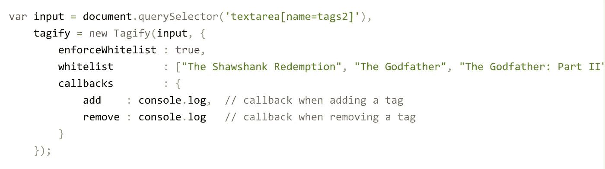

# 如何把一个纯 JS 库包装成一个 Angular 模块，打包安装

> 原文：<https://itnext.io/how-i-wrapped-ngtagify-a-pure-js-lib-into-an-angular-module-packed-and-installed-it-on-my-app-ac828e89fdf0?source=collection_archive---------1----------------------->

Tagify 是一个很酷的纯 javascript 库，由 [Yair Even 或](https://medium.com/u/6ba5dd2d3f8?source=post_page-----ac828e89fdf0--------------------------------)编写。Tagify 将输入(或 teaxtarea)转换成 tags ui 组件。

 [## Tagify -演示

### 将 HTML 输入/文本区域转换为标签组件

yaireo.github.io](https://yaireo.github.io/tagify/) 

在与 Yair(也是我的同事)短暂交谈后，我承诺我会用 Angular 模块包装他的酷库，以便 Angular 用户可以快速将其集成到他们的应用程序中。

因此，首先通过查看 Tagify 的 api，我清楚地知道我必须向用户提供:

1.  **ui 组件**将接受可能的“设置”作为输入，并在添加/删除标签时发出。
2.  一个**服务**，它将被我的组件用来实例化 Tagify 对象，这实际上是我需要在前面工作的 api，并将向我的模块消费者应用程序公开其他功能，如:addTags 和 removeAllTags 等..

之后，当模块完成时，我想打包并交付给 Yair，以便他可以在他的 repo 中使用它，为此我使用 ng-packar 生成一个 dist 文件夹，其中包含 ngTagify 模块包和所需的. d.ts 文件:)，并通过运行`npm pack.`将其打包到一个 npm 包中

下面是回购的源代码:

(**免责声明—我没有使用 cli 库抽象来打包它，我不认为当时 angular.json 中集成了该选项。现在我用命令行界面做任何事情。使用 cli…)

 [## LironHazan/角度标记模块

### https://yaireo.github.io/tagify/-利龙哈赞/角度-标签-模块的包装模块

github.com](https://github.com/LironHazan/angular-tagify-module/blob/master/src/ng-tagify-wrapper/tagify.component.ts) 

尽情享受吧！