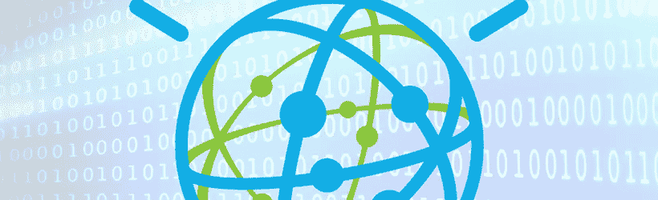

# IBM 学术计划将如何改变数据分析的前景

> 原文：<https://itnext.io/how-ibm-academic-initiative-will-change-the-data-analytics-landscape-800b01933dd?source=collection_archive---------0----------------------->

IBM 宣布，将通过新的沃森分析学术计划(WAP)和自然语言沃森分析平台的新学生版来扩展其学术计划，以培养未来的“公民数据科学家”。

我们生活的世界正在迅速变化。可以说,“数据”或者更准确地说,“大数据”是这些变化的关键促成因素。我们已经从电气化时代(十九世纪)过渡到二十世纪的通讯时代。正如 Kenneth Cukier 所描述的那样，我们的现代被定义为数据化的时代，将世界上许多以前从未量化的方面呈现为数据格式的能力。

大数据改变了我们思考和决策的方式。我们已经到了漂浮在数据中的地步，我们可以从这些海量的数据中学习。然而，由于缺乏数据分析方面的熟练人员，我们面临着一个问题。Gartner 估计，目前对数据科学家的需求超过目前的供应三倍。

为了克服这个问题，IBM 计划通过一个新的[沃森分析学术项目](https://www.ibm.com/web/portal/analytics/analyticszone/wanew) (WAP)来培训未来的“公民数据科学家”，作为其[学术计划](https://developer.ibm.com/academic/)的一部分。正如 Gartner [对](https://www.gartner.com/doc/reprints?id=1-2YEIILW&ct=160210&st=sb)的定义，公民数据科学家是“创建或生成利用预测或说明性分析的模型，但其主要工作职能不在统计和分析领域的人。”事实上，Gartner [预测](http://www.gartner.com/newsroom/id/2950317)到 2017 年，公民数据科学家的数量增长速度将是受过良好培训的同行的五倍。

目前，全球有超过 400 所大学正在使用 Watson Analytics 作为数据分析课程的一部分。为了将这项技术进一步应用到教育项目中，IBM 推出了基于自然语言的沃森分析技术的新学生版。IBM 希望利用其认知计算技术来教学生如何将数据转化为见解，而不需要全面的数据科学知识。

IBM 负责 Watson Analytics 和商业智能的副总裁 Marc Altshuller 描述道:“随着数据科学家的短缺、公民分析师的快速增加以及数据的增长，我们需要从问答驱动的分析向无偏见的调查转变，以使数据科学家花更少的时间进行搜索，花更多的时间进行调整；和公民分析师在没有深厚统计技能的情况下发现数据中的模式。”

以下两个例子说明了 Watson Analytics 学术程序是如何在不同的学术学科中使用的:

“西佛罗里达大学正在医疗保健信息学课程中使用 Watson Analytics 对哮喘数据集和涵盖佛罗里达所有 67 个县的 EPA 报告的数据集进行数据分析。通过先进的数据可视化和自然语言处理，学生们还在学习如何揭示行为和肥胖之间的相互关系，他们可以利用这些信息向医生提供更明智的建议，告诉他们如何在现实世界中治疗患者。”

“爱荷华州立大学正在将 Watson Analytics 纳入一系列管理信息系统课程，以教授学生如何利用社交媒体情绪，就销售产品和产品生命周期管理做出更明智的决策。通过使用 Watson Analytics 提供的 Twitter 情绪分析，学生们发现了 Twitter 讨论和销售数据之间的关系，他们可以利用这些关系实时调整营销活动。”

如果你对这条新闻感兴趣，想知道不同的大学是如何使用沃森分析的，请查看 IBM 的新闻稿。