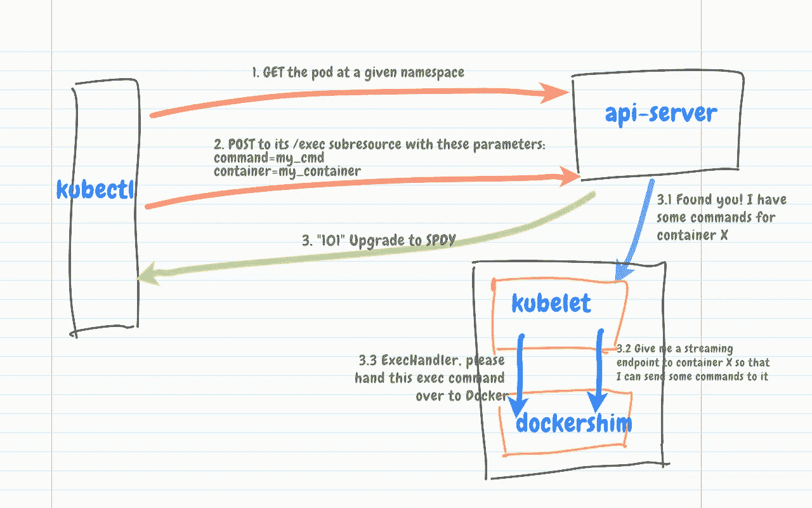
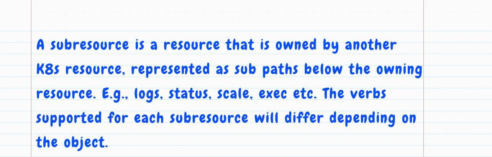

# 工作原理— kubectl exec

> 原文：<https://itnext.io/how-it-works-kubectl-exec-e31325daa910?source=collection_archive---------0----------------------->

“kubectl exec”如何工作

如果你有兴趣了解`kubectl exec`是如何工作的，那么我希望这篇文章对你有用。我们将通过检查 kubectl、K8s API 服务器、Kubelet 和容器运行时接口(CRI) Docker API 中的相关代码来研究该命令是如何工作的。

# 关于此命令

对于我们这些经常在 Kubernetes 上处理容器化工作负载的人来说,`kubectl exec`命令是一个非常有用的工具。它允许我们通过执行容器内部的命令来检查和调试我们的应用程序。

让我们用`kubectl` v1.15.0 运行一个例子:

` kubectl exec '示例

第一个`exec`命令在我的 Nginx 容器中运行一个`date`命令。第二个`exec`命令使用`-i`和`-t`标志来获取我的 Nginx 容器的 shell。

# CLI 代码

让我们以更高的日志详细度重复该命令:

带有详细输出的“kubectl exec”

请注意，有两个 HTTP 请求:

1.  一个`GET`请求[获取 pod](https://github.com/kubernetes/kubectl/blob/4f155a6381d3caaf46f37df8e575abdad9b24b3f/pkg/cmd/exec/exec.go#L287-L306)
2.  一个`POST`请求[到](https://github.com/kubernetes/kubectl/blob/4f155a6381d3caaf46f37df8e575abdad9b24b3f/pkg/cmd/exec/exec.go#L345-L349)吊舱的 `[exec](https://github.com/kubernetes/kubectl/blob/4f155a6381d3caaf46f37df8e575abdad9b24b3f/pkg/cmd/exec/exec.go#L345-L349)` [子资源。](https://github.com/kubernetes/kubectl/blob/4f155a6381d3caaf46f37df8e575abdad9b24b3f/pkg/cmd/exec/exec.go#L345-L349)

[https://kubernetes . io/docs/reference/using-API/API-concepts/](https://kubernetes.io/docs/reference/using-api/api-concepts/)

服务器以 101 `Upgrade`响应报头响应，向客户端指示它已经切换到 SPDY 协议。

# API 服务器代码

让我们检查 API 服务器的代码，看看它是如何注册`rest.ExecRest`处理程序来处理`/exec`子资源请求的。这个处理程序用来确定`exec`要到达的节点端点。

当[启动](https://github.com/kubernetes/kubernetes/blob/324b5921c1ae9b76acc074e0dfb116c0266ca1e5/cmd/kube-apiserver/app/server.go#L214-L222)时，API 服务器所做的事情之一是指示其嵌入的`GenericAPIServer`安装“遗留”API:

[https://github . com/kubernetes/kubernetes/blob/324 b 5921 C1 AE 9 b 76 ACC 074 E0 DFB 116 c 0266 ca1e 5/pkg/master/master . go # L364-L366](https://github.com/kubernetes/kubernetes/blob/324b5921c1ae9b76acc074e0dfb116c0266ca1e5/pkg/master/master.go#L364-L366)

在 API 安装过程中，`LegacyRESTStorage`类型的一个实例被[实例化](https://github.com/kubernetes/kubernetes/blob/324b5921c1ae9b76acc074e0dfb116c0266ca1e5/pkg/master/master.go#L450-L453)，这就创建了一个`storage.PodStorage`实例:

[https://github . com/kubernetes/kubernetes/blob/1934 ad 6 a9 CDE 42 e6d 92054 f 9 CFF 1 E4 d 101005 ffc/pkg/registry/core/rest/storage _ core . go # L171-L179](https://github.com/kubernetes/kubernetes/blob/1934ad6a9cde42e6d92054f9cff1e4d101005ffc/pkg/registry/core/rest/storage_core.go#L171-L179)

[https://github . com/kubernetes/API server/blob/master/pkg/registry/generic/registry/store . go # L72-L77](https://github.com/kubernetes/apiserver/blob/d65a85b44b2088665850402025c97aa9f6f32ba4/pkg/registry/generic/registry/store.go#L72-L77)

然后这个`storage.PodStorage`实例被添加到`restStorageMap`地图中。注意，在这个映射中，`pods/exec`路径被映射到`podStorage`的`rest.ExecRest`处理程序:

[https://github . com/kubernetes/kubernetes/blob/1934 ad 6 a9 CDE 42 e6d 92054 f 9 CFF 1 E4 d 101005 ffc/pkg/registry/core/rest/storage _ core . go # L271-L280](https://github.com/kubernetes/kubernetes/blob/1934ad6a9cde42e6d92054f9cff1e4d101005ffc/pkg/registry/core/rest/storage_core.go#L271-L280)

然后这个映射成为一个`apiGroupInfo`实例的一部分，这个实例被添加到`GenericAPIServer`:

[https://github . com/kubernetes/API server/blob/8 ebac 2550 a 3117540987649 ada 8d 78 CD 13366 f6b/pkg/server/generica piserver . go # L433-L439](https://github.com/kubernetes/apiserver/blob/8ebac2550a3117540987649ada8d78cd13366f6b/pkg/server/genericapiserver.go#L433-L439)

`GoRestfulContainer` [有一个](https://github.com/kubernetes/apiserver/blob/8ebac2550a3117540987649ada8d78cd13366f6b/pkg/server/handler.go#L79-L87) `[ServeMux](https://github.com/kubernetes/apiserver/blob/8ebac2550a3117540987649ada8d78cd13366f6b/pkg/server/handler.go#L79-L87)`，它知道如何将传入的请求 URL 映射到不同的处理程序。

让我们仔细看看`rest.ExecRest`处理程序是如何工作的。它的`Connect()`方法调用`[pod.ExecLocation()](https://github.com/kubernetes/kubernetes/blob/1934ad6a9cde42e6d92054f9cff1e4d101005ffc/pkg/registry/core/pod/strategy.go#L463-L473)`函数来确定 pod 容器的`exec`子资源 URL:

[https://github . com/kubernetes/kubernetes/blob/1590 c 7 b 31 CB 40259397 ccef 602 b 6d 6 DC 2 a 9 F9 d 72/pkg/registry/core/pod/rest/sub resources . go # L133-L144](https://github.com/kubernetes/kubernetes/blob/1590c7b31cb40259397ccef602b6d6dc2a9f9d72/pkg/registry/core/pod/rest/subresources.go#L133-L144)

由`pod.ExecLocation()`函数返回的 [URL](https://github.com/kubernetes/kubernetes/blob/1934ad6a9cde42e6d92054f9cff1e4d101005ffc/pkg/registry/core/pod/strategy.go#L524-L529) 被 API 服务器用来确定连接到哪个节点。

现在让我们来看看 Kubelet 代码。

# 库伯莱特密码

Kubelet 如何注册它的`exec`处理程序？它和 Docker API 的交互是什么样子的？

Kubelet 初始化过程非常复杂。以下两项职能与本职位最相关:

1.  `[PreInitRuntimeService](https://github.com/kubernetes/kubernetes/blob/9162c5d7f4a91213f258243119d484fbc3fc1c93/cmd/kubelet/app/server.go#L760-L769)()`使用`dockershim`包初始化 CRI
2.  `[RunKubelet](https://github.com/kubernetes/kubernetes/blob/9162c5d7f4a91213f258243119d484fbc3fc1c93/cmd/kubelet/app/server.go#L771-L773)()`注册处理程序并启动服务器

## 设置处理程序

当 Kubelet 启动时，它的`[RunKubelet()](https://github.com/kubernetes/kubernetes/blob/9162c5d7f4a91213f258243119d484fbc3fc1c93/cmd/kubelet/app/server.go#L1043-L1048)`函数调用未导出的`[startKubelet()](https://github.com/kubernetes/kubernetes/blob/9162c5d7f4a91213f258243119d484fbc3fc1c93/cmd/kubelet/app/server.go#L1125)`函数到[启动`kubelet.Kubelet`实例的](https://github.com/kubernetes/kubernetes/blob/9162c5d7f4a91213f258243119d484fbc3fc1c93/cmd/kubelet/app/server.go#L1131-L1135) `[ListenAndServe](https://github.com/kubernetes/kubernetes/blob/9162c5d7f4a91213f258243119d484fbc3fc1c93/cmd/kubelet/app/server.go#L1131-L1135)()` [方法](https://github.com/kubernetes/kubernetes/blob/9162c5d7f4a91213f258243119d484fbc3fc1c93/cmd/kubelet/app/server.go#L1131-L1135)。该方法然后[调用](https://github.com/kubernetes/kubernetes/blob/1590c7b31cb40259397ccef602b6d6dc2a9f9d72/pkg/kubelet/kubelet.go#L2226-L2229) `[ListenAndServeKubeletServer](https://github.com/kubernetes/kubernetes/blob/1590c7b31cb40259397ccef602b6d6dc2a9f9d72/pkg/kubelet/kubelet.go#L2226-L2229)()` [函数](https://github.com/kubernetes/kubernetes/blob/1590c7b31cb40259397ccef602b6d6dc2a9f9d72/pkg/kubelet/kubelet.go#L2226-L2229)，该函数使用`NewServer()`构造函数来安装“调试”处理程序:

[https://github . com/kubernetes/kubernetes/blob/be 26 FBC 638 ff 5 ed 952 ccae 70 e 68 baa 712 B3 c 60 c 8/pkg/kube let/server/server . go # L234-L241](https://github.com/kubernetes/kubernetes/blob/be26fbc638ff5ed952ccae70e68baa712b3c60c8/pkg/kubelet/server/server.go#L234-L241)

`InstallDebuggingHandlers()`函数向`getExec()`处理程序注册 HTTP 请求模式:

[https://github . com/kubernetes/kubernetes/blob/be 26 FBC 638 ff 5 ed 952 ccae 70 e 68 baa 712 B3 c 60 c 8/pkg/kube let/server/server . go # L375-L390](https://github.com/kubernetes/kubernetes/blob/be26fbc638ff5ed952ccae70e68baa712b3c60c8/pkg/kubelet/server/server.go#L375-L390)

`getExec()`处理程序调用`s.host`实例的`GetExec()`方法:

[https://github . com/kubernetes/kubernetes/blob/be 26 FBC 638 ff 5 ed 952 ccae 70 e 68 baa 712 B3 c 60 c 8/pkg/kube let/server/server . go # L733-L738](https://github.com/kubernetes/kubernetes/blob/be26fbc638ff5ed952ccae70e68baa712b3c60c8/pkg/kubelet/server/server.go#L733-L738)

`s.host`被实例化为`kubelet.Kubelet`类型的一个实例。它有一个对`StreamingRuntime` [接口](https://github.com/kubernetes/kubernetes/blob/1590c7b31cb40259397ccef602b6d6dc2a9f9d72/pkg/kubelet/container/runtime.go#L120-L127)的嵌套引用，接口被[实例化为`kubeGenericRuntimeManager` 实例。这个运行时管理器是与 Docker API 交互的关键组件。它实现了`GetExec()`方法:](https://github.com/kubernetes/kubernetes/blob/1590c7b31cb40259397ccef602b6d6dc2a9f9d72/pkg/kubelet/kubelet.go#L683-L710)

[https://github . com/kubernetes/kubernetes/blob/4e 45328 e 651 abaf 0 ca 72 DFD 37d 132 f 96599 c 7161/pkg/kube lett/kuberuntime/kuberuntime _ container . go # L771-L787](https://github.com/kubernetes/kubernetes/blob/4e45328e651abaf0ca72dfd37d132f96599c7161/pkg/kubelet/kuberuntime/kuberuntime_container.go#L771-L787)

这个方法调用`runtimeService.Exec()`方法。经过进一步调查，我们发现`runtimeService`是 CRI 包中定义的一个[接口](https://github.com/kubernetes/kubernetes/blob/4e45328e651abaf0ca72dfd37d132f96599c7161/pkg/kubelet/kuberuntime/kuberuntime_manager.go#L116)。`kuberuntime.kubeGenericRuntimeManager`的`runtimeService`对象被实例化为`kuberuntime.instrumentedRuntimeService`类型，它实现了`runtimeService.Exec()`方法:

[https://github . com/kubernetes/kubernetes/blob/f4db 8212 be 53 c 69 a 27d 893 d6a 4111422 fbce 8008/pkg/kube let/kuberuntime/instrumented _ services . go # L161-L168](https://github.com/kubernetes/kubernetes/blob/f4db8212be53c69a27d893d6a4111422fbce8008/pkg/kubelet/kuberuntime/instrumented_services.go#L161-L168)

此外，该`instrumentedRuntimeService`实例的嵌套`service`对象被[实例化为`remote.RemoteRuntimeService`类型的实例。这个类型拥有一个`Exec()`方法:](https://github.com/kubernetes/kubernetes/blob/962a61f51fc2cd7c9a6784ed59b37a09f5c3d801/pkg/kubelet/kubelet.go#L392-L394)

[https://github . com/kubernetes/kubernetes/blob/962 a61 f 51 fc 2 CD 7 C9 a 6784 ed 59 b 37 a 09 F5 C3 d 801/pkg/kube let/remote/remote _ runtime . go # L366-L384](https://github.com/kubernetes/kubernetes/blob/962a61f51fc2cd7c9a6784ed59b37a09f5c3d801/pkg/kubelet/remote/remote_runtime.go#L366-L384)

这个`Exec()`方法向`/runtime.v1alpha2.RuntimeService/Exec`端点发出一个 [GRPC 调用](https://github.com/kubernetes/cri-api/blob/master/pkg/apis/runtime/v1alpha2/api.pb.go#L7446-L7453)，以准备一个将用于执行容器中命令的流端点。(有关将 Docker shim 设置为 GRPC 服务器的更多信息，请参见下一小节*设置 Docker shim* 。)

GRPC 服务器[通过调用`RuntimeServiceServer.Exec()`方法来处理](https://github.com/kubernetes/cri-api/blob/de6519080ceb33d843ca275a9d8a8cd016558ad8/pkg/apis/runtime/v1alpha2/api.pb.go#L7927-L7943)这个问题。该方法由`dockershim.dockerService`结构实现:

[https://github . com/kubernetes/kubernetes/blob/579 E0 c74c 150085 B3 fac 01 f 6a 33 b 66 db 96922 f 93/pkg/kube let/docker shim/docker _ streaming . go # L105-L115](https://github.com/kubernetes/kubernetes/blob/579e0c74c150085b3fac01f6a33b66db96922f93/pkg/kubelet/dockershim/docker_streaming.go#L105-L115)

第 10 行的`streamingServer`是一个`[streaming.Server](https://github.com/kubernetes/kubernetes/blob/d24fe8a801748953a5c34fd34faa8005c6ad1770/pkg/kubelet/server/streaming/server.go#L42-L60)`接口。它在`dockershim.NewDockerService()`构造函数中被实例化:

[https://github . com/kubernetes/kubernetes/blob/579 E0 c74c 150085 B3 fac 01 f 6a 33 b 66 db 96922 f 93/pkg/kube let/docker shim/docker _ service . go # L225-L232](https://github.com/kubernetes/kubernetes/blob/579e0c74c150085b3fac01f6a33b66db96922f93/pkg/kubelet/dockershim/docker_service.go#L225-L232)

让我们看看它的`GetExec()`方法的实现:

[https://github . com/kubernetes/kubernetes/blob/d 24 Fe 8a 801748953 a5c 34 FD 34 FAA 8005 c 6 ad 1770/pkg/kube let/server/streaming/server . go # L179-L190](https://github.com/kubernetes/kubernetes/blob/d24fe8a801748953a5c34fd34faa8005c6ad1770/pkg/kubelet/server/streaming/server.go#L179-L190)

这是构建流端点并将其返回给 GRPC 客户端的地方。

如上所述，`restful.WebService`实例然后将 pod `exec`请求路由到这个端点。

[https://github . com/kubernetes/kubernetes/blob/be 26 FBC 638 ff 5 ed 952 ccae 70 e 68 baa 712 B3 c 60 c 8/pkg/kube let/server/server . go # L375-L390](https://github.com/kubernetes/kubernetes/blob/be26fbc638ff5ed952ccae70e68baa712b3c60c8/pkg/kubelet/server/server.go#L375-L390)

## 设置 Docker 垫片

`PreInitRuntimeService()`函数[创建并启动](https://github.com/kubernetes/kubernetes/blob/63df40077862c378dd0e7d22a1dc5d2557000694/pkg/kubelet/kubelet.go#L355-L361)Docker shim，作为[GRPC 服务器](https://github.com/kubernetes/kubernetes/blob/ae95a4bfcac12bf6b19e2d5acf6404359b1a8c3b/pkg/kubelet/dockershim/remote/docker_server.go#L64-L70)。在实例化`dockershim.dockerService`类型的实例时，其嵌套的`streamingRuntime`实例被赋予了对`dockershim.NativeExecHandler`实例的引用，该实例实现了`[dockershim.ExecHandler](https://github.com/kubernetes/kubernetes/blob/63df40077862c378dd0e7d22a1dc5d2557000694/pkg/kubelet/dockershim/exec.go#L33-L36)`接口:

[https://github . com/kubernetes/kubernetes/blob/63df 40077862 c 378 DD 0 e 7d 22 a1 dc5d 2557000694/pkg/kube let/docker shim/docker _ service . go # L203-L216](https://github.com/kubernetes/kubernetes/blob/63df40077862c378dd0e7d22a1dc5d2557000694/pkg/kubelet/dockershim/docker_service.go#L207-L210)

`NativeExecHandler.ExecInContainer()`方法是使用 Docker 的`exec` API 在容器中执行命令的关键:

[https://github . com/kubernetes/kubernetes/blob/63df 40077862 c 378 DD 0 e 7d 22 a1 dc5d 2557000694/pkg/kube let/docker shim/exec . go # L97-L108](https://github.com/kubernetes/kubernetes/blob/63df40077862c378dd0e7d22a1dc5d2557000694/pkg/kubelet/dockershim/exec.go#L97-L108)

最终，这是 Kubelet 调用 Docker `exec` API 的地方。

我们需要的最后一块拼图是弄清楚`streamingServer`如何处理`exec`的请求。为此，我们需要找到它的`exec`处理程序。让我们从`streaming.NewServer()`构造函数开始。这是`/exec/{token}`路径绑定到`serveExec`处理程序的地方:

[https://github . com/kubernetes/kubernetes/blob/d 24 Fe 8a 801748953 a5c 34 FD 34 FAA 8005 c 6 ad 1770/pkg/kube let/server/streaming/server . go # L125-L133](https://github.com/kubernetes/kubernetes/blob/d24fe8a801748953a5c34fd34faa8005c6ad1770/pkg/kubelet/server/streaming/server.go#L125-L133)

所有发送到`dockershim.dockerService`实例的`exec`请求都将在`streamingServer`结束，因为`[dockerService.ServeHTTP()](https://github.com/kubernetes/kubernetes/blob/579e0c74c150085b3fac01f6a33b66db96922f93/pkg/kubelet/dockershim/docker_service.go#L456-L462)`方法调用了`streamingServer`实例的`ServeHTTP()`方法。

`serveExec`处理程序[调用](https://github.com/kubernetes/kubernetes/blob/d24fe8a801748953a5c34fd34faa8005c6ad1770/pkg/kubelet/server/streaming/server.go#L285-L297) `[remoteCommand.ServeExec](https://github.com/kubernetes/kubernetes/blob/d24fe8a801748953a5c34fd34faa8005c6ad1770/pkg/kubelet/server/streaming/server.go#L285-L297)()` [函数](https://github.com/kubernetes/kubernetes/blob/d24fe8a801748953a5c34fd34faa8005c6ad1770/pkg/kubelet/server/streaming/server.go#L285-L297)。这个函数是做什么的？它调用了我们之前讨论过的`Executor.ExecInContainer()`方法。记住，`ExecInContainer()`方法是知道如何与 Docker `exec` API 对话的方法:

[https://github . com/kubernetes/kubernetes/blob/6 ecdd 22978783 ea 51 EFC 34 f 56 f 13 EB 4d 9 baa 446 a/pkg/kube let/server/remote command/exec . go # L52-L77](https://github.com/kubernetes/kubernetes/blob/6ecdd22978783ea51efc34f56f13eb4d9baa446a/pkg/kubelet/server/remotecommand/exec.go#L52-L77)

# 结论

在这篇文章中，我们通过检查 kubectl、K8s API 服务器、Kubelet 和 CRI Docker API 的代码，了解了`kubectl exec`命令是如何工作的。

我们没有介绍 Docker `exec` API 的细节，也没有介绍`docker exec`是如何工作的。

kubectl CLI 向 K8s API 服务器发出了一个`GET`和`POST`请求。作为响应，服务器向客户端发送了一个 101 `Upgrade`头，指示切换到 SPDY 协议。

K8s API 服务器使用`storage.PodStorage`和`rest.ExecRest`来提供处理程序映射和逻辑。`rest.ExecRest`处理程序将`exec`的节点端点确定为。

Kubelet 从 Docker shim 请求一个流端点，并将`exec`请求转发给 Docker `exec` API。

虽然这篇文章只关注了`exec`命令，但是值得注意的是，其他命令如`attach`、`port-forward`和`logs`也遵循类似的实现模式。

# 参考

1.  我使用了这篇[文章](https://stackoverflow.com/a/155655/1144203)中提供的定义来区分*函数*和*方法*。
2.  我用这个[帖子](https://erkanerol.github.io/post/how-kubectl-exec-works/)来验证我对部分代码的理解。这篇文章讨论了 CRI-O 源代码，而这篇文章关注的是 Docker shim。