# 我如何将开发环境的成本削减了 90%

> 原文：<https://itnext.io/how-ive-slashed-the-cost-of-my-dev-environments-by-90-9c1082ad1baf?source=collection_archive---------0----------------------->

## 创建可复制开发机器的教程


云中的编码——Shutterstock

# 问题是:

当你编写代码时，你需要一台或多台机器来编写和测试代码。

这些天，我通常用 Golang 编写后端代码 Node.js，用 REACT 编写前端代码。在 Linux 机器上开发和测试更容易，但是我的“日常”机器运行在 Windows 上。

此外，代码最终将部署在 Linux 机器上或作为一个无服务器应用程序。

最后但同样重要的是，我不总是在同一台电脑后面。

*   当我在野外时，我有一台笔记本电脑。
*   我办公室里还有一台电脑。
*   在过去的几个月里，我一直在家工作，就像很多人一样。

# 要求:

*   我想要一台可以用来编写和测试代码的机器。
*   解决方案应该是负担得起的(我不想买更多的硬件)。
*   我想使用 [Visual Studio 代码](https://code.visualstudio.com/)(我最喜欢的编辑器)，使用我需要的所有扩展和组件。
*   我需要能够在不到 5 分钟内启动并运行。

# 想法是:

*   不要依赖我的本地机器编码。
*   每次我需要编码时，在云中配置一个标准的、干净的、预配置的虚拟机。
*   一旦我完成编码就销毁机器，这样我就不会为我不需要的资源付费。

# 今天存在的(不够好):

## AWS 云 9:

AWS Cloud 9 是一个优秀的解决方案，但是它不能运行 Visual Studio 代码。它也可能有点贵。

## Visual Studio 代码中的 SSH 扩展:

*   您仍然需要连接到主机。
*   除非实现一些奇怪/复杂的配置，否则不能使用大多数调试工具和组件。

# 解决方案是:

我使用运行 Ubuntu 18–04 LTS 的 Google 云计算引擎实例(一个虚拟机)作为我的开发服务器。

我建议您使用[计算引擎可抢占实例](https://cloud.google.com/compute/docs/instances/preemptible):

*   它们比标准虚拟机便宜得多(比常规实例便宜 80%)。
    一台通常每月花费 24.27 美元的“T5”n1-standard-1 机器，作为一台可抢占机器，每月仅花费 7.30 美元。
*   由于这些机器上没有永久存储的东西，所以过一段时间就消失也没关系。

我使用 Google Chrome 远程访问与开发服务器进行交互。

我使用一个代码库(Github):

*   来托管配置开发服务器的脚本。这样，每当我需要开发服务器时，我都可以拥有一个标准的环境。
*   来托管和管理我在那台机器上创建和测试的代码。

以下是我如何做的一步一步的说明。

# 先决条件:

## 您需要具备的条件:

*   一个谷歌云平台账号。
*   在您的 GCP 项目上创建计算引擎实例的权限。
*   安装在本地机器上的 Chrome 浏览器。

## 连接到您的 GCP 控制台:

登录你的[谷歌云控制台](https://console.cloud.google.com/)。

打开谷歌云壳终端:点击 GCP 主控制台页面右上角的图标。


打开谷歌云外壳的按钮

云外壳控制台打开:

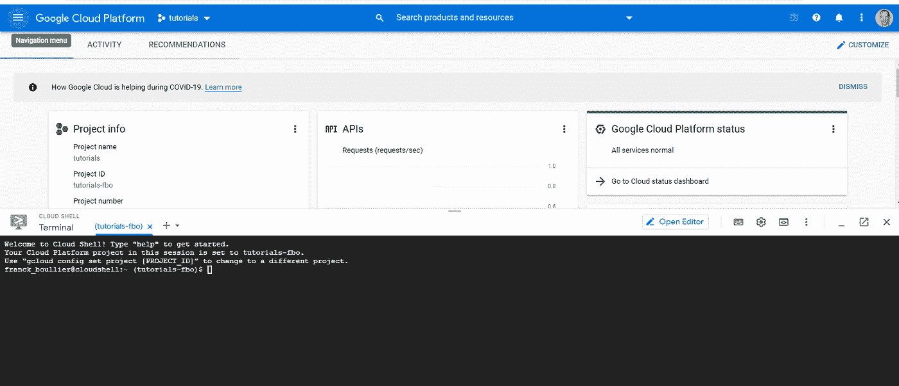

带有打开的云外壳会话的 Google 控制台

## 为机器保留一个静态 IP 地址:

为了方便与该开发机器之间的连接，我们将创建一个特定的 IP 地址，并将其连接到该虚拟机。

这并不是绝对必要的，但是为您的开发机器拥有一个持久的 IP 地址是非常有用的。

在运行该命令之前，您可以编辑我在**粗体**中突出显示的值，并用适合您的值替换它们。

将以下代码复制并粘贴到 GCP 云外壳中，以保留 IP 地址:

```
gcloud compute addresses create **tutorial-dev-vm-ip** \
 — project=**tutorials-fbo** \
 — network-tier=**STANDARD** \
 — region=**asia-southeast1**
```

让我们来分解这个命令:

```
gcloud compute addresses create **tutorial-dev-vm-ip**
```

我们正在创建一个名为` **tutorial-dev-vm-ip** 的 IP 地址

```
 — project=**tutorials-fbo**
```

我们正在项目`**教程-fbo** 中创建这个 IP 地址

*   该项目必须存在。
*   如果不指定，则在当前项目中创建 IP 地址。

*详见* [*关于如何创建项目的谷歌文档*](https://cloud.google.com/resource-manager/docs/creating-managing-projects) *。*

```
 — region **asia-southeast1**
```

IP 地址所属的区域是“**亚洲-东南亚 1** ”。

*   确保这与您将创建虚拟机的区域是同一个区域。
*   选择一个离你近的区域。
*   您可以在[谷歌地区和区域列表](https://cloud.google.com/compute/docs/regions-zones#available)上看到可用区域列表。

```
 — ip-version IPV4
```

这是一个 IP v4 地址。

*你可以在* [*关于 g cloud compute addresses create*](https://cloud.google.com/sdk/gcloud/reference/compute/addresses/create)的 Google 文档中看到关于保留 IP 地址不同选项的详细解释。

## 创建防火墙规则以访问虚拟机:

如果您需要对代码进行一些测试，在开发机器上打开 http 和 https 端口是很好的。

允许 http 访问的规则:

```
gcloud compute firewall-rules create **allow-http** \
 — project=**tutorials-fbo** \
 — direction=INGRESS \
 — network=default \
 — action=ALLOW \
 — rules=tcp:80 \
 — source-ranges=**0.0.0.0/0** \
 — target-tags=**http-server**
```

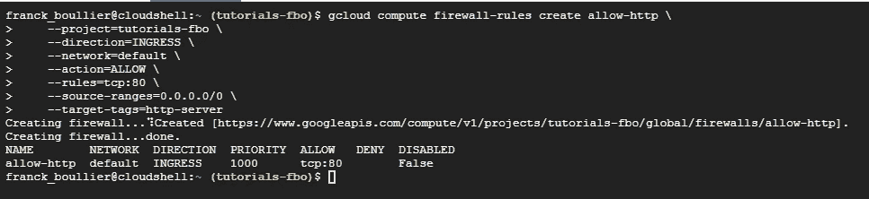

Google Cloud Shell 的屏幕截图—创建 http 防火墙规则

让我们也分解这个命令:

```
gcloud compute firewall-rules create **allow-http**
```

我们正在创建一个名为“ **allow-http** ”的防火墙规则。

```
 — project=**tutorials-fbo**
```

我们在项目“**教程-fbo** ”中创建了这个规则。如果不指定，规则将在当前项目中创建。该项目必须存在。

*详见* [*关于如何创建项目的谷歌文档*](https://cloud.google.com/resource-manager/docs/creating-managing-projects)*。*

```
 *— direction=INGRESS* 
```

*此规则适用于传入流量。*

```
 *— network=**default*** 
```

*这是本项目`**默认** ` VPC 的规则。*

```
 *— action=ALLOW* 
```

*这是一个允许访问的规则(与拒绝相对)。*

```
 *— rules=tcp:**80*** 
```

*规则本身是关于 TCP 端口 http 协议的标准端口)。*

```
 *— source-ranges=**0.0.0.0/0*** 
```

*互联网上的任何机器都可以访问。*

```
 *— target-tags=**http-server***
```

*如果项目中的资源具有标签` **http-server** `,将应用此规则。*

**你可以在 gcloud compute firewall 的* [*Google 文档-规则创建*](https://cloud.google.com/sdk/gcloud/reference/compute/firewall-rules/create) *上看到不同选项的详细解释。**

*我们还希望允许来自安全 http 连接的访问。我们用来连接机器的 Chrome 远程桌面需要打开端口 443。*

```
*gcloud compute firewall-rules create **allow-https** \
 — project=**tutorials-fbo** \
 — direction=INGRESS \
 — network=default \
 — action=ALLOW \
 — rules=tcp:443 \
 — source-ranges=**0.0.0.0/0** \
 — target-tags=**https-server***
```

*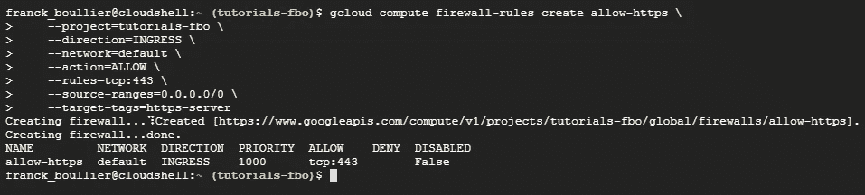*

*Google Cloud Shell 的屏幕截图—创建 https 防火墙规则*

# *简短版本—创建并访问开发服务器:*

*前面所有的步骤只需要一次。*

*这是每次您需要做一些编码时创建和访问开发机器的步骤的简短版本。*

## *创建新的开发机器:*

*如果你想知道更多关于这个步骤的细节，请阅读本文中的“扩展版本——创建开发服务器”一段。*

*登录你的[谷歌云控制台](https://console.cloud.google.com/)，打开谷歌云外壳终端。*

*复制你需要的脚本。如果您没有我的脚本，您可以使用它:它可以在 Github 上获得(法律声明:使用风险自担！).*

```
*git clone [https://github.com/franck-boullier/utils.git](https://github.com/franck-boullier/utils.git)*
```

*并移动到脚本所在的文件夹。*

```
*cd ~/utils/installation*
```

*找到您为该虚拟机创建的保留 IP 地址，并将其存储在一个变量中。*

```
***IP_ADDRESS_DEV_MACHINE**=$(gcloud compute addresses list \
 — filter=”name:**tutorial-dev-vm-ip** AND region:**asia-southeast1**" \
 — format=”value(address_range())”
 )*
```

*创建虚拟机的命令:*

```
*gcloud compute instances create **tutorial-dev-vm** \
 — project=**tutorials-fbo** \
 — zone=**asia-southeast1-b** \
 — machine-type=**n1-standard-1** \
 — preemptible \
 — image=**ubuntu-1804-bionic-v20200716** \
 — image-project=**ubuntu-os-cloud** \
 — boot-disk-size=**10GB** \
 — boot-disk-type=**pd-standard** \
 — boot-disk-device-name=**tutorial-dev-vm** \
 — metadata-from-file startup-script=**tutorial-dev-machine.sh** \
 — network-tier=**STANDARD \**
 — address=**$IP_ADDRESS_DEV_MACHINE \**
 — subnet=**default** \
 — tags=**http-server**,**https-server \**
 — labels=**os=ubuntu-18–04-lts,cost-alloc=tutorials,usage=golang,configuration=v1–1–0***
```

*您可以在浏览器上通过 SSH 从您的虚拟机实例列表连接到您新创建的开发机器(确保您选择了正确的项目)。*

*将您的用户帐户添加到远程机器上的 chrome-remote-desktop Linux 组。*

```
*sudo usermod -a -G chrome-remote-desktop $USER*
```

*并注销*

```
*logout*
```

## *要连接到您的远程机器:*

*如果你想知道更多关于如何做的细节，去这篇文章中的“连接到远程开发服务器”一段。*

*转到 [Chrome 远程桌面页面，设置对新机器的访问](https://remotedesktop.google.com/headless)，并按照说明获取允许访问远程虚拟机所需的代码。*

*通过 SSH web 连接将远程虚拟机的访问代码复制到远程虚拟机，运行该代码，并在出现提示时提供一个六位数的 PIN。*

*使用[谷歌 Chrome 远程桌面](https://remotedesktop.google.com/access)访问远程虚拟机。*

*开始编码！*

*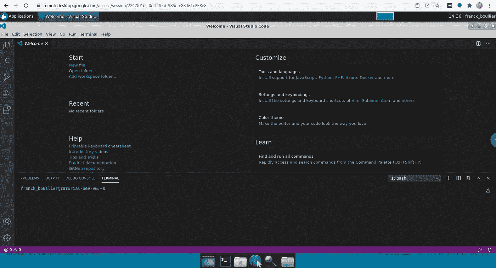*

*连接到开发机器——Visual Studio 代码是开放的并且正在工作*

# *完成后—删除虚拟机:*

*完成代码工作后，提交并推送至您最喜欢的代码库。*

*并删除开发机器:*

*登录您的 [Google Cloud 控制台](https://console.cloud.google.com/)，打开 Google Cloud Shell 终端。*

**

*带有打开的云外壳会话的 Google 控制台*

*删除机器的命令是:*

```
*gcloud compute instances delete **tutorial-dev-vm** \
 — zone=**asia-southeast1-b***
```

*结果是:*

*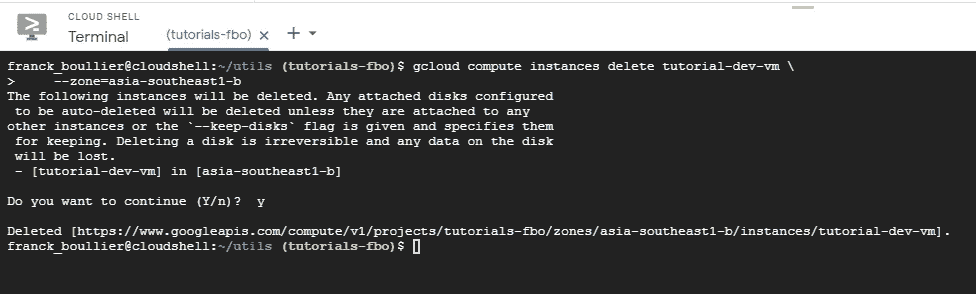*

*完成后，删除您的开发机器。*

# *下次您需要开发环境时:*

*再次创建新的开发服务器。*

*使用 [Chrome 远程桌面网站](https://remotedesktop.google.com/)连接到开发服务器。*

# *扩展版本—创建开发服务器:*

*这是对之前“短版”更详细的解释。*

*结果是相同的，但这将帮助您了解它如何工作的更多细节。*

*登录你的[谷歌云控制台](https://console.cloud.google.com/)，打开谷歌云外壳终端。*

**

*带有打开的云外壳会话的 Google 控制台*

## *获取您预订的 IP 地址:*

*验证您是否保留了可以使用的固定 IP 地址。*

```
*gcloud compute addresses describe **tutorial-dev-vm-ip** \
 — region=**asia-southeast1***
```

*输出应该是这样的:*

*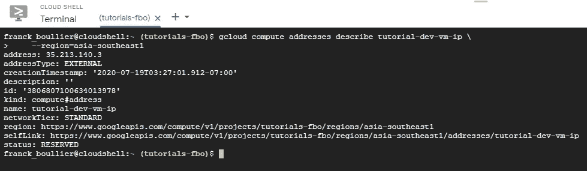*

*关于为您的开发机器保留的 IP 地址的细节*

*我们将把那个新保留的 IP 地址复制到一个本地变量`**IP _ ADDRESS _ DEV _ MACHINE**`；这使得接下来的步骤更加简单。*

```
***IP_ADDRESS_DEV_MACHINE**=$(gcloud compute addresses list \
 — filter=”name:**tutorial-dev-vm-ip** AND region:**asia-southeast1**" \
 — format=”value(address_range())”
 )*
```

*检查是否一切如预期进行。*

```
*echo $**IP_ADDRESS_DEV_MACHINE***
```

*输出应该是这样的:*

*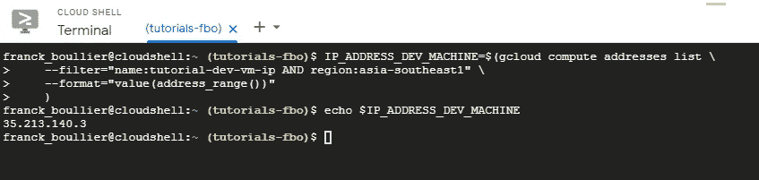*

*验证 IP 地址是否在本地变量中导出*

## *获取脚本以准备机器:*

*如果您没有我的脚本，您可以使用它:它可以在 Github 上获得(法律声明:使用风险自担！).*

```
*git clone [https://github.com/franck-boullier/utils.git](https://github.com/franck-boullier/utils.git)*
```

*我们将在本教程中使用的脚本会在虚拟机上安装以下内容:*

*   *Xcfe:所以当你登录虚拟机时，你可以有一个熟悉的图形用户界面。*
*   *Chrome 远程桌面从你的电脑访问虚拟机。*
*   *Firefox:测试你将要构建的代码。*
*   *Chrome:测试你将要构建的代码。*
*   *谷歌云 SDK，这样你就可以在需要的时候与谷歌云平台互动。*
*   *AWS CLI，以便您可以在需要时与 AWS 服务和资源进行交互。*
*   *Visual Studio 代码。*

## *创建新的虚拟机:*

*在运行下面的命令之前，您可以编辑我在**粗体**中突出显示的值，并用适合您的值替换它们。*

*移动到安装脚本的下载目录。*

```
*cd ~/utils/installation*
```

*创建虚拟机:*

```
*gcloud compute instances create **tutorial-dev-vm** \
    --project=**tutorials-fbo** \
    --zone=**asia-southeast1-b** \
    --machine-type=**n1-standard-1** \
    --preemptible \
    --image=**ubuntu-1804-bionic-v20200716** \
    --image-project=**ubuntu-os-cloud** \
    --boot-disk-size=**10GB** \
    --boot-disk-type=**pd-standard** \
    --boot-disk-device-name=**tutorial-dev-vm** \
    --metadata-from-file startup-script=**tutorial-dev-machine.sh** \
    --network-tier=**STANDARD \**
    --address=**$IP_ADDRESS_DEV_MACHINE \**
    --subnet=**default** \
    --tags=**http-server**,**https-server \**
    --labels=**os=ubuntu-18-04-lts,cost-alloc=tutorials,usage=golang,configuration=v1-1-0***
```

*让我们来分解这个命令:*

```
*gcloud compute instances create **tutorial-dev-vm***
```

*我们正在创建一个名为“ **tutorial-dev-vm** ”的实例。*

```
 *— project=**tutorials-fbo***
```

*我们在项目`**教程-fbo** '中创建了这个规则。该项目必须存在。*

*如果不指定，实例将在当前项目中创建。*

**参见* [*关于如何创建项目的谷歌文档*](https://cloud.google.com/resource-manager/docs/creating-managing-projects) *了解更多细节*。*

```
 *— zone=**asia-southeast1-b*** 
```

*我们将在“ **asia-southeast1-b** ”区域中部署该实例。
确保该区域与您创建 IP 地址的区域相同。*

```
 *— machine-type=**n1-standard-1*** 
```

*该机器是一台“n1-标准-1”机器。*

*您可以在 [Google 可能的机器类型列表](https://cloud.google.com/compute/docs/machine-types)上看到您可以构建的可能的机器列表。*

```
 *— preemptible*
```

*我们正在优化成本。谷歌抢占实例不是问题。如果发生这种情况，我们将重新创建一个新的。*

**详见* [*可抢占虚拟机上的谷歌文档*](https://cloud.google.com/compute/docs/instances/preemptible)*。**

```
 **— image=**ubuntu-1804-bionic-v20200716** \ — image-project=**ubuntu-os-cloud****
```

**我们使用的是来自“ **ubuntu-os-cloud** ”项目的“**Ubuntu-1804-bionic-v 2020 07 16**”图像。**

**通过运行命令，您可以看到可用图像及其关联项目的列表**

```
**gcloud compute images list**
```

**在你的 GCP 云壳上。**

```
 **— boot-disk-size=**10GB** \
 — boot-disk-type=**pd-standard** \
 — boot-disk-device-name=**tutorial-dev-vm** \**
```

**引导盘是一个大小为“ **10GB** 的“ **pd 标准**盘。它将被命名为`**教程-开发-虚拟机****

```
 **— metadata-from-file startup-script=**tutorial-dev-machine.sh**** 
```

**这是将作为安装过程的一部分运行的脚本。**

**当启动脚本存在时，计算引擎执行以下操作:**

*   **将启动脚本复制到实例中的本地文件。**
*   **设置文件的运行权限。**
*   **运行文件。**

```
 **— network-tier=**STANDARD**** 
```

**我们不需要超快的网络性能，我们正在优化成本。**

**我们将使用`**标准**网络层，而不是`**高级**网络层。**

***更多信息*参见 [*谷歌关于网络服务层级的文档*](https://cloud.google.com/network-tiers) *。***

```
 **— address=**$IP_ADDRESS_DEV_MACHINE****
```

**该机器的 IP 地址将是我们在上一步中创建的保留 IP 地址。这里我们使用我们之前设置的变量，而不是硬编码的值。**

```
 **— subnet=default** 
```

**我们对该虚拟机使用该项目的默认子网。**

```
 **— tags=**http-server**,**https-server**** 
```

**这是两个标签:` **http-server** 和` **https-server** ，它们是我们在上一步创建防火墙规则时创建的。**

**我们将使用 Google Chrome 来访问该机器，这样就可以通过 https 协议访问虚拟机。**

```
 **— labels=**os=ubuntu-18–04-lts**,**cost-allocation=tutorials**,**usage=golang**,**configuration=v1–1–0**
My own specific labels that I want to attach to that instance:**
```

**以下是我使用的一些有用的标签:**

*   **`**OS = Ubuntu-18–04-lts****
*   **`**成本分配=教程**` 1**
*   **`**用法=golang** `**
*   **`**配置= v1–1–0****

**I *如果你想更好地理解所有可用的参数，你可以在* [*Google 文档上看到所有附加选项的详细解释，用于 g cloud compute instances create*](https://cloud.google.com/sdk/gcloud/reference/compute/instances/create)。**

**虚拟机已经为我们准备好了。**

**我们现在需要配置 Chrome Remote 来访问那台机器。**

# **设置 Chrome 远程桌面:**

**这部分教程来自于关于如何设置 Chrome Remote 的谷歌文档。**

**要启动远程桌面服务器，您需要有一个 Google 帐户的授权密钥，以便连接到它。**

**转到您的虚拟机实例的[列表。](https://console.cloud.google.com/compute/instances)**

**您应该会看到新创建的虚拟机:**

**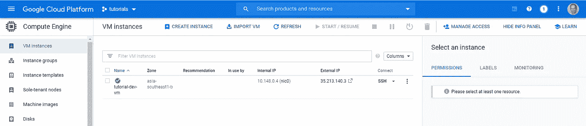**

**该项目中您的虚拟机列表—我们的实例已经创建**

**单击 SSH 按钮连接到您的虚拟机**

**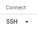**

**在 web 浏览器中访问 SSH 连接**

**您应该会看到一个新的浏览器窗口打开。**

**它看起来会像这样:**

**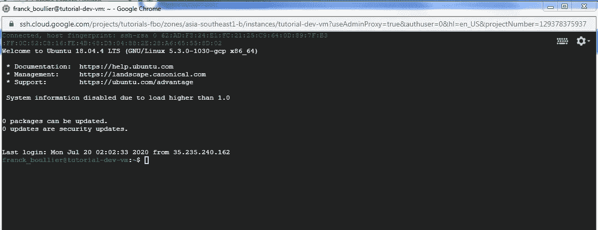**

**通过浏览器中的 SSH 连接到开发机器。**

**将您的用户帐户添加到 chrome-remote-desktop Linux 组。**

```
**sudo usermod -a -G chrome-remote-desktop $USER**
```

**并注销**

```
**logout**
```

**使用本地机器上的 Chrome 浏览器，进入 Chrome 远程桌面设置页面。你可以通过这个链接进入那个页面:**

**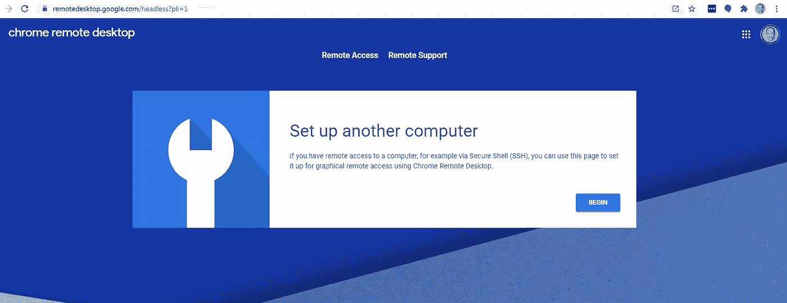**

**设置远程访问—步骤 1**

**点击“开始”**

**您现在应该会看到这个页面:**

**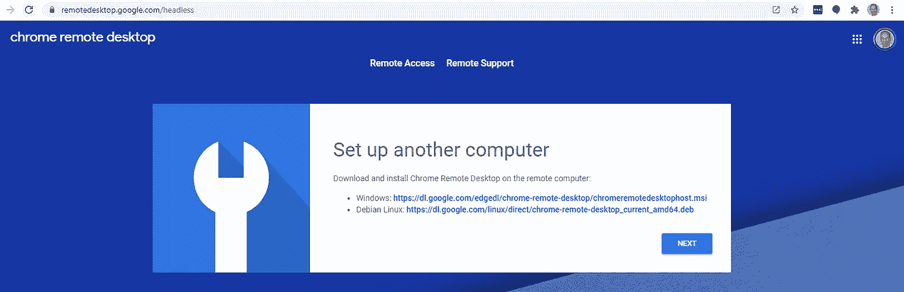**

**设置远程访问—步骤 2**

**点击**下一步**:不再需要下载或安装任何东西；这已经由我们在创建虚拟机时指定的脚本完成了。**

**下一页应该是这样的:**

**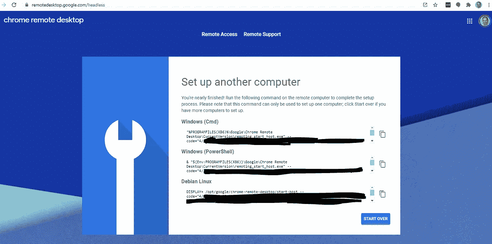**

**设置远程访问—步骤 3**

**我们使用 Debian Linux 命令(第三段代码)在 VM(远程)实例上设置和启动 Chrome 远程桌面服务。**

**要链接远程虚拟机和您的 Google 帐户，请使用授权码。**

**复制命令**

**通过再次点击 **SSH** 按钮，重新连接到您的实例(开发机器)。**

****

**该项目中的虚拟机列表—重新连接到您的实例**

**将该命令复制到连接到您的实例的 SSH 窗口，然后运行该命令。**

```
 ****EXAMPLE — DO NOT USE**
DISPLAY= /opt/google/chrome-remote-desktop/start-host \
 — code=”4/xxxxxxxxxxxxxxxxxxxxxxxx” \
 — redirect-url=”https://remotedesktop.google.com/_/oauthredirect" \
 — name=**
```

**确保使用您复制的代码。不要使用上面的例子。**

**复制刚刚打开的 SSH 窗口上的代码:**

****

**这是你需要复制谷歌远程访问代码的地方**

**不要复制谷歌云外壳上的代码。**

**运行命令(单击 enter)。**

**系统会提示您输入一个六位数的 PIN。**

**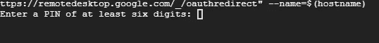**

**输入实例的六位数 PIN**

**按照要求输入一个六位数的 PIN 并确认。**

## **故障排除 1:**

**当您尝试在远程虚拟机上配置远程连接时，如果您遇到如下错误**

**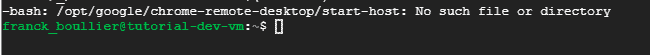**

**错误-没有安装 chrome remote**

**这可能是因为安装脚本仍在运行。**

**等待一分钟，然后重试。**

**故障排除 2:**

**如果您收到这样的错误消息:**

**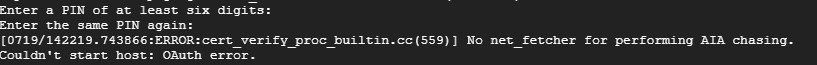**

**错误消息— OAuth 错误**

**代码可能已过期。密码只在几分钟内有效。**

**点击 Chrome 远程桌面设置页面上的重新开始按钮，然后重试。**

**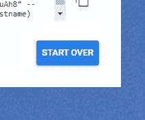**

# **连接到远程开发服务器:**

**在你的本地电脑上，打开谷歌 Chrome 浏览器，进入 Chrome 远程桌面网站。**

**您应该在那里看到您的远程机器:**

**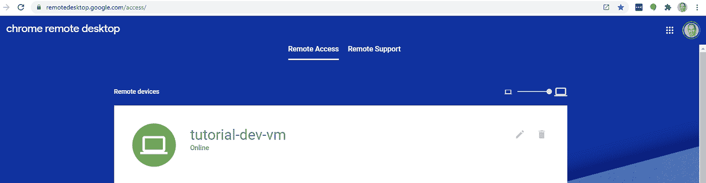**

**Chrome 远程桌面—机器是可访问的**

**单击远程桌面实例的名称。**

**出现提示时，输入您之前创建的 PIN，然后单击箭头按钮进行连接。**

**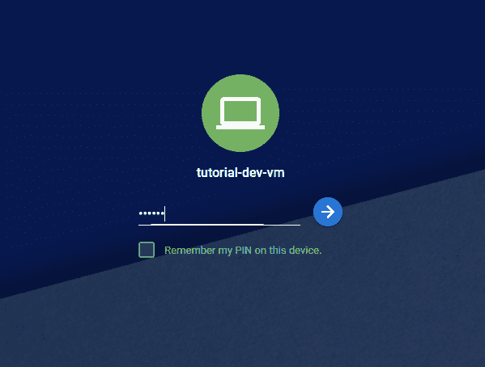**

**输入您的 PIN 以连接到远程实例**

**你接通了！**

**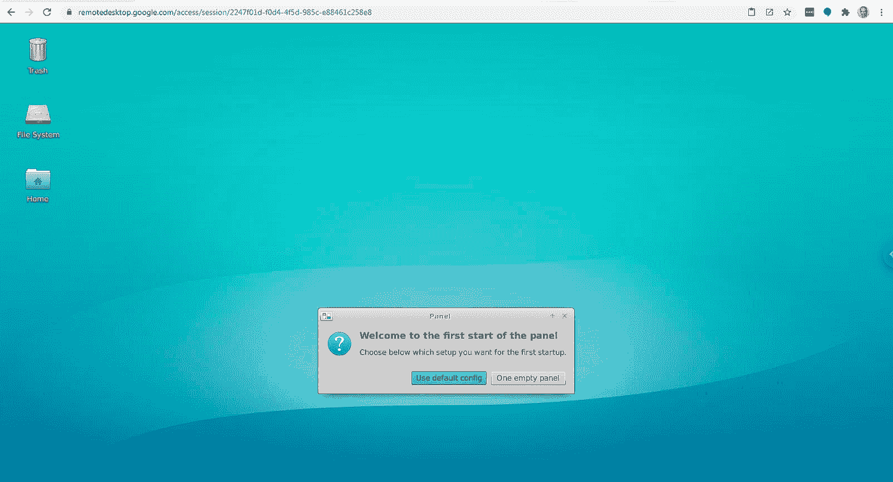**

## **故障排除 3:**

**如果您在尝试连接到远程机器时看到这样的屏幕:**

**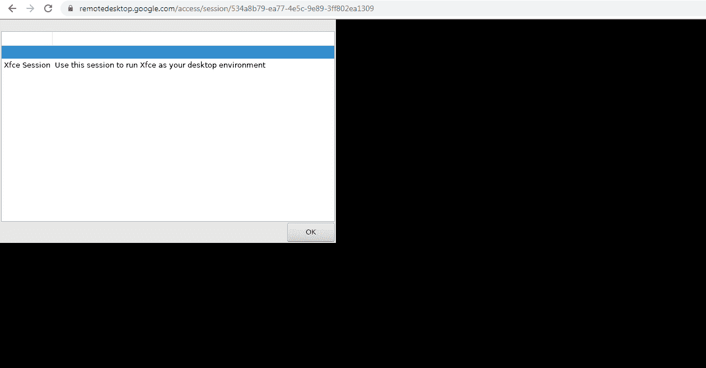**

**尝试连接到远程机器时出错**

**很可能安装脚本还没有完成。**

**单击确定。**

**等待一分钟，然后重试。**

## **如果您没有要连接的问题:**

**接受默认设置**

**转到应用>>开发> > Visual Studio 代码**

****

**编码快乐！**

**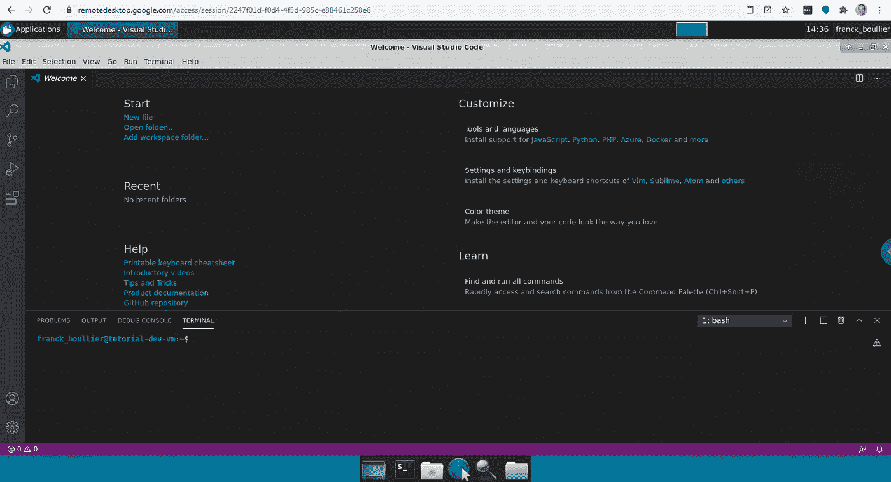**

**连接到开发机器——Visual Studio 代码是开放的并且正在工作**

# **就是这样！**

**在本文中，您已经看到了如何创建一个可负担得起的、标准的、临时的、托管在云中的开发环境。**

**那个环境有你需要编码的工具，包括 Visual Studio 代码。**

**我们还看到了如何从 Google Chrome 远程桌面访问这个环境。**

**对于本教程，我使用了谷歌云平台。如果您更熟悉 AWS，您可以使用 Amazon Web Services 和 EC2 实例。**

**这就是我如何将开发服务器的成本降低了大约 90%:我只在需要的时候使用临时实例！**

# **清理:**

**知道如何撤销事情总是好的…**

## **删除保留的 IP 地址:**

```
**gcloud compute addresses delete **tutorial-dev-vm-ip** \
 — region=**asia-southeast1****
```

## **删除防火墙规则:**

```
**gcloud compute firewall-rules delete **allow-http** gcloud compute firewall-rules delete **allow-https****
```