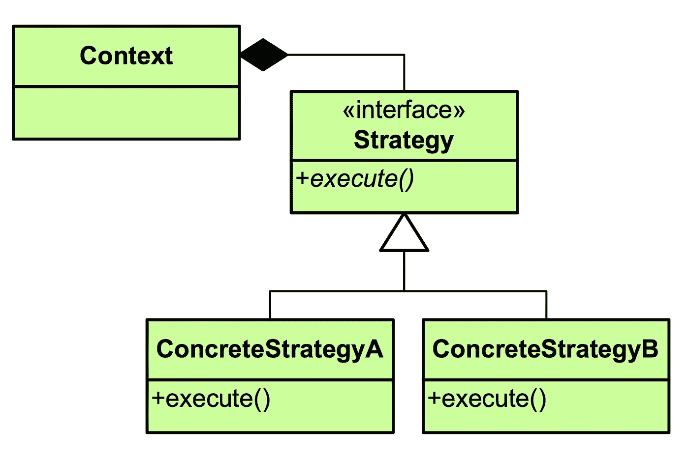

# Java 中策略模式的改进实现

> 原文：<https://itnext.io/how-java-8-killed-the-strategy-pattern-8f226a4ec3c0?source=collection_archive---------2----------------------->

## Java 8 如何杀死策略模式

图片来自[麦当劳. info](http://www.mcdonaldland.info/2007/11/28/40/)

通过在 Java 8 中引入`[lambda expression](https://docs.oracle.com/javase/tutorial/java/javaOO/lambdaexpressions.html)`, Java 世界发生了很多变化，现在 Java 开发人员可以编写更简洁的代码，也可以更容易地使用函数模式。

我读过 Alvin Alexander 写的一篇关于"[Scala 如何杀死策略模式](http://alvinalexander.com/scala/how-scala-killed-oop-strategy-design-pattern)"的好文章，这篇文章比较了 Wikipedia 的一个旧的 Java 策略模式实现与更简洁的 Scala 实现，但是那个实现使用了旧的 Java 语法(以前的 Java 8)并且非常冗长:

策略模式(Java 8 之前的版本)

以及策略模式的 Scala 实现:

策略模式(标量)

这不是一个公平的比较，因为在 Java 8 中引入了`[lambda experession](https://docs.oracle.com/javase/tutorial/java/javaOO/lambdaexpressions.html)`之后，我们可以像这样在 Java 中重新实现策略模式:

策略模式(Java 8)

或者甚至通过使用像 [Vavr](https://www.vavr.io/) 这样的库，我们不需要定义`Function3`功能接口，使用 [Vavr](https://www.vavr.io/) 提供的接口。