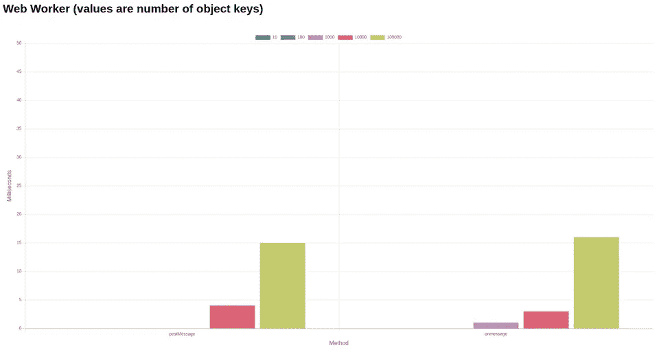

# JS 如何变成多线程？

> 原文：<https://itnext.io/how-js-becomes-multi-threaded-d54000d2daa0?source=collection_archive---------0----------------------->


图片来自 playembbeded.com

## 我们如何在我们的服务器或用户的浏览器上执行高成本的操作？JavaScript 中的多线程技术来拯救我们了！

> 这是高级职员，你并不真的需要它来成为伟大的开发者，所以如果你一开始没有得到所有的东西也不要担心。阅读这篇文章会让你比 90%的 JS 开发者更清楚

多年来，JavaScript 一直被认为是缓慢的，并且主要被用作显示网页内容的“助手”。这种情况在 2010 年左右发生了变化，类似 AngularJS 或 BackboneJS 这样的框架开始出现。开发者和公司开始意识到你可以在用户的电脑上执行复杂的操作。但是随着前端代码越来越多，一些页面开始变慢。

主要原因是 JS 是单线程的。我们甚至有循环，但这对长时间执行的函数没有帮助。你仍然可以用一些计算阻塞用户的线程。主要目标是达到 60FPS(每秒帧数)。这意味着在下一帧之前，你只有 16 毫秒的时间来执行你的代码。

这个问题的解决方案是使用 [Web Workers](https://developer.mozilla.org/en-US/docs/Web/API/Web_Workers_API) ，在这里你可以执行长时间运行的任务，而不会影响执行的主线程。工人只有一个主要问题，发送数据…

# 我们如何与员工交换数据？

对于那些刚刚接触 worker 的人来说，主线程和 worker 之间的通信通常是这样的:

```
// main.js
const myWorker = new Worker('worker.js');myWorker.onmessage = function(e) {
  doSthWithResult(e.data);
};myWorker.postMessage({
  attr1: 'data1',
  attr2: 'data2',
});// worker.js
onmessage = function(e) {
  // Message received from main thread in e.data
  postMessage(getResultOfComplexOperation(e.data));
};
```

如您所见，有许多数据是双向发送的。在这个例子中，我们发送一个简单的对象，它不会导致任何性能问题。但是如果你试图通过一个有几千个键的物体，它会变慢。为什么？因为每次我们向 Worker 发送东西时，都要调用[结构化克隆算法](http://w3c.github.io/html/infrastructure.html#safe-passing-of-structured-data)来克隆那个对象。对于那些不想阅读整个 spec :P 的人来说，它只是遍历一个给定的对象并创建它的克隆。

在这一点上，你可能会注意到我们会遇到什么样的问题。当经常发送大的数据结构或小的数据结构时，我们等待响应的时间可能会超过 16ms。下面是在我的电脑上完成的一个简单的基准测试:



感谢[詹姆斯·米尔纳](https://github.com/JamesMilnerUK)为网络工作者创造[基准，如果你愿意，你可以在你的浏览器上试试看结果。](https://github.com/JamesMilnerUK/webworker-perf)

几年前(2016 年)有一个总是解析对象`JSON.stringify(objectToSend)`的想法。原因是发送字符串比发送对象快得多。现在情况已经不同了(如前所述)。

这些结果仅针对一条消息，请记住，在大多数情况下，您希望在一个帧中发送多条消息。即使 100k keys 对象的大小可能看起来很大，但如果你花时间张贴 1k keys 对象(在我的机器上为 0.725ms * 2)并张贴 10 次，你将获得 14.5ms。

# 我们该如何改进我们的流程呢？

人们可能会说 JS 是多线程的(因为它有工作线程),但我认为真正的多线程需要的不仅仅是在不同的线程上执行部分代码的能力。那就是共享记忆。如果我每次都必须复制和粘贴我的整个数据结构，我想做一些改变。它挫败了在不同的工人身上运行它的整个想法。但是像往常一样，有一个解决方案，叫做 [SharedArrayBuffer](https://developer.mozilla.org/en-US/docs/Web/JavaScript/Reference/Global_Objects/SharedArrayBuffer) 。

截至目前，Chrome、Firefox 和 Node (=>8.10.x)都支持该功能。你可能会问，为什么只有这些浏览器？原因是，2018 年 1 月有一个名为[幽灵](https://meltdownattack.com/)的漏洞，它基本上迫使所有主要浏览器从引擎中删除该功能。Chrome 在 V67 中重新引入了它，但一些浏览器只是推迟了实现(Edge，Safari)。

好吧，但是`SharedArrayBuffer`到底是什么？如果你愿意，你可以检查一下[规范](http://www.ecma-international.org/ecma-262/#sec-sharedarraybuffer-objects)，但是从那里得到解释是很费时间的。MDN 用更简单的方式解释它:

> *SharedArrayBuffer 对象用于表示通用的、固定长度的原始二进制数据缓冲区*

这将如何帮助我解决数据问题？我们可以在两端更新相同的共享内存，而不是从主线程发送和复制数据。首先，您需要找出缓冲区和实际数组之间的区别:

```
// main.js// Create Buffer for 32 16-bit integers
const myBuffer = new SharedArrayBuffer(Int16Array.BYTES_PER_ELEMENT * 32);// create array available in main thread using our buffer
const mainThreadArray = new Int16Array(myBuffer);// post our buffer to Worker
myWorker.postMessage(myBuffer);
```

当 worker 在其线程上接收到缓冲区时，我们可以使用相同的缓冲区创建另一个数组

```
// worker.js
const workerArray = new Int16Array(e.data);
```

现在我们在两个线程中都引用了同一个内存，剩下唯一要做的就是更新这些值。

# [原子学](http://www.ecma-international.org/ecma-262/#sec-atomics-object)为胜！

当在多个线程之间共享内存时，我们可能会遇到[竞争条件](https://en.wikipedia.org/wiki/Race_condition)问题。简而言之，竞争条件是多个线程试图同时更改相同的数据。这就像如果你家里有多个电灯开关。如果两个人想做同样的动作(关灯)，那个动作的结果不会像他们预期的那样(灯保持开着)。我知道这个解释不能完全解释什么是竞争条件，但是现在不是做这个的时间和地点。

> *Atomics 对象提供了在共享内存阵列单元上不可分割地(原子地)操作的函数，以及让代理等待和分派原始事件的函数。当与规程一起使用时，原子函数允许通过共享内存进行通信的多代理程序以一种很好理解的顺序执行，即使是在并行 CPU 上。*

这是当前 JS 规范(ECMA-262，第 10 版，2019 年 6 月)的定义。换句话说，原子允许您对共享数据进行可预测的操作。好了，让我们写一些代码:

```
// main.js
const worker = new Worker('worker.js');// Create Buffer for 32 16-bit integers
const myBuffer = new SharedArrayBuffer(Int16Array.BYTES_PER_ELEMENT * 32);// create array available in main thread using our buffer
const mainThreadArray = new Int16Array(myBuffer);
for (let i = 0; i < mainThreadArray.length; i += 1) {
  Atomics.store(mainThreadArray, i, i + 5);
}worker.postMessage(myBuffer);// worker.js
self.onmessage = event => {
  const workerThreadArray = new Int16Array(event.data);
  for (let i = 0; i < workerThreadArray.length; i += 1) {
    const currentVal = Atomics.load(workerThreadArray, i);
    console.log(`Index ${i} has value: ${currentVal}`);
  }
};
```

该代码的结果只是 32 个控制台日志(`workerThreadArray.length`是 32)和来自我们缓冲区的值。

你可以在 [codesandbox](https://codesandbox.io/s/competent-gould-r2mzv?fontsize=14&module=%2Fsrc%2Findex.js&view=editor) 上自己检查一下(记得打开开发工具而不是内置控制台，因为他们的控制台不记录工作线程)。

如果简单的读/写还不够，那么你可以做更多的事情:

## [交换](https://developer.mozilla.org/en-US/docs/Web/JavaScript/Reference/Global_Objects/Atomics/exchange)

存储新值时接收以前的值。

```
// worker.js
self.onmessage = event => {
  const workerThreadArray = new Int16Array(event.data);
  for (let i = 0; i < workerThreadArray.length; i += 1) {
    const previousValue = Atomics.exchange(workerThreadArray, i, 0);
    console.log(`Index ${i} had value: ${previousValue}`);
  }
};
```

## [比较交换](https://developer.mozilla.org/en-US/docs/Web/JavaScript/Reference/Global_Objects/Atomics/compareExchange)

像`exchange`一样工作，但是只有在匹配时才替换值

```
// worker.js
self.onmessage = event => {
  const workerThreadArray = new Int16Array(event.data);
  // Remember that value at position 0 is 5 (i + 5)
  const previousValue1 = Atomics.compareExchange(workerThreadArray, 0, 5, 2);
  console.log(`Index 0 has value: ${Atomics.load(workerThreadArray, 0)}`);
  console.log(`Value received: ${previousValue1}`);
  const previousValue2 = Atomics.compareExchange(workerThreadArray, 0, 5, 1);
  console.log(`Index 0 has value: ${Atomics.load(workerThreadArray, 0)}`);
  console.log(`Value received: ${previousValue2}`);
};
```

它将打印:

```
Index 0 has value: 2 
Value received: 5 
Index 0 has value: 2 
Value received: 2
```

因为默认值是`5`，所以第一次运行匹配值(第二个参数)并用`2`(第三个参数)替换它。所以函数返回前一个值(就像在`exchange`中一样)。下一次运行失败，因为现有值不是`5`，所以函数返回一个现有值，而不是用`1`替换它。

以下是 Atomics 上所有可用操作的列表(截至 2019 年 7 月):

*   [增加](https://developer.mozilla.org/en-US/docs/Web/JavaScript/Reference/Global_Objects/Atomics/add)
*   [子](https://developer.mozilla.org/en-US/docs/Web/JavaScript/Reference/Global_Objects/Atomics/sub)
*   [和](https://developer.mozilla.org/en-US/docs/Web/JavaScript/Reference/Global_Objects/Atomics/and)
*   [或](https://developer.mozilla.org/en-US/docs/Web/JavaScript/Reference/Global_Objects/Atomics/or)
*   [异或](https://developer.mozilla.org/en-US/docs/Web/JavaScript/Reference/Global_Objects/Atomics/xor)
*   [交换](https://developer.mozilla.org/en-US/docs/Web/JavaScript/Reference/Global_Objects/Atomics/exchange)
*   [比较交换](https://developer.mozilla.org/en-US/docs/Web/JavaScript/Reference/Global_Objects/Atomics/compareExchange)
*   [负载](https://developer.mozilla.org/en-US/docs/Web/JavaScript/Reference/Global_Objects/Atomics/load)
*   [商店](https://developer.mozilla.org/en-US/docs/Web/JavaScript/Reference/Global_Objects/Atomics/store)

# 可观的？

原子不仅限于读/写操作。有时多线程操作需要您观察和响应变化。这就是为什么引入了像`wait`和`notify`这样的函数。

## 等待(仅适用于 Int32Array)

如果你熟悉`await`，那么你可以把它当作“有条件的”`await`。

```
// worker.js
const result = Atomics.wait(workerThreadArray, 0, 5);
console.log(result);
```

这段代码将一直等待，直到有人通知有变化。为此，你必须从另一个线程调用`notify`(当前线程被阻塞)。

```
// main.js
Atomics.notify(mainThreadArray, 0, 1);
```

在这种情况下,`wait`返回`ok`,因为值没有变化。代码将像在`await`情况下一样进行。

返回信息有三种类型`ok`、`not-equal`和`timed-out`。第一个被覆盖，第二个在等待期间值发生变化时返回。当我们将第四个参数传递给`wait`函数时，可以返回第三个参数

```
// worker.js
const result = Atomics.wait(workerThreadArray, 0, 5, 1000);
console.log(result);
```

1000 毫秒后`wait`返回`timed-out`，此时没有其他原因导致其停止。

关于`notify`，我觉得还有一点需要补充。函数调用中的第 3 个参数负责通知几个等待的代理。如果你想通知他们所有人，只需将值设置为`+Infinity`或留空(默认为`+Infinity`)。

原子中还有一个函数叫做 [Atomics.isLockFree(size)](http://www.ecma-international.org/ecma-262/#sec-atomics.islockfree) ，但是我们不打算在这里讨论它。

# 弦乐呢？

目前，还不支持字符串，但是通常使用的解决方案是将字符串解析成数字表示。我知道这不是最好的解决方案，但是在我们得到字符串支持之前，我们必须处理它:(

# 结论

JavaScript 中的多线程现在是真实的。您可以将工作卸载到多个线程中，并在它们之间共享内存。老实说，几年前我真的不确定这是否可能。主要是因为 JS 规范。我认为`SharedArrayBuffers`和多线程的想法是有益的，尤其是对于 NodeJS 服务。我知道对[工作线程](https://nodejs.org/api/worker_threads.html)的支持仍处于试验阶段(Node 12.6.0 ),但只要稍加努力，我们就能创建高效的服务。我认为在不久的将来，我们会在网络上看到越来越多的多线程解决方案。

*最初发布于*[*https://erdem . pl*](https://erdem.pl/2019/07/how-js-becomes-multi-threaded)*。*