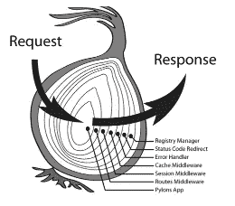

# [阅读 Koa]第一天 Koa 中间件如何工作

> 原文：<https://itnext.io/how-koa-middleware-works-f4386b5573c?source=collection_archive---------2----------------------->


Koa 中的中间件不同于 Express，Koa 使用**洋葱模型。**这个惊人的框架 Koa 只包含四个文件，今天我们只看主文件——`application.js`。它已经包含了中间件如何工作的核心逻辑。



# 准备

```
git clone git@github.com:koajs/koa.git
npm install
```

然后我们在项目的根处添加一个`index.js`用于测试目的

您可以运行以下命令来启动服务器:

```
node index.js
```

访问`http://localhost:3000`，你会看到`1, 2, 3, 4, 5, 6`的输出。这叫做**洋葱模型(中间件)**

# 洋葱模型如何工作

让我们阅读 koa 的核心，看看中间件是如何工作的。在`index.js`中，我们这样使用中间件:

```
const app = new Koa();
app.use(// middleware);
app.use(// middleware);
app.listen(3000);
```

看看`application.js`，这里是那些与中间件相关的代码，我在代码中添加了一些注释。

# 关于合成功能

关于`compose`函数的更多信息，我们可以看看`koa-compose`包

所有的中间件都被传递给`compose`函数，它返回 dispatch(0)，它立即执行 dispatch 函数并返回一个承诺。在我们理解`dispatch`函数的内容之前，我们必须理解 promise 的语法。

# 关于承诺

通常我们这样使用承诺:

```
const promise = new Promise(function(resolve, reject) {
  if (success){
    resolve(value);
  } else {
    reject(error);
  }
});
```

在 Koa 中，它是这样使用的:

```
let testPromise = new Promise((resolve, reject) => {
  setTimeout(() => {
    resolve('test success');
  }, 1000);
});Promise.resolve(testPromise).then(function (value) {
  console.log(value); // "test success"
});
```

因此，我们知道在 compose 函数中，它返回一个**承诺**。

# 回到 Koa —组合中间件

`dispatch`是一个递归函数，会循环所有中间件。在我们的`index.js`中，我们有 3 个中间件，所有 3 个中间件将在`await next();`之前执行那些编码

```
app.use(async (ctx, next) => {
  console.log(2);
  const start = Date.now();
  await next(); // <- stop here and wait for the next middleware complete
  console.log(5);
  const ms = Date.now() - start;
  ctx.set('X-Response-Time', `${ms}ms`);
});
```

我们可以看看`index.js`中那三个中间件的执行顺序:

*   执行`dispatch(0)`时，执行`Promise.resolve(fn(context, dispatch.bind(null, 0 + 1)))`
*   第一个中间件内容将运行到`await next()`
*   `next()` = `dispatch.bind(null, 0 + 1)`，第二个中间件是哪个
*   第二个中间件将运行到`await next()`
*   `next()` = `dispatch.bind(null, 1 + 1)`，这是第三个中间件
*   第三个中间件将运行到`await next()`
*   `next()` = `dispatch.bind(null, 2 + 1)`，没有第四个中间件，它会被`if (!fn) return Promise.resolve()`立即返回，第三个中间件中的`await next()`被解析，执行第三个中间件中剩余的代码。
*   第二中间件中的`await next()`被解析，第二中间件中的剩余代码被执行。
*   第一中间件中的 he `await next()`被解析，执行第一中间件中的剩余代码。

# 为什么是洋葱模型？

如果我们在中间件中有 async/ await，编码会更简单。当我们想要为 api 请求编写一个时间记录器时，通过添加这个中间件可以变得非常容易:

```
app.use(async (ctx, next) => {
  const start = Date.now();
  await next(); // your API logic
  const ms = Date.now() - start;
  console.log('API response time:' + ms);
});
```

# 下一篇文章:阅读 Koa 中的所有代码

[](https://medium.com/@alickwong/readingkoa-day-two-read-and-understand-koa-core-a6afd24e012c) [## [阅读 Koa]第二天—阅读并理解 Koa 核心

### 在 15 分钟内从 Koa 读取所有代码

medium.com](https://medium.com/@alickwong/readingkoa-day-two-read-and-understand-koa-core-a6afd24e012c) 

# 参考

*   [鸡蛋/鸡蛋](https://github.com/eggjs/egg/blob/master/docs/source/en/intro/egg-and-koa.md)