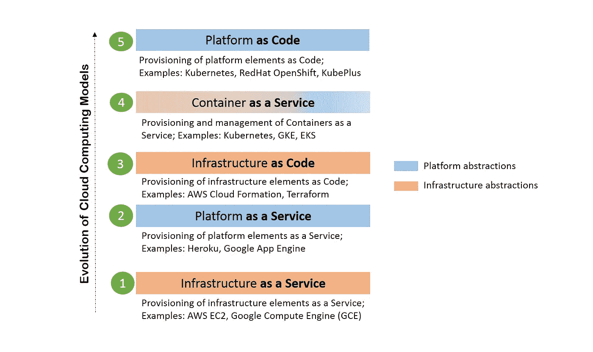

# Kubernetes API 扩展如何实现平台即代码体验

> 原文：<https://itnext.io/how-kubernetes-api-extensions-enable-platform-as-code-experience-cbb72b0970d9?source=collection_archive---------1----------------------->

在我们关于 Kubernetes world 中 PAA se 向平台即代码的演进的文章中，我们讨论了 PAA se 如何通过 Kubernetes 向平台即代码系统演进。

在这个演进框图中，Kubernetes 表现在两个层面:容器即服务(CaaS)和平台即代码(PaC)。Kubernetes 的设计是一个 CaaS 系统。此外，它还可以被视为具有声明性 YAML 定义的平台代码系统。

平台即代码系统是这样一种系统，它允许以声明性格式定义应用程序平台元素，并允许使用该定义可重复地创建应用程序平台。平台元素的例子可以是 MySQL(数据库)、Nginx (web 服务器)等。

还有其他现有的 CaaS 或 PaaS 系统也支持声明性定义。然而，使 Kubernetes 区别于这些系统的是其 API 可以被扩展以创建新的平台元素作为本地 Kubernetes 对象的独特方式。使用 Kubernetes 的自定义资源定义(CRD)和聚合 API 服务器(AA)机制，可以扩展 Kubernetes API 以在 Kubernetes 集群中添加新的平台元素作为本地 Kubernetes 对象。这种可扩展性与 Kubernetes YAML 定义相结合，使得 Kubernetes 可以与 CaaS 系统一起被称为平台即代码系统。

# API 扩展的好处

平台层(PaaS 或 PaC)的系统实现引入了新的抽象概念，以交付所需的平台化。传统上，创建这些抽象只有一种方法——包装底层的 API。如前所述，Kubernetes 引入了一种创建抽象的新方法——通过扩展 API。所以现在有两个选项可以在 Kubernetes 上实现平台抽象，如下所示:

作为 Kubernetes 扩展而不是 Kubernetes API 包装器编写的平台抽象提供了以下优势:

1.平台抽象的最终用户不需要学习任何新的 CLI 来使用它们。

2.为了提供简单性，作为 API 包装器创建的抽象最终隐藏了一些底层 API 功能，因此最终用户可能无法获得所需的控制级别。

3.为基本 Kubernetes 编写的工具(例如 Helm)可以很容易地与作为 API 扩展创建的抽象一起使用，但对于作为 API 包装器创建的抽象，情况可能就不一样了。

4.类似地，审计、RBAC 等高级功能。可以很容易地用于使用 API 扩展创建的平台抽象。对于 API 包装器这样的抽象来说，情况可能不是这样，您必须在代码中为您的抽象层处理这样的高级函数。

# 平台即代码的影响

这种新的平台即代码体验利用了 Kubernetes 的可扩展性，使团队能够在以下方面发挥作用:

*   开发人员和运营人员之间的共同语言

传统上，由于开发人员和运营人员之间缺乏通用的工具，他们之间的交流受到了影响。运营部门使用他们首选的工具来提供平台元素，而开发人员需要学习运营自动化的一部分，以便在其应用程序堆栈中使用这些资源。Kubernetes 上的平台即代码在 CaaS 和 PaC 层用 Kubernetes YAMLs 建立了一种声明性语言，并在 Ops 和开发工具链之间带来了更多的一致性。Ops 使用 kubectl 和 YAML 来扩展基本的 Kubernetes 集群，为所需的平台元素提供操作者/API 扩展。开发人员使用相同的 kubectl 和 YAML 来消费这些添加的定制资源和本地 Kubernetes 资源。

*   构建您自己的 PaaS

团队可以通过使用多个社区平台抽象来组成他们自己的 PaaS，而不是依赖单一的 PaaS 供应商和他们专有的抽象，这些抽象被编写为 Kubernetes API 扩展。

[www.cloudark.io](http://www.cloudark.io)