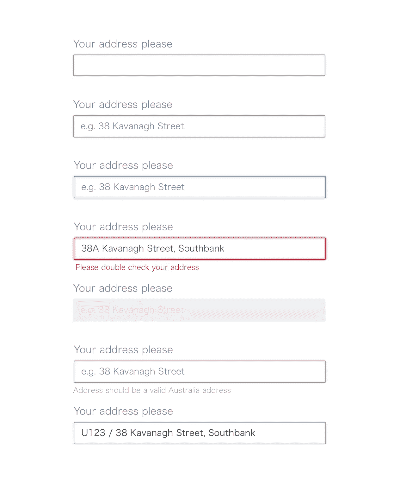
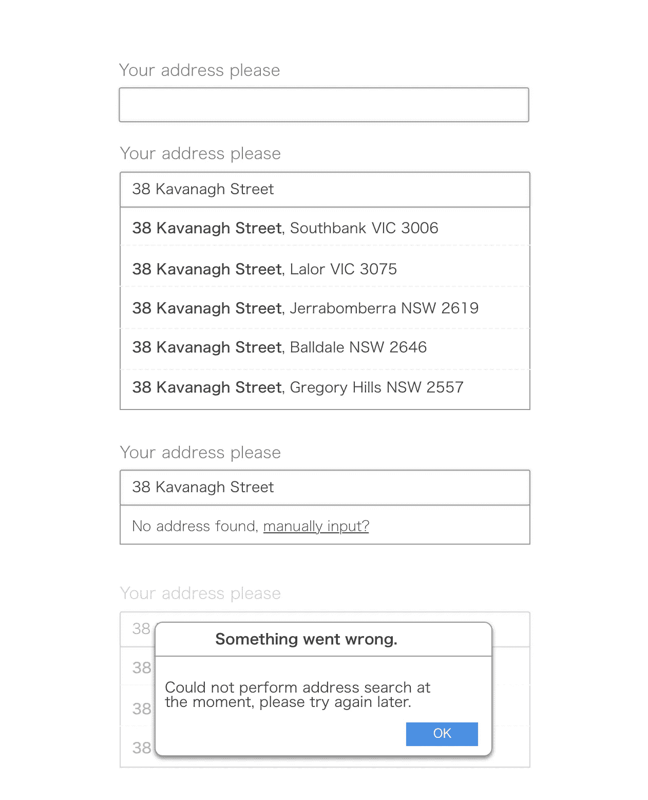
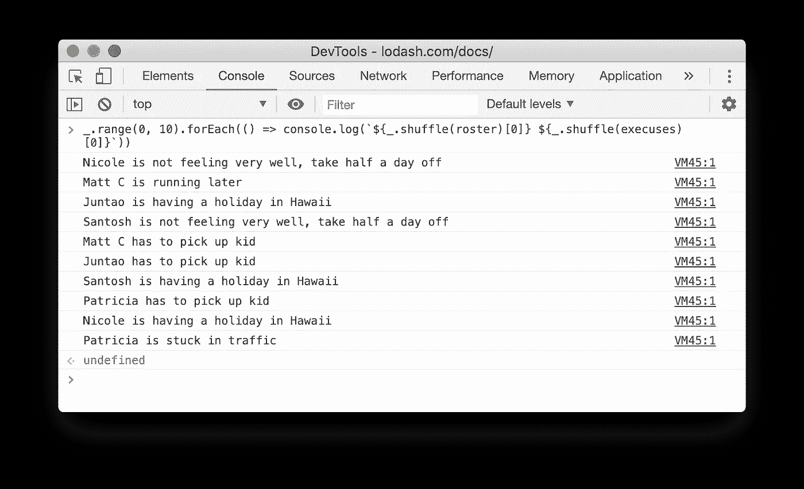
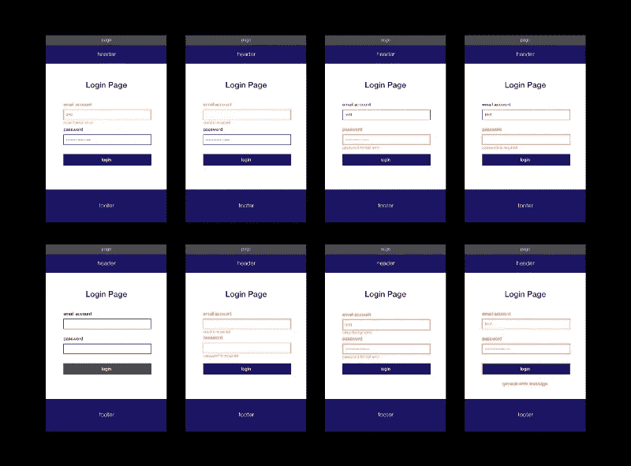

# 添加一个 InputBox 需要多长时间？

> 原文：<https://itnext.io/how-long-does-it-take-for-adding-an-inputbox-486bd4434dfa?source=collection_archive---------8----------------------->

> 当产品负责人告诉你这只是一个小变化时，不要相信他。

# 评估会议

在迭代计划会议之后，当所有的故事都走完了，PO 带着可爱的微笑转向你，假装这只是一次即兴聊天，问你在一个页面上添加一个 InputBox 需要多长时间。

他描述的是一个“简单”的输入框，让用户输入他/她的地址和其他个人信息，并保存到后端。

他甚至在白板上画了一个不规则的盒子来说明这个想法，并试图让你更清楚。他看着你问道:

“您认为这需要多长时间，评估它并将其放入待办事项中是否值得，或者我们是否可以将它与墙上的其他小卡片一起完成？”

你的直觉告诉你缺少了一些重要的东西，但你不太确定具体是什么。

你考虑了一会儿，告诉 PO“理想情况下，可能需要 5 到 6 天，如果我们考虑会议或其他活动，时间会更长……”

“一个星期就为了一个输入框？”，把不规则的盒子敲在白板上，阿宝看起来相当震惊，你甚至可以听到被救的那一半“你疯了吗？”。

“嗯，我是说，理想情况下，通常在实践中会更长……”

“……”

像这样的巨大差距通常意味着人们将苹果比作橙子，要么是产品所有者过度简化了问题，要么是开发者夸大了问题。

# 遗漏的细节

由于知识障碍和过于简单化而没有深入到细节，我们通常会在不知道的情况下低估事情。此外，如果我们忽略外部环境中的阻力，我们可能很容易在评估方面犯错误。

# 一个简单的输入框

从 PO 的角度来看，一个简单的 InputBox 可能是这样的:


用户可以输入一些文本并保存到后端。当然，需要一些验证规则，比如文本不能太长或太短。

# 一个不那么简单的输入框

然而，从一个有经验的开发人员的角度来看，这是一个完全不同的故事。一个**简单的** InputBox 的意思是这样的:



显然，它有更多的状态，因此更复杂，一些状态可能包括:

*   有缺陷的
*   空的
*   聚焦的
*   无效的
*   使用帮助文本
*   易接近

一般来说，在初始状态，InputBox 显示一个占位符，当用户开始输入时，需要大量的实时反馈:拼写检查、长度检查、格式等等。此外，页面的其他部分也可能对当前的 InputBox 产生影响。例如，未经授权的用户不能输入任何东西，所以我们必须禁用它。

不同的状态意味着不同的用户界面风格，比如字体大小、字体系列、颜色、边距和填充等等。那些琐碎的细节会花费很多来回的时间，这是我们大多数人在评估阶段容易忽略的。

另一项耗时的工作是验证(并定义规则，同样，很少看到规则可以通过一轮就被明确识别)。

# 确认

验证作为一个`cross-cutting`需求，在项目中总是被低估。除了基本的验证规则，如长度、电子邮件地址，通常会有一些复杂的规则，可能会破坏现有的实现逻辑。

例如，当开发人员为`validation`想出一个解决方案时，比如:

```
const validations = {
    minLength: 1,
    maxLength: 16,
}<AddressSearch validations={validations} value={value} />
```

经过几轮调试和重构后，它的工作方式如下:

```
const builtIns = {
    minLength: (value, criteria) => value && value.length > criteria,
    maxLength: (value, criteria) => value && value.length < criteria
}const isValid = (validations) => (value) => {
    return _.every(validations, (k, v) => builtIns[k](value, v))
}const AddressSearch = ({validations, value}) => (<Input error={isValid(validations)(value)} ... />);
```

突然，下一个需求是将`AddressSearch`的验证连接到另一个 InputBox:当国家`Dropdown`的值改变时，`AddressSearch`的规则也相应地改变。

像这样的更改会在很多地方破坏一些逻辑，开发人员可能需要更多的时间来分别在应用程序和测试中应用这些更改。上面代码片段中类似`builtIns`的代码必须重写。

# 限制

除了验证之外，对于某些字段，我们希望阻止用户输入某些字符(比如只有字母，没有空格，等等。).有时候我称之为`restrictions`，也可以看作是验证的延伸。

限制的一些例子可以是，作为一个输入框:

*   不允许使用特殊字符
*   只有数字
*   只允许字母
*   1–12 个月或 1–31 天
*   数字和点
*   有时这些规则是正交的，但有时它们可能会相互干扰。

例如，您想通过使用 InputBox 收集电话号码，如下所示:

```
<input type="number" />
```

然而，当用户必须为状态代码或其他代码提供前缀`0`(或者可能是`+60`)时，就会有一个缺陷。而且浏览器**足够智能**为你去掉前导`0`。

你可以这样做来修复它。

```
<input type="tel" pattern="[0-9]*">
```

但是新的问题可能会在以后出现。总之，每个潜在的问题及其相应的解决方案都有自己的问题，我们通常很难预见这些努力。

即使对于有经验的开发人员来说也很困难，对于在团队中扮演其他角色的人来说，情况可能更糟。

# 还有一个变量

现在我相信 PO 对一个简单的`InputBox`需要多少努力有了更好的理解。那只是冰山的一小部分。

假设我们需要进一步增强 InputBox:当用户输入地址时，我们需要搜索代码片段并自动完成完整的地址匹配。



每当网络被引入一个系统，事情就变得更加复杂，更糟糕的是这种影响不是线性的。一方面，异步系统调用本身比您消费本地数据更不可靠和复杂。另一方面，有太多的变数超出了你的控制:网络速度，网络故障(路由，防火墙等)。).

此外，一旦前端和后端分离，您需要制定两端之间的协议。您如何确保两端始终同步？

常见的情况是，用户界面需要某些东西，但最终发现字段在后端不可用，或者后端将日期保存为`long`，但前端需要`timezone`作为元数据等等。

同样的规则也适用于验证。UI 表单、后端模型和持久层中都需要逻辑。当您使用同构架构时，您可能会对后端和前端使用相同的代码，这可以减轻痛苦。但是对于在 UI 和后端使用不同语言的情况来说是很难的——你必须在两种语言中使用相同的逻辑。问题是，你如何确保这些变化同步发生？

当然，我相信从技术的角度来看，我们最终可以找到一些解决方案和一些权衡这些问题。但是你应该记住，这些事情不会自动或免费发生，它们需要付出一些代价。

即使对于有经验的开发人员和愿意不断学习的成员来说，在大多数情况下仍然如此。毕竟，很多问题是无法预见的，当然你也无法解决任何你还不知道的事情。

# 幸福之路的陷阱

在大多数情况下，人们倾向于以逻辑的方式思考问题，快乐的路径，也包括评估。但在发展阶段，所谓的幸福道路实际上是罕见的，它们是不正常的。现实世界中的许多因素会以意想不到的方式破坏我们的应用程序。

网络超时、服务停机、例行后端服务升级、不兼容的浏览器、不匹配的操作系统、不同的硬件等等。所有这些都可能导致应用程序级别的失败。

既然失败是不可避免的，那么作为开发者，我们唯一的选择就是设计一些保护机制。首先，我们需要某种东西来从失败中恢复应用程序(而不是一个空白页面)。其次，我们需要记录一些错误信息，以便我们调试或帮助我们做进一步的调查。

# 跨职能要求

除了功能性，还有其他因素需要考虑。比如可访问性和可用性(比如页面上的措辞使体验更流畅)，以及兼容性。

一些常见的跨职能要求是:

*   跨浏览器支持
*   多种设备支持
*   *快乐

人们一直忽视的另一件事是，对于响应式设计，开发/ BA 必须与 UX 密切合作，以确保设计在不同的屏幕上都能很好地工作。在大多数情况下，用户在平板电脑上的交互方式与在桌面上完全不同，字体大小和动画也是如此。

我在许多项目中看到，让页面适应更小屏幕的设想只是将字体调整得更大一点。不幸的是，在大多数情况下都不是这样。

# 超越技术细节

除了从技术角度来看不可预测的延迟和障碍之外，还有一些其他更耗时的因素。它们无处不在，对每一个来说都是微不足道的，但是累积起来，这种努力是有意义的。

# 混乱是正常的

假设一个项目中有几个开发人员，让我们将他们的名字放入一个数组中:

```
const roster = [
    'Matt C',
    'Santosh',
    'Patricia',
    'Nicole',
    'Juntao'
]
```

一般来说，每个人都必须在日常生活中处理一些事情，比如假期，病假，交通延误，或者在去喝咖啡的路上迷路。

```
const execuses = [
    'is stuck in traffic',
    'is running later',
    'has to pick up kid',
    'is not feeling very well, take half a day off',
    'is having a holiday in Hawaii'
]
```

而*的生活*就跟下面的代码一模一样:

```
`${_.shuffle(roster)[0]} ${_.shuffle(execuses)[0]}`
```

这就是为什么在现实世界中，你会经常看到这样的事情发生:



也许这不太可能每天都发生，但从相对长期来看，你几乎可以肯定会看到它发生。如果一个项目中有足够多的参与方，当团队变大时，不确定性的可能性也会增加。在某些时候，*一切都不正常*是正常的，毕竟，这就是我们生活的世界。

所有这些不确定性都可能导致我们的估计失败，而且我们肯定无法在一开始就看到它们。因此我们低估了。

# 一个小故事

几年前，在一次评估会议上，我对一个资源的 API 给出了三天的评估，我们客户的技术主管看起来对此很不满意。他告诉我他可以在半天内完成——毕竟这只是一个`CURD`。

我帮他列出了一些任务，他沉思了几分钟，同意了我的估计:

*   数据库迁移
*   实体定义
*   实体之间的关系
*   服务/控制器
*   异常处理
*   单元测试
*   我们系统到下游之间的约定
*   集成测试

就我所能回忆起来的，这至少花了三天时间，实际上仅仅找到我们能从中获取信息的合适的人就花了整整一天。

# 我们该如何处理

我想在实际工作之前，你已经对我们如何低估有了一些想法。要解决这个问题，基本原则当然是与我们通常做法相反。在实践中，一个可行的解决方案是将工作分解成没有太多不确定性的小块，并且**发现更多我们在更高层次看不到的细节**。

例如 InputBox 的不同状态、状态之间的转换、每个状态的样式等等，都可以通过精化来解决。在细化过程中，细节开始自己出现。此外，当您必须处理数据获取时，`loading`、`loading failure`、`no data available`都出现了，然后可以驱动更多未知的细节，这可能会使估计更准确。

状态机可以被用作枚举一个组件或一组组件的所有可能状态的一种方式，它可以潜在地揭示状态的所有组合和所有变化。



来源:[https://www . freecodecamp . org/news/designing-ui-States-and-communicate-with-developers-effectively-by-FSM-FB 420 ca 53215/](how-long-to-make-a-input-box/status . png](https://www.freecodecamp.org/news/designing-ui-states-and-communicate-with-developers-effectively-by-fsm-fb420ca53215/](how-long-to-make-a-input-box/status.png)

此外，在你心里，你必须承认这个世界是复杂的。在一个大型组织中，所有的事情都以一种超级复杂的方式混合在一起，所有这些因素都可以相互影响，从表面上看，事情看起来相当不可预测。与其抗拒它，我们必须主动拥抱变化。另一方面，它驱使我们采用更简单的设计，使用可靠的基础设施，利用高质量的构建方法，等等来处理整体的复杂性。

# 摘要

在这一点上，我想你已经知道在交付 InputBox 时发生了什么，是的，尽管在估计中有一些`buffer`，它仍然花了一个多星期才完成。

由于知识障碍和偏见，我们倾向于忽略实际上会对工作产生很大影响的细节。此外，我们处于一个超级复杂的世界，在许多方面都充满了不确定性，不同的因素相互关联，我们很容易失去客观的观点来评估。如果你忽略了不确定性，你就大大低估了实际的努力。

降低复杂性的一个方法是细化，从而提高可靠性。你分解的越多，估计的就越准确(当然分解本身也是努力)。另一方面，我们需要拥抱混乱，以一种易于更改和简单明了的方式构建软件，使其更加灵活和可调整。

我计划在三天内写完这篇文章，仅仅画模型就花了我两个晚上。起草和拼写检查又花了我两个小时，还有一次是为了润色语言。