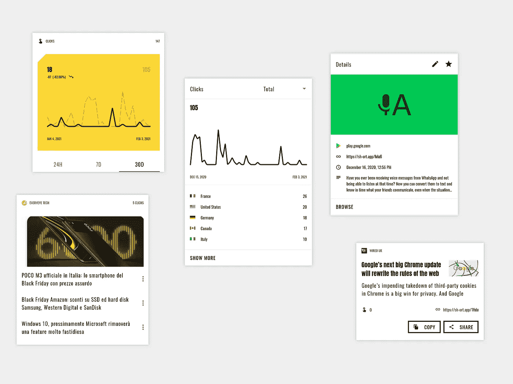
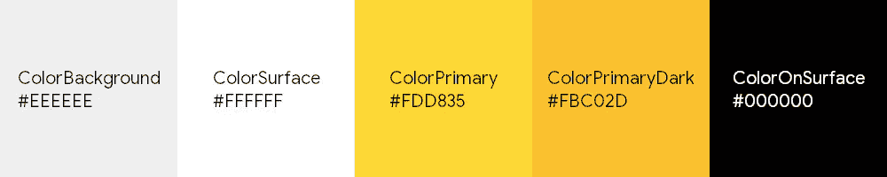
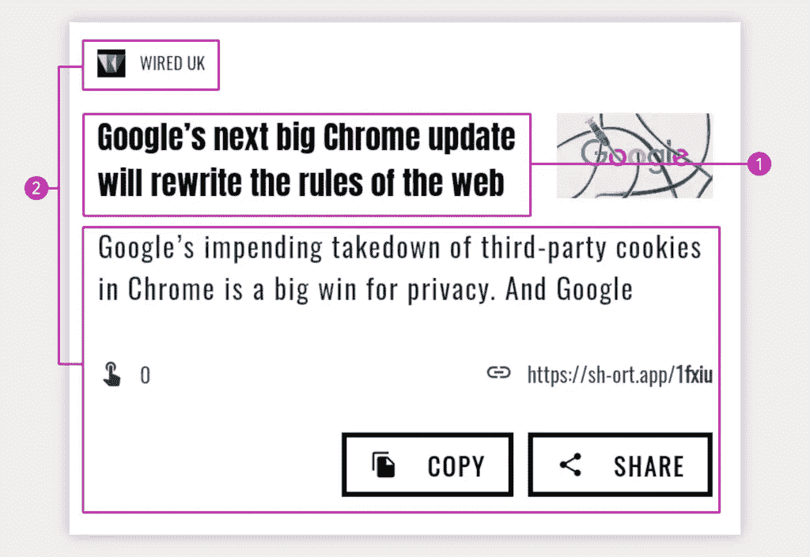
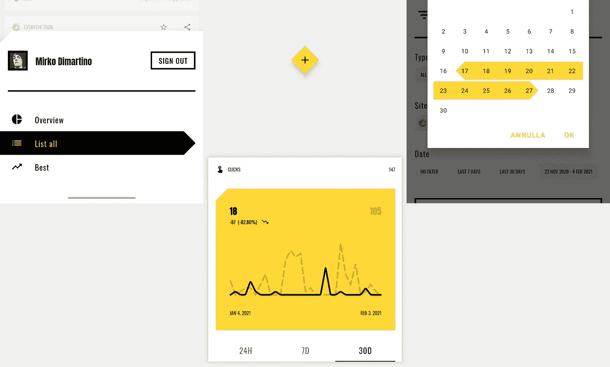

# 材料设计如何帮助你的应用品牌化

> 原文：<https://itnext.io/how-material-design-helps-you-brand-your-app-b7cb191524f7?source=collection_archive---------5----------------------->

## 1.图标

建立品牌的第一步是选择**图标**，因为这是用户首先会看到并喜欢上的东西，也是他们在 Google Play 的数千个应用中选择你的应用的主要原因。

对于我的例子，一个网址缩写，我画了一个断开的链链接，同时试图输入我想到的应用程序名称的首字母(字母“S”，首字母“Sh-ort”)。

我拿起纸和笔，开始了我的绘画，直到我得到了一个满意的结果，简单的**，**可识别的**，和一个前所未见的特征形状**。****

********

## ****2.品牌****

****现在，我们已经设计了图标，我们也有一个什么样的应用程序看起来清晰的想法。
在这里，材料设计用它的宏观规则来拯救世界:**颜色、字体、形状。******

****很容易预测主配色方案将是“黑黄色”，主字体将是粗体，形状将是切割形状。****

## ****3.颜色****

****如前所述，主要的组合是“黑-黄”，但我只选择黄色作为主要颜色，让黑色作为表面的主要颜色。
材料设计中的“表面”是指卡片，即构成应用程序的材料，或背景中的其他高级组件，例如动作栏、对话框、底层、按钮等。
对于这种类型的元素，我选择了一种中性色，这种颜色可以衬托出我选择的“表面颜色”,因此是纯白色。
作为背景色，我选择了比表面略暗的颜色，让它依次凸显出来。****

****结果是以下色标:****

********

****我没有使用“ColorSecondary”(或 accent)，但你可能想这样做，这取决于你想要构建的应用程序。****

## ****4.排印****

****[Sh-ort](https://play.google.com/store/apps/details?id=it.mirko.sh_ort) 使用两种字体: [**安东**](https://fonts.google.com/specimen/Anton?query=anton&preview.text_type=custom) 和 [**奥斯瓦尔德**](https://fonts.google.com/specimen/Oswald?query=anton&preview.text_type=custom) 。****

********

****1.安东— 2。奥斯瓦德****

****这两种字体都赋予了这款应用强大的特征和可读性，几乎让人联想到一本杂志。鉴于 Anton 的厚度，将其用于标题，而 Oswald 在中小型文本中表现非常出色。****

## ****5.形状****

********

****Sh-ort 使用不同的切割形状****

****sh-hort 对小型、中型和大型组件使用不同的切割形状；这使得应用程序与图标保持一致，并与所使用的字体保持和谐。****

## ****6.移动****

****动画经常被低估，在 android 应用程序中很少使用，如果不是正常的系统应用程序，但它们可以提供额外的推动力，陪伴用户与你的产品进行交互，或者让等待不那么无聊。****

****我想给你们看一些例子:****

*   ******启动屏幕******

****大多数应用程序都没有很好地实现启动屏幕，但看看 motion 是如何很好地集成到打开流程中，将自己转变为浮动的动作按钮。****

****启动屏幕变形为浮动动作按钮****

*   ******浮动动作按钮移动和变形******

****在这种情况下，fab 移动以给过滤器选项腾出空间，或者扩展以使文本字段在新动作中伴随用户出现。****

****浮动操作按钮移动以给过滤器选项留出空间****

****浮动操作按钮变形为文本字段****

*   ******条目编辑和删除******

****在这个例子中，我们可以看到当用户想要检查条目的细节并修改它时，如何使一个新的活动保持一致。
还可以看到一个条目在被拖动删除时的行为，给出是否可以删除的视觉反馈。****

****活动过渡和编辑动画****

****拖动时的不同行为告诉用户项目是否可删除****

## ****结论****

****这是一篇短文，讲述材料设计的真正含义，以及它如何帮助我们打造应用品牌。
如果你有兴趣了解更多你可以 [**下载 app**](https://sh-ort.app/gkd9g) 或者留下**拍拍**详细看看我是怎么实现上面看到的所有东西的。****

****与朋友或同事分享😎👍****