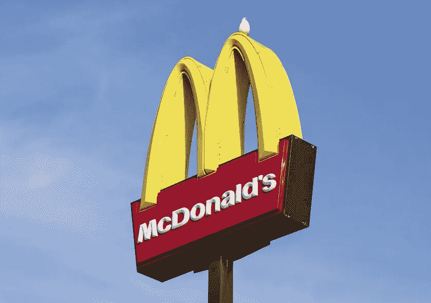

# 微软的低代码战略如何类似于麦当劳的商业战略

> 原文：<https://itnext.io/how-microsofts-low-code-strategy-is-similar-to-mcdonald-s-business-strategy-a2b827a9219b?source=collection_archive---------1----------------------->

## 微软的业务是销售服务器和许可证，而不是软件开发

凯尔温斯图塔德

> “大多数天才——尤其是那些领导他人的天才——不是通过解构错综复杂的事物而成功的，而是通过利用未被认可的简单性而成功的。”—安迪·伯努瓦

如果你想知道为什么微软创建了 Power 平台并进入了低代码开发领域，你需要了解微软从事的是什么业务。

微软从事服务器和许可证业务，Power platform 将帮助它销售更多产品，Power Platform 将吸引一批新客户。

低代码开发是一个不断增长的领域[为什么低代码软件开发正在蚕食世界](https://blog.devgenius.io/why-low-code-software-development-is-eating-the-world-ca5d9644a821)并且对微软来说是完美的，以增加其客户基础。[为什么低代码软件开发会成功](https://blog.devgenius.io/low-code-development-is-big-today-bigger-tomorrow-de8554e23f97)如果你想了解低代码的好处以及为什么它会在未来 5 年内快速增长。

# 麦当劳——他们从事什么行业？

我正在看电影《创始人 T8》，这是关于雷·克洛克(迈克尔·基顿饰演)和麦当劳如何成为世界上最大的餐饮企业之一的故事。当我们想到麦当劳时，我们会想到汉堡，但你应该想到房地产。

雷·克洛克是一名销售奶昔制作机的销售人员。一天，他从圣贝纳迪诺的一家餐馆得到一份订单，订购了许多 8 轴奶昔制造机，而大多数餐馆都需要 1 台。

雷开车去了圣贝纳迪诺，看到了麦当劳兄弟创建的餐厅，对麦当劳的速度和质量印象深刻(在快餐发明之前)。

1956 年，雷与麦当劳兄弟合作经营麦当劳，并开始在美国开设麦当劳。

雷很快就遇到了现金流问题，因为从每家餐厅的销售额中获得一小部分并没有给雷扩张的资金。他遇到了哈里·J·索恩伯恩，他很好地总结了这种情况(来自电影《创始人》)

> “所以，总而言之，”Sonneborn 说，“你的收入来源很少，没有现金储备，而且合同负担很重，要求你通过一个缓慢的批准过程来做出改变，如果他们被批准的话。他们从来都不是。我错过了什么吗？”

他接着说

> 你不是做汉堡生意的。你在做房地产生意——哈里·j·索内伯恩

哈里·索恩伯恩帮助雷·克洛克意识到麦当劳不是在做汉堡生意，而是在做土地生意。这种洞察力使麦当劳走上了今天成为全球企业的道路。Sonneborn 在麦当劳做了 10 年的首席执行官

> “严格来说，我们并不从事食品行业。我们从事房地产生意。我们出售 15 美分汉堡的唯一原因是因为它们是最大的收入来源，我们的租户可以从中支付我们的租金。”
> 
> 请记住，这是一个相互支持的系统:“租户”只有在客户对食物、服务、价格等满意的情况下才能支付租金。麦当劳对每一家特许经营店的健康都有既得利益，因为如果没有销售，特许经营者将无法继续经营。索恩伯恩

64 年前，雷·克洛克做出了一个彻底改变麦当劳的决定。剩下的就是历史了

> “在 20 世纪 50 年代中期，当雷·克洛克和麦当劳兄弟一起做生意时，他意识到真正的钱不在于卖汉堡包，而在于把餐馆出租给其他人来卖汉堡包。迄今为止，麦当劳主要是一家房地产公司，出租近 40，000 处房产(以及其名称和食谱的权利)，其他人在这些房产中从事利润较低的煎牛肉业务。[黄金日](/Prime Day)

几个麦当劳的事实来自[这里](https://www.seriousfacts.com/mcdonalds-facts/)

*   每 14.5 小时就有一家新的麦当劳餐厅开张。
*   麦当劳餐厅每天为 6800 万人提供食物
*   麦当劳在全球拥有超过 36，000 家餐厅
*   麦当劳每秒钟卖出超过 75 个汉堡
*   比尔·盖茨有一张麦当劳金卡，可以无限量免费享用快餐
*   美国大约 7%的土豆被加工成麦当劳薯条

点击阅读麦当劳的历史

# 微软(Power Apps) -他们从事什么行业？

让我们比较一下麦当劳和 Power Platform(微软)

**麦当劳的业务**

*   你有餐馆和汉堡
*   麦当劳买下这块地，租给特许经营者
*   麦当劳餐厅出售汉堡、薯条和奶昔
*   麦当劳从租金和特许经营利润中赚钱

**微软电力平台业务**

*   有服务器/许可证(餐馆)和电力平台(汉堡店)
*   Power Apps 是创建软件的工具(汉堡餐厅)
*   客户从微软(the land)租用服务器和许可证
*   微软从你购买的许可证、环境(服务器)和其他服务中赚钱

微软不从事低代码软件开发业务，他们从事服务器和许可证业务。有巨大增长潜力的是服务器和许可证业务。

微软是一家服务器和许可证公司，它开发了一个软件开发工具来销售服务器和许可证。

他们出售 Power Apps 许可和微软 Office、Azure 以及所有其他许可/服务器/消费。

微软的目标是获得比竞争对手更多的客户[微软将 Power Apps 许可减少 50%](https://blog.devgenius.io/understand-why-microsoft-drops-power-apps-licences-by-50-cddda80b1fa1) 并让更多的用户使用他们的服务器。微软在 Power Platform 上获得的客户越多，竞争对手平台上的客户就越少，微软可以降低利润来赢得客户。

# **为什么微软不交付项目**

软件开发缓慢而昂贵，它的发展受到拥有技术人员来交付项目的限制。微软的云战略没有限制，除了服务器空间。

软件开发是卖汉堡包，开餐馆的一方，并且都是关于人的(开发人员、顾问、项目经理等)。雇佣员工是昂贵的，因为你必须让他们开心，培训他们，给他们职业机会。

交付软件项目大约有一半时间会出错— [当软件开发出错时，领导者会躲在被窝里希望](/when-software-development-goes-wrong-leaders-hide-under-the-covers-and-hope-df5fd887be42)。微软交付了一些项目，但重点是服务器和许可证，因为这更有利可图和可扩展。

企业项目需要几个月甚至几年的时间，这就像雷·克洛克建立特许经营权，然后等待获得他的利润。人数限制了你可以交付的软件项目的数量。

# **大局**

当你专注于细节时，你就错过了大局。看电影《创始人》帮助我理解了微软的业务，它结合了两家最受欢迎的公司，麦当劳和微软。

我喜欢它(贾斯汀·汀布莱克因为这个广告得到了 600 万美元的报酬！可能他是营销业务)。

雷·克洛克创建麦当劳时已经 52 岁了，所以每个人都有成功的时间。

> "我的确是一夜成名，但 30 年是一个漫长的夜晚."雷·克洛克