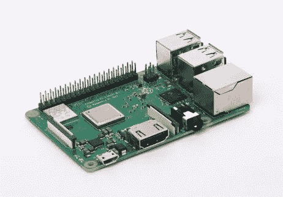
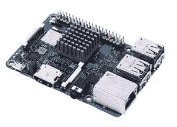
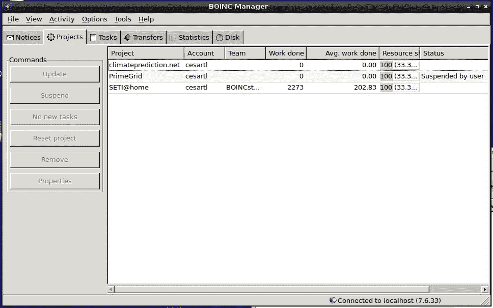
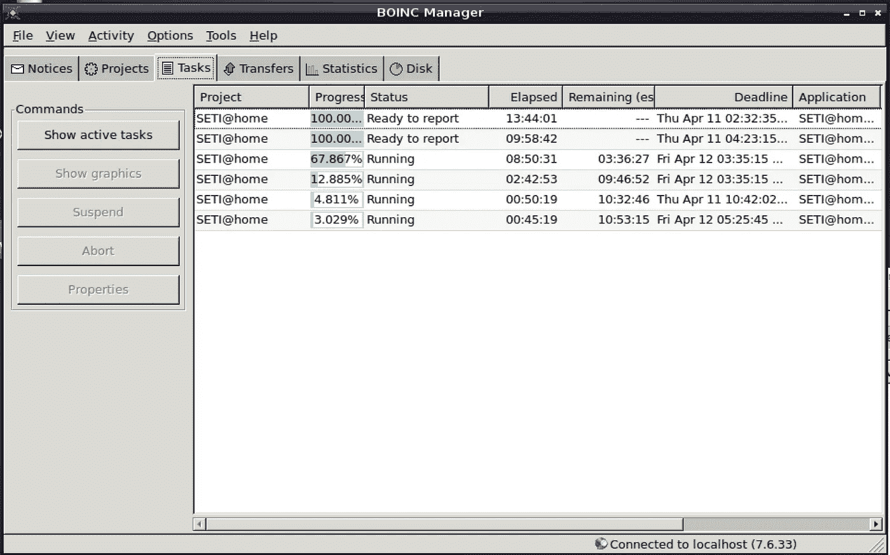
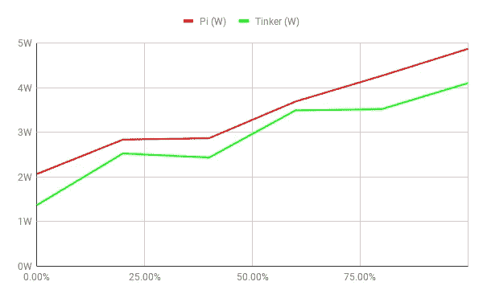
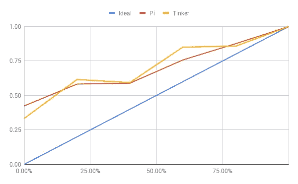

# 我的树莓皮是如何听星星的

> 原文：<https://itnext.io/how-my-raspberry-pi-listens-to-the-stars-538aa5f77e87?source=collection_archive---------7----------------------->


> TL；DR:我分享你如何将多余的计算资源——比如树莓派——借给全球科学界；利用这个机会一路涉猎。

# 单板计算机

单板计算机( **SBC** )如[树莓派](https://www.raspberrypi.org/)在过去的 10 年里变得非常流行。它们相对便宜(T5)、小巧(T6)、节能(T7)，并提供全功能的 Linux 或 Android 电脑。它们通常用于教育、研究、修补或建造智能房屋。

最近买了 2 台 SBC，一台[树莓 Pi 3 型号 B+](https://www.raspberrypi.org/products/raspberry-pi-3-model-b-plus/) 和一台[华硕修补板 S](https://www.asus.com/uk/Single-Board-Computer/Tinker-Board-S/overview/) 。



树莓派 3B+



华硕修补板 S

我买它们是为了一个很快被放弃的项目🤷‍♂️.

幸运的是，我很快在[延迟满足](https://www.slow-journalism.com/)中看到一篇关于寻找外星智慧(SETI)的文章。

# 外星智能探索

这个概念相对简单，大型射电望远镜指向天空，希望**探测到外星智能发出的无线电信号**。可以肯定的是，在我们的太阳附近没有其他智慧生命能够产生无线电信号。因此，假设，如果它们存在，**这些信号将非常微弱**。因此，要仔细梳理这些数据，寻找微弱无线电脉冲的踪迹，需要大量的处理能力。

## SETI@HOME

SETI@HOME 项目诞生于这样一个可怕的现实:世界上没有一所大学或研究所能够负担得起处理所有这些数据所需的超级计算机。

> 如果有可能使用公众中成千上万台闲置电脑中的一部分，会怎么样？

我最近读到了谷歌、亚马逊和微软等公司使用的现代数据中心。他们运行的工作负载通常是数据密集型的，这意味着瓶颈通常在 I/O(网络、磁盘、内存)而不是纯粹的 CPU 能力。这意味着硬件和软件工程师必须一起工作，以最大限度地减少机器之间的数据传输量，或者确保这种传输尽可能在本地进行。

> 这种工作量对于分布在互联网上的小型计算机网格来说是不切实际的。

幸运的是，SETI@HOME 中涉及的处理**不是数据密集型的，并且相对容易并行**。无线电信号被分割成小块的数据(< 0.5 MB)，这些数据可以被发送到计算机进行分析(根据计算机的功能，这通常需要几个小时)。一旦完成，结果就会被 SETI@HOME 团队发回并汇总。你可以在这里找到它如何工作的细节[。](http://seticlassic.ssl.berkeley.edu/about_seti/about_seti_at_home_1.html)

> 卖了？我如何参与？

# BOINC

[伯克利网络计算开放基础设施](https://boinc.berkeley.edu/) (BOINC)是一个允许志愿者为科学(多个项目，不仅仅是 SETI)提供计算能力的项目。

安装在树莓派或华硕修补板上非常简单。它们都运行 Debian Linux 发行版的变体，BOINC 可以使用标准的包管理器来安装:

```
sudo apt-get update
sudo apt-get upgrade
*sudo apt-get install boinc*
```

一旦安装了 BOINC，你可以加入 SETI@HOME 这样的特定项目，也可以使用**账户管理器**。客户经理是一个网站，它允许你搜索寻找志愿者的项目。我热衷于参与几个科学项目，所以我注册了一个这样的供应商 BAM。

要使用账户管理器，您需要点击`View -> Advanced View` ，然后点击`Tools -> Use account manager`

BOINC 将与你的账户管理器同步，账户管理器将发送任务给你运行。



在 BOINC 上运行多个项目



运行任务

如果你不想把整台电脑都投入到这项任务中，BOINC 会给你很多选项来限制工作量，比如:

*   限制 BOINC 可以使用的 CPU 时间或 CPU 内核的总量。
*   如果其他任务需要 CPU，请关闭 BOINC。
*   安排 BOINC 一周中的哪一天和哪几个时间可以工作。

# 功耗和成本

你可能想知道 24/7 全天候满负荷运行一个 SBC 要花多少钱。简短的回答是——很便宜。

让我们离题进入**能量**和**能量**的概念，如果你已经熟悉它们就跳过。

## 动力和能源

能量是一个普遍而抽象的概念，它描述了一个系统(机械、化学、电气等)所能做的功的数量。它用`Joule`、`kcal`(是的，就是你食物中的那些)或`W.h`(下面会详细介绍)来表达。

**功率是一个系统在单位时间内能够产生/消耗**(视视角而定)**的能量的总量。我发现与更熟悉和相似的概念进行比较很有用:**

*   ****速度**是单位时间的距离量，即`distance/time`。如果将平均速度乘以总时间，就得到**行驶的总距离。****
*   ****电流**(单位为安培`A`)是单位时间内的电荷量，即`charge/time`。如果你将平均电流乘以总时间，你就得到**总电荷**(这就是为什么电池容量通常用`A.h`来测量)**
*   ****功率**是单位时间内的能量，即`energy/time`。如果你把平均功率乘以总时间，你就得到了总能量。这就是为什么你的电力供应商通常会按`kW.h`收费，这是一种测量你消耗能量的便捷方式。**

## **电力**

**根据能源类型的不同，有许多计算功率和能量的公式。对于电源(准确地说是直流电流)，功率的公式是`P = U.I`，其中`U`是用**伏特**表示的**电势**或张力，`I`是用**安培**表示的**电流**。**

**为了测量我的 SBCs 消耗了多少功率，我购买了一个简单的 USB 设备，如下所示:**

****

**USB 测试仪，小于 10**

**你将设备插入电源，然后将 SBC 插入设备。它将监控电压和电流，可以计算瞬时功率以及流经设备的**总能量**(在`W.h`中)。**

> **如果你想检查手机或其他设备的电池容量，这非常有用。**

## **电缆并非生来平等**

**令我惊讶的一件事是，我发现并非所有的 USB 电缆都是一样的。我用不同的电缆给电池组充电，做了一些测试。我的一些电缆(USB 到 micro-USB)能够提供 1.2A 的电流(我认为这是包装能够产生的电流)，而其他电缆只能提供`0.9A`甚至`0.7A`。这是一个很大的区别，如果你家里有一个测试者，把坏苹果分开可能是值得的。**

## **总功耗**

**由于波动太大，我无法使用设备的瞬时功率来测量 SBCs 的功耗。相反，我会让设备运行 1 小时，然后**读取**在`W.h`消耗的总能量。然后我只需要除以`1h`就能得到动力。所以我在测试 1 小时后读取了`3.46 W.h`，这意味着主板平均消耗了`3.46 W`。**

****

**阅读的例子。右侧从上到下依次为:瞬间能量，累积能量，累积时间**

****

**我安装了一个网络摄像头，这样我就可以在家以外阅读测量数据**

***(我觉得用 1 小时测量不够精确，所以我换成让它运行 12 小时，但原理是一样的——除以 12 而不是 1)***

**满负荷(即 BOINC 一直使用 100%的 CPU)时，我的树莓 Pi 消耗了`4.8 W`。**

**修补板在类似的情况下被消耗掉了。**

**我的电力供应商收费大约在`0.18 £/kW.h`左右，这意味着以 100% CPU 24/24 小时运行 SBCs 将花费我:**

*   **Pi 为 7.70 英镑/年**
*   **修补板每年 6.50 英镑**

**我的供应商完全使用可再生能源发电，因此对环境的影响也非常低。**

**基于以上两个事实，我不会因为让这两个全年运行而感到内疚！**

## **圆周率 vs 修补匠**

**使用 BOINC 提供的基准测试，我可以测量:**

*   **Pi: `4.5 Gops/s`用于浮点计算，`70 Gops/s`用于整数计算**
*   **修补板:`5.3 Gops/s`用于浮点计算，`107 Gops/s`用于整数计算**

**`Gops/s` *表示每秒 10 亿次运算，即板卡在 1 秒钟内可以完成的运算量***

**在这里，修补板对于带浮点计算的 Pi 来说在`£3.9p/Pops`比`£5.4p/Pops`更具成本效益，对于整数计算来说在`£0.19p/Pops`比`£0.35p/Pops`更具成本效益。**

***整数计算意味着计算机只使用整数，而浮点计算使用小数。后者更难，这就是为什么主板每秒能做的更少。* `*1Pops = 1 Peta operations = 1 quadrillion operations*`**

# **能量比例**

**我最近读了一篇论文[1]，描述了建设和运行大型数据中心的不同方面，并想到了非常有趣的概念[能源比例](https://en.wikipedia.org/wiki/Energy_proportional_computing)。**

**这个想法源于运营这些大型数据中心的经济效益。一个有用的衡量标准是计算单位的成本。在这种情况下，成本就是**运行**整个设施需要多少钱；建设数据中心的成本是单独计算的。**

**理想的能量比例服务器在空闲时消耗`**0W**`**，在满负荷时消耗一定的最大功率`Pmax`，在中间的任何地方消耗**线性级数。******

> ****换句话说，这意味着服务器在 100%、80%或任何其他负载下运行时的能效都是一样的。****

****显然，从来不是这样。即使在空闲时，服务器也会消耗资源(旋转磁盘、空闲 CPU、本地风扇，如果有的话)。当组件与能量不成比例时，**随着负载从最大值开始下降，每个计算单元将变得更加昂贵。******

****更简单地说，非能源比例部分是**而不是**“量入为出”。想象一下，一个体育中心每月收费 10 英镑，然后是 2 英镑。你去的次数越多，每次入境的实际费用就越便宜。****

****大多数服务器通常都经过优化，在满负荷时效率最高，这对现代数据中心来说是个问题。在这些地方，服务器的大部分时间都在 10%-50%的利用率范围内[1]，这与制造商优化的范围相差甚远。这种低利用率需要能够吸收高峰流量，这在互联网上并不罕见。****

****研究表明[2]提高现代数据中心服务器的能源比例可以减少一半的能耗。这是一个尚未完全探索的新研究领域。****

## ****实验****

****由于这是一个相对较新的研究领域，我想看看**我的 SBC 的能量比例是多少会很有趣。我做了一个简单(但有点长)的实验，在这个实验中，我使用 BOINC 将 CPU 使用率限制在某个百分比，并测量了功耗(平均超过 12 小时)。我以 20%的利用率增量为每个 SBC 做了这个实验。******

****在我写这篇文章的时候，我正在我的地窖里运行 SBCs，全天保持 15 摄氏度的恒温。因此，我不需要使用风扇，但如果天气变暖，我可能需要。****

## ****放弃****

****以下结果代表单一类型的工作负载，不一定反映主板在不同工作负载下的比较情况。****

## ****结果****

****两块板的结果绘制如下:****

********

****带负载的功耗****

****我惊讶地看到，修补板使用更少的能源，同时运行更快的计算。必须指出的是，修补板的成本大约比 Pi 高 2.5 倍，这种比较有些不公平。****

****另一个有趣的图形可以通过**归一化所有功率**(即除以最大功率)得到。这样做之后，Y 轴代表从 0 到 1 的值，即当前功率与最大功率的比值。一个完美的能量比例分量将遵循线`y=x`，即。满负荷时为 1，空闲时为 0，在两者之间沿直线前进。****

****我们可以通过观察它们与理想线的距离来感受 SBC 的不均衡程度:****

********

****标准化功耗****

****我无法从这张图表中得出任何结论性的事实。Tinker 板在静止时(0%负载)似乎效率略高，但总体趋势似乎相似。同样，这个实验非常具体地针对我运行的工作负载，在其他配置上可能完全不同。****

# ****结论****

****我希望你觉得这篇文章很有趣，学到了一些东西，并希望对帮助全球科学项目感到好奇。****

****我还想结束这个项目对我的启发。[延迟满足](https://www.slow-journalism.com/)是**慢新闻**运动的领导者之一。记者们没有急于报道突发新闻，而是故意在事件发生几个月后再回去调查，以便进行更全面的分析。一期 10 英镑(订阅的话更便宜)，覆盖一年中的 3 个月(每年发行 4 期)，120 页，没有一个广告，充满了很酷的信息图表。如果你喜欢阅读有深度的新闻文章，我强烈推荐它。****

> ****这篇文章不是由我提到的任何产品赞助的。****

## ****资源****

*   ****[如何在树莓派上安装 BOINC](https://www.raspberrypi.org/magpi/share-boinc/)****
*   ****[SETI @ HOME 如何工作](http://seticlassic.ssl.berkeley.edu/about_seti/about_seti_at_home_1.html)****

## ****参考****

****[1]:巴罗佐、路易斯·安德烈和克利达拉什、吉米和霍尔兹勒、乌尔斯。作为计算机的数据中心:仓库规模机器设计介绍，第二版。可从 https://www . morganclaypool . com/doi/ABS/10.2200/s 00516 ed 2v 01y 201306 CAC 024 获得****

****[2]:范、韦伯、巴罗佐。仓库大小的计算机的电源供应。《第 34 届计算机体系结构国际研讨会论文集》,加利福尼亚州圣地亚哥，2007 年 6 月 9 日至 13 日。07 年的 ISCA。DOI: /10.1145/1250662.1250665 78，84，85，113****

****如果你喜欢这类内容，你可以在 Twitter 上关注我****

****[](https://twitter.com/cesarTronLozai) [## 塞萨尔·特隆-洛扎伊(@塞萨尔·特隆洛扎伊)|推特

### 塞萨尔·特隆-洛扎伊的最新推文(@塞萨尔·特隆洛扎伊)。老公，女权主义者，我爱科学，物理，数学，分类…

twitter.com](https://twitter.com/cesarTronLozai)****