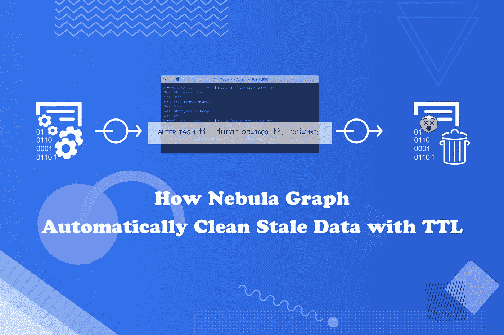
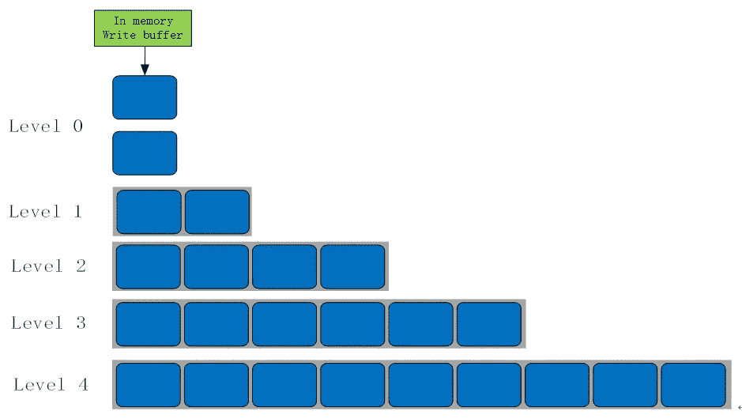
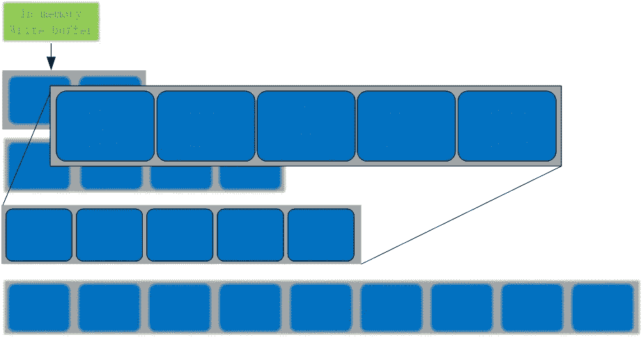
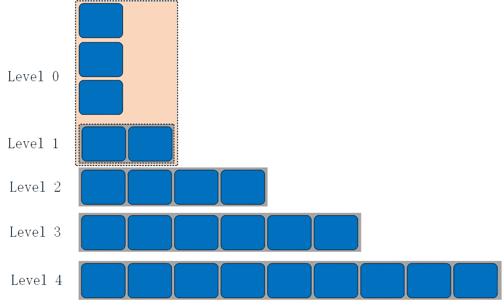
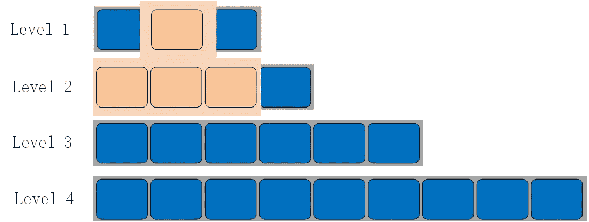

# NebulaGraph 数据库如何用 TTL 自动清除陈旧数据

> 原文：<https://itnext.io/how-nebulagraph-database-automatically-cleans-stale-data-with-ttl-cbe840277fc7?source=collection_archive---------4----------------------->



# 介绍

大数据时代，我们处理的是 TB、PB，甚至 EB 的数据。如何处理庞大的数据集是数据库领域工作人员面临的一个普遍问题。

这个问题的核心是存储在数据库中的数据是否仍然有效和有用。因此，提高有效数据的利用率、过滤无效/过期数据等问题已经引起了全球的广泛关注。

在这篇文章中，我们将关注如何处理数据库中的过时数据。

清理数据库中过时数据的方法有很多种，比如存储过程、事件等等。这里我们举一个例子来简单解释一下数据过滤中常用的存储过程事件以及 TTL。

# 存储过程和事件

# 存储过程

存储过程是一个或多个 SQL 语句的集合。这种技术将复杂的操作封装到一个代码块中，以便在对数据库执行一系列读或写操作时重用代码，从而大大节省了数据库开发人员的时间和精力。

通常，存储过程一旦编译，就可以多次执行，从而大大提高效率。

存储过程的优点:

*   **简化操作。**将重复的操作封装到一个存储过程中，这简化了对这些 SQL 查询的调用。
*   **批量加工。**SQL 作业的组合可以减少服务器端和客户端之间的流量。
*   **统一接口**确保数据安全。
*   **编译后，随处运行**提高效率。

以 MySQL 为例，假设我们要删除如下表:

```
mysql> SHOW CREATE TABLE person;
+--------+---------------------------------------------------------------------------------------------------------------------------------+
| Table  | Create Table                                                                                                                    |
+--------+---------------------------------------------------------------------------------------------------------------------------------+
| person | CREATE TABLE `person` (
  `age` int(11) DEFAULT NULL,
  `inserttime` datetime DEFAULT NULL
) ENGINE=InnoDB DEFAULT CHARSET=utf8 |
+--------+---------------------------------------------------------------------------------------------------------------------------------+
1 row in set (0.00 sec)
```

这是一个名为 person 的表，其中 _inserttime_ column 是日期时间类型。我们使用 _inserttime_ column 来存储数据的生成时间。

接下来，我们创建一个删除该表的存储过程:

```
mysql> delimiter //

mysql> CREATE PROCEDURE del_data(IN `date_inter` int)
    -> BEGIN
    ->   DELETE FROM person WHERE inserttime < date_sub(curdate(), interval date_inter day);
    -> END //

mysql> delimiter ;
```

该示例创建了一个名为 _del_data_ 的存储过程，其中参数 _date_inter_ 指定删除时间和当前时间之间的间隔，即如果 inserttime 列(日期时间类型)和 date_inter 之和小于当前时间，则数据过期，然后被删除。

# 事件

事件是根据计划运行的任务。一个事件可以被调用一次或重复调用。一个称为事件调度程序的特殊线程执行所有调度的事件。

事件类似于触发器，因为它们都在满足特定条件时运行。当数据库中的语句在事件监听其调度程序时执行时，触发器运行。由于相似性，事件也被称为临时触发器。每秒钟都可以安排一个事件。

以下示例创建一个重复事件，该事件在每天 12:00:00 调用 _del_data_ stored 过程，以清除自 2020 年 3 月 20 日以来的数据。

```
mysql> CREATE EVENT del_event  
    ->     ON SCHEDULE
    ->     EVERY 1 DAY
    ->     STARTS '2020-03-20 12:00:00'
    ->     ON COMPLETION PRESERVE ENABLE
    ->     DO CALL del_data(1);
```

然后运行:

```
mysql> SET global event_scheduler = 1;
```

打开事件 del_event，使其在指定时间自动在后台执行。过期数据通过存储过程 del_data 和事件 del_event 自动清除。

# 通过 TTL 清除数据

上一节介绍了通过存储过程和事件的组合定期清理数据。然而 NebulaGraph 提供了一种**简单有效的方式**来自动清理过期数据，即 TTL 方法。

使用 TTL 清除过期数据的好处如下:

1.  简单方便。
2.  通过数据库系统的内部逻辑进行处理，确保了安全性和可靠性。
3.  高度自动化。数据库根据自身状态自动判断并执行何时处理。不需要人工干预。

# TTL 简介

[生存时间](https://en.wikipedia.org/wiki/Time_to_live)(简称 TTL)是一种允许你自动删除过期数据的机制。TTL 决定了数据库中数据的生命周期。

在 NebulaGraph 中，过期的数据将不再被检索，并将在未来被删除。

在称为压缩的后台垃圾收集操作期间，系统将自动从磁盘中删除过期数据。在从磁盘中删除之前，所有过期数据对用户都是不可见的。

TTL 需要两个参数，`ttl_col`和`ttl_duration`。`ttl_col`表示 TTL 列，`ttl_duration`表示 TTL 的持续时间。当 TTL 列和 ttl_duration 之和小于当前时间时，数据过期。`ttl_col`类型必须是整数或时间戳，以秒为单位。`ttl_duration` **必须**也以秒为单位设定。

# TTL 读取过滤

如前所述，TTLed 记录对用户是不可见的。因此，通过网络将这些记录从存储服务器传输到图形服务是一种浪费。在 NebulaGraph 存储服务中，首先从 meta 服务获得 ttl 信息，然后在图形遍历时检查每个顶点或边的 ttl_col 值，即系统将 TTL 列和 ttl_duration 的总和与当前时间进行比较，找到过期的数据，然后过滤它们。

# TTL 压缩详细信息

# 背景:RocksDB 文件组织

NebulaGraph 使用 RocksDB 作为其存储引擎。磁盘上的 RocksDB 文件分为多个级别。默认情况下，有七个级别。



这些文件称为 SST 文件。对于 SST 文件中的所有键，它们都按照键进行了很好的排序、结构化和索引。对于级别 1 到级别 6，在每个级别中，SST 文件也是排序排列的。但是不同级别的两个文件可能会重叠。级别 0 中的文件也是如此，这些文件是从内存(MemTable)中刷新和生成的，即 l 0 中的文件将彼此重叠。如下图所示:



# RocksDB 压实

RocksDB 基于日志结构的合并树(LSM 树)。但是 LSM 是一个数据结构的概念和设计思想。详情请参考 [LSM 论文](http://citeseerx.ist.psu.edu/viewdoc/download?doi=10.1.1.44.2782&rep=rep1&type=pdf)。LSM 最重要的部分是压实。因为数据文件是以仅附加模式写入的，所以过期、重复和删除的数据需要通过后台压缩操作来清除。

# RocksDB 压缩逻辑

这里使用的压缩策略是分级压缩(受 Google 著名的 LevelDB 启发)。当数据被写入 RocksDB 时，它首先被写入 MemTable。当 MemTable 已满时，它将成为不可变的 MemTable。RocksDB 通过后台的 flush 线程将这个不可变的 MemTable 刷新到磁盘，生成一个排序字符串表(SST)文件，放在 0 级。当级别 0 中的 SST 文件的数量超过某个阈值时，执行压缩。它从第 0 层读取所有密钥，并将一些新的 SST 文件写入第 1 层。通常，L0 的所有文件都必须合并到 L1 中以提高读取性能，因为 L0 文件通常是重叠的。

0 级和 1 级压实如下:



其他级别的压缩规则相同，以 1 级和 2 级压缩为例:



当 0 级压缩完成时，1 级中的总文件大小或文件数量可能会超过阈值，从而触发 1 级和 2 级之间的另一次压缩。将至少选择一个来自 L1 的文件，并且还会选择 L2 的一些文件(这些文件与所选的 L1 文件有重叠)。在这一新的压缩之后，在 L1 和 L2 的选定文件被直接从磁盘中删除，并且一些新文件将被写入 L3，这可能再次触发 L2 和 L3 之间的另一新的压缩，等等。

从用户的角度来看，如果没有压缩，写操作会非常快(仅追加)，但读操作会非常慢(系统必须从一堆文件中找到一个键)。为了在写入、读取和磁盘使用之间取得平衡，RocksDB 在后台执行压缩，以合并不同级别的 SST。

# 星云图 TTL 压缩原理

除了上面提到的默认压缩操作(分级 SST 文件合并)，RocksDB 还提供了一种在后台基于自定义逻辑删除或修改键/值对的方法，即 CompactionFilter。

NebulaGraph 使用 CompactionFilter 定制自己的 TTL 函数，在这篇文章中讨论了这个函数。每次在压缩过程中读取数据时，CompactionFilter 都会调用一个自定义的筛选函数。TTL 压缩基于方法在筛选器函数中实现 TTLed 数据删除逻辑。

下面是详细的实现:

1.  首先从元服务获取标签/边缘的 TTL 信息。
2.  在图形遍历期间，读取一个顶点或边并取值。
3.  得到 ttl_duration 和 ttl_col 之和，然后与当前时间进行比较。这决定了数据是否过期。过期的数据将被删除。

# 实践中的 TTL

在 NebulaGraph 中，将 TTL 添加到边几乎与添加到标签一样。我们以 tag 为例介绍 TTL 的用法。

# 设置 TTL 值

在 NebulaGraph 中设置 TTL 值有两种方法。

创建新标签时设置 TTL 属性。用 ttl_col 表示 ttl 列，而 ttl_duration 表示这个标签的寿命。

```
nebula> CREATE TAG t (id int, ts timestamp ) ttl_duration = 3600, ttl_col = "ts";
```

当 TTL column 和 ttl_duration 之和小于当前时间时，我们认为数据过期。ttl_col 数据类型必须是整数或时间戳，并且以秒为单位设置。ttl_duration 也是以秒为单位设置的。

*   当 ttl_duration 设置为-1 或 0 时，此标签的顶点属性不会过期。
*   ttl_col 数据类型必须是整数或时间戳。

或者，您可以通过 ALTER 语法为现有标签设置 TTL 值。

```
nebula> CREATE TAG t (id int, ts timestamp );
nebula> ALTER TAG t ttl_duration = 3600, ttl_col = "ts";
```

# 显示 TTL

您可以使用以下语法来显示 TTL 值:

```
nebula> SHOW CREATE TAG t;
=====================================
| Tag | Create Tag                  |
=====================================
| t   | CREATE TAG t (
  id int,
  ts timestamp
) ttl_duration = 3600, ttl_col = id |
-------------------------------------
```

## 改变 TTL

用`ALTER TAG`语句改变 TTL 值。

```
nebula> ALTER TAG t ttl_duration = 100, ttl_col = "id";
```

# 丢弃 TTL

如果您已经为字段设置了 TTL 值，但后来决定不希望它自动过期，则可以删除 TTL 值，将其设置为空字符串，或者通过将其设置为 0 或-1 来使其无效。

```
nebula> ALTER TAG t1 ttl_col = ""; -- drop ttl attribute
```

删除`ttl_col`字段:

```
nebula> ALTER TAG t1 DROP (a); -- drop ttl_col
```

将 ttl_duration 设置为 0 或-1:

```
nebula> ALTER TAG t1 ttl_duration = 0; -- keep the ttl but the data never expires
```

# 例子

以下示例显示，当设置了 TTL 值且数据过期时，系统会忽略过期数据。

```
nebula> CREATE TAG t(id int) ttl_duration = 100, ttl_col = "id";
nebula> INSERT VERTEX t(id) values 102:(1584441231);
```

```
nebula> FETCH prop on t 102;
Execution succeeded (Time spent: 5.945/7.492 ms)
```

注意:

1.  如果字段包含 ttl_col 值，则不能对该字段进行任何更改。您必须先删除 TTL 值，然后更改该字段。
2.  请注意，标记或边不能同时具有 TTL 属性和索引，即使 ttl_col 列不同于索引列。

TTL 介绍到此结束。通过向我们提出一个[问题](https://github.com/vesoft-inc/nebula)或在我们的官方[论坛](https://discuss.nebula-graph.io/)上发布您的反馈来分享您对 TTL 的想法。

# 你可能也会喜欢

1.  [索引如何在 NebulaGraph 中工作](https://nebula-graph.io/posts/how-indexing-works-in-nebula-graph/)
2.  [存储平衡和数据迁移](https://nebula-graph.io/posts/nebula-graph-storage-banlancing-data-migration/)
3.  [星云图中的快照介绍](https://nebula-graph.io/posts/nebula-graph-snapshot-introduction/)