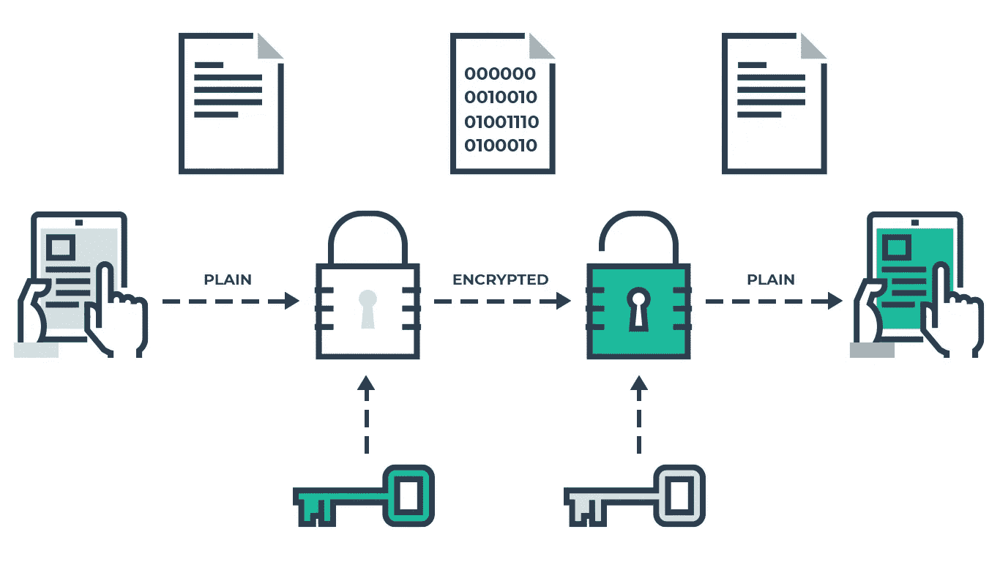
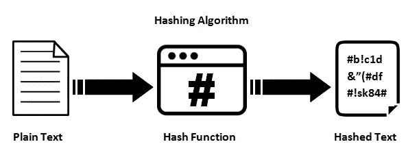

# 如何(不)存储密码

> 原文：<https://itnext.io/how-not-to-store-passwords-4955569e6e84?source=collection_archive---------1----------------------->

验证和认证应用程序的用户是网络安全的主要领域之一。
正确存储密码至关重要，但这也是许多开发人员未能做到的一点。
部分原因是这个领域可能非常技术性、数学化，而且非常容易出错，部分原因是——尽管很可悲——纯粹出于懒惰。

在这篇文章中，我将介绍存储网站或应用程序密码的不同方法。有些人会比其他人更受欢迎。

# 将密码存储为明文

因此，您正在为您的网站创建一个登录系统，您需要有效地存储密码。
当然，真正幼稚的方法非常简单:储存起来。
您有一个包含所有用户的表的数据库，它可能看起来类似于`(id, username, password)`。
创建用户时，将用户名和密码以明文形式存储在这些字段中，登录时，提取与输入的用户名相关的行，并将输入的密码与数据库中的密码进行比较。如果匹配，你就让你的用户进来。非常简单且易于实现。

显然(我希望)，这是一种极其糟糕和不安全的存储密码的方式！
如果你很不幸，你的数据库被黑了，你的每一个用户密码都会直接暴露在肉眼下。
让我们用一些事实来强调这次灾难的意义:
大多数人对所有(或至少多个)服务使用同一个密码。
因此，你不仅危及了对自己网站的访问，还潜在地泄露了用户在其他地方使用的密码；他们的个人电子邮件或网上银行。
此外，如果您选择以纯文本形式存储您的用户密码，您可能不太关心[净化](https://codex.wordpress.org/Validating_Sanitizing_and_Escaping_User_Data)您的输入或者使用[准备好的语句](https://www.w3schools.com/php/php_mysql_prepared_statements.asp)来防止 SQL 注入。你的网页被黑客攻击的几率可能并没有那么小。

但愿，你已经因为读到这里而畏缩了，并对自己说:“这只是常识，没有人真的这么做”。
再想想！当我在 2019 年写这篇文章时，仍然有许多网站——见鬼，甚至是大公司——像这样存储密码。
如果你被这个事实吓倒了，我不怪你。
有一种快速的方法可以验证你自己的密码是否以明文形式存储。尝试使用网站的“恢复密码”功能。如果你收到一封通知你密码的邮件，那是因为网站以明文形式存储了密码，这将是一个**巨大的**危险信号！

# 加密您的密码

在数据库的密码上增加一层安全层的第一种方法是利用加密。
让我们以一种非常简单的方式快速浏览一下加密的工作原理:

*   生成将用于加密消息的密钥。
*   这个密钥现在将加密明文信息，并把它们变成密文(乱码)。
*   之后，同样的密钥可以用来解密密文，把它变成原始消息。

关于存储密码，其思想是在将密码存储到数据库之前，使用生成的密钥对密码进行加密。
每次用户登录时，输入的密码将使用相同的密钥加密，加密后的输入密码将与存储在数据库中的密码进行比较。
如果黑客找到了进入数据库的方法，他们会在密码字段中看到密文。

虽然这比明文存储密码要好，但这仍然是不安全的，也是很糟糕的做法。
让我们拿出更多的事实:
根据 Troy Hunt 的调查， [86%的密码都很糟糕](https://www.troyhunt.com/86-of-passwords-are-terrible-and-other-statistics/)！比方说，作为一名黑客，我的确设法闯入了你的数据库。
现在，我将拥有许多带有加密密码的条目。
根据统计，这些密码中有很大概率是‘123456’或‘password’或‘ABC 123’(或其他常用的前 100 名密码之一)。我现在会尝试其中的一些，如果幸运的话，我可以很容易地得到加密密钥。或者更好——我会写一个简单的小脚本来完成它。现在，我可以立即在数据库中尝试使用前 10.000 个密码！
搞定！我所要做的就是找到一个匹配的密码——知道了密钥，我现在可以有效地解密数据库中剩余的每一个密码。

# 散列你的密码

不使用加密，你可以选择在创建时对你的密码进行散列运算。
毕竟，在上面的例子中，我们从来不需要解密加密后的密码。我们只需要确保相同的密码每次都会产生相同的密文，然后简单地比较它们。
这是一种*散列算法*变得有益的情况。

其中，使用散列算法的好处是

*   它是不可逆的。也就是说，从输出散列中重建输入在计算上是不现实的。
*   输出散列的长度是固定的。也就是说，不管输入的是一个单词还是莎士比亚的全部作品，输出散列的长度总是为 *x* 个字符。
*   输入的最小变化将导致完全不同的输出散列。这也被称为[雪崩效应](https://en.wikipedia.org/wiki/Avalanche_effect)。
*   同样的输入每次都会产生同样的输出。因此哈希算法是一个*函数*。

*如果你想了解更多关于哈希的知识，推荐你阅读劳尔·乔丹的* [*这篇文章*](https://medium.com/zkcapital/the-state-of-hashing-algorithms-the-why-the-how-and-the-future-b21d5c0440de) *。*

通过在存储密码之前应用散列函数，我们可以有效地规避使用加密时引入的问题。
但不幸的是，这仍然是一种**不安全的方式**来存储密码！

一般来说，散列函数的一个结果是总会存在*散列冲突*的可能性。也就是说，两个不同的输入将映射到同一个输出散列。给定上述第二个标准；输出散列是固定长度的，这在数学上是可以证明的，冲突是不可避免的。背后的数学原理被称为鸽子笼原理。

然而，如果很难找到映射到相同输出散列的两个输入，则称加密散列函数是抗冲突的。
一个已知的抗冲突哈希算法的好例子是 [MD5](https://en.wikipedia.org/wiki/MD5) ，这是多年来的行业标准。
然而，1996 年发现 MD5 的设计有缺陷，2004 年证明 MD5 不抗碰撞。

回想一下，在存储之前对密码应用散列时，我们也只在授权登录时比较散列。这意味着，如果我能找到一个与数据库中存储的散列相同的输入，我就可以使用这个输入来登录。

这就是为什么应该**完全避免使用 MD5** 进行任何关于认证和存储密码的事情。流行的 [SHA-1](https://en.wikipedia.org/wiki/SHA-1) 也是如此，以今天的计算资源，也很容易被攻破。

幸运的是，现在有更现代、更安全的哈希算法。
目前的行业标准有 [PBKDF2](https://en.wikipedia.org/wiki/PBKDF2) **，** [bcrypt](https://en.wikipedia.org/wiki/Bcrypt) **，**和[scrypt](https://en.wikipedia.org/wiki/Scrypt) 。然而，即使应用了最先进的哈希技术，这仍然是一种不安全的存储密码的方式。

让我们回想一下，所有密码中有 86%是可怕的。作为一名黑客，我知道如果我使用 MD5 对密码“123456”进行哈希运算，我将总是得到相同的输出哈希。使用最常用的密码列表，我将遍历这些密码，应用常用的哈希算法并存储输出哈希。下次我想破解散列密码时，我只需在存储的输出散列列表中进行查找，很有可能在这里找到原始输入。事实上，我甚至不需要自己创建这个列表。人们已经用各种不同的哈希算法组合完成了这项工作。这些列表被称为[彩虹表](https://en.wikipedia.org/wiki/Rainbow_table)。对于一大串最常用的密码，实际上并不比简单地将散列粘贴到谷歌中更困难，你可能会在前几次搜索命中中得到原始密码。
您还将了解在执行散列时应用了哪种散列算法。

你自己试试！看看能不能破解这个哈希密码:*482 c8 11 da 5d 5 B4 BC 6d 497 FFA 98491 e38*

# 哈希+加盐

一种防止上述安全隐患的方法，如在执行散列之前对密码应用*盐*。

一个 [salt](https://en.wikipedia.org/wiki/Salt_(cryptography)) 是一个随机生成的长字符串，它与密码连接在一起。这个 salt 在每个新用户创建时生成，并与用户名和散列密码一起存储。

这样，密码“HappyFace”每次用于创建新用户时都会生成一个完全不同的散列。
它不会匹配在任何其他网站上使用的相同密码的哈希，即使在同一个数据库中多次使用相同的密码，也会导致完全不同的输出哈希。

这样，作为一名黑客，我只剩下一个选择:暴力攻击。也就是说，简单地尝试每一种可能的字符组合，直到我偶然发现正确的密码。
如果密码和 salt 足够长，这几乎不可能实现。

因此，总结一下，如果你真的必须存储密码，最安全的方法是应用散列+加盐，从而使用众所周知的[密码策略](https://en.wikipedia.org/wiki/Password_policy)强制执行强密码。

# 根本不要存储密码

尽管您可以通过遵循上面的约定来应用令人满意的安全层，但是仍然非常非常容易出错！因此，如果您必须存储密码，请确保在开始之前进行适当的研究，并确保遵循您选择的任何框架或方法的最新安全约定。当你读完这篇文章的时候，可能有些事情已经改变了。所以一定要查阅最新的标准。

总之，**存储密码的最佳方式**是**根本不存储密码！**

谷歌、微软、脸书、推特等等，都有很好的、易于实现的、现成的用户认证解决方案。
您可以绝对肯定，他们雇佣了该领域最有经验的专家，他们应用了所有最新、最前沿的安全技术，并且如果报告了任何违反其安全标准的情况，他们将第一个做出重大改变！

我强烈建议您始终使用这些第三方解决方案来验证您网站上的用户，并且根本不要存储任何密码。

**就是这样！
如果您有任何问题或反馈，请随时在下方评论。如果你喜欢这篇文章，请鼓掌👏扣几下吧！
你也可以在**[**Twitter**](https://twitter.com/SimonLH_)**上找到我，我会在那里发布更多类似的内容。**