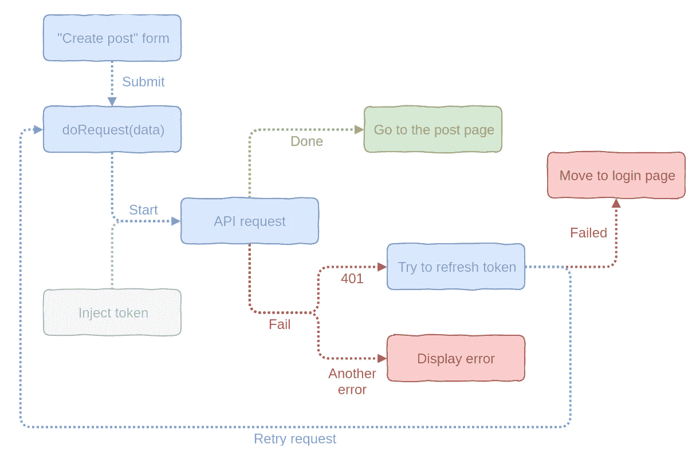

# 如何不受 API 的困扰

> 原文：<https://itnext.io/how-not-to-suffer-with-apis-8aa75f890fe6?source=collection_archive---------2----------------------->

## 重新思考 Apicase 和为什么我仍然没有使用 axios



典型 OAuth

> [点击这里在 LinkedIn 上分享这篇文章](https://www.linkedin.com/cws/share?url=https%3A%2F%2Fitnext.io%2Fhow-not-to-suffer-with-apis-8aa75f890fe6)

每天我都会看到这样的问题*“如何使用 API？”*、*“能不能给点最佳做法”*、*“如何烹饪 axios”*前台聊天。他们得到了很多答案，但都可以归纳为三种类型

## –获取足够了

致命的错误。大量的样板代码保证，我没有更多要说的

## –Axios 很好，受到社区的推荐

有的人就是用 axios，不在乎。在我看来，它只在“Hello world”示例上看起来不错。当我们想更深入时，我们需要编写自己的包装器、处理程序等。而上面的问题就来了。

## –我写了我的包装，它不是最好的，但对我的案例来说足够了

*针对您的案例。*有些人分享他们的包装函数甚至类但是看起来还是很丑。通常只是 axios 调用被封装到一个函数中，用于检查 auth、处理响应等。它非常具体，仅涵盖他们的使用案例，不能用于其他应用程序。

看起来，这么长时间过去了，我们有了非常酷的框架来使用 view，我们有了非常酷的库来进行状态管理，但是…

> 我们仍然没有统一的工具来轻松地使用 API

# 介绍 Apicase

Apicase 是一个强大的库，它将 API 的大部分工作转移到一个独立的层。它基于 4 个原则

*   **基于事件的**请求处理
*   **中间件**更新/动态更改/撤销/重做 API 调用
*   **无限继承的服务**
*   **适配器**代替具体工具(fetch/xhr)

所以，我不想深究理论和歌词，还是深潜一下，试着写点请求吧。

# 入门指南

## 装置

用你最喜欢的包管理器(npm，yarn，pnpm，或者一匹穿外套的马)安装它

```
npm install @apicase/core @apicase/adapter-fetch
```

我一般用 fetch，但是如果你想要 xhr，可以安装`@apicase/adapter-xhr`代替。别担心，两者都有相同的 API。

然后，我们需要将适配器包装到`apicase`中:

我认为很简单

已经可以用了。让我们现在就使用它

## 基于事件的 API 的简单请求

因此，最简单的请求如下所示:

**获取** /api/posts，处理该请求的事件

为什么不只是`.then()`和`.catch()`？

Apicase 遵循*“业务逻辑失败不例外”*原则。这意味着您的请求至少需要 3 个状态。承诺只有两个——成功或失败。事件允许您处理尽可能多的事情。喜欢

针对任何用例的独立事件—不再需要`**if (err instanceof Error)**`

你仍然可以使用`async/await`，当然，我给你留了这个，我的小语法糖爱好者:

**注意:**承诺只有在`error`发生时才会被拒绝。否则会正面解决。

带有`apicase`的简单请求看起来类似于 axios 请求:

获取/XHR 适配器使用[**path-to-regexp**](https://github.com/pillarjs/path-to-regexp)来处理参数。还有查询字符串的查询选项

就这些吗？当然不是。

# “创建帖子”示例

## Apicase 服务

所以，就像我之前说的，当我们深入下去的时候，axios 是不够的。这只是让我们写了很多样板代码或包装成函数。

所以，我们不想写重复的请求数据部分(在前面的例子中:`url`、`method`、`headers`)。让我们创建一个服务！

现在，您可以减少商店活动计数(尤其是在 Vuex 中)。因为它是 API 层逻辑，而不是存储

此外，服务可以根据您的需要进行扩展，因此您可以这样做:

我打赌它已经有了比你组织 API 更有趣的工作方式。但这还不是全部。

因此，我们减少了一些样板代码。但是这里我们静态地传递了我们的`token`。永远不会变。所以，钩子就是来解决你的问题的。

## 蜂箱挂钩

钩子在某个时刻拦截请求，并可能修改请求*有效载荷*、*响应*，取消请求或重试请求，进行另一个请求等。像 axios 拦截器，但更好。

**前**钩子修改请求前请求有效载荷

看起来很简单——我们只需添加将`token`添加到标题的`before`钩子，然后进入下一步。

我们能做得更好吗？当然啦！我们可以将它移动到我们的根服务，然后继承它。

如果我们不需要到处传递 auth token 呢？Apicase 有传递给钩子的`meta`选项。喜欢`vue-router`有，如果你知道:)

所以，这里`GetProfile`服务不会有令牌传递。

还有别的吗？当然，因为我能做到！

# 成为硬核

## “刷新令牌”不再痛苦

因此，让我们假设我们有需要 auth token 的 API。如果我们收到 401 错误，我们可以尝试在特定路由内刷新令牌。典型的 oAuth。

我们可以不用任何样板代码，只用钩子就可以做到。

因为钩子是异步的，我们可以在那里做另一个请求。我们还可以将请求状态从失败更改为成功，反之亦然。看这个:

你的解决方案和这个一样可靠吗？

因此，如果请求以 401 状态失败，我们将尝试刷新令牌。如果没问题，请求再次开始，应用程序中没有额外的操作和处理。

## 更难！两个请求同时失败

哦耶！您有两个并发的 API 请求，但都失败了。他们都将尝试刷新令牌，但我们只需要一个。

重写以前的代码？创造一个自行车？Lol，我只用一个字就能搞定。不信？请看:

**第 26 行。**剂量请求

服务的请求队列中包含当前正在运行的请求。他们也有一些有用的方法:

*   `doRequest` —只需启动请求并将其添加到队列中
*   `pushRequest` —仅在队列清空后创建新请求
*   `doSingleRequest` —仅当**没有**个当前正在运行的请求时，才创建一个新请求。否则，*返回当前运行的请求*。
*   `doUniqueRequest` —仅当**没有**当前正在运行的请求**具有相同的** `payload`时，才创建新的请求。否则，*返回这个当前运行的请求*。

您只需创建请求或监听当前正在运行的请求。那不是很美吗？

完成？不要！

# 请求取消

没有更多的低劣取消令牌，只是`.cancel()`它

**XHR** 适配器使用`xhr.abort()`取消请求
**获取**适配器使用新的`[AbortController](https://developer.mozilla.org/en-US/docs/Web/API/AbortController)`(如果可用)

# 请求队列

想创建一个同步的请求队列吗？动手吧，兄弟:

不到 30 行代码的 Apicase 队列解释

## 延迟/限时/去抖请求

Requests 具有 options 属性和一些 coll things:

*   **立即:**设置为`false`，请求不会自动开始。你必须使用`.start()`手动启动它
*   **延迟:**延迟就好。请求将在 N 毫秒后开始(也适用于自动)
*   **去抖:**经典去抖。对于从服务器自动完成很有用——创建请求，然后`.start()`延迟 N 毫秒。如果它在时间到之前被调用—重新启动计时器
*   **超时:**如果您想为请求添加时间限制，您可以使用此选项。

去抖请求示例

超时示例

# 服务树插件

服务创造可能看起来巨大而怪异。我做了一个小工具，允许使用一个 JSON 对象来声明服务:

你也可以传递钩子，元，选项。此外，还有`on`属性来传递事件:

而且，如果你想要相当干净的结构，你可以使用`rest`和`restWrapped`助手:

# 路标

做如此庞大的工作，路途是如此遥远。我尝试从头开始做了至少 4 次。现在看起来很强大(至少，对我来说)。我对 Apicase 的未来计划:

*   **规范和标准化 API:** 我觉得有些东西不够严格。我也可以跳过一些错误。在 1.0 发布之前，我会继续努力。
*   创建 devtools: 最重要的特性——带有请求日志、服务可视化等的 Chrome 插件
*   **TS/Flow 的类型:**有一个悲伤的时刻——由于钩子的缘故，Apicase 可能没有响应的类型。但是请求的类型可能创建得很好。
*   **更多简化工作的工具:**我还想创建更多的助手工具(比如*服务*)，让使用 API 工作更加舒适。

# 链接

Apicase 文档:[点击这里](https://kelin2025.gitbooks.io/apicase/content/)(还在进行中)
Github repos: [core](https://github.com/apicase/core) ， [adapter-fetch](https://github.com/apicase/adapter-fetch) ， [adapter-xhr](https://github.com/apicase/adapter-xhr) ， [services](https://github.com/apicase/services)
我的无聊推特:[关注我](http://twitter.com/kelin2025)