# 如何不哭

> 原文：<https://itnext.io/how-not-to-vue-18f16fe620b5?source=collection_archive---------0----------------------->

## 我在新工作中发现的一系列不好的事情

有些人会这样做

[*点击这里在 LinkedIn 上分享这篇文章*](https://www.linkedin.com/cws/share?url=https%3A%2F%2Fitnext.io%2Fhow-not-to-vue-18f16fe620b5)

不久前，我找到了一份新工作。当我第一次看到代码库的时候，我被吓坏了。这里我想展示一下你在 Vue.js 应用中应该避免的事情。

# 数据/计算中的静态属性

没有理由将静态属性传递给`data`，尤其是在`computed`中。当你这样做时，Vue 使这些属性反应，但这是不必要的。

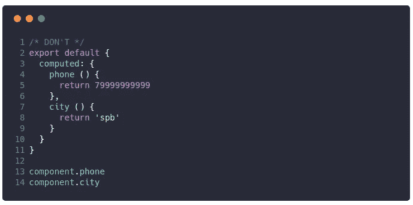

**不要**。电话和城市有无用的反应

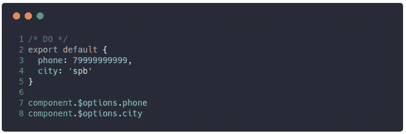

**做**。把它们递给`$options`。它更短，这里没有无用的工作

# 认为非反应性数据将是反应性的

记住:Vue 不是巫师。Vue 不知道你的 *cookies* 什么时候更新。

我提到 cookies 是因为我的同事花了 2 个小时才明白为什么他的计算属性没有更新。

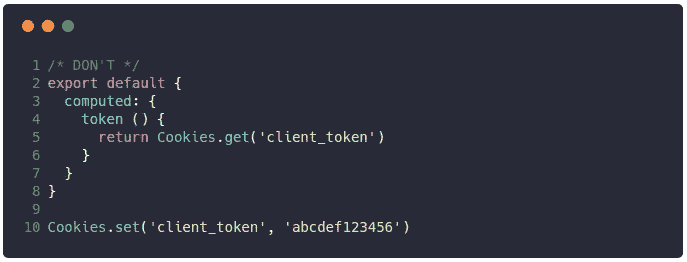

**不要**。计算出的属性应仅基于 Vue 反应数据。否则，它就不会工作

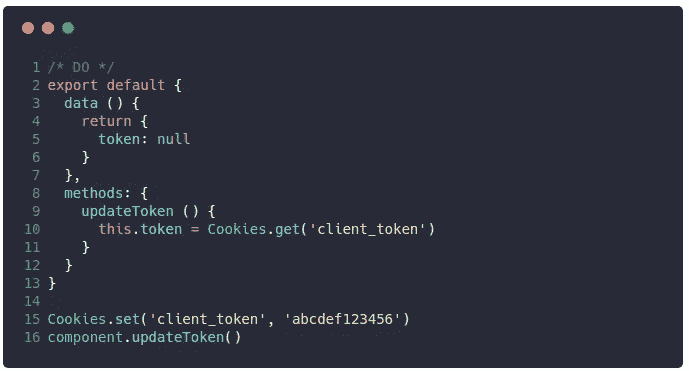

**做**。手动更新你那些不反应的东西。

此外，我建议您不要在计算属性中使用任何辅助数据。在您的计算属性中应该没有副作用。这会节省你很多时间。真的

# 把应该一次性完成的事情混在一起

混音没问题**有人马上关闭帖子** …混音在某些情况下没问题:

1.  创建修改 Vue 实例的插件，提供新功能
2.  在不同组件/整个应用程序中使用通用的特定方法

但是有一个人在`mounted` hook 中用非常缓慢的动作做出了全球混音。为什么不呢？因为它在**的每个**组件挂载上都被调用，但也可能只被调用一次。

这段代码我就不展示了。相反，为了更清楚，我将向您展示一个更简单的示例。

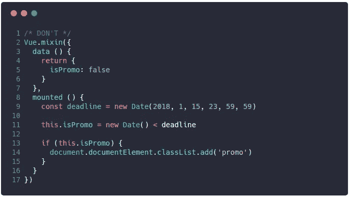

**不要。避免在 mixins 中这样做。当您不需要时，它将在每个组件挂载上被调用**

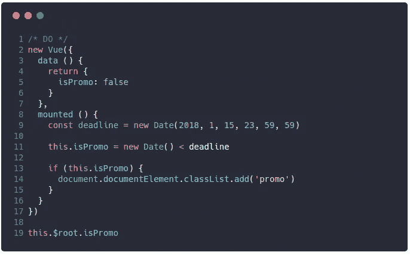

**做。在根实例中完成这项工作。它只会被调用一次。您仍然可以使用`$root`访问结果**

## setTimout/setInterval 的工作不正确

在一次采访中，我团队中的一个前端开发人员问我，我们是否可以在组件中使用超时/间隔。我回答“是”，并想解释如何正确地做这件事，但我被指责为无能。

我把这部分献给一个人，现在我必须维护他的代码

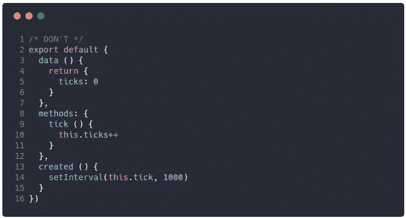

**不要。**可以用音程。但是你忘了用`**clearInterval** and will get error on component unmount`

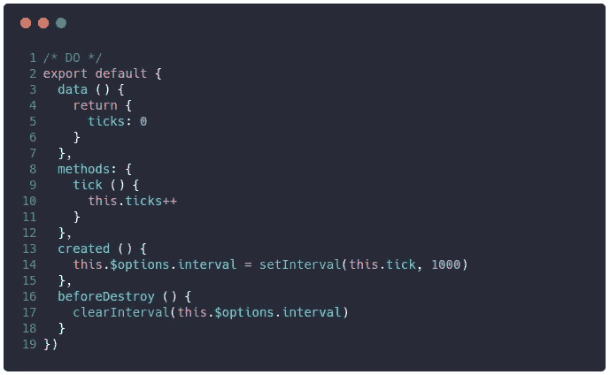

**做。**使用`beforeDestroy`挂钩中的`**clearInterval**`清除间隔

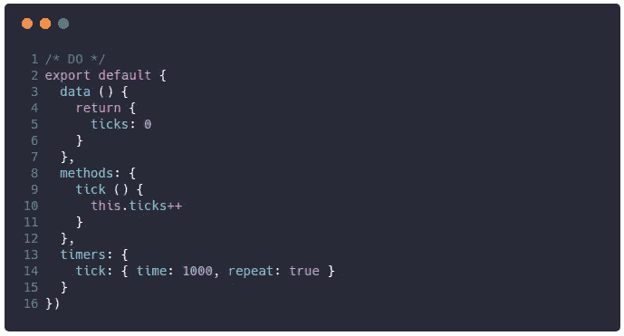

**做。**如果你不想关心，使用

# **变异的父母**

**Vue 中我非常不喜欢并希望删除的内容(Evan，请)**

**我看不到使用`$parent`的真实用例。它使组件不灵活，可能会用意想不到的问题迷惑您。**

**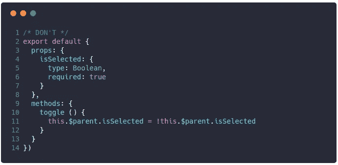**

****不要。**如果你试图变异`props`，Vue 会警告你，但是 **Vue 无法通过** `**$parent**`检测到变异**

**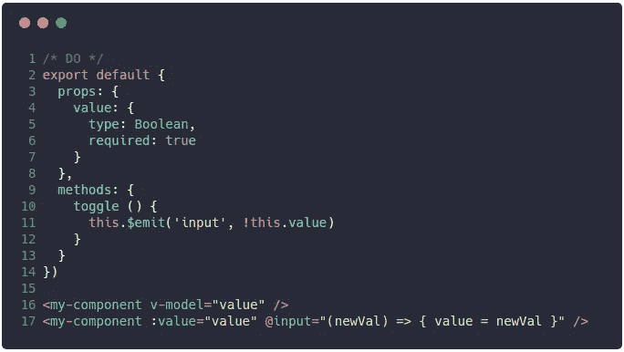**

****做。**使用事件发射器并监听事件。同样，`v-model`指令只是`value`道具+ `input`事件的糖**

**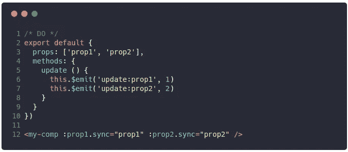**

****做。Vue 还有一个糖:`.sync`修饰符，它在`update:prop`事件时更新`prop`****

# **If/else 表单验证**

**当我发现有手动验证的表单时，我真的很困惑。它会生成大量无用的样板代码。**

**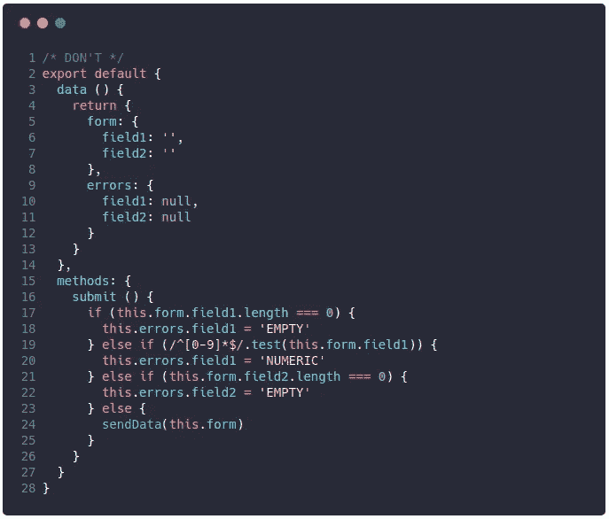**

****不要。在我的新项目中，我被类似的代码吓坏了。别傻了，有很多解决方法****

**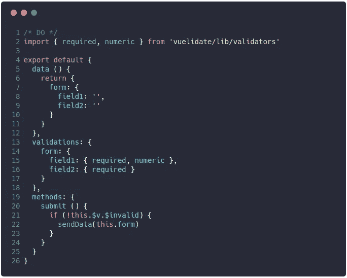**

****做。**使用 [**取消**](https://monterail.github.io/vuelidate/) 。只有一行包含每个字段的验证规则。干净的声明性代码**

**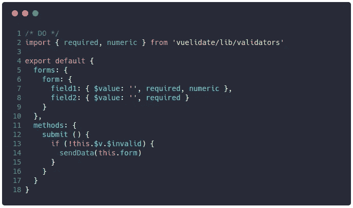**

****做。我还做了一个小的 [**插件**](https://github.com/Kelin2025/vuelidate-forms) ，允许你用一个对象声明表单数据和验证****

# **而不是结论**

**初级 Vue.js 开发者做的不全是罪，我敢肯定这个单子可能是无限的。但是我觉得已经足够了。**

**那么，你在 Vue.js 项目中看到了哪些*有趣的事情？如果您有什么要说的，请在此回复:)***

***感谢阅读！不要重复愚蠢的错误:)***

***特别感谢对[**carbon . now . sh**](https://carbon.now.sh/)有贡献的人。真的很好看！***