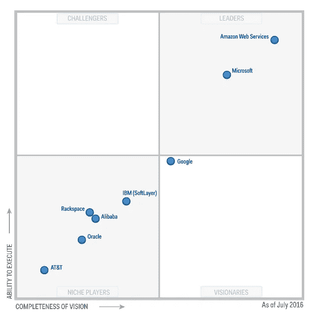

# 阿里巴巴的云有多普及？

> 原文：<https://itnext.io/how-pervasive-is-alibabas-cloud-c3d39ee3dcbc?source=collection_archive---------0----------------------->

成立于 2009 年的[阿里云](https://intl.aliyun.com/)，中国电子商务[阿里巴巴](https://www.alibaba.com/)的云计算部门，已经稳步成为中国占主导地位的云服务提供商。该公司最近被列入最新的 Gartner 的[公共云存储服务魔力象限](https://www.gartner.com/doc/reprints?id=1-3B2QZIM&ct=160705&st=sb)，为云计算和数据管理提供可扩展的平台。阿里云服务于 57.7 万付费客户，包括 [Koninklijke Philips](http://www2.alizila.com/royal-philips-and-alibaba-group-ink-comprehensive-cloud-agreement) 、[施耐德电气](http://www.schneider-electric.com/ww/en/)和营销平台 [Blogmint。](https://www.blogmint.com/)

根据奥本海默 7 月份发布的研究报告，“阿里云被严重低估了”。Oppenheimer 的分析师 Jason Helfstein 写道，“中国的云产业正处于大规模增长的边缘，阿里云是最有优势的参与者。”他补充说，除了阿里云在基础设施领域的领先地位，中间件、安全性和定价也是该细分市场的关键优势。

下图改编自 Gartner(2016 年 7 月)，说明阿里云是 Gartner 公共云存储服务魔力象限中的利基参与者。

阿里巴巴 2017 财年第一季度显示，收入同比增长 59%。在同一时期，云计算收入同比增长 156%，达到 1.87 亿美元，超过了华尔街的估计。

阿里云的增长速度比 AWS 快，而且这种增长势头有望持续。据[彭博](http://www.bloomberg.com/news/articles/2015-04-23/you-thought-amazon-s-cloud-was-big-alibaba-s-is-huge)称，与云市场成熟的美国不同，中国只有不到 10%的 IT 支出用于云计算。此外，[中国的网络安全法和数据主权](http://www.pwccn.com/webmedia/doc/635786996710002129_rcs_cybersecurity_law_sep2015.pdf)对阿里云来说是一个巨大的优势，同时也阻碍了其他竞争对手，如亚马逊网络服务和微软 Azure。

以下图表改编自[福布斯](http://www.forbes.com/sites/greatspeculations/2016/05/20/amazon-vs-alibaba-cloud-computing-infrastructure-growth/#646780822fcb):亚马逊 Vs 阿里巴巴:云计算&基础设施增长

云计算和

基础设施收入

单位

2013

2015

2018 年 e

亚马逊网络服务(AWS)收入

CAGR

十亿美元

%

3.1

7.9

59%

20.1

37%

阿里云计算收入

CAGR

十亿美元

%

0.1

0.4

77%

1.0

39%

全球云计算市场

CAGR

十亿美元

%

56.0

80.0

20%

112.0

12%

中国云计算市场

CAGR

十亿美元

%

1.5

3.1

45%

9.5

45%

**战略合作伙伴关系和国际扩张**

另一方面，对于亚马逊和微软占主导地位的阿里巴巴来说，在国际上发展更具挑战性。为了应对这一挑战，阿里巴巴已经与全球最大的基因组学组织 [BGI 基因组学](http://www.bgi.com/aliyun-partners-bgi-launch-cloud-based-genome-analytics-engine/#site_selection)、[英特尔公司](https://intl.aliyun.com/forum/read-57)、 [Equinix 公司](http://www.prnewswire.com/news-releases/equinix-and-aliyun-collaborate-to-offer-direct-access-to-cloud-services-across-asia-and-north-america-300094438.html)以及托管服务提供商 [LINKBYNET](http://www.linkbynet.com/index.php/news/linkbynet-signs-global-partnership-agreement-with-alicloud-the-leading-chinese-cloud-computing-services/) 等知名国际公司建立了战略合作伙伴关系。

今年 1 月，该公司与芯片和图形提供商 NVIDIA Corp. 就高性能计算(HPC)建立了 10 亿美元的合作伙伴关系，这是中国第一个面向 HPC 的 GPU 加速云平台。此外，阿里巴巴已经与 HTC 签署了[合作伙伴关系，将阿里云的先进云技术用于](http://www.prnewswire.com/news-releases/alibaba-cloud-partners-with-htc-to-advance-virtual-reality-development-with-cloud-computing-solutions-300310934.html) [HTC VIVE 虚拟现实耳机](https://www.htcvive.com/eu/)。

阿里巴巴雄心勃勃的全球扩张不止于此。今年 4 月，该公司还推出了全球初创企业计划 [Create@Alibaba Cloud](https://intl.aliyun.com/startup) ，让初创企业能够访问其云基础设施以及售后支持。

**投资云基础设施**

阿里云也一直在寻求全球云基础设施的扩张。到目前为止，该公司在全球有七个这样的工厂，其中两个在美国..

正如 siliconangle 所描述的，分布式基础设施是云公司的一个关键卖点——这使得它对于在全球范围内销售服务的公司来说是一个更具吸引力的选择。此外，分布式基础架构为客户提供了更多的故障切换位置选择。