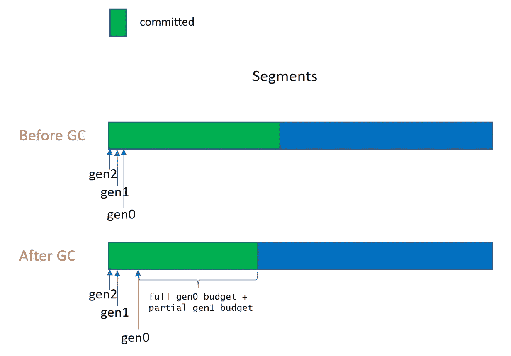
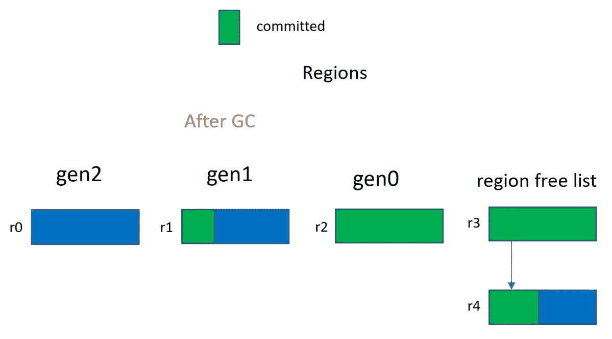
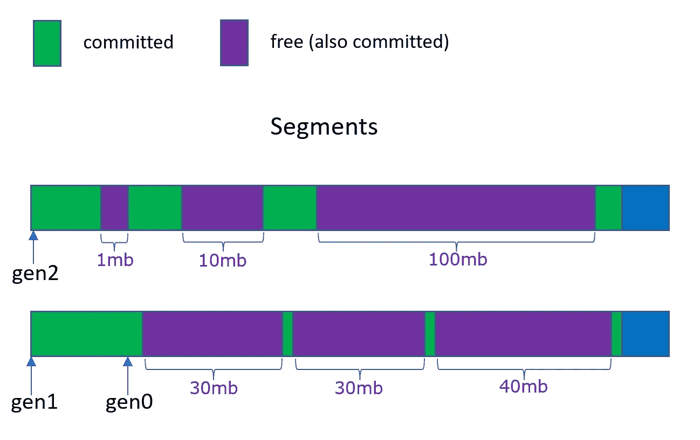

# 段和区域在。NET 7 GC

> 原文：<https://itnext.io/how-segments-and-regions-differ-in-decommitting-memory-in-the-net-7-gc-68c58465ab5a?source=collection_archive---------0----------------------->

我们只是在默认情况下打开 GC 中的区域*来捕捉下一个源。上周一发布了. NET 7.0 预览版(该版本将于四月份发布)。所以我想解释一下**区域特性在从段中释放内存的策略上有什么不同**，这样你就可以评估如果你决定尝试一下，你看到的是不是设计好的东西。**请注意，区域功能仅在 64 位中可用，目前我们在 macOS 上禁用它。**因此本文中的所有内容都将假设为 64 位。此外，我们仍处于开发周期的中期。NET 7.0 所以我会提到以后可能会改变的东西。*

正如我一直说的，我们在工作中经常要做出权衡。区域提供了更多的灵活性，这也是我最初想这么做的原因。在[我上一篇关于区域的博客文章](https://devblogs.microsoft.com/dotnet/put-a-dpad-on-that-gc/)中，我提到了其中的一些权衡。今天，我将专门讨论释放内存，因为 GC 堆占用多少内存是我们的客户最关心的指标之一。因为我不想让这个变得太长，我将**在这个博客条目**中限制对服务器 GC 的讨论，因为使用服务器 GC 运行的应用程序通常有更大的堆和更长的运行时间，所以当内存被释放时尤为重要。像往常一样，因为我知道我的许多读者也对 GC 的内部工作感兴趣，所以我将触及相关的设计/实现细节。

提交内存非常简单——GC 只是根据需要提交内存——它不会一次提交一个页面，那样会有很大的开销。它通常一次提交 16 个页面(如果分配的对象大于 16 个页面，当然需要提交更多，因为每个对象总是占用连续的内存空间)。这在。NET 6.0 GC 和。净 7.0 GC。

去承诺，奥托，是一个非常不同的故事。你不想放弃那些你知道很快就会用到的内存，因为那样你就不得不付出代价去放弃并再次放弃。但是如果空间没有被利用，你也不想留下太多的承诺。因此，我们制定了政策，规定了我们的承诺量和承诺时间。注意**空闲空间根据定义总是提交的内存**,因为它们被算作堆上正在使用的内存的一部分(它只是当前由 free 类型的对象使用，并且将用于容纳到该代的分配)。我们能取消自由空间吗？从技术上来说是的，但是这需要在区域/段上的另一层非平凡的内存管理。所以**我们只在最后一个活动对象**之后解提交一个段或一个区域的结束，但从不解提交该段/区域上第一个和最后一个对象之间的空闲对象所占用的内存。

如果每次我听到有人说“GC 从不放弃内存”或“GC 从不放弃内存，除非内存快用完了”，我都有一美元，我就能买得起一台相当不错的浓缩咖啡机了(我刚刚在周末试用了几台浓缩咖啡机…这就是我怎么知道的)。这些根本不是我们使用的政策。首先，让我们来谈谈段是如何释放内存的。

# **细分市场和区域的分解细节**

**片段的大小比区域大得多。**对于 SOH 段(它们总是相同的大小)，在服务器 GC 中，如果您有> 8 个堆，它就是 1GB，这是服务器工作负载的常见情况。UOH 段(意味着 LOH 和 POH)一开始要小得多(256mb ),但是如果需要的话可以更大。这意味着很有可能每个堆只有一个段。假设您有一个 20GB 的堆，全部在 SOH 中，并且您的应用程序运行时有 48 个堆，则每个堆只能获得一个段。如果是这样的话，对 SOH 来说，这意味着我们只在这一部分上放弃承诺。由于 gen0 始终位于该段(我们称之为堆的临时段)的较高地址端，这意味着我们的策略只需定义如何为临时段解除段空间末端的提交。关于如何组织分段的更多细节在[这里](https://github.com/Maoni0/mem-doc/blob/master/doc/.NETMemoryPerformanceAnalysis.md#physical-representation-of-the-gc-heap)描述。

对于短暂段，我们的策略规定，在阻塞 GC 结束时的最后一个活动对象之后，我们将只提交(全部第 0 代预算+部分第 1 代预算),而不提交其余部分(如果有的话)。下面的图 1 说明了在第一次 GC 之前和之后在短暂段上提交的变化。在提交最后一个活动对象后，我们保留(全部 gen0 预算+部分 gen1 预算),并取消提交其余的预算。在图 1 中，我举例说明了一个场景，其中 gen0 为空，gen1 变得更大，因为它现在保存了 gen0 的幸存者。

图 1 第一个 GC 的入口和出口

好吧，这对于服务器 GC 来说并不准确——从开始。NET 5 中，我们不再在阻塞 GC 期间进行实际的解提交工作，所以我们所做的只是在段上记住我们想要解提交的地址(即，高于该地址的段部分将被解提交)。并且反提交工作与用户线程同时在堆的服务器 GC 线程之一上运行。我们确保至少提交完整的 gen0 预算空间量，因为我们希望避免在 GC 线程和可能需要在同一段上提交更多空间的分配线程之间引入同步。正如我们将在下面看到的，这是我们不再有区域的限制之一。

对于 gen2 和 UOH 段，策略非常简单——我们只需在最后一个活动对象结束后取消提交。当然，除非我们真的在做 gen2 GC，否则没有什么可放弃的，因为如果我们不收集一代，那一代就不可能变得更小。对于 BGC，这是并发发生的(我们选择不并发阻止 gen2 GCs，因为我们经常在内存紧张时阻止 gen2，所以我们希望尽快取消提交)。

在关于诊断托管内存泄漏的[我的演讲](https://www.youtube.com/watch?v=ImeiUzbdMzc)中，我对提交和解除提交有非常详细的解释。如果你想要更多的信息/插图，我会推荐你观看《T4》中不同代的 GCs 是如何解散的。我再怎么强调这一点也不为过——我们的 GC 是分代 GC，因此分代方面在性能分析中非常重要。

**区域要小得多——默认为 4MB(对于 SOHUOH 区域默认为>= 32MB)**我们保留了一个空闲区域池，用于保存完全为空的区域。这让我们可以在几代人之间自由交换记忆。因此，如果 gen0 释放了一个区域，并将其放在空闲区域列表中，并且如果 gen1 或 gen2 需要新的区域，则 gen0 释放的区域可以用于满足这样的请求。

更大的灵活性意味着更大的复杂性。现在，我们需要对这些较小的内存单元进行更多的管理。同样，对于段，我们也不希望保留太多的空闲区域，但也不希望保留太少的区域，否则会导致我们陷入“取消提交，然后必须立即重新提交”的境地。但是对于区域，我们有额外的方面需要考虑。下面是几个例子

*   当我们需要一个地区时，该选择哪个地区？我们是选择一个更忠诚还是更不忠诚的？考虑如何使用一个区域—如果我们得到一个仅部分提交的区域，假设提交了 2mb，而我们需要超过 2mb。我们会在这个地区投入更多。如果我们在空闲列表中有另一个完全被占用的区域(即 4mb)，我们会希望使用那个区域。但是您可能会说“如果我需要一个只有 2mb 提交的区域，我不正是想要那个部分提交的区域吗？”。是的，但是你什么时候需要 2mb 的区域呢？如果 gen0 分配预算是 10mb，那么您需要 2 个完全提交的区域+ 1 个提交 2mb 的区域。我们知道其中一个将位于 gen0 区域列表的末尾。因为区域大小很小，这意味着我们在一代中只需要区域列表尾部的部分提交区域。因此，我们的政策是，我们总是挑选最投入的，如果需要的话，在尾部区域进行分解。
*   总共要保留多少个区域？与细分市场一样，我们希望保持区域承诺的分配预算价值，因为我们希望分配那么多。然而，有时 GCs 的发生并不是因为超出了分配预算。换句话说，即使没有超出分配预算，我们也可以将代提升为集合。因此，我们确实使用预算来决定我们想要取消多少区域，但是我们也想注意是否有空闲区域一直没有被使用。对于这些地区，我们确实希望解除它们的承诺。

我们确实为每一代保留了至少一个区域，因此，例如，在 GC 之后，即使我们发现 gen0 为空(如果您没有 pin，这是很可能的)，我们也会在 gen0 中保留一个区域。如果 gen0 不为空，我们保留 gen0 区域列表中的所有非空区域，并将其余区域返回到空闲区域列表。我们在一代中保留至少一个区域的原因主要是出于历史原因——在段中，我们总是为一代保留一个段(多代可以共享一个段，但是如果你为一代枚举段，你总是得到至少一个段)—我们并不严格必须这样做，但是每代至少有一个区域的不变量使实现更容易。我实际上尝试过去掉这个不变量，但实际上并没有签入它，因为它不值得这么复杂。

图 2 示出了在第一次 GC 期间发生的情况，假设 gen0 预算开始时占据 2.x 个区域。在 2.a 中，我们有 2.x 个区域在第一个 GC 进入时提交。请注意，片段和区域之间的相对大小显然不是精确的。

图 2.a 第一个气相色谱入口

图 2.b 第一个 GC 出口处

在 2.b 中，我们看到区域空闲列表现在包含两个区域。**如果空闲列表中有太多区域，我们将从空闲列表中删除一些，并将它们添加到取消提交列表中，然后取消提交**(取消提交列表未在图 2 中显示)。如上所述,“太多”是由两个因素计算出来的——1)估计预算和我们在那一代已经拥有的地区之间的差异。例如，如果 gen0 预算是 10MB，这意味着我们将需要 3 个区域。我们在 gen0 中已经有了一个区域，这意味着我们还需要 2 个区域用于 gen0。我们对每一代人都这样做。2)如果我们观察到一个区域已经有一段时间没有被使用了，也就是说，它们的年龄太大了，我们将不再使用它。现在我们只是将它设置为 20 GCs，但是我们会根据内存情况动态调整它。

现在**SOH 和 UOH 的所有代都有单独的免费列表。我们还没有做到这一点，但如果需要的话，我们会为 SOH 重新调整 UOH 自由列表上的区域。**

对于 gen0 和 gen1，如果需要，我们还会根据预算计算来取消尾部区域的结束。通常 gen0 会有一个以上的区域，但是 gen1 可能非常小。因此，在我们执行 gen1 GC 后，如果该区域上的大多数对象都死了，我们将取消提交区域空间的结尾。因此，如果第 1 代地区有 4MB 的承诺空间，而当前有 500KB 在使用，而其预算只有 1MB，这意味着我们将在该地区结束时取消承诺(4MB — 500KB — 1MB) = 2.5MB(如果第 1 代中有可用空间，我们还估计其中一部分可用于第 1 代分配)。当有很多堆的基准只使用很少的内存时(不幸的是，这些小基准经常会出现这种情况)，这可能会产生很大的不同。与段一样，我们也同时进行这种解提交工作，但是如果我们需要解提交 gen0 尾部区域，我们只需要与分配线程同步。大部分解除提交工作将由解除提交列表上的区域处理(根本不需要同步),因此该区域的解除提交工作无论如何都很小。

# **区域和分段之间的去委托差异**

现在，我们可以根据上面的内容总结不同之处了— **对于空闲列表上的区域，我们现在不提交区域空间的结尾。** **这将弥补各细分市场和地区之间在稳定状态下承诺规模的大部分差异。**当我们根据分配预算计算我们需要多少个区域时，我们会将其四舍五入为一个区域。因此，如果预算说我们需要在空闲区域保留 9mb，我们会将其四舍五入到 12mb，并为其保留 3 个空闲区域，这意味着如果这是 3 个完全承诺的区域，我们可以在其中一个区域中取消承诺 3mb。目前，我们不会为这些区域取消区域空间的结束，我希望我们会这样做，尤其是对于大型区域。所以对于 SOH，你可以在自由列表中有 3 个这样的区域。对于 UOH，可以有两个这样的区域(LOH 和 POH)。当然，这是假设您在空闲列表中有这样的区域。如果你根本不做 LOH/POH 分配，你就只有 LOH/POH 上的一个区域，而没有任何大的区域在区域空闲列表上。如果你的堆相当大，除非你碰巧有额外提交的空闲区域，这应该不会对你有太大影响。但是如果真的发生了，**请让我们知道！你可以在我们的 GH repo 中提出问题，或者对这篇文章发表评论。**

# **在申请的不同阶段提交**

*   **巅峰对决**

提交的峰值通常发生在启动阶段，这实际上是指当您分配大量长期数据时，GC 会调整预算。当预算达到最大值时，承诺的规模也达到了顶峰。对于短期运行、小型基准测试，通常的模式是在开始时分配静态数据，这意味着 GC 会观察到高存活率，并为相关代分配高预算，因此 GC 只有在分配了相当多的数据后才会触发。那将是顶峰。稍后存活率将下降，这意味着预算将减少，也意味着在 GCs 触发前分配的内存将减少。因此提交的大小会更小。

我们调整预算的政策对于细分市场和地区是相同的，因此理论上峰值应该是相同的。然而，在实践中，你可能会观察到峰值波动，只是因为预算可能会被调整得相当大。因此每次跑步的峰值可能会有所不同。但这种波动既适用于细分市场，也适用于地区。此外，GC 调整也发生了变化，即使预算计算是相同的，我们仍可能触发不同的 GC，只是因为从细分市场到地区，决定哪一代 GC 的一些因素发生了变化。例如，我们不再受“段结束”因素的限制—对于段，如果我们接近短暂段的结束，我们将触发 gen1 GC。对于地区来说，这不再是一个因素，因为如果预算允许，我们可以获得另一个地区。要分析这种差异，最好的方法是[捕获顶级 GC 跟踪](https://github.com/Maoni0/mem-doc/blob/master/doc/.NETMemoryPerformanceAnalysis.md#how-to-collect-top-level-gc-metrics)。

*   **稳态提交**

小基准测试的稳定状态可能会明显高于区域，因为我们不会为空闲列表上的区域解除区域空间的结束。这意味着每代你最多可以得到 1 个区域(因为预算是按区域大小四舍五入的)。当然，对于小型基准测试，因为它们可能只有一个 gen1/gen2/LOH/POH 区域，实际上这意味着 gen0 几乎只有一个区域。请注意，这是针对每个堆的，因此，如果您在服务器 GC 中有许多堆，而您的总堆大小很小，则这个因素会导致段数的显著增加。但是，具有大量堆的小堆并不是正常的设置。

# **致力于不同规模的工作负载**

*   **工作量较大**

对于大的工作负载，这些差异变得相对小得多。如果整个堆是 10GB，这意味着如果每个堆恰好有差不多 1 个区域的空间可以被释放，但没有被释放，这只是整个堆的一小部分(例如，如果有 48 个堆，4MB*48/10GB=2%)。如果我们每个堆有 3 个这样的区域(即 gen0、gen1 和 gen2 ),那就是 6%。我确实希望我们在 UOH 方面做得更多，因为到目前为止，我们还没有对 UOH(尤其是 LOH)做太多的性能分析。正如你所看到的，如果它恰好是一个大区域，这个“几乎 1 个区域”的因素可能非常重要。

我还希望我们做更多的工作来处理高内存负载的情况。首先，我们希望加速区域老化。

*   **如何应对有许多堆的小型基准测试**

对于内存使用率低的小型基准测试，您可以通过设置 DOTNET_GCRegionSize env 变量来减小区域大小(这些运行时 env 变量过去被称为 COMPlus_X，现在我们建议您将其重命名为 DOTNET_X)。它必须是 2 的幂。我们建议将它设置为 1MB，特别是当你有很多堆的时候

设置 DOTNET_GCRegionSize=100000

请注意，我们将在中对更多工作负载进行性能实验。NET 7，默认的区域大小可能会改变。我们不希望区域太小的原因是它增加了搜索/排序的成本。

# **现在实施后，哪种工作负载的内存使用情况会因地区而有所改善？**

显然，我们将继续努力利用各地区赋予我们的灵活性。NET 7.0。到目前为止，您会注意到内存使用方面最明显的改进是，如果堆上有非常大的空闲空间，如果它们大于一个区域的大小，这意味着它们将被自然地释放到空闲列表中，并在一段时间没有使用后被取消提交。所以堆的大小自然会更小。当您主要只为第二代 GC 做 bgc 时，这种情况会发生(并且已经观察到)。由于 BGC 没有压缩，它的工作是在第二代中建立自由空间，以容纳第一代幸存者。但是，如果您的分配/存活模式发生变化，并且在某一点上您的应用程序消耗了更多的内存，您可能会观察到 gen2/UOH 中有越来越多的空闲空间。地区肯定会有所帮助。我见过有人拥有 10 或 100 MB 的空闲空间。这些将被返回到区域自由列表，最终如果不再使用，它们将被取消提交。在图 3 中，我举例说明了在 gen2 和 gen0 中有大量空闲空间的情况(由于长时间的 pin，在 gen0 中看到大量空闲空间是很常见的，对于网络场景，您经常会在 PerfView 的 GCStats 视图中看到 gen0 相当大，碎片率为 99%)。

图 3 带有段的堆的 SOH 部分的示例

1mb 的可用空间将会存在，但大多数其他可用空间将被释放到可用区域，如果没有使用，将会被取消提交。这意味着堆的提交大小将会小很多。

如果你在跑步。NET 6.0，并想尝试。NET 7.0 GC，但不想升级到。NET 7.0(例如，预览版可能有一个问题会影响到您)，您可以从 7.0 分支中自己构建一个 clrgc.dll，并将其放入您的。NET 6.0 安装在 coreclr.dll 旁边。现在，您可以通过设置这个环境变量来使用 7.0 GC

`set COMPlus_GCName=clrgc.dll`

这样做的额外好处是，您不会受到 GC 之外发生的大量更改的影响，因此您看到的任何影响都纯粹是来自 GC 更改。

建设 clrgc.dll 的相关定义见 [gcpriv.h](https://github.com/dotnet/runtime/blob/main/src/coreclr/gc/gcpriv.h) 。如果你想构建一个使用区域的 clrgc.dll，你只需要将当前的`!defined (BUILD_AS_STANDALONE)` 翻转到`#define USE_REGIONS`到`defined (BUILD_AS_STANDALONE)`，那么 clrgc.dll 将使用区域，coreclr.dll 将使用分段。

展望未来，我希望将 clrgc.dll(甚至可能有两个版本，一个包含地区，另一个包含细分市场)与。NET SDK(目前它根本没有发布，这就是为什么你需要自己构建它)。