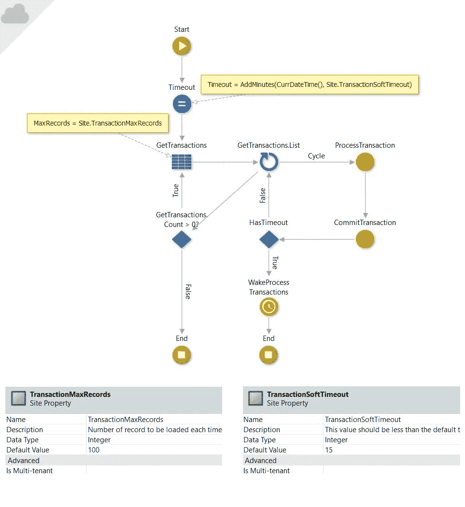
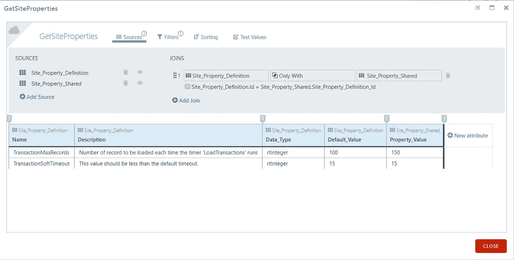
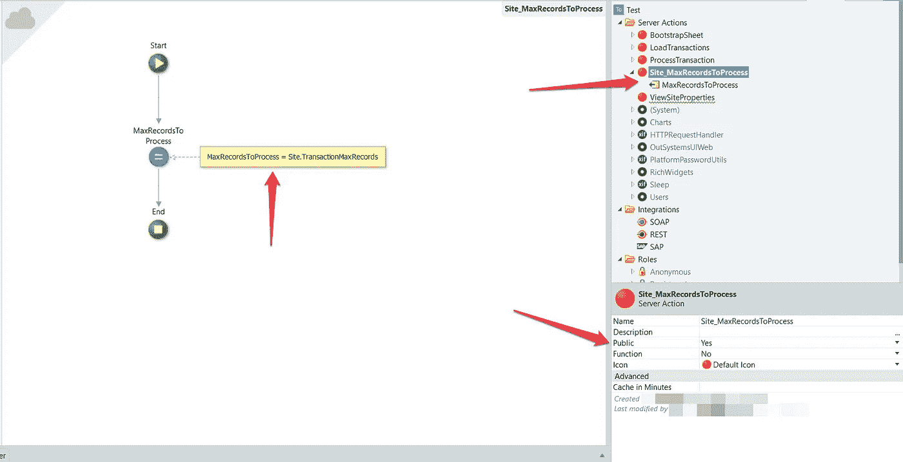

# 站点属性如何在外部系统上工作

> 原文：<https://itnext.io/how-site-properties-work-on-outsystems-8288cde70963?source=collection_archive---------3----------------------->

## 关于外部系统上的站点属性，您需要了解什么


内特·格兰特在 [Unsplash](https://unsplash.com?utm_source=medium&utm_medium=referral) 上的照片

Site Property 是 Outsystems Platform 的一个特性，主要目标是存储数据而不做太多更改。大部分时间它们被用来存储可配置变量，通常是 API 键、客户机 Id、客户机秘密值等等…我们可以将它们用于构建我们的应用程序所需的其他类型的配置。

让我们从站点属性的简单定义开始。

> 站点属性是存储原始数据类型的全局变量，它的值不会经常改变。

不仅仅是给你一个站点属性的定义，我还想告诉你如何使用它们，它们存储在哪里，以及改变它们的影响。

跟着我。

记住这个定义，让我们想象一个假设的场景，它会给你一个大画面。对于这个例子，我们创建一个计时器来处理一系列事务，我们将使用一个站点属性来设置要处理的记录数，另一个属性来控制计时器的软超时。

*该场景用于避免定时器意外超时。你可以在这个* [*链接*](https://www.outsystems.com/forums/discussion/55884/timers-default-timeout) *上查看更多。*

下一张图是关于已经创建并准备好处理事务的计时器。您可以在评论中看到创建和使用的两个站点属性。



站点属性和使用它们的计时器

因此，考虑到这两个网站的性质，让我们进入它。

# 它们存放在哪里？

我们的站点属性存储在 Outsystems 数据库中。我们可以在 Service Studio 上检查这些实体并引用它们，如下所示。


参考场地属性实体

正如我们所看到的，Outsystems 使用一些常规实体来存储站点属性信息。

站点属性记录存储在实体 **Site_Property_Definition，**中，我们将在其中找到名称、描述、数据类型、默认值等。为了找到站点属性的当前值，我们可以检查另外两个表， **Site_Property_Shared** 或 **Site_Property。**

第一个实体， **Site_Property_Shared** 是外部系统存储非多租户站点属性的实体，这些属性仅在创建它的模块上可见，并且**不，您不能将站点属性设置为 Public。**

第二个实体 **Site_Property** 是存储多租户站点属性的实体。该平台将为我们的每个租户创建这个站点属性，我们可以按租户而不是按模块配置它，这是最常用的方式。

在这两个实体中， **Site_Property** 和 **Site_Property_Shared** 我们可以看到站点属性的有效值。

为了给你一个例子，我将向你展示一个直接来自 Service Studio 的查询，显示来自我们的定时器的值。



获取站点属性值的查询

在这个例子中，我们通过站点属性名称进行过滤来获得这些结果。该过滤器是:

```
Site_Property_Definition.Name = "TransactionSoftTimeout" or Site_Property_Definition.Name = "TransactionMaxRecords"
```

# 幕后发生了什么

由于站点属性在数据库中，Outsystems 所做的是在我们第一次访问后创建一种方法将它们放入缓存中。想象一下这个场景:

在发布我们的模块来处理事务之后，模块缓存失效了，我们可以在 [Outsystems 文档](https://www.outsystems.com/help/servicestudio/8.0/Language_Reference/System_Actions_and_Functions/ESpaceInvalidateCache_Action.htm)中看到这一点。所以我们第一次使用 site 属性，在本例中， **Site。MaxRecordsToProcess**out systems 将对实体进行查询，以获取站点属性的当前值，并将其放入缓存中，下次我们访问该站点属性时，该值将在缓存中，平台不需要再次进行查询来获取该值。

一旦我们在服务中心发布了模块或更改了站点属性值，缓存就会失效，然后重复这个过程。

# 如何跨模块共享站点属性

在本文中，我提到站点属性不能是公共的。这是当我们需要在几个模块中使用站点属性时出现的问题，例如，如果我想使用我们的站点属性 **Site。其他模块中的 MaxRecordsToProcess** 。

对于这种情况，以及许多类似的情况，方法是创建一个操作来返回站点属性值并将其公开。



跨模块公开站点属性的公共操作示例

考虑到我们读到的关于站点属性的所有内容，需要考虑的最重要的部分是:**不要以编程方式更改**站点属性，并且要记住，每次您在服务中心更改一个或多个站点属性时，该模块的缓存都将失效并再次重新加载。

想了解我更多吗？查看[网站](https://tiagoagostinho.com)。

```
References:
1.[https://www.outsystems.com/forums/discussion/11484/how-do-site-properties-work-under-the-hood/](https://www.outsystems.com/forums/discussion/11484/how-do-site-properties-work-under-the-hood/)2.[https://success.outsystems.com/Documentation/11/Reference/OutSystems_Language/Data/Handling_Data/Site_Property](https://success.outsystems.com/Documentation/11/Reference/OutSystems_Language/Data/Handling_Data/Site_Property)3.[https://www.outsystems.com/help/servicestudio/8.0/Language_Reference/About_Site_Properties.htm](https://www.outsystems.com/help/servicestudio/8.0/Language_Reference/About_Site_Properties.htm)4.[https://www.outsystems.com/help/servicestudio/8.0/Language_Reference/System_Actions_and_Functions/ESpaceInvalidateCache_Action.htm](https://www.outsystems.com/help/servicestudio/8.0/Language_Reference/System_Actions_and_Functions/ESpaceInvalidateCache_Action.htm)
```