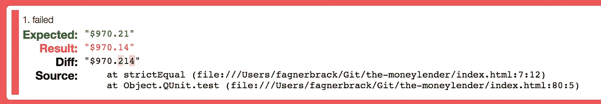
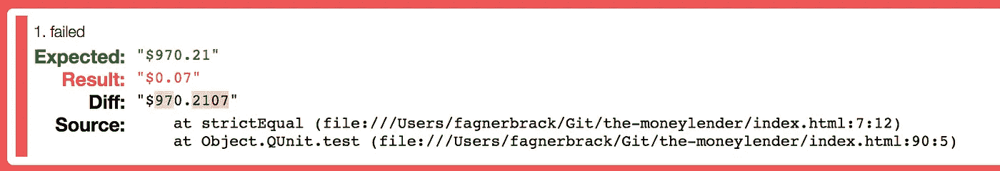
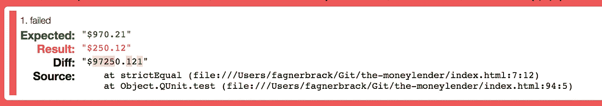

# TDD 如何防止过度工程化

> 原文：<https://itnext.io/how-tdd-can-prevent-over-engineering-1265a02f8863?source=collection_archive---------2----------------------->

## 一个可以强迫你只写你需要的代码的纪律

一个留着短胡须的秃顶男人的照片。他在桌子上用电脑，面带微笑。这是[第一帖](/the-missing-practical-step-by-step-test-driven-development-a7140ca4b71)中照片上的同一个光头男子，只是现在他周围没有了阴影。

重构至关重要。它允许您用最少的努力修改代码的结构。在关于[“放债人杰克”](/the-missing-practical-step-by-step-test-driven-development-a7140ca4b71)的故事的最后一章中，你将看到 TDD 作为一种[纪律](https://hackernoon.com/how-to-fix-the-software-industry-c2b627ec3d9d)如何防止你落入[过度工程](https://hackernoon.com/how-to-accept-over-engineering-for-what-it-really-is-6fca9a919263)的陷阱。

在[的第一篇文章](/the-missing-practical-step-by-step-test-driven-development-a7140ca4b71)中，我以杰克的故事开始，一个放债人寻找更好的方法来计算他的贷款利息。

事情是这样的:

> 嗨，我是杰克。我的业务是发放贷款。我可以给你一笔小额贷款，但是如果你这么做了，我会对超过一定限额的每一美元收取利息。
> 
> 你能为我做一些计算吗？
> 
> 0 美元到 2000 美元=无利息
> 
> 从 2001 美元到 5000 美元=每美元 9 美分
> 
> 5001 美元到 10000 美元=每美元 14 美分
> 
> 10001 美元+ =每美元 21 美分

在第一篇文章[之后，Jack 最终开发出了一个产品，可以计算 2000 美元以上的每一美元的 0.09 美元的利息，直到无穷大。这是问题的第一个边界。在第二篇文章](https://medium.com/p/a7140ca4b71)之后，Jack 最终开发出了一个产品，它可以为超过 5000 美元的每一美元计算 0.14 美元的利息。

现在是时候为下一个边界开发代码，并重构代码以消除重复。这一次，代码需要为 10000 美元以上的每一美元计算 0.21 美元的利息。

像以前一样，有一个[存储库](https://github.com/FagnerMartinsBrack/jack-the-moneylender/commits/v3)，在这里您可以看到每次测试运行的一次提交。该存储库显示了单独提交中的红/绿/重构步骤。

*   提交有一个🔴当它代表**红色**步骤时。
*   当提交代表绿色的**步骤时，它有一个绿色的✅。**
*   提交有一个🔨当它代表**重构**步骤时。

我们开始吧。

> 杰克对目前的结果很满意。没有比这更好的了…是吗？

在[的最后一篇文章](/this-is-the-one-thing-nobody-told-you-about-tdd-7f549254cd74)中，您学习了如何编写代码来计算 5000 美元以上贷款金额的 0.14 美元利息。您可以按照相同的模式为 10000 美元以上的贷款金额创建利息代码。

第一步是为低于下一个范围的一美元创建一个通过测试。为此创建测试的原因是，您可以回顾现有算法的工作原理:

[✅加考贷款金额为 10000.00 美元](https://github.com/FagnerMartinsBrack/jack-the-moneylender/commit/70cd0b164eacb6db11cdd0a1405f54d286df7c8a)

接下来，您可以为下一个范围内的第一美元创建一个测试。

[🔴添加 10001.00 美元贷款金额的测试](https://github.com/FagnerMartinsBrack/jack-the-moneylender/commit/c4e334baf216e25fa2ebf267c58733b5d54ee581)

你预计现有的每 1 美元兑换 0.14 美元的算法仍然有效。因此，测试失败时会显示一条有意义的消息。

10001 美元贷款金额测试失败的屏幕截图。它预计值 970.21 美元。相反，它得到 970.14 美元。

现在按照[与](https://github.com/FagnerMartinsBrack/jack-the-moneylender/compare/a9c2ee4085d8e82a9256909239b2585f788d301d...ea640a56f0df1141f6103edd63d90019462a804f)[上一篇文章](/this-is-the-one-thing-nobody-told-you-about-tdd-7f549254cd74)相同的步骤。隔离前一个条件中大于$5000 的贷款金额的范围，并在新条件中开发大于$10000 的贷款金额的利息:

[🔴使用之前的代码作为 10001.00 美元贷款金额的参考](https://github.com/FagnerMartinsBrack/jack-the-moneylender/commit/153e370bf66c9dc81033b341b8750a8a1593fcfa)

结果是一个有很多重复代码的新条件。此外，测试失败是因为您忽略了计算 2000 美元以上 0.09 美元和 5000 美元以上 0.14 美元利息的规则:

隔离前面的范围并创建用于计算超过$10000 的贷款金额的代码后，测试失败的屏幕截图。它预计值 970.21 美元。相反，它得到 0.07 美元。

一旦您复制了超过$5000 的贷款金额的计算，错误消息会发生变化:

[🔴复制大于 5000.00 美元](https://github.com/FagnerMartinsBrack/jack-the-moneylender/commit/b06c220303037d227c7278620100edda9d4a5424)的贷款金额的逻辑

当您复制超过$5000 的贷款金额的计算时，测试失败的屏幕截图。它预计值 970.21 美元。相反，它得到 250.12 美元。

一旦您复制了 2000 美元以上贷款金额的计算，测试就通过了:

[✅复制贷款金额大于 2000.00 美元的逻辑](https://github.com/FagnerMartinsBrack/jack-the-moneylender/commit/8d0fc82d315d02c5af90ae4aab26a51b65a3383e)

下面是删除所有幻数后代码的样子:

[代码](https://gist.github.com/FagnerMartinsBrack/620790572bdd7875d6fb4284eff95411)显示了应用[上一篇](/this-is-the-one-thing-nobody-told-you-about-tdd-7f549254cd74)相同步骤后的结果，包括所有的复制。

现在这看起来很混乱。代码有很多重复，到处都是硬编码的值。然而，这种混乱的代码是由测试驱动的。因此，它包含了许多可以带来深刻发现的模式。

为了揭示这些模式，你需要[重构](https://medium.com/@fagnerbrack/how-to-refactor-a-public-interface-317ed18d38a3)。您需要在不改变代码行为的情况下对代码进行小的修改。当你应用一个模块/类/函数的改变时，比如保存，程序的行为不会改变。

这就是为什么从[测试开始至关重要的原因——首先是](https://medium.com/@fagnerbrack/code-review-and-test-driven-development-4c19b69b5761)。如果你不写测试——首先，很难确保你测试的是正确的东西，并且当你重构时系统的行为不会改变。同样的，如果没有实践 Test- **Driven** ，很难理解你是根据[转换优先级前提](http://blog.cleancoder.com/uncle-bob/2013/05/27/TheTransformationPriorityPremise.html)来提高还是降低转换的级别。

> 当你改变代码时，你知道你在重构，下面的情况仍然成立:代码的[转换层次](http://blog.cleancoder.com/uncle-bob/2013/05/27/TheTransformationPriorityPremise.html)没有降低，测试保持绿色，并且遵循相同模式的未来测试也将保持绿色。

此时，代码对每个条件都有重复。消除重复的一个有效方法是创建一个函数，这个函数的参数是变化的值。

然而，事先很难知道新功能应该是什么样子。如果你想增加测试一直保持绿色的机会，并保持较小的变化，你可以从[纯函数](https://medium.com/javascript-scene/master-the-javascript-interview-what-is-a-pure-function-d1c076bec976)开始，这些函数**对它们的目的非常具体**。您可以在以后修改它们，使其更加通用。

也就是说，当贷款金额高于$2000 时，创建一个新的利率计算函数。将函数放在离提取的代码更近的地方是一个好主意，这样可以看到参数应该在哪个位置。

[🔨创建一个函数来计算大于$2000.00 的利息](https://github.com/FagnerMartinsBrack/jack-the-moneylender/commit/0dae8d7dca69ba228f2eee7399087ccb3603bbcb)

之后，将计算利息的函数提升到主函数“利息支付”之外的范围是一个好主意。虽然这违反了[严格性原则](https://medium.com/@fagnerbrack/the-strictness-principle-9997e483cafb)，该原则规定您应该只将变量保存在使用它们的范围内，但是这也允许您验证函数没有访问任何外部变量，即“副作用”如果你创建的函数可以访问外部变量，就很难改变它。如果测试在移动后没有中断，这意味着函数没有副作用。

在确保测试通过之后，将函数提升到作用域之外，并在其他地方替换逻辑。

[🔨提升函数以计算大于 2000.00 美元的利息](https://github.com/FagnerMartinsBrack/jack-the-moneylender/commit/408a2cd4b046672ed462c393f37253cb0cf4cfff)

> 当您将代码重构为一个新函数时，请验证它是否没有副作用。

如果您对其他每一个计算都做同样的事情，您最终会得到如下所示的代码:

[为每个计算创建一个函数后的条件代码](https://github.com/FagnerMartinsBrack/jack-the-moneylender/blob/7751e6903d56c3ece05652bc3940bcdd6d3f664e/index.html#L38-L75)。

你还是有重复的，但是看起来比以前好多了。有一个函数处理 2000 美元，一个函数处理 5000 美元，另一个函数处理 10000 美元。

[代码](https://github.com/FagnerMartinsBrack/jack-the-moneylender/blob/7751e6903d56c3ece05652bc3940bcdd6d3f664e/index.html#L10-L26)显示了计算每个范围的函数的实现。

当你重构的时候，如果有重复，保持函数尽可能的相似是很重要的。作为人类，我们是模式识别生物。如果你有看起来一样的代码，理解问题和发现有意义的模式就容易多了。

请注意，计算超过$2000 的贷款金额的第一个函数缺少一个参数，与其他函数的参数数量相同。你可以修好它。

[🔨添加函数的最后一个参数，以计算超过$2000.00 的贷款](https://github.com/FagnerMartinsBrack/jack-the-moneylender/commit/6fa4b940f35d088f14bc3079dab4c0a237cd33e1)

此外，所有函数的内部变量和参数都有不同的名称。让我们把它们变得一样。

[🔨将函数内部重命名为通用名称](https://github.com/FagnerMartinsBrack/jack-the-moneylender/commit/9c1093bdc3e2088d756d034eb73d9b7e7520cedc)

您现在可以看到，所有的函数都接受相同的东西:

*   贷款金额。
*   表示“范围结束”的数量
*   表示“每美元的利息”的金额
*   表示“以前每美元的利息”的金额

“贷款金额”是一个固定值。只有在主要功能“支付利息”的上下文中，输入才会发生变化“贷款金额”的值在每次计算的执行过程中不会改变。

其他的论点是不同的:

1.  根据正在运行的计算，代码使用不同的参数值“范围结束”、“每美元利息”和“每美元以前利息”来调用函数。
2.  计算每个范围利息的函数使用位置的[从属关系作为其参数，而不是名称](http://connascence.io/position.html)的[从属关系。那是一个](http://connascence.io/name.html)[不好的代码气味](https://medium.com/@fagnerbrack/code-smell-92ebb99a62d0)。

要解决不好的代码味道，并发现为什么代码用不同的参数调用函数，您可以应用 [DRY](https://en.wikipedia.org/wiki/Don%27t_repeat_yourself) 方法。创建一个表示变化参数的对象文字，然后[重用](https://medium.com/@fagnerbrack/how-to-solve-the-challenge-of-reusability-ac4edce069c9)它们。您可以从 2000 美元以上的贷款额的计算范围开始:

[🔨将大于 2000.00 美元的贷款范围存储在对象文字中](https://github.com/FagnerMartinsBrack/jack-the-moneylender/commit/70f37b57de09b248056596293fd19dbba45f78c3)

然后，作为第二步，在函数之外提升对象文本。假设这是一个[接口中断变更](https://medium.com/@fagnerbrack/how-to-refactor-a-public-interface-317ed18d38a3)，您需要更新其他条件中的所有外部函数调用，以使测试保持绿色。

[🔨提高 2000.00 美元以上贷款金额的范围](https://github.com/FagnerMartinsBrack/jack-the-moneylender/commit/07f8e7a20c076428134054ba86efb7e884b5f3de)

如果您对其他范围做同样的事情，并完全删除重复的内容，您将得到一段代码，它揭示了一种新的模式:

[删除所有计算利息的函数并用一个通用函数替换后的代码](https://github.com/FagnerMartinsBrack/jack-the-moneylender/blob/d886524c857c48a572d37aa3f98044a3efc00374/index.html#L16-L49)。

您可以看到导致该结果的[提交](https://github.com/FagnerMartinsBrack/jack-the-moneylender/compare/9c1093bdc3e2088d756d034eb73d9b7e7520cedc...d886524c857c48a572d37aa3f98044a3efc00374)。

现在您重构了代码，您可以看到只有一个返回，即“利息金额”，但是代码在每个条件中都复制了它。

让我们消除重复:

[🔨仅使用一个“利息金额”变量返回](https://github.com/FagnerMartinsBrack/jack-the-moneylender/commit/649a980a165fd3d45b8a3f4188216c7bfb060704)

现在仔细看看代码:

[显示前两个条件的代码](https://github.com/FagnerMartinsBrack/jack-the-moneylender/blob/649a980a165fd3d45b8a3f4188216c7bfb060704/index.html#L21-L30)。第 3 行和第 6 行有重复。

您可以看到贷款额大于$5000 的条件重复了贷款额大于$2000 的计算。它重复的原因是第一个条件仅在贷款金额小于$5001 时运行。

您可以转储第一个条件的右侧条件。如果这样做，您可以修复重复:

[🔨删除大于 2000.00 美元](https://github.com/FagnerMartinsBrack/jack-the-moneylender/commit/a38331bfdea55191a98930c97d23c67ef78fe229)的贷款金额的重复项

您可以对其余的代码做同样的事情:

[🔨删除大于 5000.00 美元的贷款金额的重复项](https://github.com/FagnerMartinsBrack/jack-the-moneylender/commit/b426e865f1f5486d828753ce3699c772e53fdaff)

结果如下:

[显示每个条件处理一个计算的代码](https://github.com/FagnerMartinsBrack/jack-the-moneylender/blob/b426e865f1f5486d828753ce3699c772e53fdaff/index.html#L16-L35)。

上面的代码清楚地显示了如果“贷款金额”大于 2000 美元、5000 美元或 10000 美元，算法如何计算利息。

现在是令人兴奋的时刻:

当你重构代码，使每个组件彼此相似，并去除[不好的代码味道](https://medium.com/@fagnerbrack/code-smell-92ebb99a62d0)时，不仅代码变得易于维护，而且你还会更好地理解你试图解决的[问题的模式](https://levelup.gitconnected.com/the-problem-you-solve-is-more-important-than-the-code-you-write-d0e5493132c6)。这样，你知道你是在朝着正确的方向进行概括，而不是猜测或过度设计。

> 在测试驱动开发中，你只需要写你需要的代码。没别的了。

您可以看到的另一件有趣的事情是，在范围和对它们运行计算的代码之间存在解耦。您可以将范围提取到一个 JSON 配置文件中。如果这样做，Jack 可以通过修改配置文件来修改代码的行为。他不需要每次想要修改遵循相同模式的行为时都向开发人员付费。

如果您不想将范围提取到配置文件中，您仍然可以重构代码以强调解耦。当您强调解耦时，您也有助于提高代码的可读性，不管您是否将数据移动到配置文件中。

> 测试驱动开发可以让你理解问题，创造更多的价值。

[🔨将每个范围移动到范围数组中](https://github.com/FagnerMartinsBrack/jack-the-moneylender/commit/3b1f5229ae3ac651ad144d91ae35896924af8651)

[🔨用动态索引替换循环中的常量索引访问](https://github.com/FagnerMartinsBrack/jack-the-moneylender/commit/43198498c83f4f9d6abd32f6115c7ebf4c869b96)

就是这样！下面是最终的代码:

[应用了这篇文章中的所有重构后的最终代码](https://github.com/FagnerMartinsBrack/jack-the-moneylender/blob/57933066a5bc460bed699968c3f3f556f85f7cdc/index.html#L16-L34)。

对于“[显而易见的](https://en.wikipedia.org/wiki/Cynefin_framework)”领域内的问题，你不会感受到 TDD 的大部分好处。在“显而易见”的领域中，原因和结果是非常清楚的，并且情况是稳定的。

对于那些被 [Cynefin 框架](https://en.wikipedia.org/wiki/Cynefin_framework)描述为“复杂”的问题，你会感受到 TDD 的大部分好处在“复杂”的领域中，因果关系并不明显，需要更多的分析。测试驱动开发是帮助你进行分析的一个很好的工具，因为它允许你问正确的问题。

“显而易见的”域的一个例子是向一个网站发送一个 HTTP POST 请求，该请求包含一些简单的数据，并且没有身份验证。您可以在命令行中使用 curl 和 run。

“复杂”领域的一个例子是创建内容管理系统。在 CMS 中，你需要在每一步问正确的问题，以获得关于领域如何工作的知识。

> 当你处理“复杂的”问题而不是“明显的”问题时，你会感受到 TDD 的大部分好处。

如果你在[第一篇文章](/the-missing-practical-step-by-step-test-driven-development-a7140ca4b71)之后一直在读这篇文章，现在你应该能够理解“放债人杰克”问题的每一个细节。这意味着您可以继续尽可能多地重构代码，并且确信您不会无意中引入错误。

测试驱动的开发和重构听起来可能是一个乏味的过程。然而，和任何技能一样，随着时间的推移，你会变得更好。通过练习，你的速度会增加。下次您遇到类似的问题时，您可能会更早地发现这些模式，并在很短的时间内完成所有这些工作。

杰克不仅仅选择任何人来解决他的问题。

他选择了职业程序员。

**又见** [你不知道的 TDD](https://medium.com/@fagnerbrack/you-dont-know-tdd-691efe670094) 。

感谢阅读。如果你有一些反馈，请通过 [Twitter](https://twitter.com/FagnerBrack) 、[脸书](https://www.facebook.com/fagner.brack)或 [Github](http://github.com/FagnerMartinsBrack) 联系我。

感谢 [Jay Bazuzi](http://jay.bazuzi.com/) 、 [Ian Tinsley](https://medium.com/u/c4ccb3ab8d17?source=post_page-----1265a02f8863--------------------------------) 和 **Kali** 对这篇文章的深刻见解。