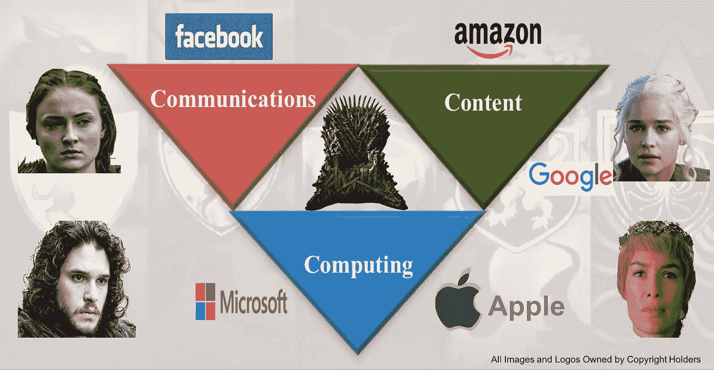
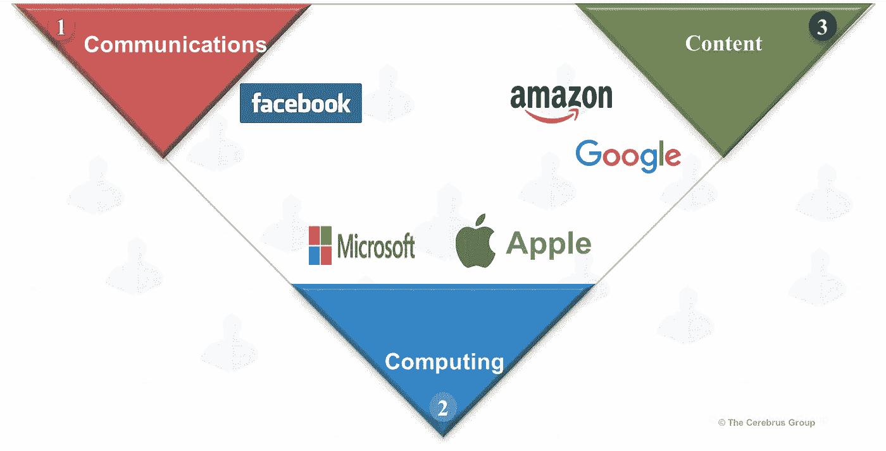
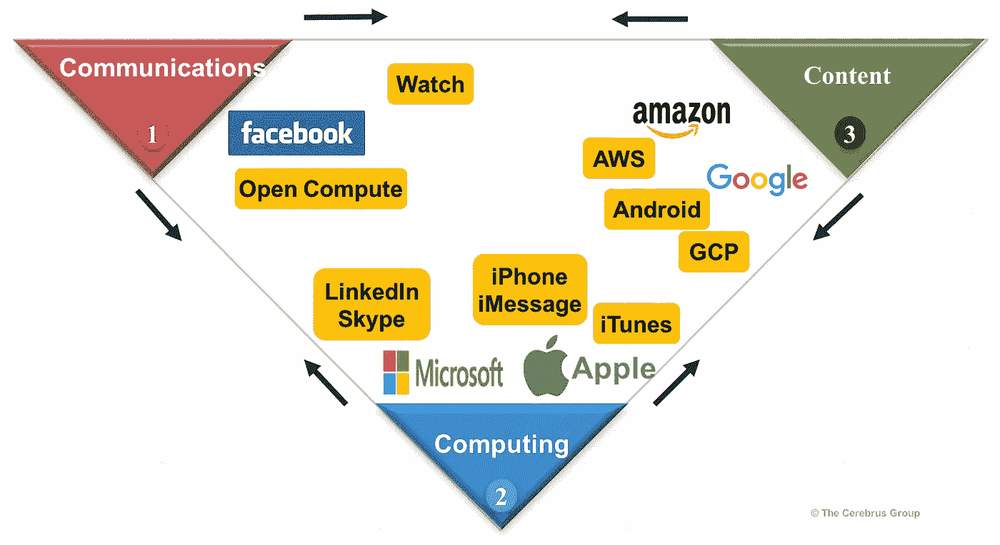
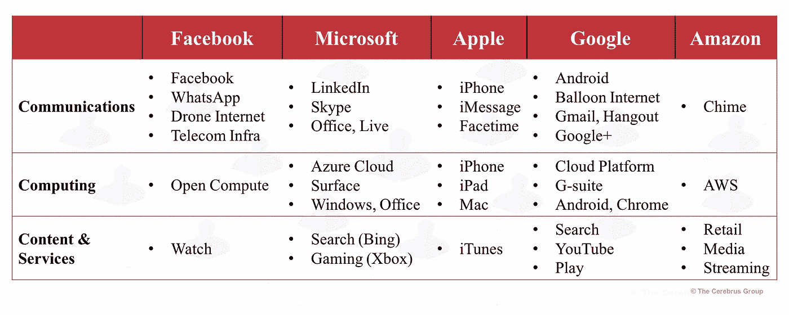
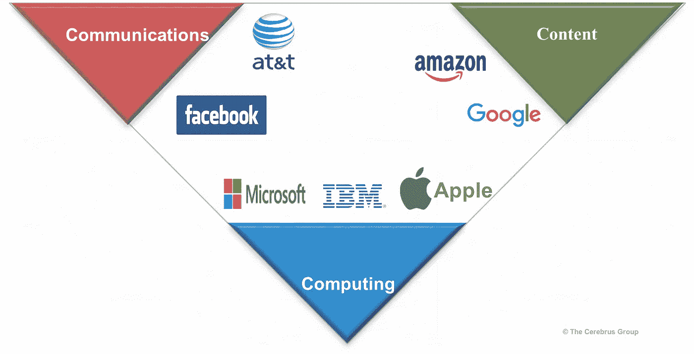

# 五大巨头如何控制 3C 的大战役正在展开

> 原文：<https://itnext.io/how-the-big-5s-mega-battle-to-control-the-3c-s-is-unfolding-182dfca035a?source=collection_archive---------0----------------------->

对通信、计算和内容控制权的争夺刚刚进入中期。

听到来自科技五巨头的消息已经变得司空见惯。 **FMAGA** 简称，如果你和我一样，想不起 5 大俱乐部里有谁。

有一天，我们听到他们谈论云或物联网。第二天，我们会听到新的手机、笔记本电脑、它们的超高清晰度，或者会和主人顶嘴的小玩意。然后我们会听到人工智能的大脑模仿，虚拟现实的世界模仿，或者气球驱动的互联网和无人机的巫术。

他们在玩什么权力的游戏？他们的竞技场是什么？他们想控制什么？

这是通过以下三个 C 的镜头来看 FMAGA 及其持续的攻击和抵抗:

1.  **通信:**包含所有形式的通信，包括电信、协作工具、社交网络、聊天等。
2.  **计算:**从个人到商业计算，从智能设备到云计算和软件栈(中间件或 PaaS，应用或 SaaS，以及新兴的分析和 AI 服务)。
3.  **内容:**实物商品、虚拟商品(数字内容)、游戏，以及流媒体以外的技术支持服务，如医疗保健和交通运输。

我们将看到每个 FMAGA 是如何在 **3C 的战场上开始他们的游戏的，**他们是如何进化的，并简要地将他们与& T 和 IBM 的技术老手进行比较。

# 开幕赛

下面是我们的主角 FMAGA 在 3C 战场的描述，他们在自己的地盘(可以说是他们的传统角落)开始了他们的游戏。

总结了法玛加在三个领域的开局策略:

*   通信:脸书通过虚拟社交网络诞生了 21 世纪的社交通信，并迅速试图利用他们的 2B+活跃用户。
*   计算:苹果和微软在这一领域持续了四十年之久的战争仍在继续。
*   内容:亚马逊主宰着向美国提供从书籍到杂货的实体内容。以及通过设备和流传输的虚拟内容。谷歌的传统也在这一领域，通过复杂的搜索让我们接触卖家和内容。

现在我们已经把他们的起点钉在了战场上，让我们用六十秒来看十年的进化。

# 中间的游戏

每个玩家都在努力保护自己的核心地位，同时雄心勃勃地向其他领域扩张。从每个公司的有利位置来看，**好斗的** **向其他领域移动**要么是**向左，要么是向右**，如下图箭头所示。黄色便笺显示产品、功能或他们为实现这一转变而引入的计划。

FMAGA 的攻击行为，从原来的角落向左或向右移动:

*   **脸书**:通过最近宣布的流媒体服务脸书**手表**向左移动到内容角。通过开放计算项目( **OCP** )获得经济高效的云计算。试图通过电信基础设施项目来捍卫他们对通信的控制。
*   **微软**:收购了 **Skype** 用于通讯和协作，又收购了 **LinkedIn** ，类似于脸书的商业网络。随着脸书自身向 B2B 服务领域扩张，当 B2B 和 B2C 方式发生冲突时，3C 战场的左侧应该是一个有趣的观察点。
*   苹果公司:10 年前转向通信领域，之后销售 1B+融合移动通信和计算设备。它加强了与苹果 **Messaging** 和 **FaceTime** 的沟通；移至右侧，通过 **iTunes** 和 **AppStore** 提供内容和应用。
*   **谷歌**:通过**安卓**、 **Chrome** 、谷歌云平台( **GCP** )转移到通讯(2B+安卓设备)和计算；通过 **gmail** 、 **Hangout** (视频/会议)和 **Google+** 转移到社交和通讯。
*   **亚马逊**:通过令人敬畏的**亚马逊网络服务** (AWS)向左转移到计算领域，微软凭借 **Azure** 云稳固地捍卫其计算领域的大本营；随着统一通信服务向右移动，**钟声**。所有这一切，同时大规模扩大物理和虚拟内容和服务的地盘。

这里是一个总结的 FMAGA 的产品和倡议，在每个领域的 3C，以显示中间的游戏阶段。【注:不全面且不断变化的列表】。

嗯，尽管简化了三个桶的分类，但确实有很多东西要处理！基于实验室中正在进行的“登月”努力，我们可以在这里盘点更多。

争夺 3C 的战斗正在激烈进行。感觉我们仍然处于即将到来的更大战斗的风口浪尖，建立在这些乐高积木上。

# 马贝尔，大蓝，还有法玛加

让我们不要忘记上个世纪的庞然大物。下面是美国电话电报公司和 IBM 以及 FMAGA 的主场。

通过收购时代华纳(Time Warner)和 DirecTV，新的美国电话电报公司显然试图通过收购内容创作和交付领域的旧世界玩家，在新的媒体和娱乐世界中发挥作用。【此处参见[AT&T 马贝尔与脸书的对比】。](https://medium.com/cerebrus/is-facebook-the-at-t-of-the-21st-century-569064759ea4)

IBM 正试图应对云计算和人工智能的新计算世界。蓝色巨人**能像 FMAGA 一样快速地从云中更新和交付**令人难以置信的企业软件和协作产品吗？它能在一个自助式、[预制的云技术世界](https://medium.com/tinted-glass/prefabricated-it-stack-33c0fc86b66f)中重复其**服务主导的战略**吗？它能使用 **Watson** 作为战斗口号和伞状投资组合封面吗(比如说， **WebSphere** 用于中间件)？

我希望那些老守卫者能和 FMAGA 一较高下。将野蛮人拒之门外并不容易。(热情的《权力的游戏》粉丝们请注意:尽管我对此充满希望，但我听到了阿多绝望的“抓住门”呼喊的遥远回声[。](https://www.romper.com/p/what-does-hold-the-door-mean-on-game-of-thrones-hodors-backstory-is-revealed-11064)

# 下一个:更大还是更小？

不像《权力的游戏》,我们不能穿越时空看到未来十年。我们可以假装成未来主义者，做出无法证实的断言，或者尝试根据 3Cs 之争进行一些温和的观察。一个这样的观察是这样的:

> 这场战斗将在内容领域愈演愈烈，医疗、金融和交通领域的技术支持服务将推动计算和通信领域的上游创新。

未来十年，科技和工业领域的老牌企业、FMAGA、亚洲巨头和未知的新进入者之间的精彩比赛将会上演。我们不会是旁观者，而是积极的参与者，即使是不知情的参与者。

— — —

同样来自作者:[脸书是 21 世纪的 AT&T](https://medium.com/cerebrus/is-facebook-the-at-t-of-the-21st-century-569064759ea4)？