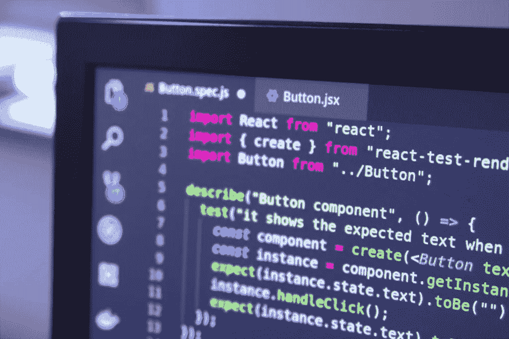

# 测试如何改变开发人员的生活

> 原文：<https://itnext.io/how-the-testing-can-change-your-life-as-developer-147c1fd49905?source=collection_archive---------4----------------------->

在这篇文章中，我想谈谈我自己多年来关于测试的经历，以及它是如何改变我的开发生活的。

这不是一个谈论测试类型、最佳实践或类似内容的帖子。

# 没有测试的生活:

缺乏测试就等于你交付给产品的代码缺乏**安全性。**你可以在一个地点开始工作，由于一些原因(通常是**匆忙或无知**)你可以着陆并说“嘿，没有任何测试。”。

这是一个非常大的问题。以下是我经常亲身经历的一些真实案例:

*   一遍又一遍地“解决”同一个 bug。
*   开发一个新的特性，并凭直觉发布代码，我在代码的其他部分创建了**副作用**，但不确定或不知道在哪里。
*   我的经理因为一个重复的 bug 而生气，但是不允许我花开发时间写测试。
*   **花 70%的时间解决 bug**而不是特性。
*   **不稳定**
*   对自己代码技能的怀疑。
*   当最终用户一次又一次地发现同样的错误时，给他们借口。

在一个没有人关心考试的环境中工作是一个危险信号，也是逃避的信号。你可能没有意识到这一点，因为这并不容易，但你不应该把时间花在这种文化的公司里。

没有测试，开发人员的生活是艰难和令人沮丧的。你不能成长，你不能享受你的工作，你每天都生气、悲伤或沮丧。软件测试不仅仅是关于代码，它会在一段时间后影响你的心情。

Bug 修复是中断**导致一个昂贵的上下文切换**，所以时间成本。这也影响到其他部门。另一方面，由于你大部分时间都在修复漏洞，公司只是在赔钱。

# **有考验的人生:**

在我的案例中，之前的问题引发了公司的变化。我到达了一个测试必不可少的地方，而开发测试的方式也引起了争论。差别真大:)

现在我将列出测试给项目和他的开发者的一些东西:

*   实现编码时关于**副作用**
*   在最终用户之前检测到 bug
*   **对你的代码和团队的信心**
*   **TDD 允许您更好地理解需求并加速开发**
*   **拥有一个快乐的终端用户，因为他有良好的体验。**

**这些只是在你的软件项目中包含测试的一些好处。**

****

# ****结论****

**多年来，许多公司都回避它们，主要是因为无知。测试不是为了酷，有一个漂亮的代码，跟随一个趋势或类似的，不！**

**测试只是为了钱。没有测试的公司会损失开发人员、客户服务、QA 等的时间。他们会因为情绪而失去开发人员，并且有一个没人想碰的糟糕的项目。**

**一个 bug 投入生产的成本**比一个自动化测试套件捕获一个 bug 的成本大很多倍。**换句话说，测试具有压倒性的正 ROI。**

**做测试！:)**