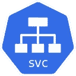

# 如何使用服务访问 Kubernetes 应用程序

> 原文：<https://itnext.io/how-to-access-kubernetes-applications-using-services-c437a4c940ad?source=collection_archive---------0----------------------->

欢迎👋 👋这是[“Kubernetes in the 坚果壳”](https://medium.com/@abhishek1987/kubernetes-in-a-nutshell-blog-series-c3a97fce9445)博客系列的另一部分，它关注 Kubernetes 的“广度”并涵盖基本主题，如[编排无状态应用](https://dev.to/itnext/stateless-apps-in-kubernetes-beyond-pods-4p52)，如何[使用](https://dev.to/itnext/hands-on-guide-configure-your-kubernetes-apps-using-the-configmap-object-44gj) `[ConfigMap](https://dev.to/itnext/hands-on-guide-configure-your-kubernetes-apps-using-the-configmap-object-44gj)`配置 Kubernetes 应用等。

 [## “果壳中的库伯内特”——博客系列

### 本系列将涵盖 Kubernetes 的“广度”和核心/基础主题(见下一节)。它会…

itnext.io](/kubernetes-in-a-nutshell-blog-series-c3a97fce9445) 

在这一部分，我们将深入 Kubernetes 服务。您将了解到:

*   Kubernetes 内部和外部通信的服务类型
*   集群内服务发现技术
*   如何访问外部服务等。



一如既往的码(还有`YAML`！)在 GitHub 上[可用](https://github.com/abhirockzz/kubernetes-in-a-nutshell/blob/master/services)

> *很高兴通过*[*Twitter*](https://twitter.com/abhi_tweeter)*获得您的反馈，或者发表评论🙏🏻*

Kubernetes `Pod`是短暂的，也就是说，它们不会在重启或重新调度后保留其属性。这适用于容器存储(卷)、身份(`Pod`名称)，甚至 IP 地址。这给应用程序访问带来了挑战。像`Deployment`这样的高层抽象控制几个`Pod`并将它们视为无状态实体——客户端如何访问这些`Pod`组？客户需要知道`Deployment`下面每个`Pod`的坐标吗？另外，你不能指望`Pod`在重启后获得相同的 IP——客户端应用程序如何继续访问`Pod`？

进入 Kubernetes 服务！

# Kubernetes 服务

一个`Service`是一个更高级别的组件，它提供对一组`Pod`的访问。它将客户端应用从一个`Deployment`(或一组`Pod`的细节中分离出来，以实现可预测和稳定的访问。

Kubernetes 定义了以下类型的服务:

*   `ClusterIP` —仅适用于 Kubernetes 集群内的访问
*   `NodePort` —使用 Kubernetes 节点本身的 IP 和端口进行访问
*   `LoadBalancer` —使用外部负载平衡器(通常是特定于云提供商的)，例如 [AKS](https://docs.microsoft.com/azure/aks/?WT.mc_id=medium-blog-abhishgu) 中的 [Azure 负载平衡器](https://docs.microsoft.com/azure/load-balancer/load-balancer-overview?WT.mc_id=medium-blog-abhishgu)
*   `ExternalName` —将`Service`映射到外部 DNS 名称

人们可以将访问模式分为两大类:

*   从外部接近
*   内部访问

# 从外部接近

如果您希望外部客户端访问 Kubernetes 集群中的应用程序，您可以使用`NodePort`或`LoadBalancer`服务。

## 节点端口

`NodePort`就像它听起来的那样——使得使用节点的 IP(在其上已经调度了`Pod`)和 Kubernetes 分配的随机端口访问集群内的应用成为可能，例如，对于 HTTP 端点，您可以使用`http://<node_ip>:<port>`

这里有一个例子:

```
apiVersion: v1
kind: Service
metadata:
  name: kin-nodeport-service
spec:
  type: NodePort
  ports:
    - port: 80
      targetPort: 8080
  selector:
    app: kin-service-app
```

虽然`NodePort`在概念上很简单，但这里有几点你应该注意

*   随机端口分配受限于范围— `30000–32767`
*   该端口对于集群中的每个节点都是相同的
*   可以指定一个静态端口号，但是由于端口分配、无效端口等原因，`Service`创建可能会失败。

## 负载平衡器

当在云提供商中运行时，`LoadBalancer`服务类型触发外部负载均衡器的供应，该负载均衡器在后台之间分配流量。

为了看到这一点，让我们在 [Azure Kubernetes 服务](https://docs.microsoft.com/azure/aks/?WT.mc_id=medium-blog-abhishgu)上部署一个应用程序，并使用`LoadBalancer`服务公开它。

> *使用基于多节点(至少两个)云的 Kubernetes 集群可以很容易地演示这一概念。随意使用任何其他云提供商(例如* `*GKE*` *来尝试这个场景)*

如果你想用 [Azure](https://azure.microsoft.com/) 试试这个，这里有一些先决条件，你应该在阅读本文教程之前完成:

*   获得一个[免费的微软 Azure 账户](https://docs.microsoft.com/azure/aks/?WT.mc_id=medium-blog-abhishgu)！
*   [安装 Azure CLI 工具](https://docs.microsoft.com/cli/azure/install-azure-cli?view=azure-cli-latest&WT.mc_id=medium-blog-abhishgu)
*   [安装](https://kubernetes.io/docs/tasks/tools/install-kubectl/) `[kubectl](https://kubernetes.io/docs/tasks/tools/install-kubectl/)`来访问您的 Kubernetes 集群
*   [使用 CLI 在 Azure 上设置一个双节点 Kubernetes 集群](https://docs.microsoft.com/en-in/azure/aks/kubernetes-walkthrough)

完成集群设置后，确保使用`[az aks get-credentials](https://docs.microsoft.com/cli/azure/aks?view=azure-cli-latest&WT.mc_id=medium-blog-abhishgu#az-aks-get-credentials)`命令配置`kubectl`连接到集群——这会下载凭证并配置 Kubernetes CLI 来使用它们。

```
az aks get-credentials --name <AKS-cluster-name> --resource-group <AKS-resource-group>
```

你现在应该都准备好了。让我们从创建`Service`以及示例应用程序开始。

为了简单起见，YAML 文件直接从 [GitHub repo](https://github.com/abhirockzz/kubernetes-in-a-nutshell) 中引用，但是你也可以下载文件到你的本地机器上，以同样的方式使用它。

```
kubectl apply -f https://raw.githubusercontent.com/abhirockzz/kubernetes-in-a-nutshell/master/services/loadbalancer/service.yamlkubectl apply -f [https://raw.githubusercontent.com/abhirockzz/kubernetes-in-a-nutshell/master/services/app/app.yaml](https://raw.githubusercontent.com/abhirockzz/kubernetes-in-a-nutshell/master/services/app/app.yaml)
```

> *[*示例应用*](https://github.com/abhirockzz/kubernetes-in-a-nutshell/tree/master/services/app) *其实很简单* [*走*](https://golang.org/) *程序**

*确认`Service`已经创建*

```
*kubectl get svc/kin-lb-service*
```

*您应该会得到类似下面的响应*

```
*NAME             TYPE           CLUSTER-IP    ** EXTERNAL-IP **    PORT(S)        AGE
kin-lb-service   LoadBalancer   10.0.149.217   **<pending>**        80:31789/TCP   1m*
```

*`EXTERNAL-IP`的`pending`状态是暂时的——这是因为 AKS 正在幕后提供一个 [Azure 负载均衡器](https://docs.microsoft.com/azure/load-balancer/load-balancer-overview?WT.mc_id=medium-blog-abhishgu)。*

*一段时间后，您应该会看到`EXTERNAL-IP`填充了负载均衡器的公共 IP*

```
*NAME             TYPE           CLUSTER-IP     EXTERNAL-IP     PORT(S)        AGE
kin-lb-service   LoadBalancer   10.0.149.217   242.42.420.42   80:31789/TCP   2m*
```

*检查应用程序是否也已部署——您应该看到两个`Pod`处于`Running`状态*

```
*kubectl get pod -l=app=kin-service-appNAME                              READY   STATUS    RESTARTS   AGE
kin-service-app-775f989dd-gr4jk   1/1     Running   0          5m
kin-service-app-775f989dd-rmq6r   1/1     Running   0          5m*
```

*您可以使用负载平衡器 IP 访问应用程序，如下所示:*

```
*curl [http://242.42.420.42/](http://242.42.420.42/)*
```

> **请注意，在您的情况下，IP 会有所不同。另外，根据* `*Service*` *清单中的* `*spec.ports.port*` *属性，负载平衡器端口为* `*80*` *。**

*您应该会看到类似以下内容的响应:*

```
*Hello from Pod IP 10.244.0.151 on Node aks-agentpool-37379363-0*
```

*此输出显示:*

*   *`Pod`的 IP，以及，*
*   *Pod 所在的`Node`的名称*

*如果您再次尝试访问应用程序(`curl http://242.42.420.42/`)，您很可能会被负载平衡到另一个实例`Pod`，该实例可能位于不同的`Node`上，您可能会看到如下响应:*

```
*Hello from Pod IP 10.244.1.139 on Node aks-agentpool-37379363-1*
```

> **您可以扩展您的应用程序(向内和向外扩展),并使用负载平衡器 IP 继续访问它。**

*如果您想使用 CLI 获取 Azure 负载平衡器的详细信息，请使用以下命令:*

```
*export AZURE_RESOURCE_GROUP=[enter AKS resource group]
export AKS_CLUSTER_NAME=[enter AKS cluster name]*
```

*使用`[az aks show](https://docs.microsoft.com/cli/azure/aks?view=azure-cli-latest&WT.mc_id=medium-blog-abhishgu)`命令获取 AKS 集群基础架构资源组名称*

```
*INFRA_RG=$(az aks show --resource-group $AZURE_RESOURCE_GROUP --name $AKS_CLUSTER_NAME --query nodeResourceGroup -o tsv)*
```

*用它列出带有`[az network lb list](https://docs.microsoft.com/cli/azure/network/lb?view=azure-cli-latest&WT.mc_id=medium-blog-abhishgu#az-network-lb-list)`命令的负载平衡器(您将得到一个带有负载平衡器信息的 JSON 响应)*

```
*az network lb list -g $INFRA_RG*
```

# *使用`ClusterIP`进行内部访问*

*`ClusterIP`服务类型和可以在集群内使用的通信——只需在`spec.type`中指定`ClusterIP`,就可以了！*

> *`*ClusterIP*` *是默认的服务类型**

*即使对于具有`ClusterIPService`类型的集群内通信，也必须有一种方法让应用`A`调用应用`B`(通过`Service`)。集群中的应用有两种服务发现方式:*

*   *环境变量*
*   *`DNS`*

## *环境变量*

*每个`Pod`都有一组特定于`Service`的环境变量。让我们看看这是怎么回事！如下创建一个`ClusterIP`服务，并确认它已经被创建*

```
*kubectl apply -f https://raw.githubusercontent.com/abhirockzz/kubernetes-in-a-nutshell/master/services/clusterip/service.yamlkubectl get svc/kin-cip-service*
```

*还记得我们为探索`LoadBalancer` `Service`类型而部署的应用程序吗？好吧，删除并重新创建它一次(我会解释为什么这样做，一会儿)*

```
*kubectl delete -f https://raw.githubusercontent.com/abhirockzz/kubernetes-in-a-nutshell/master/services/app/app.yamlkubectl apply -f [https://raw.githubusercontent.com/abhirockzz/kubernetes-in-a-nutshell/master/services/app/app.yaml](https://raw.githubusercontent.com/abhirockzz/kubernetes-in-a-nutshell/master/services/app/app.yaml)*
```

*一旦 app 处于`Running`状态(检查`kubectl get pod -l=app=kin-service-app`)，`[exec](https://kubernetes.io/docs/reference/generated/kubectl/kubectl-commands#exec)`(直接在`Pod`内部执行命令)进入`Pod`检查其环境变量*

```
*kubectl exec <enter-pod-name> -- env | grep KIN_CIP*
```

*您将看到类似下面的结果:*

```
*KIN_CIP_SERVICE_PORT_9090_TCP_ADDR=10.0.44.29
KIN_CIP_SERVICE_SERVICE_PORT=9090
KIN_CIP_SERVICE_PORT_9090_TCP_PROTO=tcp
KIN_CIP_SERVICE_PORT_9090_TCP=tcp://10.0.44.29:9090
KIN_CIP_SERVICE_PORT=tcp://10.0.44.29:9090
KIN_CIP_SERVICE_SERVICE_HOST=10.0.44.29
KIN_CIP_SERVICE_PORT_9090_TCP_PORT=9090*
```

*注意环境变量名称的格式了吗？其中包括`ClusterIP` `Service`本身的名称(即`kin-cip-service`)，将`-`替换为`_`，其余为大写。这是一种预定义的格式，如果您知道支持它的`Service`的名称，它可以用来与另一个应用程序通信。*

> **这里有一个警告:只有在* `*Service*` *之前创建了* `*Pod*` *时，才会将环境变量植入其中！这就是我们必须重新创建应用程序来查看效果的原因。**

*让我们使用环境变量从另一个`Pod`访问这个应用程序。用`curl`再运行一次`Pod`*

```
*kubectl run --rm --generator=run-pod/v1 curl --image=radial/busyboxplus:curl -i --tty*
```

> **你应该很快就会看到一个命令提示符**

*确认这个`Pod`也有环境变量(使用`env | grep KIN_CIP`，然后使用环境变量简单地`curl`应用程序端点*

```
*curl [http://$KIN_CIP_SERVICE_SERVICE_HOST:$KIN_CIP_SERVICE_SERVICE_PORT](/$KIN_CIP_SERVICE_SERVICE_HOST:$KIN_CIP_SERVICE_SERVICE_PORT)*
```

*您应该会看到与`LoadBalancer`示例相同的响应，即*

```
*Hello from Pod IP 10.244.0.153 on Node aks-agentpool-37379363-0*
```

*多试几次，以确认负载在各个吊舱之间达到平衡！因此，我们基于`Service`名称导出环境变量，即`kin-cip-service`被转换为`KIN_CIP_SERVICE`，其余部分被添加- `_SERVICE_HOST`和`_SERVICE_PORT`，分别用于主机和端口。*

## *域名服务器(Domain Name Server)*

*Kubernetes 有一个内置的 DNS 服务器(例如`CoreDNS`)，为每个`Service`维护 DNS 记录。就像环境变量一样，DNS 技术提供了一个一致的命名方案，基于这个方案，如果您知道应用程序的`Service`名称(如果需要的话，还有其他信息，比如`namespace`)，您就可以访问应用程序。*

> **好的一点是，这种技术不像环境变量*那样依赖于 `*Service*` *和* `*Pod*` *的创建顺序**

*你可以马上试试:*

*再次运行`curl` `Pod`*

```
*kubectl run --rm --generator=run-pod/v1 curl --image=radial/busyboxplus:curl -i --tty*
```

*要访问应用程序:*

```
*curl [http://kin-cip-service.default.svc.cluster.local:9090](http://kin-cip-service.default.svc.cluster.local:9090)*
```

*一切都应该以同样的方式工作！FQDN 格式为`<service-name>.<namespace>.<cluster-domain-suffix>`。在我们的例子中，它映射到:*

*   *`service-name` - `kin-cip-service`*
*   *`namespace` - `default`*
*   *`cluster-domain-suffix` - `svc.cluster.local`*

> **对于同一个* `*namespace*` *中的应用程序，你实际上可以跳过大部分，只使用服务名！**

# *映射外部服务*

*有些情况下，您需要从 Kubernetes 集群内部的应用程序引用外部服务。你可以用几种方法来做到这一点*

*   *以静态方式使用`Endpoints`资源*
*   *使用`ExternalName`服务类型*

## *静态`Endpoints`*

*这是揭示 Kubernetes 为您创建的每一个`Service`创建一个`Endpoints`资源的好时机(如果您使用一个`selector`，这是除了少数场景之外的大多数情况)。这个`Endpoints`对象实际上捕获了后台`Pod`的 IP。你可以使用`kubectl get endpoints`查看现有的 IP。*

*如果您想要访问外部服务，您需要:*

*   *创建一个没有任何`selector`的`Service`——Kubernetes 不会创建一个`Endpoints`对象*
*   *手动创建与您的`Service`(同名)和您想要访问的服务的 IP/port 对应的`Endpoints`资源。*

*这给了你同样的好处，即你可以保持`Service`不变，并在需要时在后台更新实际实体。例如，我们将使用这种技术抽象对公共 HTTP 端点`http://demo.nats.io:8222/`的访问。*

*首先创建`Service`*

```
*kubectl apply -f [https://raw.githubusercontent.com/abhirockzz/kubernetes-in-a-nutshell/master/services/external/static/service.yaml](https://raw.githubusercontent.com/abhirockzz/kubernetes-in-a-nutshell/master/services/external/static/service.yaml)*
```

*这里是`Service`的样子。注意，我们将`port` `8080`映射到我们想要访问的实际(目标)端口`8222`*

```
*kind: Service
apiVersion: v1
metadata:
  name: demo-nats-public-service
spec:
  type: ClusterIP
  ports:
    - port: 8080
      targetPort: 8222*
```

*让我们看看`Endpoints`资源。*

```
*kind: Endpoints
apiVersion: v1
metadata:
  name: demo-nats-public-service
subsets:
  - addresses:
      - ip: 107.170.221.32
    ports:
      - port: 8222*
```

*请注意以下事项:*

*   *资源名称(`demo-nats-public-service`)与`Service`相同*
*   *我们已经使用了`subsets`属性来指定`ip`和`port`(我们通过简单地使用`ping demo.nats.io`找到了支持`demo.nats.io`的`ip`*

*使用以下方式创建:*

```
*kubectl apply -f [https://raw.githubusercontent.com/abhirockzz/kubernetes-in-a-nutshell/master/services/external/static/endpoints.yaml](https://raw.githubusercontent.com/abhirockzz/kubernetes-in-a-nutshell/master/services/external/static/endpoints.yaml)*
```

*就是这样！让我们看看这是否有效。只需运行一个`curl` `Pod`*

```
*kubectl run --rm --generator=run-pod/v1 curl --image=radial/busyboxplus:curl -i --tty*
```

*现在，我们需要使用的只是我们的`Service`的名称，即`demo-nats-public-service`(以及端口`8080`)，它将完成这个任务。*

```
*curl [http://demo-nats-public-service:8080](http://demo-nats-public-service:8080)*
```

*您应该会看到以下响应(这与您浏览到`[http://demo.nats.io:8222](http://demo.nats.io:8222))` [)](http://demo.nats.io:8222))*

```
*<html lang="en">
   <head>
    <link rel="shortcut icon" href="http://nats.io/img/favicon.ico">
    <style type="text/css">
      body { font-family: "Century Gothic", CenturyGothic, AppleGothic, sans-serif; font-size: 22; }
      a { margin-left: 32px; }
    </style>
  </head>
  <body>
    
    <br/>
	<a href=/varz>varz</a><br/>
	<a href=/connz>connz</a><br/>
	<a href=/routez>routez</a><br/>
	<a href=/gatewayz>gatewayz</a><br/>
	<a href=/leafz>leafz</a><br/>
	<a href=/subsz>subsz</a><br/>
    <br/>
    <a href=https://docs.nats.io/nats-server/configuration/monitoring.html>help</a>
  </body>
</html>*
```

## *`ExternalName service`*

*`ExternalName`是另一种`Service`类型，可用于将`Service`映射到 DNS 名称。请注意，这是一个 DNS 名称，而不是上述策略中的 IP/端口组合(使用手动创建的`Endpoints`)。*

*在`Serivce`清单中:*

*   *不包括一个`selector`*
*   *使用`externalName`属性指定 DNS 名称，例如`test.example.com`*
*   *不允许使用 IP 地址*

*这里有一个例子:*

```
*apiVersion: v1
kind: Service
metadata:
  name: demo-nats-public-service2
spec:
  type: ExternalName
  externalName: demo.nats.io*
```

*我们正在创建一个名为`demo-nats-public-service2`的`Service`，它使用`spec.type`即`ExternalName`映射到 DNS 名称`demo.nats.io`。*

*其工作方式相同，即您需要使用`Service`名称来访问外部实体。唯一的区别(与手动`Endpoints`方法相比)是您还需要知道端口。要尝试这种方法:*

*创建`Service`*

```
*kubectl apply -f [https://raw.githubusercontent.com/abhirockzz/kubernetes-in-a-nutshell/master/services/external/external-name/service.yaml](https://raw.githubusercontent.com/abhirockzz/kubernetes-in-a-nutshell/master/services/external/external-name/service.yaml)*
```

*只需运行一个`curl` `Pod`*

```
*kubectl run --rm --generator=run-pod/v1 curl --image=radial/busyboxplus:curl -i --tty*
```

*现在，我们需要使用的只是我们的`Service`的名称，即`demo-nats-public-service2`(以及端口`8222`)*

```
*curl [http://demo-nats-public-service2:8222](http://demo-nats-public-service2:8222)*
```

*您应该会看到与上一个场景相同的响应*

# *`Headless`服务*

*您可以使用`LoadBalancer`、`NodePort`和`ClusterIP`服务类型在一组`Pod`之间实现负载平衡。A `Headless` `Service`允许访问单个`Pod`s——这种情况下不涉及代理。这在许多情况下都很有用，例如*

*   *考虑一个对等系统，其中各个实例(pod)需要相互访问。*
*   *一种主从式服务，其中从实例需要知道主 Pod*

*为了创建一个`Headless` `Service`，您需要明确指定`None`作为`.spec.clusterIP`的值。这里有一个例子:*

```
*apiVersion: v1
kind: Service
metadata:
  name: kin-hl-service
spec:
  clusterIP: None
  ports:
    - port: 9090
      targetPort: 8080
  selector:
    app: kin-service-app*
```

*与其他类型相比，您使用无头服务的方式是不同的。针对服务(例如`<service-name>.<namespace>.svc.cliuster.local`)的 DNS 查找返回对应于不同`Pods`的多个 IP(与其他服务类型情况下的单个虚拟 IP 相比)。让我们来看看实际情况*

*创建`Service`*

```
*kubectl apply -f [https://raw.githubusercontent.com/abhirockzz/kubernetes-in-a-nutshell/master/services/headless/service.yaml](https://raw.githubusercontent.com/abhirockzz/kubernetes-in-a-nutshell/master/services/headless/service.yaml)*
```

*运行`curl` `Pod`*

```
*kubectl run --rm --generator=run-pod/v1 curl --image=radial/busyboxplus:curl -i --tty*
```

*检查衬垫`Pod` IPs*

```
*nslookup kin-hl-service.default.svc.cluster.local*
```

*您将得到类似下面的响应*

```
*[ root@curl:/ ]$ nslookup kin-hl-service
Server:    10.0.0.10
Address 1: 10.0.0.10 kube-dns.kube-system.svc.cluster.localName:      kin-hl-service
Address 1: 10.244.0.153 10-244-0-153.kin-hl-service.default.svc.cluster.local
Address 2: 10.244.1.141 10-244-1-141.kin-hl-service.default.svc.cluster.local*
```

*`10-244-0-153.kin-hl-service.default.svc.cluster.local`和`10.244.1.141 10-244-1-141.kin-hl-service.default.svc.cluster.local`对应于个人`Pod`的坐标——这在传统的`Service`类型中是不可能的。您现在可以使用它来访问特定的`Pod`,例如*

```
*curl http://10-244-0-153.kin-hl-service.default.svc.cluster.local:8080//response
Hello from Pod IP 10.244.0.153 on Node aks-agentpool-37379363-0curl http://10-244-1-141.kin-hl-service.default.svc.cluster.local:8080//response
Hello from Pod IP 10.244.1.141 on Node aks-agentpool-37379363-1*
```

# *进入*

*我们确实讨论了 Kubernetes `Service`的基础知识，但是我确实想强调一下`Ingress`，它完全值得一个单独的帖子。`Ingress`不是`Service`类型(如`ClusterIP`等。)——把它想象成一个`Service`之上的抽象。就像`Service`的前端一堆`Pod`一样，一个`Ingress`可以被配置为与几个后台`Service`一起工作，并按照你可以定义的规则转发请求。*

*由`Ingress`提供的智能实际上是以`Ingress`控制器的形式实现的。例如， [Minikube 自带基于 NGINX 的入口控制器](https://kubernetes.io/docs/tasks/access-application-cluster/ingress-minikube/)。控制器负责在评估`Ingress`规则后，提供对适当支持`Service`的访问。*

*这就是“果壳中的库伯内特”系列的这一部分。敬请关注更多内容！*

> **友情提示如果有兴趣学习 Kubernetes 和 Containers 使用* [*Azure*](https://azure.microsoft.com/services/kubernetes-service/?WT.mc_id=medium-blog-abhishgu) *！只需* [*创建一个* ***免费*** *账号*](https://azure.microsoft.com/en-us/free/?WT.mc_id=medium-blog-abhishgu) *就可以了！一个好的起点是使用文档中的* [*快速入门、教程和代码示例*](https://docs.microsoft.com/azure/aks/?WT.mc_id=medium-blog-abhishgu) *来熟悉该服务。我也强烈推荐查看一下* [*50 天 Kubernetes 学习路径*](https://azure.microsoft.com/resources/kubernetes-learning-path/?WT.mc_id=medium-blog-abhishgu) *。高级用户可能希望参考* [*Kubernetes 最佳实践*](https://docs.microsoft.com/azure/aks/best-practices?WT.mc_id=medium-blog-abhishgu) *或观看一些* [*视频*](https://azure.microsoft.com/resources/videos/index/?services=kubernetes-service&WT.mc_id=medium-blog-abhishgu) *以了解演示、主要功能和技术会议。**

*我真的希望你喜欢这篇文章，并从中学到了一些东西🙌如果你做了，请喜欢并跟随！*