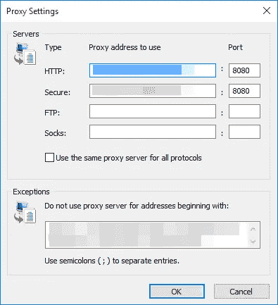
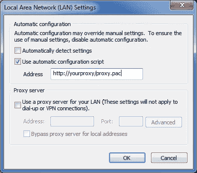

# 如何从企业环境中的工具和终端访问 Web

> 原文：<https://itnext.io/how-to-access-the-web-from-tools-and-terminals-in-corporate-environments-d822f77acba9?source=collection_archive---------2----------------------->

在大中型公司中，几乎总是这样，你的网络流量必须通过公司代理才能到达网络。以下是如何找到更多关于代理的信息。


图片由[狄龙·温斯皮尔](https://unsplash.com/@dillonwinspear)提供

在这篇文章中，我会给你一些提示，告诉你如何发现哪个/哪些代理被使用(如果有的话)。我还将提到更复杂的 IT 环境如何使用自动代理发现协议(WPAD)和 pac 文件处理代理设置，执行 TLS 终止，有时甚至只允许特定的用户代理通过。最后，我将告诉您如何配置您的应用程序和命令行工具来访问 Web。

正如我们将看到的，在基本环境中，您只需查看设置即可找到代理的 URL/IP/端口。在更复杂的环境中，您需要分析 pac 文件来找出这些问题。

# 为什么和一个小警告

首先，给你一个建议:通常网络流量都有严格的安全策略。确保你没有做违反这些政策的事情。如果你不确定，在做任何可能让你陷入困境的事情之前，先问问网络/安全团队/ CISO。

您可能出于多种原因想要了解更多关于正在使用的公司代理的信息。第一个可能是好奇心，这可能是最糟糕的原因。另一个更有效的方法是能够从您的开发工具和/或终端访问 Web。

就我个人而言，我经常需要 Web 访问来下载某些工具/下载 NPM/maven/随便什么包，等等。通常我希望我的工具能够做到这一点，或者至少能够从终端做到这一点。

在任何情况下，请务必联系安全和网络团队，看看是否有既定/公认的解决方案可以让您随心所欲。安全总比后悔好；-)

如果你知道自己在做什么，那就继续读下去。

# 找出使用了哪些代理的一些方法

一些“基本”环境只是通过系统配置(通常在 Windows 环境中通过组策略等来定义/实施)来实施一个代理(或一组代理)，这可以通过 Internet Explorer (meh)来检查:



你可能已经见过这个窗口至少一次了；-)

要到达那个屏幕，你可以看看这篇微软知识库文章:[https://support . Microsoft . com/en-ph/help/4551930/using-proxy-servers-together-with-internet-explorer](https://support.microsoft.com/en-ph/help/4551930/using-proxy-servers-together-with-internet-explorer)

关于 Edge，看这篇文章:[https://www . windows central . com/how-set-proxy-Edge-windows-10](https://www.windowscentral.com/how-set-proxy-edge-windows-10)

如果你可以通过上面的任何一个直接看到代理设置，那么你就完成了，可能没有必要再看了；只需获取主机/IP/端口。

如果你使用的是 Windows 10，另一种方法是通过操作系统的设置应用程序查看代理设置，如下所述:[https://helpdesgeek . com/networking/internet-connection-problem-Proxy-Settings/](https://helpdeskgeek.com/networking/internet-connection-problem-proxy-settings/)(该文章还介绍了如何发现 OSX & Linux 的代理设置)。

在 Google Chrome 中，您可能可以访问以下设置页面:

```
chrome://net-internals/#proxy
```

在 Mozilla Firefox 中，您可以看到同样的情况:

```
about:preferences#advanced
```

如果你有访问 Windows 注册表的权限，那就太容易了；只看下面这个键:`HKEY_CURRENT_USER\Software\Microsoft\Windows\CurrentVersion\Internet Settings`。

或者通过命令行:

```
reg query "HKEY_CURRENT_USER\Software\Microsoft\Windows\CurrentVersion\Internet Settings" | find /i "proxyserver"
```

如果您是这台机器的管理员(您可能永远都不应该是管理员！)，那么你也可以以管理员身份运行以下命令:`netsh winhttp show proxy`。

如果你想得到花式，你可以通过 PowerShell 得到同样的信息:`Get-ItemProperty -Path 'HKCU:\Software\Microsoft\Windows\CurrentVersion\Internet Settings' | findstr ProxyServer`

# 代理自动配置(PAC)

代理自动配置(PAC)文件是(不那么)神奇的文件，它描述了让 Web 浏览器(和其他用户代理)为给定的 URL 选择使用哪个代理服务器的规则。

当 Web 浏览器被配置为使用 pac 文件时，无论何时需要访问网络，它都会调用 PAC 文件中定义的`FindProxyForURL`函数，以确定要使用的代理服务器(如果有)。

通常，强制流量通过代理的公司定义 PAC 文件，指示用户代理直接连接到目标(例如，对于内部 IP 范围/内部 DNS 域)，或者通过特定代理连接。

在这样的环境中，PAC 文件才是您真正想要的；它包含了你需要的所有信息。

这里有一个示例 PAC 文件，取自[这里](https://findproxyforurl.com/example-pac-file/):

```
function FindProxyForURL(url, host) {
  // If the hostname matches, send direct.
  if (dnsDomainIs(host, "intranet.domain.com") ||
  shExpMatch(host, "(*.abcdomain.com|abcdomain.com)"))
  return "DIRECT";

  // If the protocol or URL matches, send direct.
  if (url.substring(0, 4)=="ftp:" ||
  shExpMatch(url, "http://abcdomain.com/folder/*"))
  return "DIRECT";

  // If the requested website is hosted within the internal network, send direct.
  if (isPlainHostName(host) ||
  shExpMatch(host, "*.local") ||
  isInNet(dnsResolve(host), "10.0.0.0", "255.0.0.0") ||
  isInNet(dnsResolve(host), "172.16.0.0",  "255.240.0.0") ||
  isInNet(dnsResolve(host), "192.168.0.0",  "255.255.0.0") ||
  isInNet(dnsResolve(host), "127.0.0.0", "255.255.255.0"))
  return "DIRECT";

  // If the IP address of the local machine is within a defined
  // subnet, send to a specific proxy.
  if (isInNet(myIpAddress(), "10.10.5.0", "255.255.255.0"))
  return "PROXY 1.2.3.4:8080";

  // DEFAULT RULE: All other traffic, use below proxies, in fail-over order.
  return "PROXY 4.5.6.7:8080; PROXY 7.8.9.10:8080";
}
```

这里对 JS 代码质量不要抱太大希望；通常你会偶然发现那些不是 Web 开发人员或者对此毫不关心的人写的代码；-)

您希望在 pac 文件中破译的是您应该用于自己目的的代理(或多个代理)。例如，如果你想访问网络，而不是一些内部网站/域名，那么你可能需要使用`4.5.6.7:8080`和/或`7.8.9.10:8080`。

根据谁在维护 PAC 文件，这可能是非常清楚或非常神秘的(一些系统管理员把这些文件弄得一团糟)。

但是如何找到 pac 文件呢？好问题！

有两种可能；要么通过代理设置直接设置 PAC 文件，例如通过 IE 可见:



在这种情况下，你又得到了你想要的。

或者，代理设置被配置为自动检测。在这种情况下，WPAD 协议用于查找 PAC 文件。

# Web 代理自动发现协议(WPAD)

PAC 文件通常与一个叫做 WPAD 的协议协同工作，即[网络代理自动发现协议](https://en.wikipedia.org/wiki/Proxy_auto-config)。

顾名思义，网络浏览器/用户代理使用 WPAD 协议，通过 DHCP 和/或 DNS 自动发现要使用的代理。

简单地说，WPAD 试图从“wpad”主机下载一个名为“wpad.dat”的文件。

检查环境中是否使用了 WPAD 的最简单方法是尝试简单的 ping:

```
ping wpad
```

如果不存在，那么要么不使用 WPAD，要么您需要附加一个环境特定的 DNS 后缀，您应该能够通过`ipconfig /all`来识别，正如这里所解释的[。基本上你在寻找主要的 DNS 后缀& DNS 后缀搜索列表。](https://superuser.com/questions/346372/how-do-i-know-what-proxy-server-im-using)

如果您可以访问`wpad`或`wpad.<some suffix>`，那么您可以通过以下方式下载 wpad.dat 文件:

```
http://wpad.<suffix>/wpad.dat
```

如果你有那个文件，那么你就又一次得到了你想要的信息。

如果这不起作用，那么 WPAD 可能会通过 DHCP 进行配置，在这种情况下，您可以尝试通过 Wireshark 等工具查看 DHCP 流量，或者尝试这里建议的[方法](https://superuser.com/questions/346372/how-do-i-know-what-proxy-server-im-using)。

顺便说一下，维基百科关于 WPAD 的文章提到了一些关于 WPAD 安全的事实；这还挺好玩的(还是难过？)来读。

# 代理配置

所以，你有代理设置；现在怎么办？

这完全取决于你想如何/在哪里使用它们。我会给你几个例子，但是对于其他的，你需要钻研你的工具的文档；-)

## 尝试

如果你想从你的 [Bash 终端](/bash-aliases-are-awesome-8a76aecc96ab)访问网页(哦我[感觉到你](/bash-aliases-are-awesome-8a76aecc96ab)！)，那么您需要配置(部分或全部)以下环境变量:

```
export HTTP_PROXY="http://<username>:<password>@<host>:<port>
export HTTPS_PROXY="http://<username>:<password>@<host>:<port>
export FTP_PROXY="http://<username>:<password>@<host>:<port>
export SOCKS_PROXY="http://<username>:<password>@<host>:<port>
export TELNET_PROXY="http://<username>:<password>@<host>:<port>
export ALL_PROXY="http://<username>:<password>@<host>:<port>
export NO_PROXY="localhost,127.0.0.1, <whatever else>"
```

正如您在上面所看到的，您还可以定义凭证来验证代理。对于某些环境，您必须使用 Windows 域凭据。

## 饭桶

如果您从 Bash 终端使用 Git(哈哈)，那么您就可以开始了。

如果不是，那么您可能需要配置 git 来使用代理:

```
git config --global http.proxy http://<username>:<password>@<host>:<port>
```

同样，用户名/密码是可选的；这完全取决于环境。

这些设置将储存在您的个人文件夹的”。gitconfig "文件。

如果您想在 SSH 上使用 git，不要抱太大希望..

## npm

使用 npm，配置代理也很简单:

```
npm config set proxy http.proxy http://<username>:<password>@<host>:<port>
npm config set https-proxy http.proxy http://<username>:<password>@<host>:<port>
```

这些设置将储存在您的个人文件夹的”。npmrc”文件。

## 专家

和往常一样，使用 Maven 时，一切都通过“settings.xml”文件进行:

```
<proxies>
   <proxy>
        <host>http://<host></host>
        <port><port></port>
        <username>...</username>
        <password>...</password>
        <nonProxyHosts>...</nonProxyHosts>
    </proxy>
</proxies>
```

查看[这篇文章](https://www.baeldung.com/maven-behind-proxy)了解更多细节。

# 自签名证书

在许多组织中，企业代理也执行 SSL/ [TLS 终止](https://en.wikipedia.org/wiki/TLS_termination_proxy)。也就是说，公司代理和周围的基础设施在边缘端接 SSL/TLS 连接，以便它们可以检查所有流量。我希望你在工作时上网时意识到这一点，否则你现在可能会感觉很糟糕；-)

这样做的组织通常向客户端机器提供自签名(但内部信任)证书，同时检查他们这边的第三方证书。

这意味着如果你想去 https://gmail.com 的[，](https://gmail.com,)，那么你将永远看不到 gmail.com 的证明。相反，您将看到一个由企业基础设施动态创建/自签名的证书。

这在公司的 Web 浏览器中运行良好，因为您的机器被配置为信任这些证书。但是你的工具和终端就不会这样了。

如果环境做到了这一点，那么您需要确保您的工具/终端接受/信任您收到的证书。这对安全性非常不利，但这是唯一的方法(据我所知)。

这有点超出了本文的范围，但是如果您正面临这种情况，那么请尝试查看这些自签名证书是否都是由同一个根 CA 发出的。如果是这种情况，那么只信任工具中的根证书颁发机构。

如果每个证书都是完全独立的，那就糟了，你需要禁用证书检查。

例如，使用 npm，您可以使用以下内容来信任特定的 CA 证书文件:

```
npm config -g set cafile blabla.cert
```

如果你运气不好，不怕被黑(提示:你应该害怕！)，那么您可能需要这样做:

```
npm config -g set strict-ssl false
```

使用 Git:

```
export GIT_CURL_VERBOSE=1 # to debug
export GIT_SSL_NO_VERIFY=1
```

大多数处理 SSL/TLS 的工具都有类似的选项。

# 用户代理字符串

有时，代理对哪些用户代理可以通过或不可以通过是严格的。在 2020 年，这肯定是一个糟糕的做法(很长时间以来一直如此)，但要意识到这一点。

如果是这种情况，那么确定接受哪个用户代理字符串(可能是主/审查的 Web 浏览器的字符串)，并调整您的工具以使用该用户代理字符串。

您还可以更进一步，安装您自己的本地代理(例如，使用 [Squid](http://www.squid-cache.org/Doc/config/request_header_replace/) 、 [privoxy](https://www.privoxy.org/user-manual/actions-file.html) 等)来自动修改您的 HTTP 请求，然后将它们发送给公司代理。

不过这个稍微高级一点:)

# 结论

在本文中，我解释了如何识别正在使用的公司代理，以及如何配置您的工具/终端通过它们连接到 Web。

我还告诉了你经常使用的 PAC 文件和 WPAD 协议。

最后，我解释了一些组织进行 SSL/TLS 终止，提供自签名证书，甚至可能是邪恶的，只允许特定的用户代理通过。

希望你不需要做上面的任何事情，但是如果没有选择和帮助，这可能是有用的。

今天到此为止！

# 喜欢这篇文章吗？点击下面“喜欢”按钮查看更多内容，并确保其他人也能看到！

PS:如果你想学习大量关于软件/Web 开发、TypeScript、Angular、React、Vue、Kotlin、Java、Docker/Kubernetes 和其他很酷的主题的其他很酷的东西，那么请不要犹豫[拿一本我的书](https://www.amazon.com/Learn-TypeScript-Building-Applications-understanding-ebook/dp/B081FB89BL)并订阅[我的简讯](https://mailchi.mp/fb661753d54a/developassion-newsletter)！