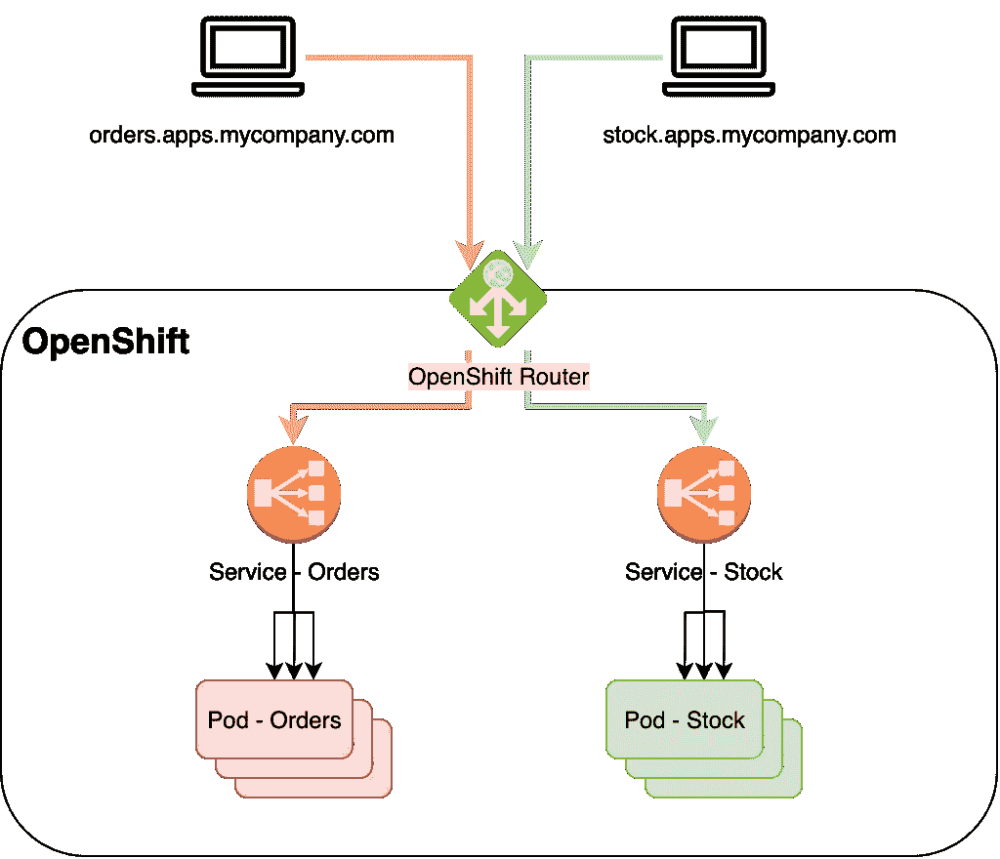
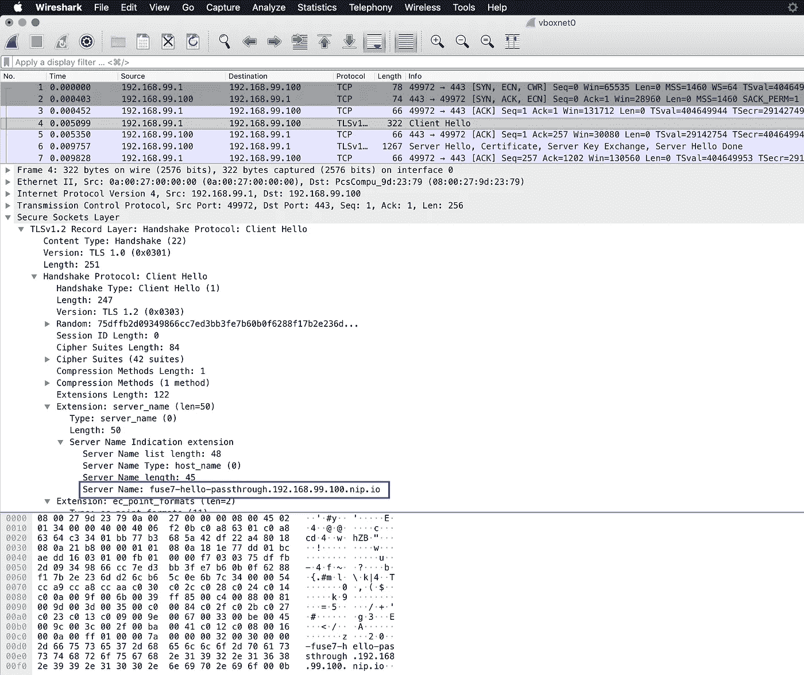
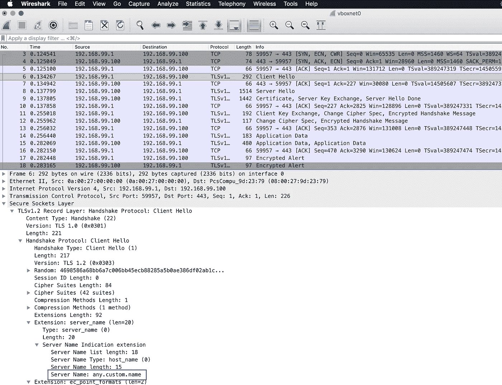

# 如何在 OpenShift 路由器后面访问您的应用程序？

> 原文：<https://itnext.io/how-to-access-your-app-behind-an-openshift-router-87cbae3e7185?source=collection_archive---------0----------------------->

构建[云原生](https://opensource.com/article/18/7/what-are-cloud-native-apps)应用，并在部署在 [Kubernetes](https://kubernetes.io/) 上的容器中运行您的代码，成为许多组织首选的运行时环境。利用容器的进程和网络级隔离减少了应用程序配置的维护开销，提高了安全性，但是使得从集群外部访问您的服务有点棘手。

[Red Hat OpenShift](https://www.openshift.com/) 使用[路由](https://docs.openshift.com/container-platform/3.11/architecture/networking/routes.html)的概念将入口流量导向部署在集群上的应用。该解决方案基于运行在 1-3 个专用节点(基础设施节点)上的 [HAProxy](http://www.haproxy.org/) 实例，这些节点负责[虚拟主机](https://en.wikipedia.org/wiki/Virtual_hosting)。这意味着我们将在同一个 IP 地址和端口后面有多个服务，它们仅通过主机名来区分(例如，***orders****. apps . my company . com*，***stock****. apps . my company . com*)。



主机名不是基本 TCP/IP 堆栈的一部分，但是 HAProxy 路由器需要知道客户端想要访问哪个服务。代理在两个地方检查主机名:

*   HTTP *主机*头
*   TLS *客户端问候*消息

使用 *Host* 头显然只适用于 HTTP/S 流量，但通常这正是我们想要公开的。它由大多数 HTTP 客户端自动添加。看起来是这样的:

```
$ curl -v http://fuse7-hello-plain.192.168.99.100.nip.io/api/hello
...
> GET /api/hello HTTP/1.1
> **Host: fuse7-hello-plain.192.168.99.100.nip.io**
> User-Agent: curl/7.54.0
> Accept: */*
>
< HTTP/1.1 200 OK
...
```

TLS *Client Hello* 是一个更通用的解决方案，适用于任何使用[服务器名称指示(SNI](https://en.wikipedia.org/wiki/Server_Name_Indication) )的 TLS 连接(包括 HTTPS)。主机名以不加密的方式发送，因此代理可以决定将加密流量转发到哪里:

```
curl -k https://fuse7-hello-passthrough.192.168.99.100.nip.io/
```



## 路线类型

基于 TLS 卸载的 OpenShift 中有四种不同类型的路由:

*   **无 TLS** (端口 80):非加密 HTTP 流量
*   **Edge** (端口 443):客户端和路由器代理之间的加密 HTTPS 流量。pod 公开了未加密的 HTTP 端点。
*   **重新加密**(端口 443):加密的流量被路由器代理终止，就像对*边缘*路由一样，但是 pod 也暴露了一个 HTTPS 端点。所以在代理和 pod 之间有另一个 TLS 连接。
*   **穿越**(端口 443):路由器不参与 TLS 卸载。客户端和 pod 之间的流量是端到端加密的。此类型也可用于非 HTTP TLS 终结点。

路由类型决定了代理是检查 HTTP *主机*报头还是 TLS *客户端 Hello 中的主机名。*为到达路由端点的客户端显示的证书也取决于路由的配置。在下文中，我们将检查如何验证不同路由类型的行为。对于那些对细节不太感兴趣的人，让我们从一个简短的总结开始:

在*边缘*和*重新加密*的情况下，TLS 被路由器代理终止，因此它可以访问未加密的 HTTP 流量。主机名应该在 HTTP *主机*头中。正在使用为路由配置的单个证书，或者在大多数情况下使用安装的默认通配符证书(例如 **.apps.mycompany.com* )。

在*直通*的情况下，代理无法访问未加密的流量——甚至可能不是 HTTP——因此主机名是从 TLS *客户端问候*消息中选取的，并且客户端可以看到 pod 端点上的证书。

> 这有关系吗？大多数情况下不会。无论遇到哪种路由类型，HTTP 客户端都能正常工作。了解代理可能很重要，例如，如果您必须在外部负载平衡器中设置健康检查，通过 IP 地址访问基础架构节点，以检查应用程序是否部署在 OpenShift 集群上。

## 环境

对于一个简单的测试，我们可以使用 [MiniShift](https://www.okd.io/minishift/) (参见[红帽 CDK](https://developers.redhat.com/products/cdk/overview/) )，这是一个本地单节点 OpenShift 虚拟机。查看用于此博客的版本:

```
$ **minishift version**
minishift v1.27.0+5981f996
CDK v3.7.0-1$ **oc version**
oc v3.11.69
kubernetes v1.11.0+d4cacc0
features: Basic-Auth
Server [https://192.168.99.100:8443](https://192.168.99.100:8443)
kubernetes v1.11.0+d4cacc0$ **minishift config view**
- iso-url                            : file:///Users/bszeti/.minishift/cache/iso/minishift-rhel7.iso
- memory                             : 6GB
- openshift-version                  : v3.11.82
- vm-driver                          : virtualbox
```

让我们在 OpenShift 中为我们简单的 [Hello World API](https://github.com/bszeti/camel-springboot/tree/master/fuse7-hello) 应用程序创建以下路线(参见[附录](#b7b1)中的命令):

按照 MiniShift 的默认 **.192.168.99.100.nip.io* 命名约定，为每个路由类型创建了一个路由，该路由使用 [nip.io](http://nip.io/) 将域名解析为虚拟机的 ip。我们还创建了一个带有自定义名称的额外路由，以测试它不需要坚持这种命名模式。

## 工具

*OpenSSL* 通常在 Linux 或 Mac 上可用。它可用于手动打开 TLS 连接、打印证书和发送 HTTP 命令:

```
$ **openssl s_client -showcerts -connect fuse7-hello-edge.192.168.99.100.nip.io:443**
CONNECTED(00000005)
depth=1 CN = openshift-signer@1551218868
verify error:num=19:self signed certificate in certificate chain
verify return:0
---
Certificate chain
 0 s:/CN=*.router.default.svc.cluster.local
   i:/CN=openshift-signer@1551218868
-----BEGIN CERTIFICATE-----
...
---
**GET /api/hello HTTP/1.1
Host: fuse7-hello-edge.192.168.99.100.nip.io**HTTP/1.1 200 OK
...
```

默认情况下，该命令中使用的*主机名*被添加到 TLS *客户端 Hello* 中，但是可以手动设置:

```
$ **openssl s_client -connect 192.168.99.100:443 --servername any.custom.name**
CONNECTED(00000003)
...
---
**GET /api/hello HTTP/1.0**HTTP/1.1 200 OK
...
```



*Curl* 自动在 HTTP *Host* 头以及 TLS *Client Hello* 中设置主机名。可以很容易地更改报头，但是 TLS 消息中的主机名需要在 DNS 解析方面做一些小技巧:

```
*# Flag '-k' is used to skip certificate verification.*
$ **curl -vk --resolve any.custom.name:443:192.168.99.100 -H 'Host: myhost'** [**https://any.custom.name/api/hello**](https://any.custom.name/api/hello)
* Added any.custom.name:443:192.168.99.100 to DNS cache
* Hostname any.custom.name was found in DNS cache
*   Trying 192.168.99.100...
* TCP_NODELAY set
* Connected to any.custom.name (192.168.99.100) port 443 (#0)
...
> GET /api/hello HTTP/1.1
> Host: myhost
> User-Agent: curl/7.54.0
> Accept: */*
>
< HTTP/1.1 200 OK
```

## 让我们跳舞吧

因为我们已经准备好了环境和工具，所以让我们快速看一下不同路由类型的行为。

**无 TLS**

普通的 HTTP 路由没什么可看的。路由器代理根据 HTTP *Host* 报头决定要访问哪些 pods。

```
$ **curl -v http://fuse7-hello-plain.192.168.99.100.nip.io/api/hello**
> GET /api/hello HTTP/1.1
> Host: fuse7-hello-plain.192.168.99.100.nip.io
> User-Agent: curl/7.54.0
> Accept: */*
>
< HTTP/1.1 200 OK*# If the Host header is incorrect, the service is not found*
$ **curl -v http://fuse7-hello-plain.192.168.99.100.nip.io/api/hello -H 'Host: xxx'**
> GET /api/hello HTTP/1.1
> Host: xxx
> User-Agent: curl/7.54.0
> Accept: */*
>
< HTTP/1.0 503 Service Unavailable
```

**边缘**

路由决定由 HTTP *主机*报头做出，TLS *客户端 Hello* 中的主机名被忽略。使用路由器的默认通配符证书，或路由的单独证书(如果设置的话)。

```
$ **curl -vk https://fuse7-hello-edge.192.168.99.100.nip.io/api/hello** 
> GET /api/hello HTTP/1.1
> Host: fuse7-hello-edge.192.168.99.100.nip.io
>...
< HTTP/1.1 200 OK*# Hostname in TLS Client Hello is ignored*
$ **curl -vk --resolve nonexistinghost:443:192.168.99.100** [**https://nonexistinghost/api/hello**](https://nonexistinghost/api/hello) **-H 'Host: fuse7-hello-edge.192.168.99.100.nip.io'**
> GET /api/hello HTTP/1.1
> Host: fuse7-hello-edge.192.168.99.100.nip.io
> ...
< HTTP/1.1 200 OK*# If the Host header is incorrect, the service is not found*
$ **curl -vk https://fuse7-hello-edge.192.168.99.100.nip.io/api/hello -H 'Host: xxx'**
> GET /api/hello HTTP/1.1
> Host: xxx
>...
< HTTP/1.0 503 Service Unavailable
```

**重新加密**

就像在 *Edge* 的情况下，HTTP *Host* 头很重要。客户端会看到路由器的(默认或特定于路由的)证书。重要的是，路由器代理必须信任 pod 提供的证书，因此必须在路由上相应地设置*destinationCACertificate*。要信任自签名证书，只需在此处添加即可。对于由 CA 签名的证书，添加 CA 的根(或中间)证书。pod 证书上的 CN(主机名)未经验证。

```
$ **curl -vk https://fuse7-hello-reencrypt.192.168.99.100.nip.io/api/hello**
...
* Server certificate:
*  subject: CN=*.router.default.svc.cluster.local
...
> GET /api/hello HTTP/1.1
> Host: fuse7-hello-reencrypt.192.168.99.100.nip.io
>...
< HTTP/1.1 200 OK*# Hostname in TLS Client Hello is ignored* $ **curl -vk --resolve nonexistinghost:443:192.168.99.100 https://nonexistinghost/api/hello -H 'Host: fuse7-hello-reencrypt.192.168.99.100.nip.io'**
> GET /api/hello HTTP/1.1
> Host: fuse7-hello-reencrypt.192.168.99.100.nip.io
> ...
< HTTP/1.1 200 OK*# If the Host header is incorrect, the service is not found*
$ **curl -vk https://fuse7-hello-reencrypt.192.168.99.100.nip.io/api/hello -H 'Host: xxx'**
> GET /api/hello HTTP/1.1
> Host: xxx
>...
< HTTP/1.0 503 Service Unavailable
```

**通过**

TLS 由 pod 终止，因此代理无法访问未加密的流量。路由决定基于 TLS *客户端 Hello* 中的主机名，忽略*主机*报头。此外，流量不一定是 HTTPS，因为 TLS 包装的协议仅由 pod 处理。

```
$ **curl -vk https://fuse7-hello-passthrough.192.168.99.100.nip.io/api/hello**
> GET /api/hello HTTP/1.1
> Host: fuse7-hello-passthrough.192.168.99.100.nip.io
> ...
< HTTP/1.1 200 OK*# Incorrect Host header causes no problem* 
$ **curl -vk https://fuse7-hello-passthrough.192.168.99.100.nip.io/api/hello -H 'Host: xxx'**
> GET /api/hello HTTP/1.1
> Host: xxx
>...
< HTTP/1.1 200 OK*# If the TLS Client Hello is incorrect, the service is not found* $ **curl -vk --resolve nonexistinghost:443:192.168.99.100 https://nonexistinghost/api/hello -H 'Host: fuse7-hello-passthrough.192.168.99.100.nip.io'**
> GET /api/hello HTTP/1.1
> Host: fuse7-hello-passthrough.192.168.99.100.nip.io
> ...
< HTTP/1.0 503 Service Unavailable
```

## 附录

解释如何设置 MiniShift、构建和部署应用以及如何创建 OpenShift 资源超出了本文的范围。作为指南，请参见上面用于为我们的测试准备环境的命令。

**构建应用程序并创建图像**

```
$ oc project openshift$ oc new-build java:8~[https://github.com/bszeti/camel-springboot.git](https://github.com/bszeti/camel-springboot.git) --context-dir=fuse7-hello$ oc logs bc/camel-springboot -f
*...
Running 'mvn -e -Popenshift -DskipTests -Dcom.redhat.xpaas.repo.redhatga -Dfabric8.skip=true --batch-mode -Djava.net.preferIPv4Stack=true -s /tmp/src/configuration/settings.xml -Dmaven.repo.local=/tmp/artifacts/m2  package'
...*$ oc get is camel-springboot -n openshift
camel-springboot   172.30.1.1:5000/openshift/camel-springboot
```

**用 HTTP 启动 app**

```
$ oc new-project hello-http*# Required only to read secrets and configMaps*
$ oc policy add-role-to-user edit -z default$ cat <<EOF | oc apply -f -
apiVersion: apps.openshift.io/v1
kind: DeploymentConfig
metadata:
  name: fuse7-hello
  labels:
    app: fuse7-hello
spec:
  replicas: 1
  selector:
    app: fuse7-hello
  template:
    metadata:
      labels:
        app: fuse7-hello
    spec:
      containers:
      - name: default-container
        image: 172.30.1.1:5000/openshift/camel-springboot:latest
        readinessProbe:
           failureThreshold: 3
           httpGet:
             path: /health
             port: 8080
           initialDelaySeconds: 10
           timeoutSeconds: 1
        resources:
           limits:
             memory: 512Mi
EOF$ oc get pod -n hello-http$ oc create service clusterip fuse7-hello --tcp=8080:8080$ cat <<EOF | oc apply -f -
apiVersion: route.openshift.io/v1
kind: Route
metadata:
  labels:
    app: fuse7-hello
  name: fuse7-hello-plain
spec:
  host: fuse7-hello-plain.192.168.99.100.nip.io
  port:
    targetPort: 8080-8080
  to:
    kind: Service
    name: fuse7-hello
EOF$ curl -k http://fuse7-hello-plain.192.168.99.100.nip.io/api/hello
*{"message":"Hello World!"}*$ cat <<EOF | oc apply -f -
apiVersion: route.openshift.io/v1
kind: Route
metadata:
  labels:
    app: fuse7-hello
  name: fuse7-hello-edge
spec:
  host: fuse7-hello-edge.192.168.99.100.nip.io
  port:
    targetPort: 8080-8080
  tls:
    termination: edge
  to:
    kind: Service
    name: fuse7-hello
EOF$ curl -k https://fuse7-hello-edge.192.168.99.100.nip.io/api/hello
*{"message":"Hello World!"}*
```

**用 HTTPS 启动 app**

```
$ oc new-project hello-https$ oc policy add-role-to-user edit -z default*# Generate selfsigned cert in one step. Use passphrase "mysecret"*
$ openssl req -newkey rsa:2048 -keyout selfsigned.key -x509 -days 365 -out selfsigned.crt -subj '/DC=com/DC=mycompany/CN=myapp'$ openssl pkcs12 -export -in selfsigned.crt -inkey selfsigned.key -out selfsigned.p12 -name myapp$ oc create secret generic hello-keystore --from-file=keystore.p12=selfsigned.p12*# The fuse7-hello app reads ConfigMap with matching name*
$ oc create configmap fuse7-hello --from-literal=server.ssl.key-store=/etc/keystore/keystore.p12 --from-literal=server.ssl.key-store-password=mysecret --from-literal=server.port=8443$ cat <<EOF | oc apply -f -
apiVersion: apps.openshift.io/v1
kind: DeploymentConfig
metadata:
  name: fuse7-hello
  labels:
    app: fuse7-hello
spec:
  replicas: 1
  selector:
    app: fuse7-hello
  template:
    metadata:
      labels:
        app: fuse7-hello
    spec:
      containers:
      - name: default-container
        image: 172.30.1.1:5000/openshift/camel-springboot:latest
        readinessProbe:
           failureThreshold: 3
           httpGet:
             path: /health
             port: 8443
             scheme: HTTPS
           initialDelaySeconds: 10
           timeoutSeconds: 1
        resources:
           limits:
             memory: 512Mi
        volumeMounts:
          - mountPath: /etc/keystore
            name: keystore-volume
      volumes:
        - name: keystore-volume
          secret:
            secretName: hello-keystore
EOF$ oc create service clusterip fuse7-hello --tcp=8443:8443$ cat <<EOF | oc apply -f -
apiVersion: route.openshift.io/v1
kind: Route
metadata:
  labels:
    app: fuse7-hello
  name: fuse7-hello-passthrough
spec:
  host: fuse7-hello-passthrough.192.168.99.100.nip.io
  port:
    targetPort: 8443-8443
  tls:
    termination: passthrough
  to:
    kind: Service
    name: fuse7-hello
EOF$ curl -k https://fuse7-hello-passthrough.192.168.99.100.nip.io/api/hello
*{"message":"Hello World!"}*$ cat <<EOF | oc apply -f -
apiVersion: route.openshift.io/v1
kind: Route
metadata:
  labels:
    app: fuse7-hello
  name: fuse7-hello-reencrypt
spec:
  host: fuse7-hello-reencrypt.192.168.99.100.nip.io
  port:
    targetPort: 8443-8443
  tls:
    termination: reencrypt
    destinationCACertificate: |-
      -----BEGIN CERTIFICATE-----
      *# Certificate from selfsigned.crt*
      -----END CERTIFICATE-----
  to:
    kind: Service
    name: fuse7-hello
EOF$ curl -k https://fuse7-hello-reencrypt.192.168.99.100.nip.io/api/hello
*{"message":"Hello World!"}*$ cat <<EOF | oc apply -f -
apiVersion: route.openshift.io/v1
kind: Route
metadata:
  labels:
    app: fuse7-hello
  name: fuse7-hello-custom
spec:
  host: any.custom.name
  port:
    targetPort: 8443-8443
  tls:
    termination: passthrough
  to:
    kind: Service
    name: fuse7-hello
EOF$ curl -k --resolve any.custom.name:443:192.168.99.100 https://any.custom.name/api/hello
*{"message":"Hello World!"}*
```