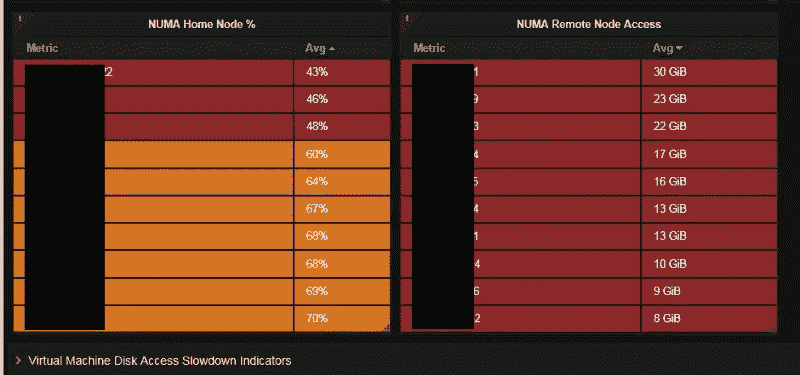
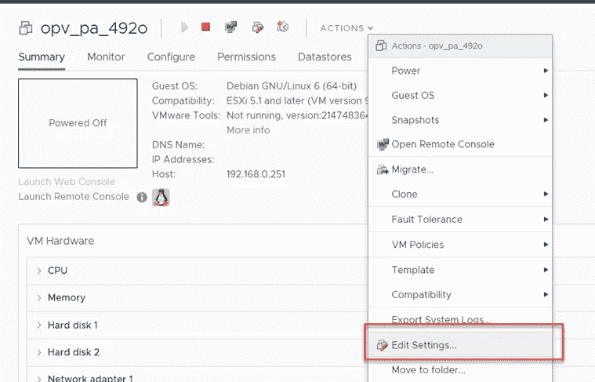
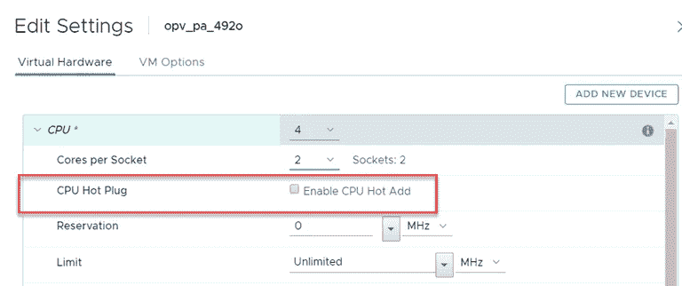
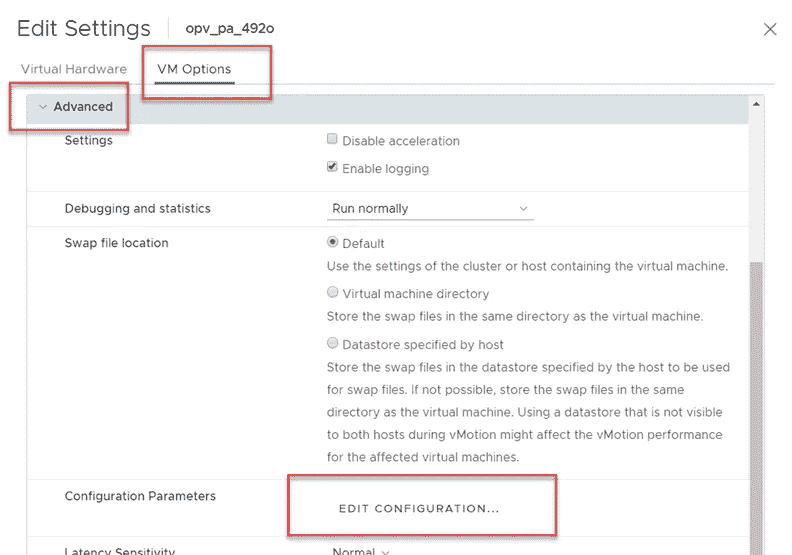
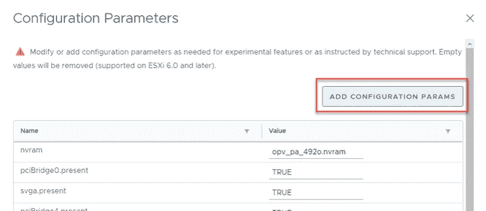
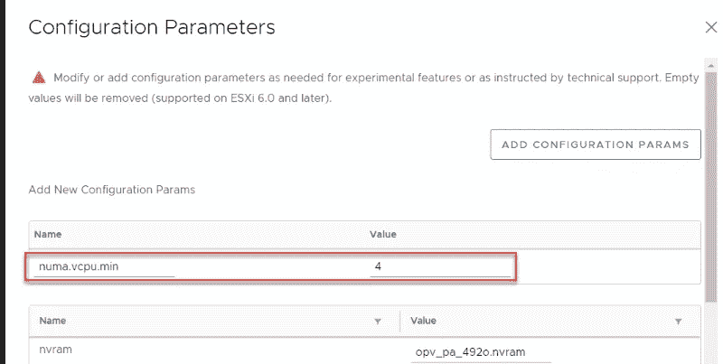

# 如何激活 vCPU 数量较少的 VMware vNUMA

> 原文：<https://itnext.io/how-to-activate-vmware-vnuma-with-lower-vcpu-count-156ba88e26f8?source=collection_archive---------2----------------------->

自从我们发布了 [NUMA 度量仪表板](https://www.opvizor.com)以来，数百名客户能够检测到 NUMA 使用的问题和不平衡。由于使用 NUMA 远程节点而导致的性能下降可能非常严重，很容易达到 75%的性能损失。

我们还收到许多关于 vNUMA 以及如何以最佳方式配置 NUMA 的问题。因此，我们从这篇文章开始一系列关于 NUMA，vNUMA。

如何激活 CPU 数量较少的 VMware vNUMA

# 什么是 NUMA

> 非均匀内存访问(NUMA)是一种用于多处理的计算机内存设计，其中内存访问时间取决于内存相对于处理器的位置。在 NUMA 下，一个处理器可以比非本地内存(另一个处理器的本地内存或处理器之间共享的内存)更快地访问自己的本地内存。NUMA 的优势仅限于特定的工作负载，特别是在数据通常与特定任务或用户紧密相关的服务器上。维基百科—

【Https://En.Wikipedia.Org/Wiki/Non-Uniform_memory_access 号

就 vNUMA 而言，这意味着 VMware ESXi 向虚拟机显示底层硬件的物理 NUMA 配置，而不是隐藏它。

您可以在此阅读有关 NUMA、vNUMA 和性能问题的更多信息:

[Https://Itnext。io/Vmware-VSP here-Why-Checking-Numa-Configuration-So-Important-9764 C16 a7e 73](/vmware-vsphere-why-checking-numa-configuration-is-so-important-9764c16a7e73)

默认情况下，对于 vcpu 少于 9 个的虚拟机，vNUMA 处于停用状态，或者 CPU 或内存热添加处于激活状态。

# vNUMA 控件

VMware 提供了一系列高级参数来调整 vNUMA，可在此处找到:

[Https://Docs。Vmware.Com/En/VMware-VSphere/6.7/Com.VMware . VSP here . resmgmt . doc/GUID-3e 956 FB 5-8ac b-42 C3-B068-664989 C3 ff 44。Html](https://docs.vmware.com/en/VMware-vSphere/6.7/com.vmware.vsphere.resmgmt.doc/GUID-3E956FB5-8ACB-42C3-B068-664989C3FF44.html)

# 为具有较少 vcpu 核心(即 4、6 或 8 个 vcpu)的虚拟机激活 vNUMA

虚拟机必须关闭才能继续。

# 停用热插拔

首先确保 CPU 热插拔被禁用。

内存热插拔也是如此

# 现在，我们更改虚拟机选项

# 更改 NUMA 选项

请记住，列表中没有最高级的 NUMA 选项，所以您需要添加它们。如果选项已经在列表中，您只需更改值并保存配置。

# 添加参数 numa.vcpu.min

由于默认情况下，NUMA 体系结构只有 9 个或更多的 vCPU，因此您应该将该值设置为当前的 vCPU 数量，也就是说，如果您有 2 个 vCPU 插槽和 2 个 vCPU 核心，则应该将该值设置为 4。

启动虚拟机后，客户操作系统可以看到 NUMA 体系结构并相应地采取行动。

请注意，VMware VMkernel 在管理 NUMA 方面做得非常好，但是有时，尤其是当您发现系统的 NUMA 不平衡时，优先选择 vNUMA 是有意义的。

如果您想亲自查看 VMware NUMA 指标和潜在的性能损失，请开始免费试用性能分析器:[www.opvizor.com](https://www.opvizor.com)