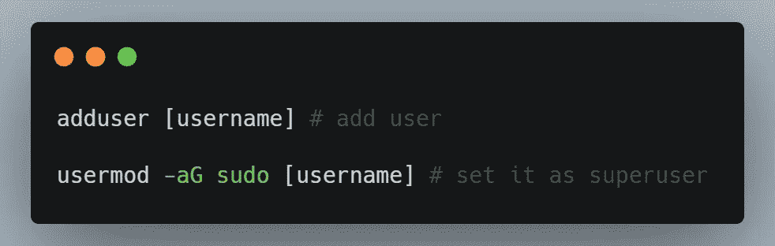
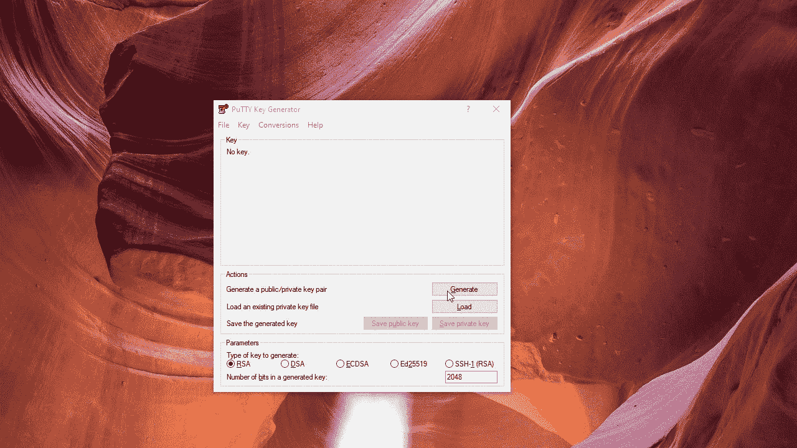
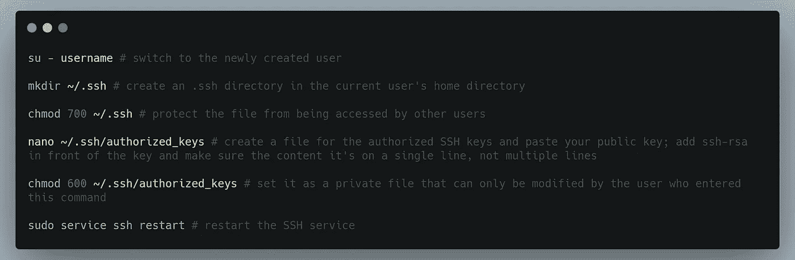
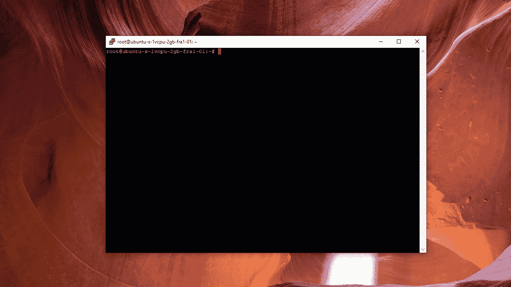
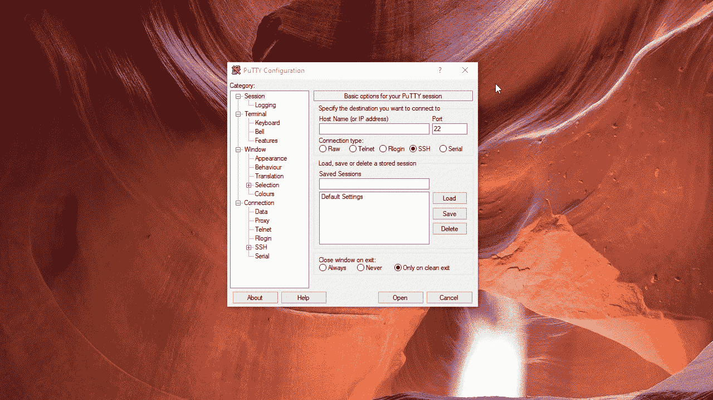
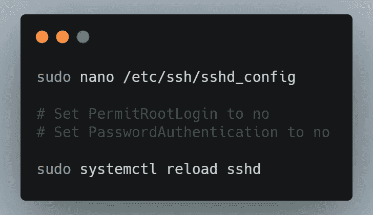
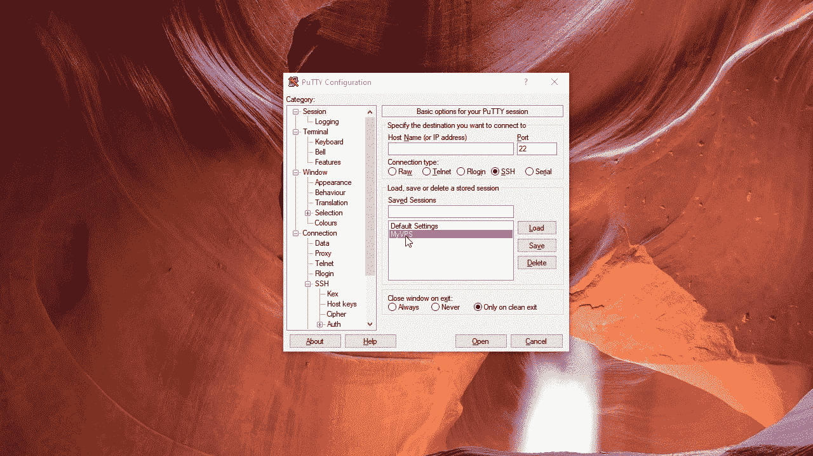

# 如何使用 SSH 向您的 VPS 添加新用户

> 原文：<https://itnext.io/how-to-add-a-new-user-with-ssh-to-your-vps-f44276c02b4b?source=collection_archive---------3----------------------->

在 [Unsplash](https://unsplash.com/s/photos/server?utm_source=unsplash&utm_medium=referral&utm_content=creditCopyText) 上[科学高清](https://unsplash.com/@scienceinhd?utm_source=unsplash&utm_medium=referral&utm_content=creditCopyText)拍摄的照片

设置 VPS 的第一步是添加一个带有 SSH 密钥的新的非 root 用户，并禁用 root 身份验证和密码身份验证。

在本文中，我们将看到如何在基于 Linux 的操作系统(Ubuntu)的 VPS 上实现这一点。

## 先决条件

*   [油灰](https://www.putty.org/)
*   [推杆](https://www.puttygen.com/)

## 目录:

1.  创建新用户
2.  创建一个 SSH 密钥
3.  将会话保存在 Putty 中，以便于连接
4.  禁用 root 和密码登录
5.  将主题颜色应用于 Putty 会话(可选)

# 1.创建新用户

当您启动一个新的 VPS 时，您通常会第一次以根用户身份连接到它，并创建一个单独的用户，您将在将来出于[安全原因](https://askubuntu.com/questions/16178/why-is-it-bad-to-log-in-as-root)使用该用户。

如果您是系统管理员，您将为自己创建的这个用户将是超级用户，为了提高安全性，您还将禁用 root 和密码身份验证，并且只使用 SSH 密钥。

以 root 用户身份连接到 VPS 后，您可以运行以下命令来添加新用户。

[Raw](https://carbon.now.sh/?bg=rgba%28171%2C+184%2C+195%2C+1%29&t=seti&wt=none&l=application%2Fx-sh&ds=true&dsyoff=20px&dsblur=68px&wc=true&wa=true&pv=14px&ph=20px&ln=false&fl=1&fm=Hack&fs=14px&lh=133%25&si=false&es=2x&wm=false&code=adduser%2520%255Busername%255D%2520%2523%2520add%2520user%250A%250Ausermod%2520-aG%2520sudo%2520%255Busername%255D%2520%2523%2520set%2520it%2520as%2520superuser)

> 系统将提示您添加的密码可用于验证和授权超级用户命令(sudo)

# 2.创建一个 SSH 密钥

为了创建新的 SSH 密钥，我们将使用 [PuTTYgen](https://www.puttygen.com/) 。

为了增加一层安全性，我们还将在 SSH 密钥中添加一个密码短语。这样，任何想要使用 SSH 密钥的人也必须输入密码。这在安全方面很有用，以防 SSH 密钥泄露。

用 PuTTYGen 创建一个 SSH 密钥

> 这里有一个很好的经验法则，那就是始终使用密码短语，除非你在任何类型的自动化程序中需要它。

一旦生成了 SSH 密钥对，我们就可以将其添加到我们的 VPS 中。

为此，我们需要运行以下命令。

[生](https://carbon.now.sh/?bg=rgba%28171%2C+184%2C+195%2C+1%29&t=seti&wt=none&l=application%2Fx-sh&ds=true&dsyoff=20px&dsblur=68px&wc=true&wa=true&pv=14px&ph=20px&ln=false&fl=1&fm=Hack&fs=14px&lh=133%25&si=false&es=2x&wm=false&code=su%2520-%2520username%2520%2523%2520switch%2520to%2520the%2520newly%2520created%2520user%250A%250Amkdir%2520%7E%252F.ssh%2520%2523%2520create%2520an%2520.ssh%2520directory%2520in%2520the%2520current%2520user%27s%2520home%2520directory%250A%250Achmod%2520700%2520%7E%252F.ssh%2520%2523%2520protect%2520the%2520file%2520from%2520being%2520accessed%2520by%2520other%2520users%250A%250Anano%2520%7E%252F.ssh%252Fauthorized_keys%2520%2523%2520create%2520a%2520file%2520for%2520the%2520authorized%2520SSH%2520keys%2520and%2520paste%2520your%2520public%2520key%253B%2520add%2520ssh-rsa%2520in%2520front%2520of%2520the%2520key%2520and%2520make%2520sure%2520the%2520content%2520it%27s%2520on%2520a%2520single%2520line%252C%2520not%2520multiple%2520lines%250A%250Achmod%2520600%2520%7E%252F.ssh%252Fauthorized_keys%2520%2523%2520set%2520it%2520as%2520a%2520private%2520file%2520that%2520can%2520only%2520be%2520modified%2520by%2520the%2520user%2520who%2520entered%2520this%2520command%250A%250Asudo%2520service%2520ssh%2520restart%2520%2523%2520restart%2520the%2520SSH%2520service)

> [chmod 700](https://chmodcommand.com/chmod-700/) 和 [chmod 600](https://chmodcommand.com/chmod-600/) 解释

为新用户添加 SSH 密钥

以下是对该视频的一些评论:

*   用运行`adduser *username*` 命令时提供的用户名替换`georgian`；
*   `nano`是一个轻量级的命令行文本编辑器，用于 Unix 和 **Linux** ，我们将使用它来添加我们的 **public** SSH 密钥；粘贴 SSH 密钥可以使用`right-click`，保存并退出可以使用`CTRL+X`；

# 3.将会话保存在 Putty 中以实现更快的连接

下面是如何作为新添加的用户使用 SSH 密钥连接到 VPS。

在 PuTTy 中保存会话

以下是上面视频中可见的步骤:

1.  在字段`Host Name (or IP address)`中，填写您的副总裁的 IP。
2.  在`Saved Sessions`部分，输入您想要保存该会话的标签。
3.  在左侧菜单的**连接- >数据**选项卡下，用您创建用户时使用的名称填写**自动登录用户名**字段。
4.  在**连接- > SSH - >认证**中添加私有 SSH 密钥。
5.  在左侧菜单中，返回**会话**选项卡，点击**保存**保存该信息，然后点击**打开**。

对于将来的连接，您只需在**会话**选项卡的**保存的会话**部分选择该会话，然后点击**打开**。

> 当使用 Putty 中保存的会话连接到 VPS 时，私有 SSH 密钥的路径必须始终可用。因此，建议您将 SSH 密钥放在计算机上定义明确的目录中，这样就不会意外删除它。

# 4.禁用 root 和密码登录

这一步是额外的安全措施，是可选的，但是推荐使用。

在这里，我们将禁用 root 身份验证，这样任何人都不能使用 SSH 或密码作为 **root** 用户登录，我们还将禁用所有人的密码登录，因此我们的 VPS 将只允许非 root 用户使用 SSH 连接。

为此，您必须执行以下操作:

[生](https://carbon.now.sh/?bg=rgba%28171%2C+184%2C+195%2C+1%29&t=seti&wt=none&l=application%2Fx-sh&ds=true&dsyoff=20px&dsblur=68px&wc=true&wa=true&pv=14px&ph=20px&ln=false&fl=1&fm=Hack&fs=14px&lh=133%25&si=false&es=2x&wm=false&code=sudo%2520nano%2520%252Fetc%252Fssh%252Fsshd_config%2520%250A%250A%2523%2520Set%2520PermitRootLogin%2520to%2520no%250A%2523%2520Set%2520PasswordAuthentication%2520to%2520no%250A%250Asudo%2520systemctl%2520reload%2520sshd%2520)

> **systemctl** 命令是控制 **systemd** 系统和服务的工具，被大多数新的 Linux 操作系统所使用。

禁用 root 和密码登录

# 5.将主题颜色应用于 Putty 会话

最后一步是完全可选的，只是作为 Putty 会话的增强，即添加主题颜色。

你可以从这个 Github [资源库](https://github.com/AlexAkulov/putty-color-themes)下载主题，并按照下面视频中的说明来应用一个。

向 putty 会话添加主题颜色

只需打开您喜欢的主题文件`.reg`，键入您想要应用主题的 Putty 会话的名称，然后双击该文件。

您可以根据主题文件的内容确定将应用哪些更改。

应用这个主题会出现的一个问题是`right-click`粘贴会被禁用，但是你可以很容易地从左边的菜单进入**窗口- >选择**标签，从 **xterm** 切换到**窗口**或**妥协。**

右键单击时修复副本

> 请注意，在更新会话之前，您首先需要点击**加载**按钮，然后点击**保存**，以保存此更改。