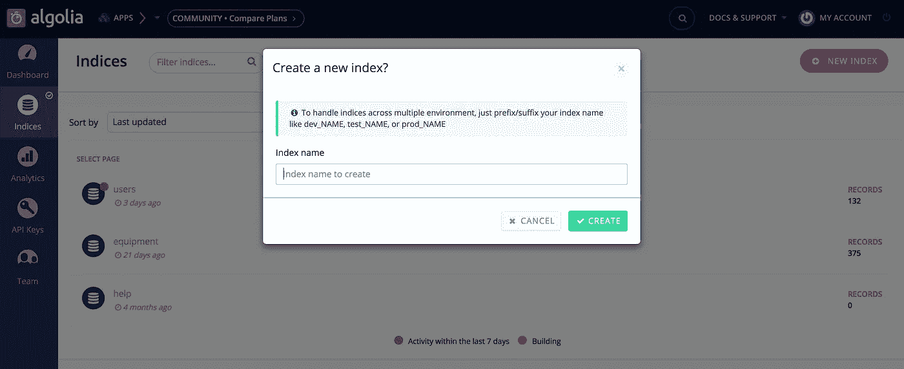
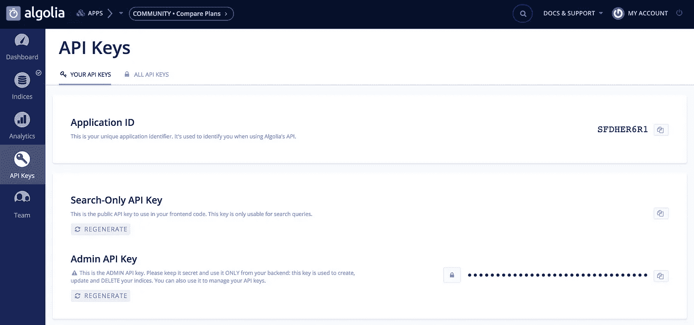
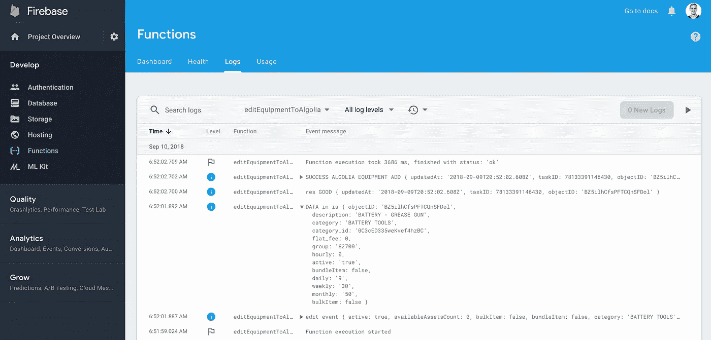
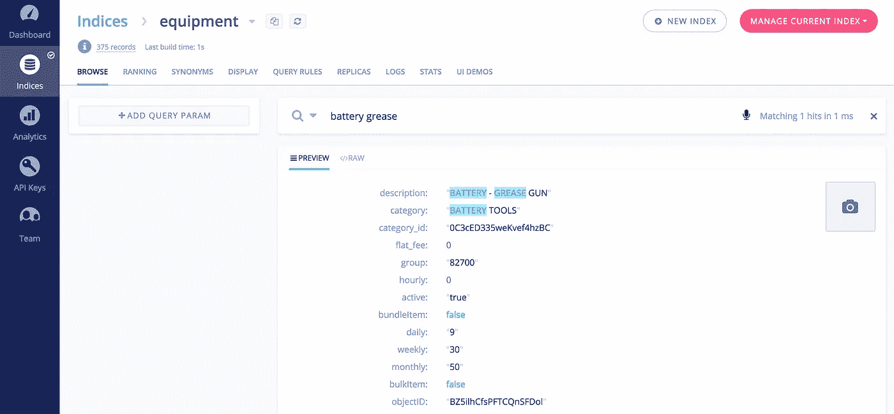

# 如何使用 Algolia 将快速实时搜索添加到 Firebase 应用程序中

> 原文：<https://itnext.io/how-to-add-fast-realtime-search-to-your-firebase-app-with-algolia-2491f7698d52?source=collection_archive---------1----------------------->

在你的应用中改善用户体验的最好方法之一是提供跨各种列表或集合的全文搜索。

使用 Firebase 和 Firestore 在设备管理应用程序中进行 Algolia 实时搜索

在本教程中，我将介绍如何使用 [Algolia](http://algolia.com) 、 [Firebase](http://firebase.com) 函数和 [Firestore](http://firebase.com) (Firebase 的新实时数据库)实现实时全文搜索。

你可能会想，等等，你刚刚说 Firestore 是一个实时数据库，为什么我需要另一个实时数据库来处理全文搜索。好问题！答案是 Firestore 非常擅长在发生变化时更新集合，因为它可以在您喜欢的任何集合或单个对象上设置监听器。然而，Firestore 并没有设计成使用自由文本输入来提供超快的预索引搜索结果。这就是阿尔戈利亚的闪光点。

[Algolia 是搜索即服务](http://algolia.com)。简而言之——它给你的应用程序提供谷歌式的快速全文搜索结果。你添加到 Algolia 的任何东西都可以被搜索到(即使有像我在上面的视频中显示的拼写错误)。

**总的来说，实施 Algolia 搜索的步骤是:**

1.  创建一个 Algolia 帐户 algolia.com
2.  在 Algolia 中创建一个索引(这只是意味着你想要搜索的数据库的名称已经存在于你的应用程序中——在我的 Firestore 数据库中，我有一个“设备”集合，所以我在 Algolia 中创建了一个“设备”索引。
3.  创建一个 firebase 函数，监听您的集合中的创建和更新，并将它们复制到 Algolia
4.  在 Firestore 系列中添加一些物品进行测试
5.  调用应用前端的 Algolia 来显示搜索结果

让我们来完成这些步骤，好吗？

# **第一步:创建一个 Algolia 账户**

这里没什么可说的，只要去 algolia.com 创建一个免费账户就行了

# **第二步:在 Algolia 中创建一个索引**

一旦你创建了你的账户，点击左边面板上的索引，然后点击“新建索引”



从 Algolia 的索引页面创建新的索引

您可以随意命名这个索引，但是为了简单起见，我将索引名称与我的 Firestore 集合名称保持一致。

# **步骤 3:创建 Firebase 函数，该函数监听您想要在**上搜索的集合的创建和编辑

就我而言，我想知道一台新设备何时被添加或编辑。为了做到这一点，这些是我写的 firebase 函数。

*收听 Firestore 中“设备”集合的创建和编辑操作:*

```
// this the firebase functions setup codeconst functions = require('firebase-functions');
const admin = require('firebase-admin');
let Promise = require('promise');
const cors = require('cors')({ origin: true });
const auth = require('basic-auth');
const request = require('request');
const algoliasearch = require('algoliasearch');
admin.initializeApp(functions.config().firebase);
const db = admin.firestore(); // listen for creating a piece of equipment in Firestoreexports.addEquipmentToAlgolia = functions.firestore.document('equipment/{document}')
.onCreate(event => {console.log('ADD EQUIP EVENT IS', event);const active = event.data.data().active === true ? "true" : "false"const data = {
  objectID: event.params.document,
  description: event.data.data().description, 
  category: event.data.data().category,
  category_id: event.data.data().category_id,
  flat_fee: event.data.data().flat_fee,
  group: event.data.data().group,
  hourly: event.data.data().hourly,
  active: active,
  daily: event.data.data().daily,
  weekly: event.data.data().weekly,
  monthly: event.data.data().monthly,
  bulkItem: event.data.data().bulkItem 
 };return addToAlgolia(data, 'equipment')
 .then(res => console.log('SUCCESS ALGOLIA equipment ADD', res))
 .catch(err => console.log('ERROR ALGOLIA equipment ADD', err));
});// listen for editing a piece of equipment in Firestoreexports.editEquipmentToAlgolia = functions.firestore.document('equipment/{document}')
.onUpdate(event => {console.log('edit event', event.data.data())const active = event.data.data().active === true ? "true" : "false"const data = {
  objectID: event.params.document,
  description: event.data.data().description, 
  category: event.data.data().category,
  category_id: event.data.data().category_id,
  flat_fee: event.data.data().flat_fee,
  group: event.data.data().group,
  hourly: event.data.data().hourly,
  active: active,
  bundleItem: event.data.data().bundleItem,
  daily: event.data.data().daily,
  weekly: event.data.data().weekly,
  monthly: event.data.data().monthly,
  bulkItem: event.data.data().bulkItem 
 };console.log('DATA in is', data)return editToAlgolia(data, 'equipment')
 .then(res => console.log('SUCCESS ALGOLIA EQUIPMENT EDIT', res))
 .catch(err => console.log('ERROR ALGOLIA EQUIPMENT EDIT', err));
});// listen for a delete of a piece of equipment in Firestoreexports.removeEquipmentFromAlgolia = functions.firestore.document('equipment/{document}')
.onDelete(event => {
 const objectID = event.params.document;
 return removeFromAlgolia(objectID, 'equipment')
 .then(res => console.log('SUCCESS ALGOLIA equipment ADD', res))
 .catch(err => console.log('ERROR ALGOLIA equipment ADD', err));
})// helper functions for create, edit and delete in Firestore to replicate this in Algoliafunction addToAlgolia(object, indexName) {
 console.log('GETS IN addToAlgolia')
 console.log('object', object)
 console.log('indexName', indexName)
 const ALGOLIA_ID = functions.config().algolia.app_id;
 const ALGOLIA_ADMIN_KEY = functions.config().algolia.api_key;
 const client = algoliasearch(ALGOLIA_ID, ALGOLIA_ADMIN_KEY);
 const index = client.initIndex(indexName);return new Promise((resolve, reject) => {
  index.addObject(object)
  .then(res => { console.log('res GOOD', res); resolve(res) })
  .catch(err => { console.log('err BAD', err); reject(err) });
 });
}function editToAlgolia(object, indexName) {
 const ALGOLIA_ID = functions.config().algolia.app_id;
 const ALGOLIA_ADMIN_KEY = functions.config().algolia.api_key;
 const client = algoliasearch(ALGOLIA_ID, ALGOLIA_ADMIN_KEY);
 const index = client.initIndex(indexName);return new Promise((resolve, reject) => {
  index.saveObject(object)
  .then(res => { console.log('res GOOD', res); resolve(res) })
  .catch(err => { console.log('err BAD', err); reject(err) });
 });
}function removeFromAlgolia(objectID, indexName) {
 const ALGOLIA_ID = functions.config().algolia.app_id;
 const ALGOLIA_ADMIN_KEY = functions.config().algolia.api_key;
 const client = algoliasearch(ALGOLIA_ID, ALGOLIA_ADMIN_KEY);
 const index = client.initIndex(indexName);return new Promise((resolve, reject) => {
  index.deleteObject(objectID)
  .then(res => { console.log('res GOOD', res); resolve(res) })
  .catch(err => { console.log('err BAD', err); reject(err) });
 });
}
```

上述代码位于 firebase 应用程序的 functions/index.js 文件中。

**重要提示:**你会注意到有对**functions . config()algolia . app _ id**的引用——我们在命令行中这样配置:

在终端中的应用程序内，执行以下命令(在 Algolia 中用**应用程序 ID** 替换 YOUR_ALGOLIA_APP_ID，在 ALGOLIA 中用**管理 API 密钥**替换 YOUR_ADMIN_API_KEY。

```
$ firebase functions:config:set algolia.app_id="YOUR_ALGOLIA_APP_ID" algolia.api_key="YOUR_ADMIN_API_KEY"
```

要找到您的密钥，请在 Algolia 的左侧面板上转到 API 密钥，然后复制它们。



一旦您将您的键添加到 Firebase，您现在将能够访问这些键来创建、更新和删除 Algolia 中的索引对象。

**同样重要的是:**你会在上面的代码片段顶部看到，我们正在使用 [algoliasearch](https://www.npmjs.com/package/algoliasearch) npm 模块。我们需要在本地安装它，以便部署我们的功能，所以我们现在就开始吧。从终端中应用程序的根目录:

```
$ cd functions$ yarn add algoliasearch
```

(要让代码像上面显示的那样工作，请确保您也安装了显示的其他包)

# 第四步:在 Firestore 系列中添加一些物品进行测试

让我们测试一下，确保我们的功能现在正常工作。我们首先需要部署我们的功能:

```
$ firebase deploy --only functions
```

接下来，转到 firebase 的 Firestore 部分，手动将一个项目添加到您的集合中，匹配它在您刚刚编写的函数中期望的有效负载。

一旦你在你的 Firestore 收藏中添加了这个新的项目，进入 Firebase 的 Functions 部分查看日志，以确保在 Firebase 端成功执行(然后我们将去 Algolia 看一看)



成功执行将新 Firestore 商品复制到 Algolia 的功能

您可能会看到类似上面的内容，在我们添加的 console.log 中显示成功。我已经打开了数据对象来检查刚刚添加的集合项。

现在，让我们检查 Algolia，以确保该项也在那里。

幸运的话，我们的装备物品现在也被复制到了 Algolia:



我们的 Firebase 函数已经成功地将 firestore 对象复制到 Algolia 中

现在我们已经可以工作了(假设我们的更新和删除功能也可以工作了，我们可以在前端进行搜索了——哇！

# **第五步:调用应用前端的 Algolia 来显示搜索结果**

首先，让我们引入脚本标签，让我们访问客户端的 algolia 方法。在 index.html 添加:

```
<script src="[https://cdn.jsdelivr.net/algoliasearch/3/algoliasearch.min.js](https://cdn.jsdelivr.net/algoliasearch/3/algoliasearch.min.js)"></script>
```

这个特定应用的前端是用 Angular 1 编写的，所以请忽略“vm”和“$scope”语法，因为该函数在很大程度上与 React 等相同。

```
// search algolia for equipment name
  function doSearch() {
    $scope.results = [];const client = algoliasearch('Application ID', 'Search-Only API Key');
    index = client.initIndex('equipment');vm.newQuery = { query: vm.querySearch };index.search(vm.newQuery)
    .then(res => {
      if (vm.querySearch.length === 0) {
        $scope.results = []
        vm.currentFilter.description = '';
        vm.currentFilter.category = '';
        vm.showDropdown = false;
      } else {
        lodash.map(res.hits, item => item.name = item.description);
        $scope.results = res.hits;
        vm.currentFilter.category = '';
        vm.showDropdown = true;
      }
      $scope.$apply();
    })
    .catch(err => console.error(err));}
```

上面，我们调用了 **algoliasearch** 方法(可以从这个代码片段上面添加的脚本标签中访问),它接收我们之前使用的应用程序 ID。仅搜索 API 键可以在 Algolia 的 API 键部分找到，在 Admin API 键的上方——使用这个键并且不要在这里暴露你的 Admin API 键是很重要的。

Algolia 是一个超级强大的工具。我们甚至还没有触及我们将如何根据您的行业、客户需求或我们可能希望添加的任何其他因素来提高结果排名的表面——也许是为了将来的教程。

干得好！我们都准备好了。现在，您应该能够调用 Algolia 数据库，这是一个实时的、自我更新的 Firestore 收藏副本。您的用户现在可以在您的应用程序中使用 Google-fast 搜索了！

如果你对 Algolia、Firebase 函数或 Firestore 有任何问题，我很乐意帮助你。

本:)